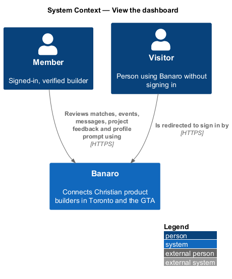
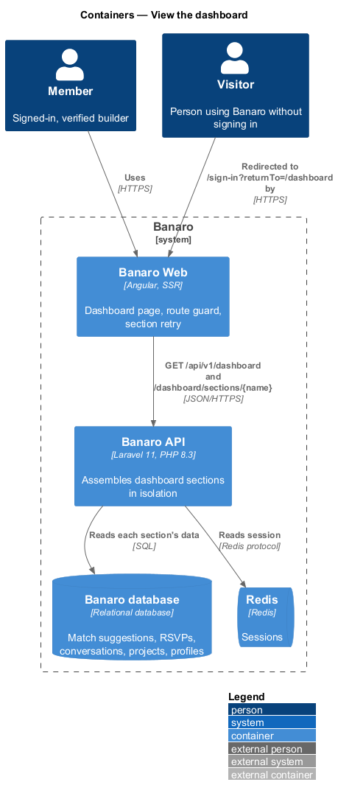
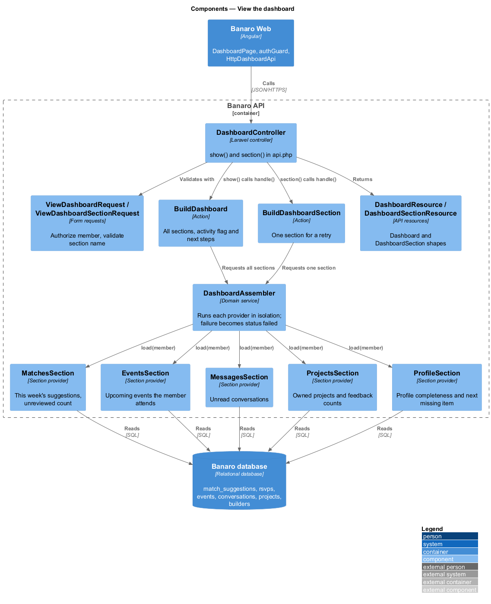
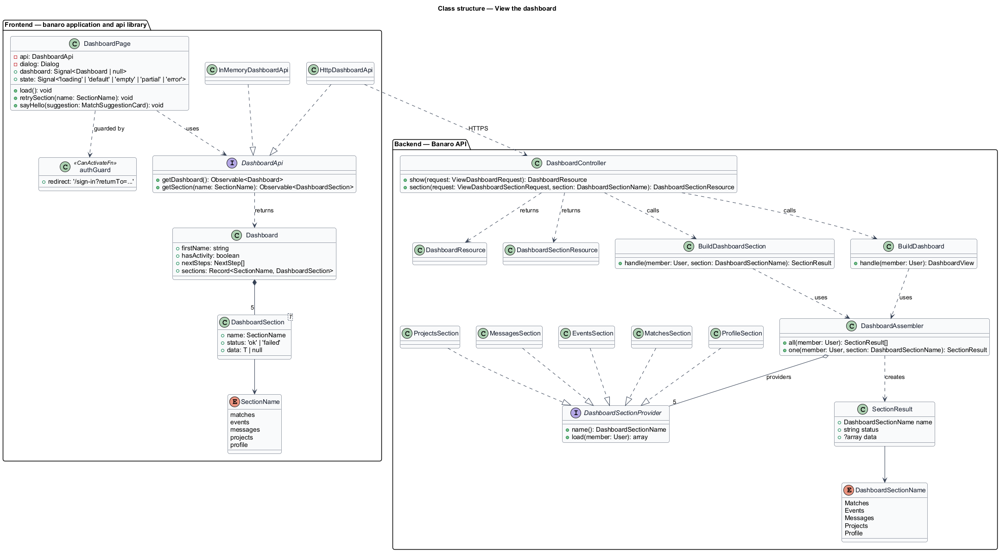
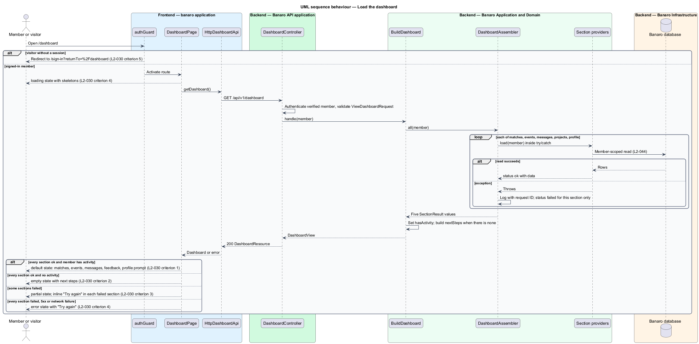
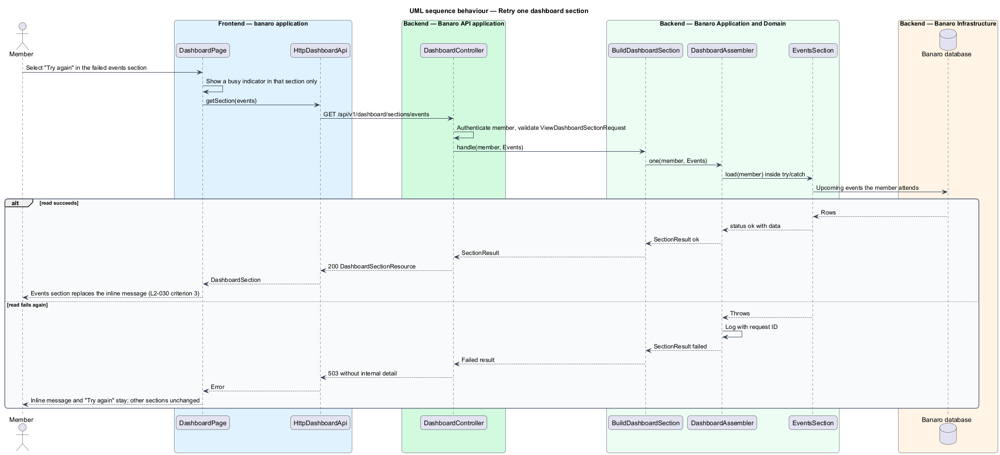

# View the dashboard

## Overview

The dashboard is a signed-in member's landing page. It gathers what needs the member's attention
from across Banaro into one view: this week's match suggestions, upcoming events, unread messages,
feedback on the member's projects and a prompt to complete the profile. It belongs to the
`dashboard` subsystem. It owns no data of its own; it reads from the `matching`, `events`,
`messaging`, `projects` and `profiles` subsystems.

Terms used in this design:

- **dashboard section** — one panel of the dashboard that summarises one data source
- **section status** — outcome of loading one section: `ok` or `failed`
- **partial dashboard** — dashboard where at least one section failed and at least one loaded
- **section retry** — request that reloads one failed section without reloading the rest
- **activity** — any match suggestion, upcoming RSVP, conversation or owned project
- **next steps** — ordered list of starting actions shown to a member without activity
- **profile completeness** — share of the profile that the member has filled in, as a percentage

The page makes one request for the whole dashboard. The API builds each section on its own and
catches a failure in one section, so that the others still return. The page shows the sections that
loaded and an inline retry for each one that failed. A visitor never reaches the page; the route
guard sends them to sign in first.

## Description

The slice runs from the dashboard page in Banaro Web through the Banaro API to the Banaro database.
It reads only.

### Frontend — `banaro` application and libraries

- **`DashboardPage`** (`pages/dashboard/`) — routed page for `/dashboard`. It shows the `default`,
  `loading`, `empty`, `error` and `partial` states from the mock.
  - `default` shows the greeting, a one-line summary of new matches, unread messages and events in
    the next 7 days, and the five sections (`L2-030` criteria 1 and 7). The matches section lists
    three suggestions in match-score order with "Say hello" and "Pass" (`L2-030` criterion 6). The
    events and messages sections are omitted when they have no rows (`L2-030` criteria 7 and 8).
  - `empty` shows the next steps — complete profile, share a project, set up matching — when the
    member has no activity (`L2-030` criterion 2).
  - `partial` shows each loaded section and, in place of each failed one, an inline message with
    "Try again" (`L2-030` criterion 3). The retry reloads that section only. The summary line
    mentions only the sections that loaded (`L2-030` criterion 11).
  - `loading` shows skeletons sized to the final layout (`L2-048` criterion 4). `error` shows
    "Try again" when the whole request fails or every section fails (`L2-030` criterion 4).
  - The greeting date ("Friday 9 October") and every event time use the America/Toronto zone. The
    greeting is "Good morning" from 05:00 to 11:59, "Good afternoon" from 12:00 to 17:59 and "Good
    evening" from 18:00 to 04:59; a member with no activity sees "Welcome to Banaro" (`L2-030`
    criterion 10). The summary line takes its plural forms from the translation catalogue (`L2-052`
    criterion 1).
  - The matches section's "Say hello" opens `SayHelloDialog` from `say-hello`. Its second action,
    "Pass", opens the `pass-suggestion` dialog from `pass-on-suggestion` (`L2-023` criterion 1).
- **`authGuard`** (`api` library, `lib/auth/`) — route guard shared by both applications. For a
  visitor it redirects to `/sign-in?returnTo=%2Fdashboard`, on the server during SSR and in the
  browser (`L2-030` criterion 5). The `sign-in-and-sign-out` feature owns it.
- **`DashboardApi`** / **`DASHBOARD_API`** / **`HttpDashboardApi`** (`api` library) — the contract,
  its injection token and its HTTP implementation. `getDashboard()` sends `GET /api/v1/dashboard`.
  `getSection(name)` sends `GET /api/v1/dashboard/sections/{name}`. `InMemoryDashboardApi`
  (`lib/testing/`) is the fake.
- **`Dashboard`** (`api` library model) — `firstName`, `hasActivity`, `nextSteps` and `sections`, a
  record of the five `DashboardSection` values keyed by `matches`, `events`, `messages`, `projects`
  and `profile`.
- **`DashboardSection<T>`** (`api` library model) — `name`, `status` (`ok` or `failed`) and `data`
  (`null` when failed). The data types are `MatchesSummary` (suggestions and unreviewed count),
  `EventsSummary` (upcoming events), `MessagesSummary` (unread conversation count and latest unread
  previews), `ProjectsSummary` (owned projects with feedback count and new feedback count) and
  `ProfileSummary` (completeness percentage and the next missing item).

### Backend — Banaro API

- **`DashboardController`** (`Controllers/Api/V1/Dashboard/`) — `show()` handles `GET /dashboard` and
  calls `BuildDashboard`. `section()` handles `GET /dashboard/sections/{section}` and calls
  `BuildDashboardSection`. Both routes are in `routes/api.php`, so a visitor receives 401
  (`L2-044` criterion 3).
- **`ViewDashboardRequest`** and **`ViewDashboardSectionRequest`** (`Requests/Dashboard/`) — authorize
  a verified member. The second validates `section` against the `DashboardSectionName` enum
  (`L2-045` criterion 1).
- **`DashboardSectionName`** (`Enums/`) — `Matches`, `Events`, `Messages`, `Projects` and `Profile`.
- **`BuildDashboard`** (`Actions/Dashboard/`) — asks `DashboardAssembler` for every section. It sets
  `hasActivity` from the loaded sections and, when there is none, builds `nextSteps`. It always
  returns 200 when at least one section loaded (`L2-030` criterion 3).
- **`BuildDashboardSection`** (`Actions/Dashboard/`) — asks `DashboardAssembler` for one section. A
  failure here returns 503, so the page keeps the inline retry.
- **`DashboardAssembler`** (`Services/Dashboard/`) — runs each `DashboardSectionProvider` inside its
  own `try`/`catch`. A thrown exception becomes `status: failed` for that section only. The
  exception is logged with the request ID (`L2-053` criterion 4) and no internal detail reaches the
  response.
- **`DashboardSectionProvider`** (`Services/Dashboard/`) — interface with `name()` and
  `load(User $member)`. Five implementations live in `Services/Dashboard/Sections/`:
  - `MatchesSection` — this week's `MatchSuggestion` rows in match-score order and the unreviewed
    count. The matching rules, including block filtering, stay in the `matching` subsystem.
  - `EventsSection` — events the member is going to, through going `Rsvp` rows (not waitlisted) and
    `Event`, that start within the next 14 days, soonest first. The summary count uses the rows that
    start within the next 7 days (`L2-030` criterion 7).
  - `MessagesSection` — unread conversation count and up to 3 latest unread previews, newest first,
    through `ConversationParticipant` read marks (`L2-030` criterion 8).
  - `ProjectsSection` — the member's projects with comment counts and new comment counts, where new
    means posted by someone else since the member last opened that project's feedback (`L2-030`
    criterion 9).
  - `ProfileSection` — profile completeness and the next missing item. Completeness is the share of
    five items filled in, 20% each: name and role, photo, skills, neighbourhood and what the member
    is looking for (`L2-030` criterion 9).
  Each provider scopes every query to the current member (`L2-044` criteria 1 and 5).
- **`DashboardResource`** and **`DashboardSectionResource`** (`Resources/Dashboard/`) — serialize the
  `Dashboard` and `DashboardSection` shapes.

### Failure handling

A failed section never fails the whole dashboard while another section loads. The page shows the
`partial` state, and each section retry either fills its section or leaves the inline message in
place. A network failure, a 5xx on `GET /dashboard`, or a response where every section failed leads
to the `error` state with "Try again". The read budget of `L2-047` criterion 1 applies to the whole
request, so each provider uses indexed queries, and no section is cached (`L2-030` criterion 12).

### Resolved decisions

- Route: `/dashboard` in `L2-030`, the manifest and this design (settled in gap-analysis iteration 1).
- The events section lists only events the member is going to in the next 14 days; the summary line
  counts those in the next 7 days, so the mock says "1 event in the next 7 days" (`L2-030`
  criterion 7; mock `default.html`). The `empty` mock no longer lists events and shows one
  suggested public event in the aside instead (`L2-030` criterion 2).
- The messages section lists up to 3 unread conversations in the existing inbox layout, under the
  events section, with a link to `/messages` (`L2-030` criterion 8; mocks `default.html` and
  `partial.html`).
- The `empty` next steps are complete profile, share a project and set up matching, in that order
  (`L2-030` criterion 2; mock `empty.html`).
- The matches line reads "best match first" and the second action reads "Pass" (`L2-030`
  criterion 6; mocks `default.html` and `partial.html`).
- "New" feedback means posted by someone else since the member last opened that project's feedback;
  profile completeness is five items at 20% each (`L2-030` criterion 9).
- The greeting uses the 05:00 / 12:00 / 18:00 boundaries in America/Toronto (`L2-030` criterion 10).
- Dashboard data is built per request and never cached in Redis (`L2-030` criterion 12).

## Requirements

| L2 ID | Refines (L1) | Requirement |
|-------|--------------|-------------|
| `L2-030` | `L1-002`, `L1-007`, `L1-013` | A signed-in member's landing page shall summarise what needs their attention. |

The design realizes all twelve acceptance criteria of `L2-030`. The Description cites each criterion
where a component enforces it.

## Diagrams

### System context

A member opens the dashboard in Banaro. A visitor who requests it is sent to sign in first. The
feature calls no external system.

### Containers

The dashboard page in Banaro Web calls the Banaro API once for the whole dashboard and once per
section retry. The API reads each section from the Banaro database.

### Components

Inside the Banaro API, `DashboardController` calls `BuildDashboard` or `BuildDashboardSection`. Both
use `DashboardAssembler`, which isolates the five section providers from one another.

### Class structure

`DashboardPage` depends on the `DashboardApi` contract and receives a `Dashboard` made of
`DashboardSection` values. On the backend, five providers implement `DashboardSectionProvider`.

### Behaviour — load the dashboard

The guard turns a visitor away. For a member, the API builds each section in isolation and returns
the result. The page then shows the default, empty, partial or error state.

### Behaviour — retry one section

The member selects "Try again" inside a failed section. The page requests that section alone and
replaces the inline message with its content, or keeps the message when the retry fails.

