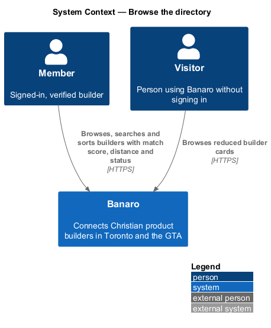
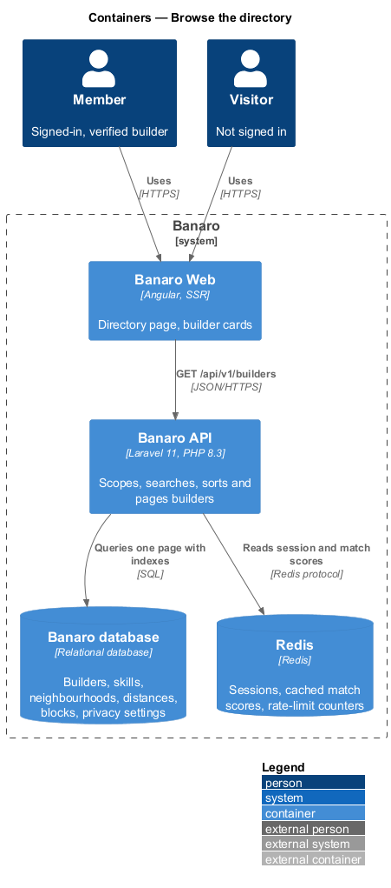
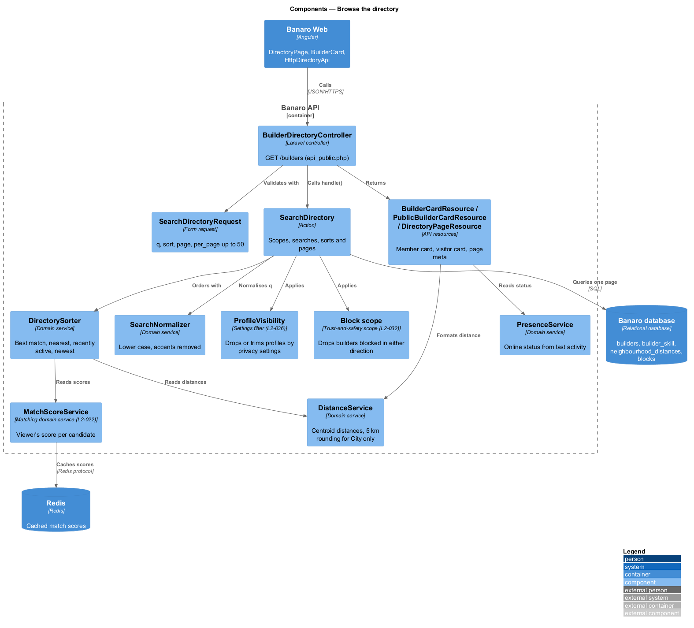
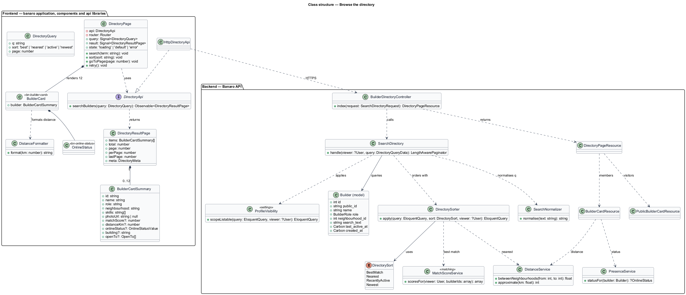
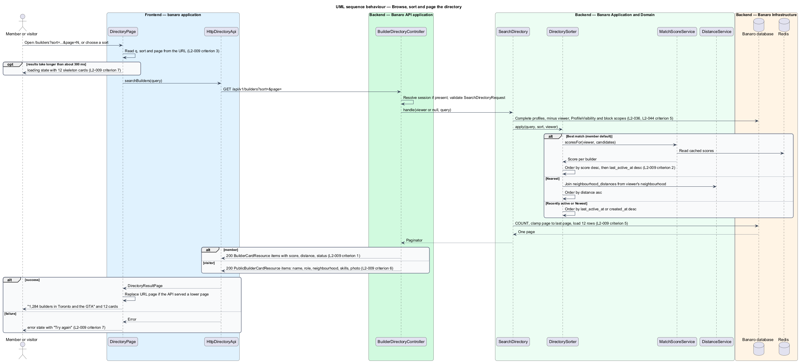
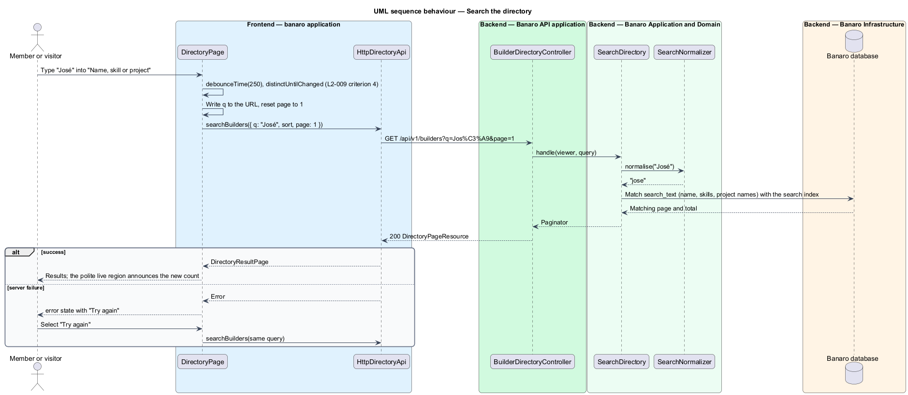

# Browse the directory

## Overview

The builder directory is how Christian product builders in Toronto and the GTA find each other. This
feature lists builders at `/builders`, 12 per page, with search, sorting and paging. It belongs to the
`directory` subsystem. Members see each builder's match score, distance and online status. Visitors who
are not signed in see a reduced card. Facet filters on the same page are the subject of the
`filter-directory` feature; a builder's full profile is the subject of `view-builder-profile`.

Terms used in this design:

- **directory** — paged list of builder cards at `/builders`
- **builder card** — summary of one builder: photo or initials, name, role, neighbourhood, distance,
  skills, the "Building" and "Open to" facts, and online status
- **match score** — integer from 0 to 100 that rates how well a builder fits the viewing member;
  `MatchScoreService` in the `matching` subsystem computes it (`L2-022`)
- **distance** — kilometres between the centroids of the viewer's and the builder's neighbourhoods
- **neighbourhood centroid** — fixed latitude and longitude that stands for a whole GTA neighbourhood
- **online status** — "Online now" or "Seen {time} ago", derived from a builder's last activity
- **sort** — order of results: "Best match" (default), "Nearest", "Recently active" or "Newest"
- **search text** — normalised lower-case, accent-free text of a builder's name, skills and project
  names, kept for searching
- **directory query** — search term, sort, page and filters, all held in the URL query string

The Banaro API filters, sorts and pages the builders; the browser never filters a full list. Each
response carries one page and the total count. Privacy settings (`L2-036`) and blocks (`L2-032`) are
applied in the query, so a hidden or blocked builder never reaches the browser.

## Description

The slice runs from the directory page in Banaro Web through the Banaro API to the Banaro database.
Redis caches match scores. No external system takes part.

### Frontend — `banaro` application and libraries

- **`DirectoryPage`** (`pages/directory/`, selector `bn-directory-page`) — routed page for `/builders`,
  open to visitors and members. It shows the mock states `default`, `loading` and `error`. The
  `filter-directory` feature adds `filtered`, `no-results` and `edge`.
  - **Query from the URL.** The page reads `q`, `sort` and `page` from the query string and calls
    `searchBuilders()`. Every change updates the URL, so a reload or a shared link shows the same
    results (`L2-009` criteria 3 and 5).
  - **Count.** The toolbar shows the total with thousands separators, for example "1,284 builders in
    Toronto and the GTA", and "Showing 1–12 of 1,284 builders" (`L2-009` criterion 1, `L2-052`
    criterion 4). The toolbar is a polite live region, so count changes are announced.
  - **Search.** The search box ("Name, skill or project") emits after a 250 ms pause through
    `debounceTime(250)` and `distinctUntilChanged()`. A new term resets the page to 1 (`L2-009`
    criterion 4).
  - **Sort.** The "Sort by" select offers "Best match", "Nearest", "Recently active" and "Newest" and
    writes `sort` to the URL (`L2-009` criterion 3).
  - **Paging.** The page shows the page number in the URL. When the API answers with a lower page than
    requested, because the requested page is past the end, the page replaces the URL with the served
    page (`L2-009` criterion 5).
  - **Loading.** If results take longer than about 300 ms, the page shows 12 `bn-builder-card-skeleton`
    cards while the filters stay usable (`L2-009` criterion 7).
  - **Error.** The `error` state reports the failure and offers "Try again", which
    repeats the same query (`L2-009` criterion 7).
  - **Best-match hint.** For a member with matching preferences, the toolbar names what the member is
    looking for, such as a technical co-founder, from the response `meta.lookingFor`.
  - **Messaging.** "Say hello" or "Ask for advice" on a card opens the `say-hello` dialog (`L2-026`).
    Visitors see no messaging action (`L2-009` criterion 6).
- **`BuilderCard`** (`bn-builder-card`) (`components` library) — renders one card. It uses `bn-avatar`
  for the photo or initials and `bn-online-status` for status. It omits any fact the API did not send,
  which is how the visitor card stays reduced (`L2-009` criterion 6).
- **`OnlineStatus`** (`bn-online-status`) (`components` library) — a dot plus a word ("Online now",
  "Seen 3 h ago"), never colour alone (`L2-009` criterion 1, `L2-050` criterion 7).
- **`BuilderCardSkeleton`** (`bn-builder-card-skeleton`) (`components` library) — placeholder with the
  final card's dimensions, so the replacement does not shift layout (`L2-048` criterion 4).
- **Perf-test scenarios** — `BuilderCard.ts`, `OnlineStatus.ts` and `BuilderCardSkeleton.ts`, plus the
  composite `DirectoryResults.ts` that renders a page of 12 cards, in
  `frontend/projects/perf-test/src/scenarios/`.
- **`DistanceFormatter`** (`api` library, `lib/i18n/`) — formats kilometres with one decimal under
  10 km and none above, for example "5.8 km" and "27 km" (`L2-052` criterion 3).
- **`DirectoryApi`** / **`DIRECTORY_API`** / **`HttpDirectoryApi`** (`api` library) — the directory
  contract, its injection token and its HTTP implementation. `searchBuilders(query)` sends
  `GET /api/v1/builders` and returns a `DirectoryResultPage`. The `view-builder-profile` feature adds
  `getBuilder(id)`.
- **`DirectoryQuery`**, **`DirectoryResultPage`** and **`BuilderCardSummary`** (`api` library models) —
  the query (`q`, `sort`, `page`, filters), the page (`items`, `total`, `page`, `perPage`, `lastPage`,
  `meta`) and one card. Member-only fields (`matchScore`, `distanceKm`, `onlineStatus`, `building`,
  `openTo`) are optional in `BuilderCardSummary`.
- **`InMemoryDirectoryApi`** (`api` library, `lib/testing/`) — in-memory fake for page tests.

### Backend — Banaro API

- **Route** — `GET /builders` is in `routes/api_public.php`, because visitors may browse (`L2-009`
  criterion 6). The route still resolves the session when one exists, so a member gets the member
  view.
- **`BuilderDirectoryController`** (`Controllers/Api/V1/Directory/`) — `index()` calls
  `SearchDirectory`. It returns `BuilderCardResource` items for a member and `PublicBuilderCardResource`
  items for a visitor, inside a `DirectoryPageResource`.
- **`SearchDirectoryRequest`** (`Requests/Directory/`) — validates `q` (string), `sort` (a
  `DirectorySort` case), `page` (integer of at least 1) and `per_page` (default 12, at most 50,
  `L2-047` criterion 4). A visitor's `sort` may only be `recently_active` or `newest`. The
  `filter-directory` feature adds the filter keys.
- **`SearchDirectory`** (`Actions/Directory/`) — builds the result in five steps:
  1. **Base scope.** It starts from builders with complete profiles and leaves out the viewer.
  2. **Privacy and blocks.** It applies the `ProfileVisibility` filter owned by the `settings`
     subsystem, which drops "Members only" profiles for visitors (`L2-036` criterion 2). It applies
     the block scope owned by `trust-and-safety`, which drops builders blocked in either direction
     (`L2-032` criterion 1, `L2-044` criterion 5).
  3. **Search.** It normalises `q` with `SearchNormalizer` and matches it against `builders.search_text`
     (`L2-009` criterion 4).
  4. **Sort.** It orders by the chosen `DirectorySort` through `DirectorySorter`.
  5. **Page.** It counts the results, clamps the page to the last page and loads that page (`L2-009`
     criterion 5).
- **`DirectorySorter`** (`Services/Directory/`) — applies one sort, always ending with `builders.id`
  so pages are stable:
  - `BestMatch` asks `MatchScoreService` for the viewer's scores of the candidates. It orders by score
    descending, then by `last_active_at` descending (`L2-009` criterion 2).
  - `Nearest` orders by distance from `DistanceService`.
  - `RecentlyActive` orders by `last_active_at` descending.
  - `Newest` orders by `created_at` descending.
- **`MatchScoreService`** (`Services/Matching/`, owned by the `matching` subsystem) — returns the
  viewer's score for each candidate builder. This design reads scores and does not define their
  weights (`L2-022` criterion 4). Scores are cached in Redis per viewer.
- **`DistanceService`** (`Services/Directory/`) — returns kilometres between two neighbourhood
  centroids. It reads a precomputed `neighbourhood_distances` table, so SQL can join, sort and limit by
  distance with an index. For a builder whose privacy setting is "City only", it returns the distance
  rounded to the nearest 5 km (`L2-036` criterion 3).
- **`PresenceService`** (`Services/Directory/`) — turns `last_active_at` into an online status. It
  returns nothing when the builder has turned online status off (`L2-036` criterion 1).
- **`RecordActivity`** (`Http/Middleware/`) — sets the member's `last_active_at` on authenticated
  requests, at most once per interval.
- **`SearchNormalizer`** (`Services/Directory/`) — lower-cases text and removes accents, so "José" and
  "jose" match (`L2-009` criterion 4).
- **`RefreshBuilderSearchText`** (`Listeners/`) — listens for `ProfileUpdated` from the `profiles`
  subsystem and for project changes. It rewrites `builders.search_text` from the name, skills and
  project names.
- **`BuilderCardResource`** and **`PublicBuilderCardResource`** (`Resources/Directory/`) — the member
  card and the visitor card. The visitor card holds only name, role, neighbourhood, skills and photo,
  with no match score, exact distance, online status or messaging action (`L2-009` criterion 6). Hidden
  fields are absent, not null.
- **`DirectoryPageResource`** (`Resources/Directory/`) — wraps the items with `total`, `page`,
  `perPage`, `lastPage` and `meta` (`lookingFor`, and the facets that `filter-directory` adds).
- **`DirectorySort`** (`Enums/`) — `BestMatch`, `Nearest`, `RecentlyActive`, `Newest`.
- **Indexes** — `builders(last_active_at)`, `builders(created_at)`, `builders(neighbourhood_id)` and a
  search index on `search_text` keep the query within budget at 10,000 builders (`L2-047`
  criteria 1 and 3). The search index type depends on the database engine, which is `<TO SUPPLY>`.

### Failure handling

The directory is read-only, so a failure changes nothing. A 5xx response or a timeout puts the page in
the `error` state with "Try again". A 429 response from the general limit (`L2-046` criterion 1) shows
the "slow down" message.

### Open points

- Paging control: `L2-009` criterion 5 describes numbered pages held in the URL. The mock shows "Show
  12 more builders" with "12 of 1,284 · page 1 of 107". Whether the button appends the next page or
  replaces the current one, and how a reload of an appended list behaves: `<TO SUPPLY>`.
- Loading skeletons: `L2-009` criterion 7 asks for 12; the `loading` mock shows 6. The design follows
  the specification.
- Default sort for visitors, who have no match score, and for a member without a neighbourhood:
  `<TO SUPPLY>`.
- Whether "Nearest" is available to visitors: `<TO SUPPLY>`.
- Whether builders who have not finished onboarding appear in the directory: `<TO SUPPLY>`. The design
  lists complete profiles only.
- Thresholds for "Online now" and for the "Seen {time} ago" wording, and the `last_active_at` update
  interval: `<TO SUPPLY>`.
- Lifetime of cached match scores and their invalidation: `<TO SUPPLY>`; owned by the `matching`
  subsystem.
- Behaviour of "Best match" when `MatchScoreService` is slow or unavailable: `<TO SUPPLY>`.
- Source of the label on the card's messaging action ("Say hello" or "Ask for advice", which the mock
  varies by "Open to" value): `<TO SUPPLY>`.
- No `signed-out` state of the directory is mocked, although `L2-009` criterion 6 defines one. Its
  mock: `<TO SUPPLY>`.

## Requirements

| L2 ID | Refines (L1) | Requirement |
|-------|--------------|-------------|
| `L2-009` | `L1-003` | Members and visitors shall be able to browse builders at `/builders`, 12 per page, sorted by best match by default. |

The design realizes all seven acceptance criteria of `L2-009`. The Description cites each criterion
where a component enforces it.

## Diagrams

### System context

Members and visitors browse builders through Banaro. Members receive the full card; visitors receive
a reduced one. No external system takes part.

### Containers

The directory page in Banaro Web calls the Banaro API. The API queries builders in the Banaro database
and reads cached match scores from Redis.

### Components

Inside the Banaro API, `BuilderDirectoryController` calls `SearchDirectory`. The action scopes the
query by privacy and blocks, then relies on `DirectorySorter`, `MatchScoreService`, `DistanceService`
and `PresenceService` to order and describe the results.

### Class structure

`SearchDirectory` depends on the sort, distance, presence and normalisation services and on the
`ProfileVisibility` filter. Two resources shape the member and visitor cards. On the frontend,
`DirectoryPage` depends on the `DirectoryApi` contract, not on `HttpDirectoryApi`.

### Behaviour — browse, sort and page

The page turns the URL into a directory query. The API scopes, sorts and pages the builders and
returns the member or visitor card shape. A page past the end returns the last page.

### Behaviour — search

The search box waits for a 250 ms pause, then sends one request. The API matches the normalised term
case- and accent-insensitively. A failure shows the error state with a retry.

