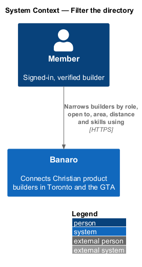
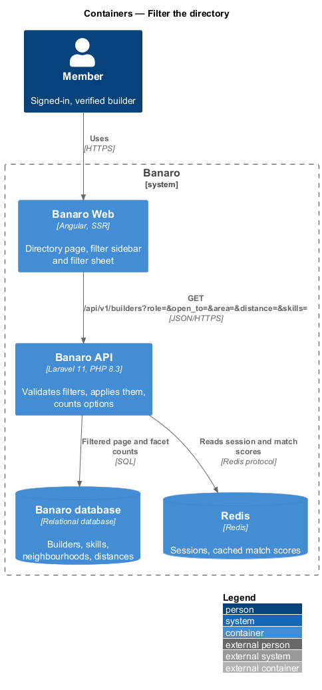
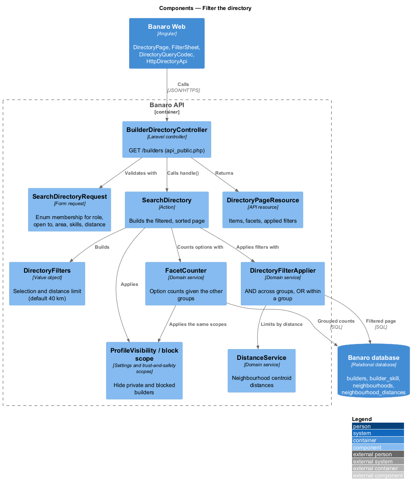
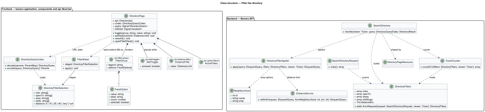
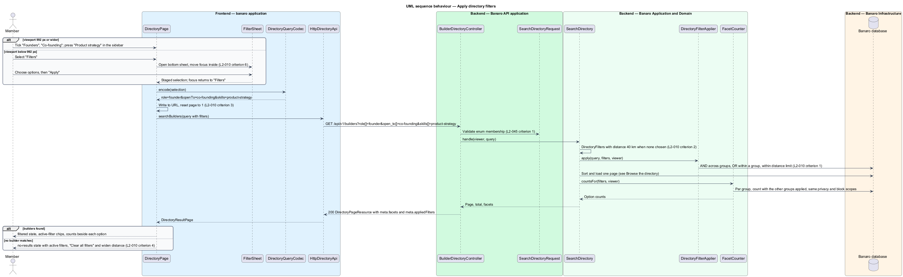
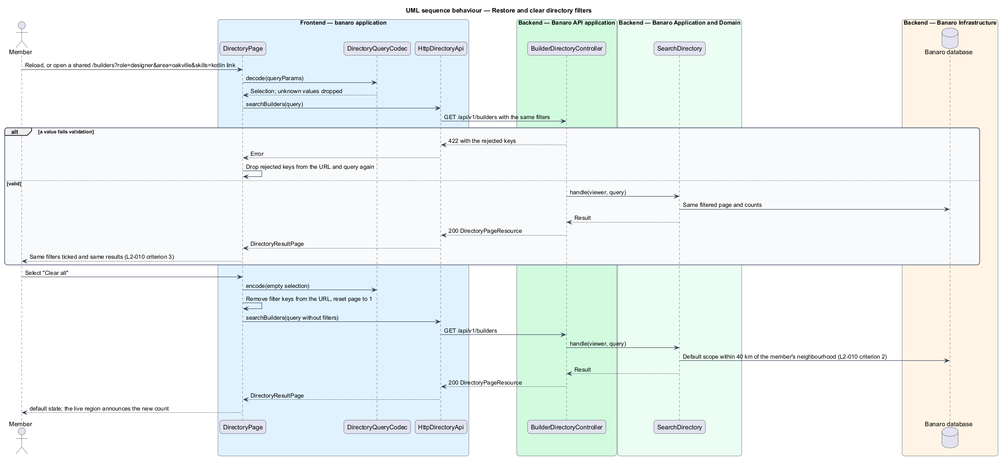

# Filter the directory

## Overview

A member looking for a designer in Markham who is open to co-founding should not have to scroll
through 1,284 builders. This feature adds facet filters to the builder directory at `/builders`. It
belongs to the `directory` subsystem and extends the `browse-directory` feature, which owns search,
sorting and paging. The filters narrow the same query that `browse-directory` describes.

Terms used in this design:

- **facet** — attribute builders can be narrowed by: Role, Open to, Neighbourhood or city, Distance
  and Skills
- **filter group** — set of options for one facet, shown as a `fieldset` with a `legend`
- **option count** — number of builders a filter option would return, given the filters in the other
  groups
- **active filter** — selected option, shown as a removable chip above the results
- **distance limit** — maximum distance from the member's neighbourhood: 5, 10, 25 or 40 km, or
  "Anywhere in the GTA"; 40 km applies when none is chosen
- **filter sheet** — bottom sheet that holds the filters below 992 px, with an "Apply" action
- **edge card** — builder card with unusual content: a long name, no skills, no photo or a
  right-to-left name

Filters combine predictably. Results match every filter group (AND) and any selected option within a
group (OR). The filters live in the URL query string, so a reload or a shared link restores the same
filters and results. The Banaro API applies them in the database query and returns each option's count
with the page. At 992 px and wider the filters form a sticky sidebar. Below 992 px a "Filters" button
opens them as a bottom sheet.

## Description

The slice runs from the directory page in Banaro Web through the Banaro API to the Banaro database. No
external system takes part.

### Frontend — `banaro` application and libraries

- **`DirectoryPage`** (`pages/directory/`) — the page from `browse-directory`. This slice adds the mock
  states `filtered`, `no-results` and `edge`.
  - **Filter panel.** It hosts the filter groups in the sidebar at 992 px and wider. Below 992 px it
    opens them in `FilterSheet`, chosen through the CDK `BreakpointObserver` (`L2-010` criterion 6).
  - **URL state.** Each change writes the filters to the URL through `DirectoryQueryCodec` and resets
    the page to 1. On load the page decodes the URL first, so filters and results are restored
    (`L2-010` criterion 3).
  - **Active filters.** Above the results it lists active filters as chips, each with an accessible
    name such as "Remove filter: Founders", and a "Clear all" action. "Clear all" removes every
    filter key from the URL (`L2-010` criterion 3).
  - **No results.** The `no-results` state reads "No builders match those filters". It repeats the
    active filters and offers "Clear all filters" and an action to widen the distance (`L2-010`
    criterion 4).
  - **Count.** The toolbar announces the new count politely when results change.
- **`DirectoryQueryCodec`** (`banaro` application, `shared/`) — converts between `DirectoryQuery` and
  query parameters: `role`, `openTo`, `area`, `skills` (comma-separated slugs) and `distance` (`5`,
  `10`, `25`, `40` or `any`). It drops unknown values, so a tampered link degrades to fewer filters.
- **`FilterGroup`** (`bn-filter-group`) (`components` library) — a `fieldset` and `legend` with
  checkbox options. Each option shows its label and count, for example "Engineers 486" (`L2-010`
  criteria 1 and 5).
- **`SkillToggle`** (`bn-skill-toggle`) (`components` library) — shared with `complete-onboarding`. In
  the "Popular skills" group each skill is a toggle button with `aria-pressed` and a count (`L2-010`
  criterion 5).
- **`DistanceFilter`** (`bn-distance-filter`) (`components` library) — a radio group with the options
  5, 10, 25 and 40 km and "Anywhere in the GTA" (`L2-010` criterion 2).
- **`ActiveFilters`** (`bn-active-filters`) (`components` library) — removable chips plus "Clear all".
- **`FilterSheet`** (`banaro` application, `pages/directory/`) — opened through CDK `Dialog` as a
  bottom sheet. Focus moves into it and Tab stays inside it. Escape closes it and focus returns to
  "Filters". Changes in the sheet are staged and applied by the "Apply" action (`L2-010` criterion 6,
  `L2-050` criterion 3).
- **`BuilderCard`** (`bn-builder-card`) (`components` library) — from `browse-directory`. For edge
  content it keeps a fixed layout (`L2-010` criterion 7):
  - long names and roles end in an ellipsis, with the full text in the accessible name;
  - the skills row is omitted when a builder has none;
  - initials replace a missing photo in the same square;
  - right-to-left names are isolated with `bdi`.
- **Perf-test scenarios** — `FilterGroup.ts`, `SkillToggle.ts`, `DistanceFilter.ts` and
  `ActiveFilters.ts`, plus the composite `DirectoryFilters.ts` that renders the full sidebar with
  counts, in `frontend/projects/perf-test/src/scenarios/`.
- **`DirectoryApi`** (`api` library) — `searchBuilders(query)` from `browse-directory` now sends the
  filter parameters. `DirectoryResultPage.meta` gains `facets` (option counts per group),
  `appliedFilters` and `distanceKm` (the limit in force).

### Backend — Banaro API

- **Route** — `GET /builders` in `routes/api_public.php`, unchanged from `browse-directory`.
- **`SearchDirectoryRequest`** (`Requests/Directory/`) — this slice adds the filter keys (`L2-045`
  criterion 1). It returns 422 for any value outside these sets:
  - `role[]` holds `BuilderRole` cases.
  - `open_to[]` holds `OpenTo` cases.
  - `area[]` holds known neighbourhood areas, such as "Downtown Toronto" or "Mississauga".
  - `skills[]` holds existing skill slugs.
  - `distance` is one of `5`, `10`, `25`, `40` or `any`.
- **`DirectoryFilters`** (`Services/Directory/`) — value object built from the validated request. It
  resolves the distance limit: the chosen value, or 40 km when none is chosen (`L2-010` criterion 2).
  For a visitor, or a member without a neighbourhood, there is no distance limit.
- **`DirectoryFilterApplier`** (`Services/Directory/`) — adds the filters to the directory query from
  `SearchDirectory` (`L2-010` criterion 1, `L2-047` criterion 3):
  - Each group becomes one `whereIn` or `whereHas` clause, so options in a group combine with OR.
  - Groups are chained, so they combine with AND.
  - Distance joins `neighbourhood_distances` from the member's neighbourhood and keeps rows within the
    limit.
- **`FacetCounter`** (`Services/Directory/`) — computes option counts. For each group it counts
  builders matching all the other groups' filters, grouped by that group's options. The counts use the
  same privacy and block scopes as the results, so a hidden builder is never counted (`L2-010`
  criterion 1).
- **`SearchDirectory`** (`Actions/Directory/`) — from `browse-directory`; it now calls
  `DirectoryFilterApplier` before sorting and `FacetCounter` after paging.
- **`DirectoryPageResource`** (`Resources/Directory/`) — adds `meta.facets`, `meta.appliedFilters` and
  `meta.distanceKm`.
- **`Neighbourhood`** (`Models/`) — its `area` column groups neighbourhoods into the options of the
  "Neighbourhood or city" group.
- **Indexes** — `builders(role)`, `builder_skill(skill_id, builder_id)` and
  `neighbourhood_distances(from_id, distance_km)` keep filtered queries and counts within budget
  (`L2-047` criterion 3).

### Failure handling

Filtering is read-only. A 422 response for a malformed link makes the page drop the rejected keys from
the URL and query again. A 5xx response shows the `error` state with "Try again" and keeps the
filters. A failed request from the filter sheet leaves the sheet open with the staged choices.

### Open points

- Distance control: `L2-010` criterion 2 lists 5, 10, 25 and 40 km and "Anywhere in the GTA". The mock
  shows a range slider from 1 to 60 km. The design follows the specification; mock alignment:
  `<TO SUPPLY>`.
- Widening suggestion: the `no-results` mock offers "Search within 60 km", which no distance option in
  `L2-010` supports. The design widens to the next option, ending at "Anywhere in the GTA". The copy:
  `<TO SUPPLY>`.
- Edge cards: `L2-010` criterion 7 asks for ellipsis truncation without layout shift. The `edge` mock
  note says long text wraps, "nothing is truncated and the card grows". The design follows the
  specification; confirmation: `<TO SUPPLY>`.
- Edge cards: the `edge` mock shows "Building No project listed" rather than omitting the row.
  Whether empty "Building" rows are omitted like empty skill rows: `<TO SUPPLY>`.
- Page size in the `filtered` mock: it shows "Showing 1–6 of 38 builders" and "page 1 of 7", which
  implies 6 per page; `L2-009` sets 12. The design keeps 12.
- Apply action: `L2-010` criterion 6 names "Apply"; the mock's button reads "Show 38 builders". The
  label, and whether sidebar changes at 992 px and wider apply at once or on that button:
  `<TO SUPPLY>`.
- Mapping of neighbourhoods to the "Neighbourhood or city" options, and the full option list:
  `<TO SUPPLY>`.
- Which skills appear in "Popular skills", and whether members can filter by any other skill:
  `<TO SUPPLY>`.
- Whether visitors may use the filters: `<TO SUPPLY>`. `L2-010` names members only.
- Whether the distance filter uses the exact centroid distance or the 5 km-rounded distance for
  builders whose privacy setting is "City only" (`L2-036` criterion 3): `<TO SUPPLY>`.

## Requirements

| L2 ID | Refines (L1) | Requirement |
|-------|--------------|-------------|
| `L2-010` | `L1-003` | Members shall be able to narrow the directory with facet filters that combine predictably. |

The design realizes all seven acceptance criteria of `L2-010`. The Description cites each criterion
where a component enforces it.

## Diagrams

### System context

A member narrows the builder directory through Banaro. No external system takes part.

### Containers

The directory page in Banaro Web sends the filters in the query string to the Banaro API. The API
applies them and counts the options in the Banaro database.

### Components

Inside the Banaro API, `SearchDirectory` hands the validated filters to `DirectoryFilterApplier` for the
results and to `FacetCounter` for the option counts. Both use the same privacy and block scopes.

### Class structure

`DirectoryFilters` holds the validated selection and the distance limit. `DirectoryFilterApplier` and
`FacetCounter` read it. On the frontend, `DirectoryQueryCodec` maps the selection to and from the URL,
and the filter components render it.

### Behaviour — apply filters

The member selects options in the sidebar or the filter sheet. The page writes them to the URL, and
the API returns matching builders with option counts. An empty result shows the no-results state.

### Behaviour — restore and clear filters

A reload or a shared link restores the filters from the URL. "Clear all" removes them and returns the
default directory within 40 km.

