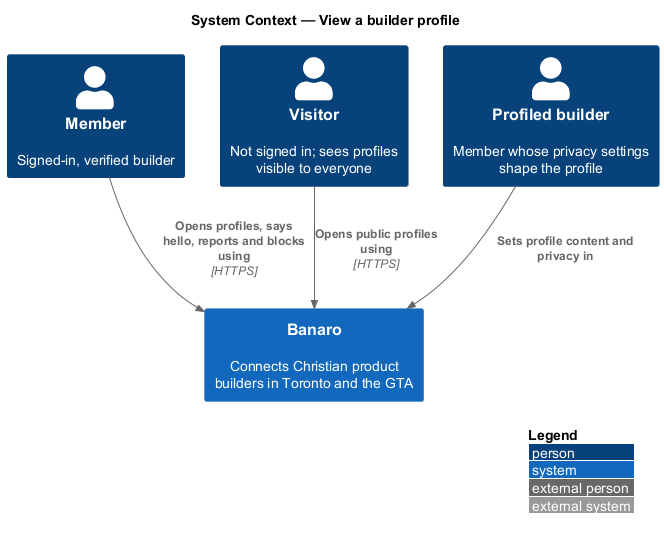
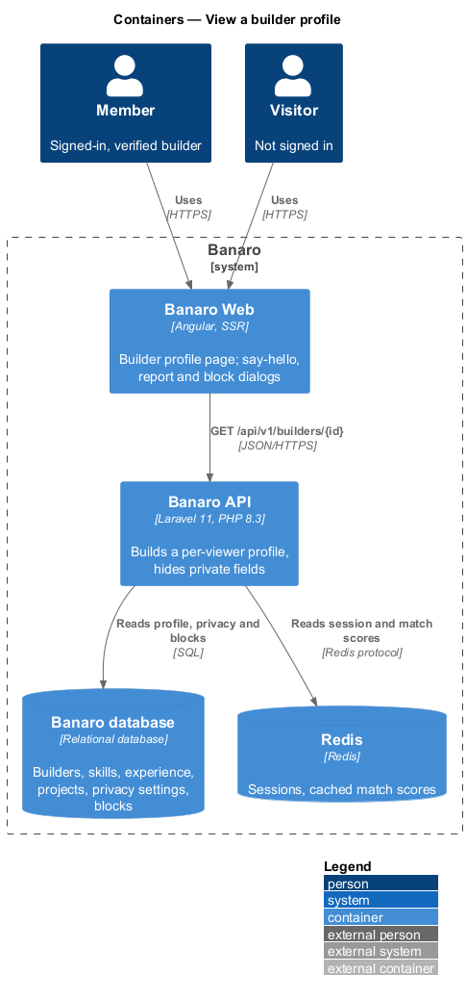
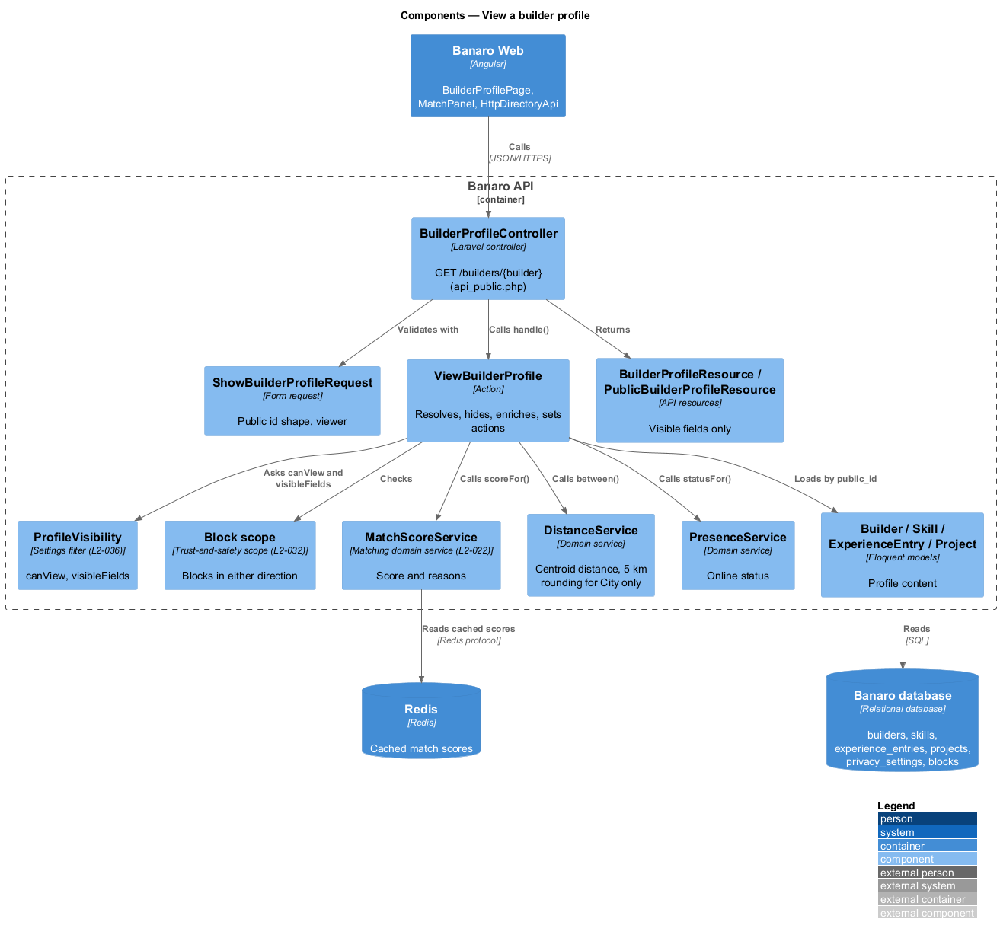
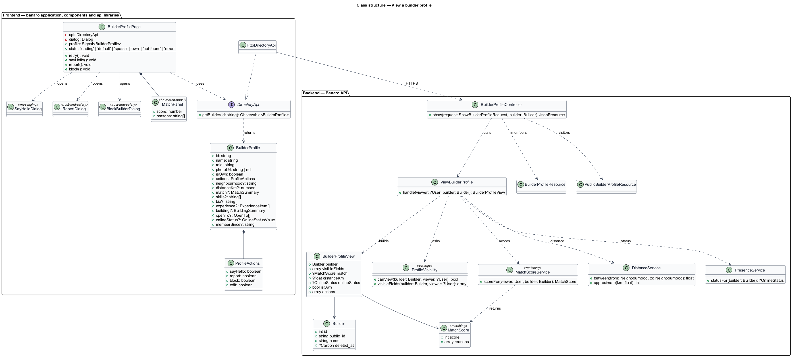
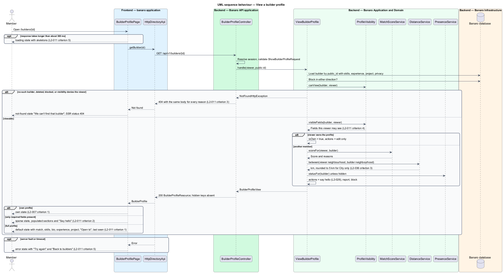
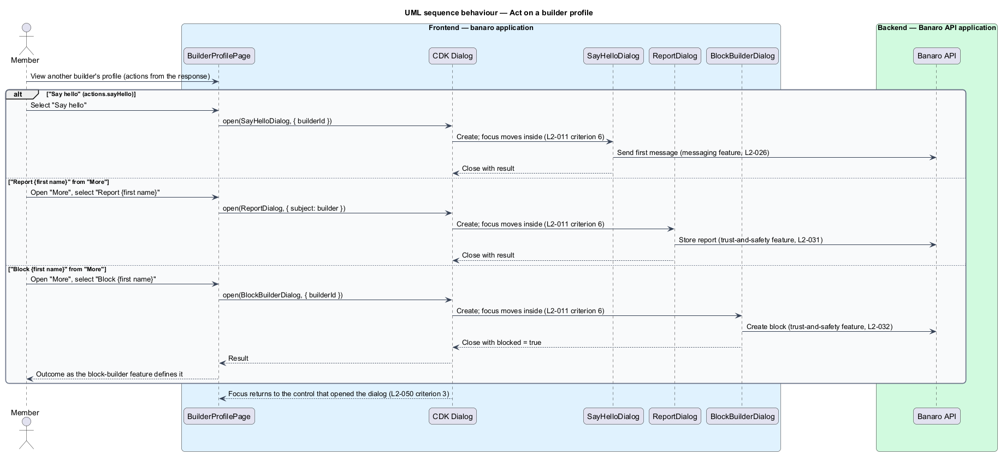

# View a builder profile

## Overview

A directory card says who a builder is; the profile says what they offer. This feature shows another
builder's full profile at `/builders/{id}`. It belongs to the `directory` subsystem. Members open it
from a directory card, a match, a project or a message. The profile shows the builder's match score
and the reasons for it. It also offers "Say hello", "Report" and "Block". Each builder's privacy
settings (`L2-036`) decide which fields appear at all.

Terms used in this design:

- **builder profile** — full public page of one builder: photo or initials, name, role, neighbourhood,
  distance, match score with reasons, skills, bio, experience, building project, "Open to" and
  last-seen status
- **public id** — opaque, non-sequential identifier of a builder used in URLs and API paths
- **match reasons** — short explanations of a match score, such as shared stack or distance, produced
  by `MatchScoreService` in the `matching` subsystem (`L2-022`)
- **sparse profile** — profile with only the required fields filled in
- **hidden field** — profile field that the builder's privacy settings withhold from the viewer
- **indistinguishable not-found** — 404 response whose body and timing are the same whether the
  builder never existed, deleted their account or is blocked

The Banaro API builds the response for one viewer. It leaves out every field the builder hides, so the
field is absent from the JSON as well as from the page. A missing, deleted or blocked builder all
produce the same 404, so the response never reveals which reason applies. When the viewer opens their
own profile, the page shows the `own` state described by the `edit-own-profile` feature.

## Description

The slice runs from the builder profile page in Banaro Web through the Banaro API to the Banaro
database. Redis caches match scores. No external system takes part.

### Frontend — `banaro` application and libraries

- **`BuilderProfilePage`** (`pages/builder-profile/`, selector `bn-builder-profile-page`) — routed page
  for `/builders/{id}`. It shows the mock states `default`, `loading`, `error`, `own`, `sparse` and
  `not-found`.
  - **Loading.** It calls `getBuilder(id)`. If the response takes longer than about 300 ms, skeletons
    sized to the final layout appear (`L2-011` criterion 5).
  - **Default.** It shows the breadcrumb "Builders › {name}" and the profile head (photo or initials,
    name, role, "{neighbourhood} · {distance} away" and online status). "About" holds the bio,
    followed by "Skills", experience and "What {first name} is building". The project links to its
    page, for example "Read about Psalter". The side panels hold the match panel ("94% match" and
    its reasons) and "At a glance" ("Open to", "Neighbourhood", "Distance", "Member since") (`L2-011`
    criterion 1).
  - **Sparse.** Only sections with content render. A builder with no project shows "No project listed
    yet. {first name} is here to meet people first." The "Say hello" action stays as the invitation
    to make contact (`L2-011` criterion 2).
  - **Not found.** A 404 response shows the not-found message with "Browse builders" and a link to
    the dashboard. During server-side rendering the page sets the HTTP status to 404 (`L2-011`
    criterion 3, `L2-042` criterion 1).
  - **Error.** A 5xx response or a timeout shows the load-failure message with "Try again" and
    "Back to builders" (`L2-011` criterion 5).
  - **Own.** When `isOwn` is true the page renders the `own` state from `edit-own-profile` (`L2-007`
    criterion 1).
  - **Rendering rules.** The page renders only the fields present in the response; it never shows a
    placeholder for a hidden field (`L2-011` criterion 4). All text goes through Angular
    interpolation, so markup displays as text (`L2-007` criterion 6).
  - **Actions.** "Say hello" opens `SayHelloDialog` (`L2-026`). The "More" menu holds "Report {first
    name}", which opens `ReportDialog` (`L2-031`), and "Block {first name}", which opens
    `BlockBuilderDialog` (`L2-032`). All three are CDK dialogs owned by their features (`L2-011`
    criterion 6). The page shows an action only when the response permits it.
- **`MatchPanel`** (`bn-match-panel`) (`components` library) — the match panel: the score as
  text and its reasons. The score is never shown by colour alone (`L2-050` criterion 7). It has a
  `MatchPanel.ts` perf-test scenario.
- **`Avatar`** (`bn-avatar`) and **`OnlineStatus`** (`bn-online-status`) (`components` library) — shared
  with `browse-directory`.
- **`DirectoryApi`** / **`DIRECTORY_API`** / **`HttpDirectoryApi`** (`api` library) — this slice adds
  `getBuilder(id)`, which sends `GET /api/v1/builders/{id}` and returns a `BuilderProfile`.
- **`BuilderProfile`** (`api` library model) — `id`, `name`, `role`, `photoUrl`, `isOwn` and
  `actions` (`sayHello`, `report`, `block`, `edit`). Optional fields: `neighbourhood`, `distanceKm`,
  `match` (`score`, `reasons`), `skills`, `bio`, `experience`, `building` (`projectId`, `name`,
  `summary`, `stage`, `lookingFor`), `openTo`, `onlineStatus` and `memberSince`. An absent key means
  hidden or empty.

### Backend — Banaro API

- **Route** — `GET /builders/{builder}` is in `routes/api_public.php`, so a visitor may open a profile
  whose visibility is "Everyone" (`L2-036` criterion 2). The route still resolves the session when one
  exists.
- **`BuilderProfileController`** (`Controllers/Api/V1/Directory/`) — `show()` calls
  `ViewBuilderProfile`. It returns a `BuilderProfileResource` for a member and a
  `PublicBuilderProfileResource` for a visitor.
- **`ShowBuilderProfileRequest`** (`Requests/Directory/`) — validates the shape of the public id and
  resolves the viewer (`L2-045` criterion 1).
- **`ViewBuilderProfile`** (`Actions/Directory/`) — builds the profile for one viewer:
  1. It loads the builder by public id with skills, experience, links, neighbourhood, photo and
     building project.
  2. It raises the same `NotFoundHttpException` when the builder does not exist, the account is
     deleted, or a block exists in either direction (`L2-011` criterion 3, `L2-032` criterion 4). It
     also raises it when `ProfileVisibility` denies the viewer the profile, for example a visitor and
     a "Members only" profile.
  3. It asks `ProfileVisibility` for the fields this viewer may see (`L2-011` criterion 4).
  4. For a member viewing another builder, it asks `MatchScoreService` for the score and reasons, and
     `DistanceService` for the distance. A "City only" builder gets the distance rounded to the
     nearest 5 km (`L2-036` criterion 3).
  5. It asks `PresenceService` for the online status unless the builder hides it.
  6. It sets the permitted actions. "Say hello" follows the messaging rules (`L2-026`). "Report" and
     "Block" are offered on other builders' profiles only. "Edit profile" is offered on the own profile
     only.
- **`ProfileVisibility`** (`settings` subsystem, `L2-036`) — this design calls it and does not redefine
  it. `canView(builder, viewer)` decides access. `visibleFields(builder, viewer)` returns the fields
  the viewer may see.
- **`MatchScoreService`** (`Services/Matching/`, `matching` subsystem) — `scoreFor(viewer, builder)`
  returns the integer score and its reasons. This design does not define the weights (`L2-022`
  criterion 4).
- **`DistanceService`** and **`PresenceService`** (`Services/Directory/`) — shared with
  `browse-directory`.
- **`BuilderProfileResource`** (`Resources/Directory/`) — serializes only the visible fields, using
  conditional attributes so hidden keys are absent rather than null (`L2-011` criterion 4). It links
  the building project by its public id.
- **`PublicBuilderProfileResource`** (`Resources/Directory/`) — the visitor shape, without match score,
  exact distance, online status or actions, in line with the visitor card of `L2-009` criterion 6.
- **`Builder`** (`Models/`) — adds `public_id` (random, unique, indexed) and `deleted_at`. Route model
  binding uses `public_id`, never the numeric key.

### Failure handling

The profile is read-only, so a failure changes nothing. A 5xx response or a timeout shows the `error`
state with "Try again". A 404 response is final and shows the `not-found` state.

### Open points

- Experience: `L2-011` criterion 1 lists experience, but no `builder-profile` mock state shows an
  experience section. Its layout: `<TO SUPPLY>`.
- Route parameter: `L2-011` uses `/builders/{id}`; the mock manifest uses a name slug
  (`/builders/daniel-reyes`). The design uses an opaque public id; whether readable slugs are wanted:
  `<TO SUPPLY>`.
- Fields a visitor sees on a profile whose visibility is "Everyone": `<TO SUPPLY>`. The design reuses
  the visitor card's field set from `L2-009` criterion 6.
- Whether a suspended account (`L2-033`) also returns the indistinguishable 404: `<TO SUPPLY>`.
- Format of match reasons: the mock shows one prose sentence ("Daniel works in Laravel and Angular,
  the stack Harvest needs…"). Whether `MatchScoreService` returns sentences or structured reasons:
  `<TO SUPPLY>`; owned by the `matching` subsystem.
- Wording of the invitation to say hello on the `sparse` state: the mock relies on the "Say hello"
  action and the "here to meet people first" line. Dedicated copy: `<TO SUPPLY>`.
- Behaviour when `MatchScoreService` is unavailable: `<TO SUPPLY>`.

## Requirements

| L2 ID | Refines (L1) | Requirement |
|-------|--------------|-------------|
| `L2-011` | `L1-003` | A member shall be able to open another builder's profile and see what they offer, subject to that builder's privacy settings. |

The design realizes all six acceptance criteria of `L2-011`. The Description cites each criterion
where a component enforces it.

## Diagrams

### System context

A member opens another builder's profile through Banaro; a visitor may open a profile visible to
everyone. No external system takes part.

### Containers

The profile page in Banaro Web calls the Banaro API. The API reads the builder, privacy settings and
blocks from the Banaro database and match scores from Redis.

### Components

Inside the Banaro API, `BuilderProfileController` calls `ViewBuilderProfile`. The action asks
`ProfileVisibility` what the viewer may see, and asks `MatchScoreService`, `DistanceService` and
`PresenceService` for the viewer-specific facts.

### Class structure

`ViewBuilderProfile` depends on the visibility filter and three domain services. Two resources shape
the member and visitor responses. On the frontend, `BuilderProfilePage` depends on the `DirectoryApi`
contract and opens dialogs owned by other features.

### Behaviour — view a profile

The API resolves the builder, returns an indistinguishable 404 for a missing, deleted or blocked
builder, and otherwise returns only the fields the viewer may see. The page renders the state that
matches the response.

### Behaviour — act on a profile

From a profile, "Say hello", "Report" and "Block" each open the dialog owned by its feature. Focus
returns to the action when the dialog closes.

