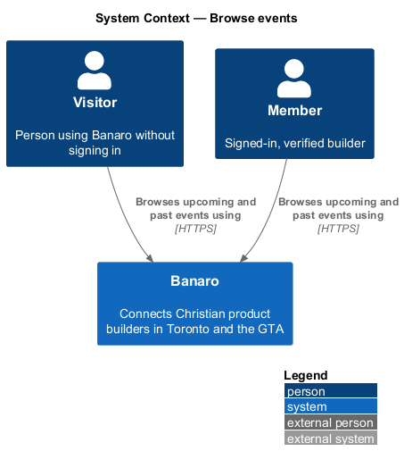
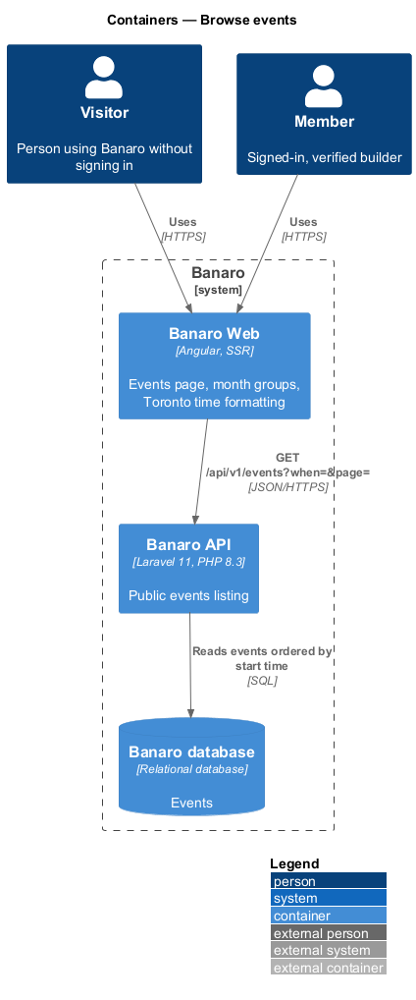
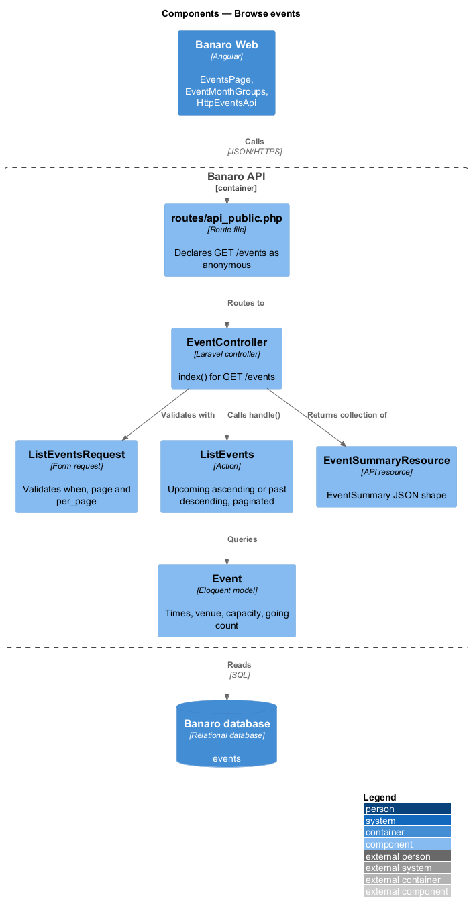
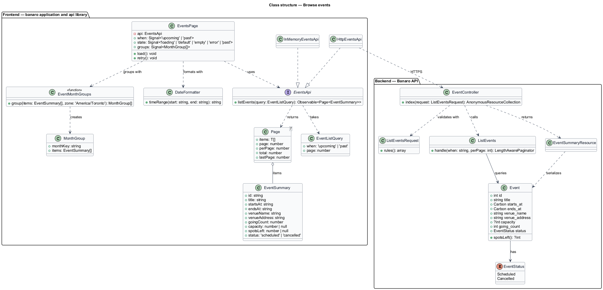
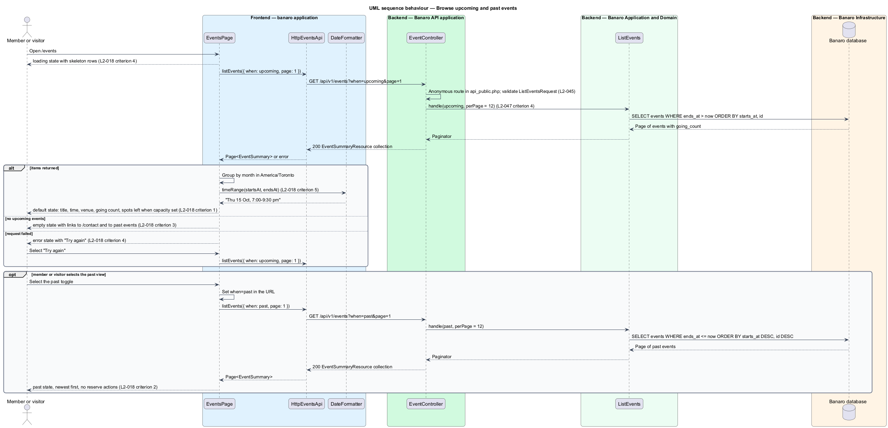

# Browse events

## Overview

Banaro lists local gatherings for Christian product builders in Toronto and the GTA, such as demo
nights, prayer breakfasts and workshops. This feature lets members and visitors see what is coming up
and look back at what has already happened. It belongs to the `events` subsystem. It runs on the
events page (`/events`), the entry point to the `view-event` and `rsvp-to-event` features.

Terms used in this design:

- **upcoming event** — event whose end time has not yet passed
- **past event** — event whose end time has passed
- **going count** — number of members holding a place at an event (`going_count` on `Event`)
- **spots left** — capacity minus going count; shown only for an event with a capacity
- **month group** — run of consecutive list entries that start in the same calendar month in the
  America/Toronto time zone
- **view toggle** — two-option control that switches the list between upcoming and past events

The page opens on upcoming events in chronological order, grouped by month. Each entry shows the
title, date and time, venue, going count and, when the event has a capacity, the places left. The
view toggle switches to past events, newest first. The list is public: the API route needs no
session, so a visitor sees the same entries as a member. Every time on the page uses the
America/Toronto time zone and a 12-hour clock.

## Description

The slice runs from the events page in Banaro Web through the Banaro API to the Banaro database. It
reads only; it changes no data and sends no e-mail.

### Frontend — `banaro` application and libraries

- **`EventsPage`** (`pages/events/`) — routed page for `/events`, rendered on the server and hydrated
  in the browser. It holds the view (`upcoming` or `past`) in the `when` query parameter, so the
  past view has its own URL. It shows the `default`, `loading`, `empty`, `error` and `past` states
  from the mock.
  - `default` lists upcoming events in month groups (`L2-018` criterion 1). Each entry links its
    title and its "Reserve a spot" action to the event detail page; this page does not RSVP.
  - `past` lists past events newest first, without reserve actions (`L2-018` criterion 2).
  - `empty` appears when the upcoming list has no entries. It links to `/contact`, where the
    "Propose an event" topic exists (`L2-040`), and to the past view (`L2-018` criterion 3).
  - `loading` shows skeleton rows sized to the final layout, so the list replaces them without
    layout shift (`L2-048` criterion 4). `error` shows a "Try again" action that repeats the
    request (`L2-018` criterion 4).
- **`EventMonthGroups`** (`pages/events/`) — pure function that groups a page of `EventSummary`
  items by month. It derives the month key from `startsAt` in the America/Toronto zone, never in
  UTC, so an event late on the last evening of a month stays in that month.
- **`DateFormatter`** (`api` library, `lib/i18n/`) — formats dates and time ranges in Canadian English
  and the America/Toronto zone with a 12-hour clock and am/pm, for example "Thu 15 Oct, 7:00–9:30 pm"
  (`L2-018` criterion 5, `L2-052` criterion 2). The `localize-and-format` feature owns it.
- **`EventsApi`** / **`EVENTS_API`** / **`HttpEventsApi`** (`api` library) — the events contract, its
  injection token and its HTTP implementation, shared with `view-event` and `rsvp-to-event`. This
  feature adds `listEvents(query)`, which sends `GET /api/v1/events?when={upcoming|past}&page={n}`
  and returns a `Page<EventSummary>`. `InMemoryEventsApi` (`lib/testing/`) is the fake.
- **`EventSummary`** (`api` library model) — `id`, `title`, `startsAt` and `endsAt` (ISO 8601 with
  offset), `venueName`, `venueAddress`, `goingCount`, `capacity` and `spotsLeft` (both `null` without a
  capacity) and `status` (`scheduled` or `cancelled`).
- **`Page<T>`** (`api` library model) — `items`, `page`, `perPage`, `total` and `lastPage`.

### Backend — Banaro API

- **`EventController`** (`Controllers/Api/V1/Events/`) — `index()` handles `GET /events`. The route is
  in `routes/api_public.php`, because visitors may browse events (`L2-018`, `L2-044` criterion 3). It
  calls `ListEvents` and returns an `EventSummaryResource` collection with paging metadata.
- **`ListEventsRequest`** (`Requests/Events/`) — validates `when` as one of `upcoming` and `past`
  (default `upcoming`), `page` as a positive integer and `per_page` as an integer from 1 to 50,
  default 12 (`L2-045` criterion 1, `L2-047` criterion 4). It ignores every other parameter.
- **`ListEvents`** (`Actions/Events/`) — builds the query:
  1. For `upcoming`, it selects events with `ends_at` later than now, ordered by `starts_at` then `id`
     ascending (`L2-018` criterion 1).
  2. For `past`, it selects events with `ends_at` at or before now, ordered by `starts_at` then `id`
     descending (`L2-018` criterion 2).
  3. It reads `going_count` from the event row, so the list makes no per-event count query.
  4. It paginates with the validated page size. An index on `events (ends_at, starts_at)` keeps the
     query within the read budget (`L2-047` criterion 1).
- **`Event`** (`Models/`) — the model shared with `rsvp-to-event`. This feature reads `title`,
  `starts_at`, `ends_at`, `venue_name`, `venue_address`, `capacity`, `going_count` and `status`, and
  calls `spotsLeft()`. Times are stored in UTC.
- **`EventSummaryResource`** (`Resources/Events/`) — serializes an `Event` into the `EventSummary`
  shape. It emits times in ISO 8601 with offset and leaves time-zone formatting to the frontend.

### Failure handling

A failed list request leaves the page in the `error` state, and "Try again" repeats the same query.
A page number beyond the last page returns an empty `items` array; the page then shows the `empty`
state for the upcoming view.

### Open points

- The mock labels the view toggle "Upcoming" and "Last season"; `L2-018` criterion 2 names it
  "Past events". The label is `<TO SUPPLY>`.
- The `past` mock lists September entries oldest first (12 Sep before 22 Sep), while `L2-018`
  criterion 2 requires newest first. The design follows the requirement; the mock order is
  `<TO SUPPLY>` for correction.
- The mock shows "Filter by area" (All areas, Downtown, Leslieville, Liberty Village, Markham) and
  "Day" (Any day, Weekdays, Weekends) filters, and scopes copy to the viewer ("4 events near
  Leslieville", "within 40 km of Leslieville"). No L2 criterion defines these filters or a distance
  scope, so their behaviour and the visitor fallback are `<TO SUPPLY>`.
- Past entries read "Ended · 24 came". Whether "came" is the final going count or a recorded
  attendance count is `<TO SUPPLY>`.
- Whether a cancelled upcoming event stays in the list, and how its entry looks, is `<TO SUPPLY>`;
  no mock shows one.
- The mocks show only signed-in chrome. The visitor rendering of `/events` is `<TO SUPPLY>`.
- No mock shows paging controls for more than one page of events. The control is `<TO SUPPLY>`.

## Requirements

| L2 ID | Refines (L1) | Requirement |
|-------|--------------|-------------|
| `L2-018` | `L1-006` | Members and visitors shall be able to see upcoming events at `/events`, with past events accessible. |

The design realizes all five acceptance criteria of `L2-018`. The Description cites each criterion
where a component enforces it.

## Diagrams

### System context

Members and visitors browse events in Banaro. The feature reads data only and calls no external
system.

### Containers

Banaro Web renders the events page on the server and in the browser. Both call the public events
endpoint of the Banaro API, which reads the Banaro database.

### Components

Inside the Banaro API, `EventController` validates the query with `ListEventsRequest`, calls
`ListEvents` and returns `EventSummaryResource` items.

### Class structure

`EventsPage` depends on the `EventsApi` contract and groups `EventSummary` items by month. On the
backend, `ListEvents` reads `Event` rows and `EventSummaryResource` shapes them.

### Behaviour — browse upcoming and past events

The page requests upcoming events, groups them by month and formats times in the America/Toronto
zone. The alternates cover the empty list, the failed request with retry and the switch to past
events.

