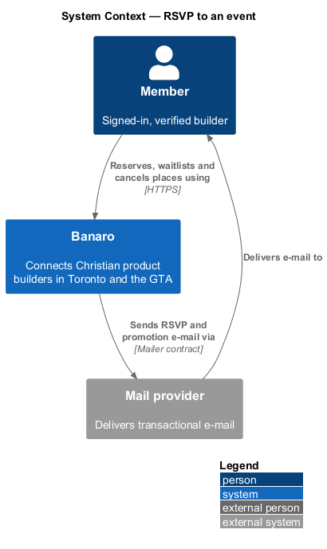
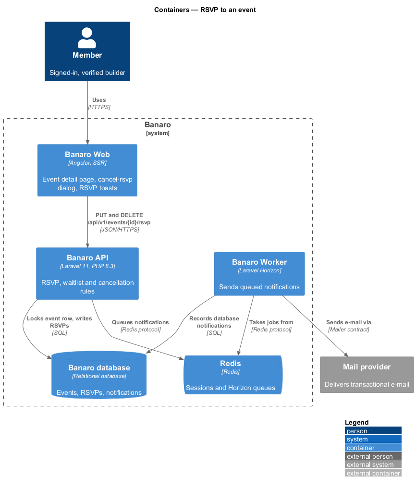
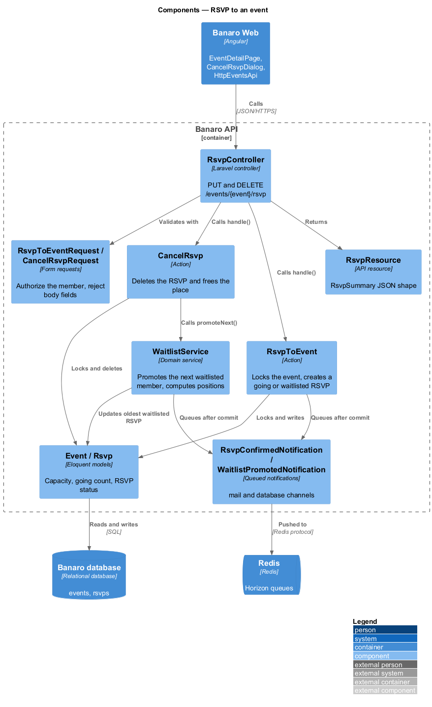
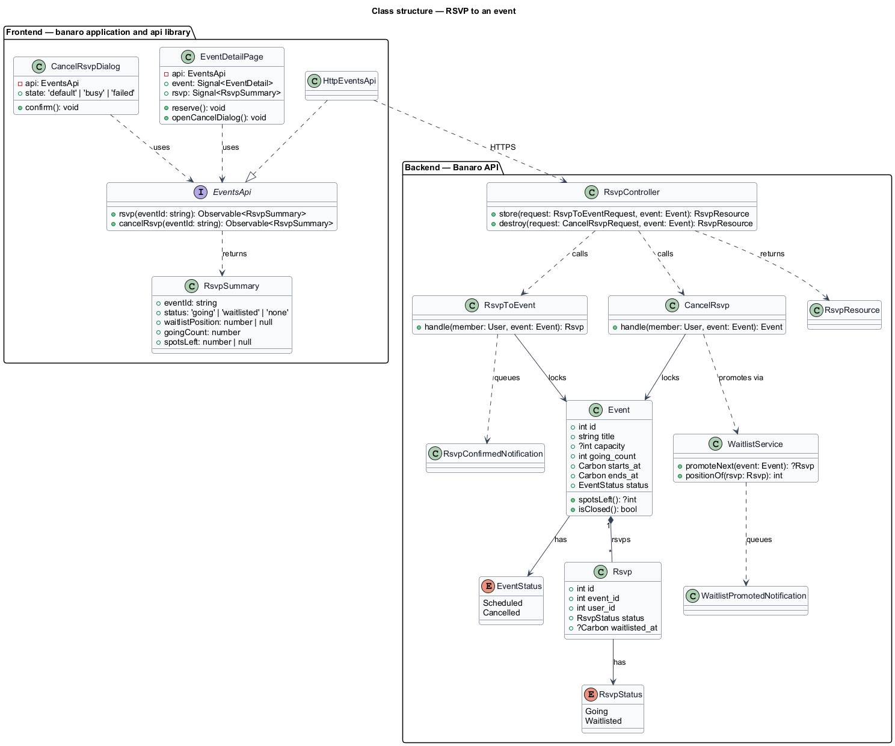
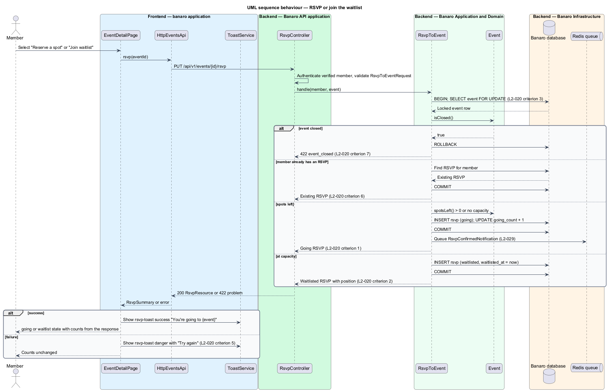
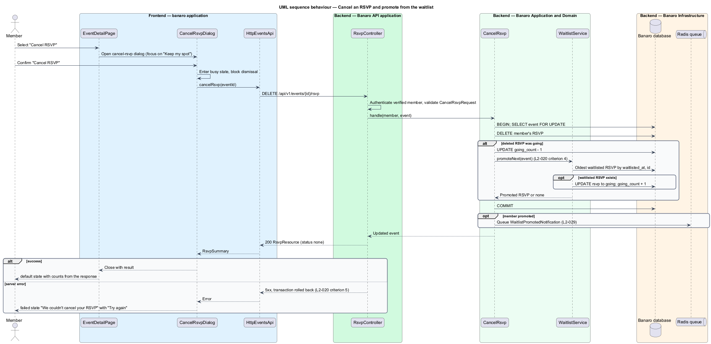

# RSVP to an event

## Overview

Banaro lists local gatherings for Christian product builders in Toronto and the GTA, such as demo
nights, prayer breakfasts and workshops. This feature lets a member reserve a place at one of those
events and give the place up again. It belongs to the `events` subsystem. It runs on the event detail
page (`/events/{id}`), which the `view-event` feature describes.

Terms used in this design:

- **RSVP** — member's recorded intention to attend one event
- **capacity** — maximum number of members an event admits; an event without capacity admits any number
- **going** — RSVP status of a member who holds one of the event's places
- **waitlist** — ordered queue of members who asked to attend an event that was at capacity
- **waitlist position** — 1-based rank of a waitlisted member, counted from the oldest waitlist entry
- **promotion** — move of the oldest waitlisted member to going when a place becomes free
- **closed event** — event that has started, has ended or is cancelled, and accepts no new RSVPs

A member selects "Reserve a spot" when the event has places left, or "Join waitlist" when it is full.
The API decides the outcome, not the browser. When two members ask for the last place at the same
moment, the API holds a row lock on the event, so exactly one of them takes the place. A member who
is going can cancel through the `cancel-rsvp` dialog. That frees the place, and the API promotes the
oldest waitlisted member and notifies them.

## Description

The slice runs from the event detail page in Banaro Web through the Banaro API to the Banaro database.
E-mail is sent through the Banaro Worker.

### Frontend — `banaro` application and libraries

- **`EventDetailPage`** (`pages/event-detail/`) — routed page for `/events/{id}`. It shows the
  RSVP panel in the `default`, `going` and `waitlist` states. Its "Reserve a spot", "Join waitlist" and
  "Cancel RSVP" actions call the events contract. It updates the going count and places left from the
  response, never from a local calculation.
- **`CancelRsvpDialog`** (`dialogs/cancel-rsvp/`) — CDK dialog with `default`, `busy` and `failed`
  states. Focus starts on "Keep my spot". The dialog cannot be dismissed while busy. In the `failed`
  state it shows "We couldn't cancel your RSVP" and a "Try again" action.
- **`ToastService`** (`components` library) — shows the `bn-rsvp-toast` success message "You're going
  to {event}" and the danger message "We couldn't save your RSVP" with "Try again". Toast timing
  follows the `system-notifications` feature (`L2-028`).
- **`EventsApi`** / **`EVENTS_API`** / **`HttpEventsApi`** (`api` library) — the contract, its
  injection token and its HTTP implementation. `rsvp(eventId)` sends `PUT /api/v1/events/{id}/rsvp`.
  `cancelRsvp(eventId)` sends `DELETE /api/v1/events/{id}/rsvp`. Both return an `RsvpSummary`.
- **`RsvpSummary`** (`api` library model) — `eventId`, `status` (`going`, `waitlisted` or `none`),
  `waitlistPosition`, `goingCount` and `spotsLeft`.

### Backend — Banaro API

- **`RsvpController`** (`Controllers/Api/V1/Events/`) — `store()` handles `PUT /events/{event}/rsvp`.
  `destroy()` handles `DELETE /events/{event}/rsvp`. Both routes are in `routes/api.php`, so they
  require a verified member. Each method calls one action and returns an `RsvpResource`.
- **`RsvpToEventRequest`** and **`CancelRsvpRequest`** (`Requests/Events/`) — form requests that
  authorize the member and reject any request body fields. The member is always taken from the
  session, never from the body.
- **`RsvpToEvent`** (`Actions/Events/`) — applies the RSVP rules in one database transaction:
  1. It locks the event row with `lockForUpdate()`. Concurrent RSVPs for one event therefore run one
     after another (`L2-020` criterion 3).
  2. It rejects a closed event with 422 and code `event_closed` (`L2-020` criterion 7). The design
     also treats a cancelled event as closed.
  3. It returns the member's existing RSVP unchanged if one exists (`L2-020` criterion 6).
  4. Otherwise it creates a `going` RSVP and increments `going_count` while places remain. At capacity
     it creates a `waitlisted` RSVP stamped with `waitlisted_at` (`L2-020` criteria 1 and 2).
  5. After commit, it queues `RsvpConfirmedNotification` for a going member.
- **`CancelRsvp`** (`Actions/Events/`) — locks the event row, deletes the member's RSVP and returns
  404 when none exists. When the deleted RSVP was going, it decrements `going_count` and calls
  `WaitlistService::promoteNext()` in the same transaction (`L2-020` criterion 4).
- **`WaitlistService`** (`Services/Events/`) — `promoteNext(Event)` changes the oldest waitlisted RSVP
  (ordered by `waitlisted_at`, then `id`) to going and increments `going_count`. It then queues
  `WaitlistPromotedNotification` after commit. `positionOf(Rsvp)` counts the waitlisted RSVPs ahead of
  the given RSVP and adds one.
- **`Event`** (`Models/`) — holds `capacity` (nullable), `going_count`, `starts_at`, `ends_at` and
  `status`. `spotsLeft()` returns `capacity - going_count`, or `null` without capacity. `isClosed()`
  is true once `starts_at` has passed or `status` is `Cancelled`.
- **`Rsvp`** (`Models/`) — one row per member and event, enforced by a unique index on
  (`event_id`, `user_id`). It holds `status` (`RsvpStatus`) and `waitlisted_at`. The unique index is
  the second guard on idempotence, after the row lock.
- **`RsvpResource`** (`Resources/Events/`) — serializes an RSVP and its event into the `RsvpSummary`
  shape.
- **`RsvpConfirmedNotification`** and **`WaitlistPromotedNotification`** (`Notifications/`) — queued
  notifications on the `mail` and `database` channels. The Banaro Worker sends them through the
  `Mailer` contract, subject to e-mail preferences (`L2-029`).

### Failure handling

A failed transaction rolls back, so `going_count`, the RSVP row and the waitlist stay unchanged
(`L2-020` criterion 5). The page then shows the `bn-rsvp-toast` danger message. The `cancel-rsvp`
dialog shows its `failed` state, and both offer a retry. A retried RSVP is safe because the request is
idempotent.

### Open points

- E-mail reminder timing for going members ("Wednesday evening" in the mock, 24 hours before in
  `L2-029`): `<TO SUPPLY>`; the `email-notifications` feature owns it.
- Behaviour when an administrator lowers an event's capacity below `going_count`: `<TO SUPPLY>`.

## Requirements

| L2 ID | Refines (L1) | Requirement |
|-------|--------------|-------------|
| `L2-020` | `L1-006` | A member shall be able to RSVP to an event with capacity, join a waitlist when it is full, and cancel. |

The design realizes all seven acceptance criteria of `L2-020`. The Description cites each criterion
where a component enforces it.

## Diagrams

### System context

A member reserves places through Banaro. Banaro confirms RSVPs and promotions by e-mail through the
mail provider.

### Containers

The event detail page in Banaro Web calls the Banaro API. The API locks and writes the event and its
RSVPs in the Banaro database and queues notifications on Redis. The Banaro Worker sends them.

### Components

Inside the Banaro API, `RsvpController` calls `RsvpToEvent` or `CancelRsvp`. `CancelRsvp` relies on
`WaitlistService` to promote the next waitlisted member.

### Class structure

An `Event` has many `Rsvp` rows, each with an `RsvpStatus`. The two actions depend on the models and
on `WaitlistService`. On the frontend, `EventDetailPage` and `CancelRsvpDialog` depend on the
`EventsApi` contract, not on `HttpEventsApi`.

### Behaviour — RSVP or join the waitlist

The action locks the event and checks whether it is closed or already reserved. It then creates a
going or waitlisted RSVP. The row lock makes the last-place race resolve to one going and one
waitlisted member.

### Behaviour — cancel an RSVP and promote from the waitlist

The member confirms the `cancel-rsvp` dialog. `CancelRsvp` deletes the RSVP and promotes the oldest
waitlisted member in the same transaction. The promotion e-mail leaves after commit.

