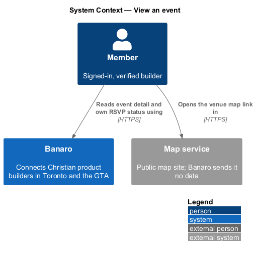
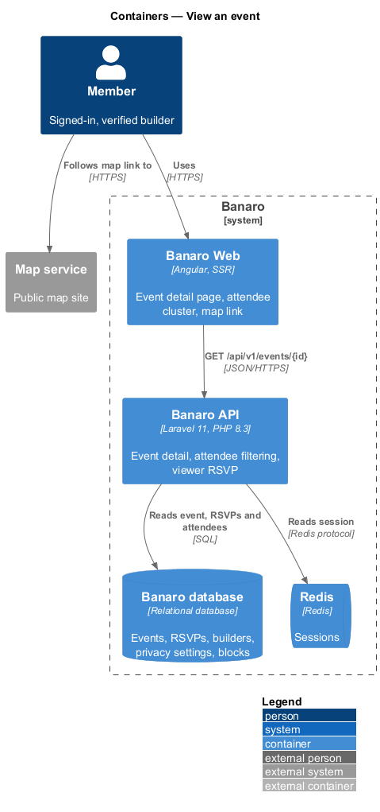
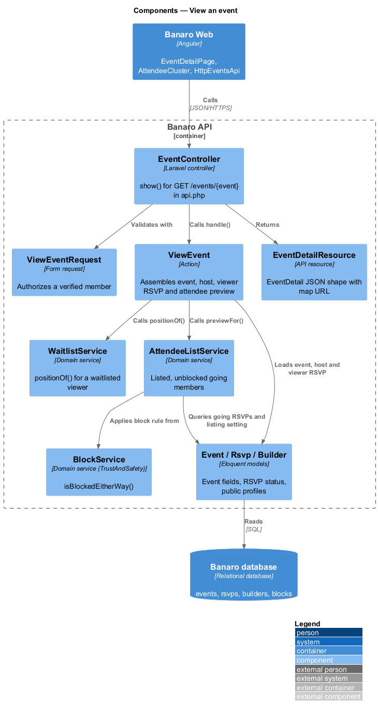
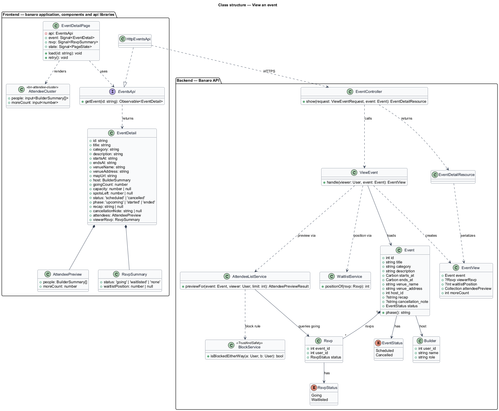
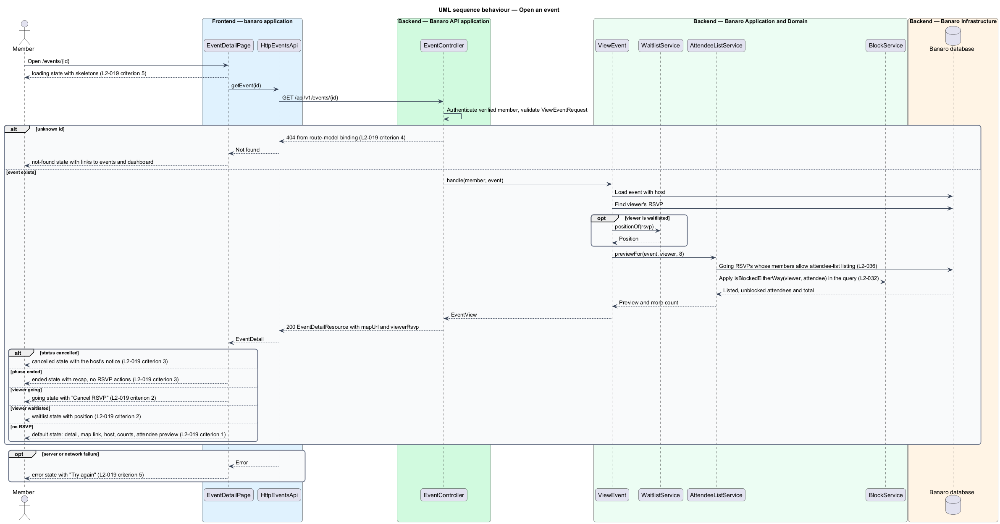

# View an event

## Overview

Each Banaro event has a detail page that tells a member what the gathering is, when and where it
happens, who hosts it and who else is going. This feature delivers that page at `/events/{id}`. It
belongs to the `events` subsystem. The `browse-events` feature links to it, and the `rsvp-to-event`
feature adds the reserve, waitlist and cancel actions to its RSVP panel.

Terms used in this design:

- **event detail** — full description of one event, including the viewer's own RSVP status
- **RSVP panel** — side panel of the page that shows the going count, places left and the viewer's
  RSVP status
- **attendee list** — members who are going to an event and who allow being listed (`L2-036`)
- **attendee preview** — first entries of the attendee list, followed by a count of the rest
- **host** — member who runs the event and is named on its page
- **ended event** — event whose end time has passed
- **cancelled event** — event whose `status` is `Cancelled`
- **recap** — short account of how an ended event went
- **map link** — link from the venue address to the public map service, opened in a new tab

The page reads one event and the viewer's RSVP in a single request. The API decides which members
appear in the attendee list. It omits members who have not opted in to attendee-list listing, and
members who are blocked in either direction with the viewer. The page then picks one of its states:
`default`, `going`, `waitlist`, `ended` or `cancelled`. A missing event yields `not-found`.

## Description

The slice runs from the event detail page in Banaro Web through the Banaro API to the Banaro database.
It reads only; RSVP writes belong to `rsvp-to-event`.

### Frontend — `banaro` application and libraries

- **`EventDetailPage`** (`pages/event-detail/`) — routed page for `/events/{id}`, shared with
  `rsvp-to-event`. It calls `getEvent(id)` on load and holds the result in `event` and `rsvp`
  signals. It derives its state from the response in this order:
  1. `cancelled` when `status` is `cancelled`. The page shows the cancellation notice and the
     host's note, and hides RSVP actions (`L2-019` criterion 3).
  2. `ended` when `phase` is `ended`. The page hides RSVP actions and shows the recap and the
     "Who came" list (`L2-019` criterion 3).
  3. `going` when `viewerRsvp.status` is `going`. The panel shows the going heading and the
     "Cancel RSVP" action (`L2-019` criterion 2).
  4. `waitlist` when `viewerRsvp.status` is `waitlisted`. The panel shows the member's waitlist
     position (`L2-019` criterion 2).
  5. `default` otherwise (`L2-019` criterion 1).
  - `loading` shows skeletons sized to the final layout. `error` shows "Try again" and a link to all
    events. A 404 response shows `not-found` with links to upcoming events and the dashboard
    (`L2-019` criteria 4 and 5).
  - The venue address renders as a map link to the map service. The link opens in a new tab and its
    accessible name says so. Banaro sends the map service no data; the browser follows the link.
- **`AttendeeCluster`** (`components` library, selector `bn-attendee-cluster`) — renders the attendee
  preview as avatars or initials, each with a visually hidden name, and the "and N more" count. It
  is a reusable component, so it ships with a perf-test scenario `AttendeeCluster.ts`.
- **`DateFormatter`** (`api` library, `lib/i18n/`) — formats "Thu 15 Oct 2026, 7:00–9:30 pm" in the
  America/Toronto zone (`L2-052` criterion 2). The `localize-and-format` feature owns it.
- **`EventsApi`** / **`EVENTS_API`** / **`HttpEventsApi`** (`api` library) — the events contract.
  This feature adds `getEvent(id)`, which sends `GET /api/v1/events/{id}` and returns an
  `EventDetail`. `InMemoryEventsApi` (`lib/testing/`) is the fake.
- **`EventDetail`** (`api` library model) — `id`, `title`, `category`, `description`, `startsAt`,
  `endsAt`, `venueName`, `venueAddress`, `mapUrl`, `host` (`BuilderSummary`), `goingCount`,
  `capacity`, `spotsLeft`, `status` (`scheduled` or `cancelled`), `phase` (`upcoming`, `started` or
  `ended`), `recap`, `cancellationNote`, `attendees` (`AttendeePreview`) and `viewerRsvp`
  (`RsvpSummary`, shared with `rsvp-to-event`).
- **`AttendeePreview`** (`api` library model) — `people` (up to 8 `BuilderSummary` entries, the count
  the mock shows) and `moreCount`, the number of further listed attendees.

### Backend — Banaro API

- **`EventController`** (`Controllers/Api/V1/Events/`) — `show()` handles `GET /events/{event}`. The
  route is in `routes/api.php`, because `L2-019` grants the page to members. Route-model binding
  returns 404 for an unknown id (`L2-019` criterion 4). The method calls `ViewEvent` and returns an
  `EventDetailResource`.
- **`ViewEventRequest`** (`Requests/Events/`) — authorizes a verified member and accepts no query or
  body fields (`L2-045` criterion 1).
- **`ViewEvent`** (`Actions/Events/`) — loads the event with its host. It reads the viewer's `Rsvp`
  and, for a waitlisted RSVP, its position from `WaitlistService::positionOf()`. It asks
  `AttendeeListService` for the attendee preview. It returns an `EventView` value object.
- **`AttendeeListService`** (`Services/Events/`) — `previewFor(Event, User $viewer, int $limit)`
  selects going RSVPs whose members allow attendee-list listing. The `control-privacy` feature owns
  that setting (`L2-036` criterion 1); its default is off (`L2-036` criterion 4). The service also
  drops each attendee for whom `BlockService::isBlockedEitherWay($viewer, $attendee)` holds (`L2-032`
  criterion 1). `BlockService` lives in `Services/TrustAndSafety` and is owned by `block-builder`.
  The filters run in the query, not in the browser (`L2-044` criterion 5).
- **`WaitlistService`** (`Services/Events/`) — the service from `rsvp-to-event`. This feature calls
  only `positionOf(Rsvp)`.
- **`Event`** (`Models/`) — the shared model. This feature also reads `description`, `category`,
  `recap`, `cancellation_note` and `host_id`. `phase()` returns `upcoming`, `started` or `ended` from
  `starts_at` and `ends_at`.
- **`Rsvp`**, **`RsvpStatus`** and **`EventStatus`** (`Models/`, `Enums/`) — as defined in
  `rsvp-to-event`.
- **`Builder`** (`Models/`) — public profile of the host and of each listed attendee.
- **`EventDetailResource`** (`Resources/Events/`) — serializes an `EventView` into the `EventDetail`
  shape. It embeds an `RsvpResource` for the viewer, or `status: none` without an RSVP. It builds
  `mapUrl` from the venue address and the map-service URL template.

### Failure handling

A 404 leads to the `not-found` state and reveals nothing about why the event is missing. Any other
failure leads to the `error` state, whose "Try again" repeats `getEvent(id)`. A visitor who opens the
page receives 401 from the API. The `banaro` application then sends the visitor to `/sign-in` with a
`returnTo` parameter, through the shared route guard in the `api` library (`lib/auth/`).

### Open points

- The event detail mock shows the venue address as plain text with no map link, while `L2-019`
  criterion 1 requires one. The map-service URL template is `<TO SUPPLY>`.
- The mock manifest uses the route `/events/fall-demo-night`, a slug; `L2-019` uses `/events/{id}`.
  The identifier form is `<TO SUPPLY>`.
- `L2-018` lets visitors browse events, but `L2-019` grants the detail page to members. Whether a
  visitor may read an event's detail without the attendee list is `<TO SUPPLY>`.
- The mock shows the viewer in "Who is going" in the `going` state. Whether a member always sees
  themselves in the list, whatever their own listing setting, is `<TO SUPPLY>`.
- The mock shows "Six demos" and "The evening" sections. Whether these are structured event fields
  or part of the description is `<TO SUPPLY>`. The `category` vocabulary ("Demo night") is also
  `<TO SUPPLY>`.
- No mock state covers an event that has started but not ended. `L2-020` criterion 7 closes RSVPs
  then, but the page state for that window is `<TO SUPPLY>`.
- The `going` mock offers "Add to calendar", which no L2 criterion covers; its behaviour is
  `<TO SUPPLY>`.
- The going-state copy promises a reminder "on Wednesday evening", while `L2-029` criterion 1 says
  24 hours before the event. The `email-notifications` feature owns the timing; `<TO SUPPLY>`.
- How events are created and how hosts write the recap and cancellation note is `<TO SUPPLY>`; no
  admin slice exists yet.

## Requirements

| L2 ID | Refines (L1) | Requirement |
|-------|--------------|-------------|
| `L2-019` | `L1-006` | A member shall be able to see an event's detail and their own RSVP status at `/events/{id}`. |

The design realizes all five acceptance criteria of `L2-019`. The attendee list applies the
attendee-list listing setting of `L2-036` and the block rule of `L2-032` without redesigning either.

## Diagrams

### System context

A member reads an event's detail in Banaro. The venue address links to the public map service, which
the member's browser opens directly.

### Containers

The event detail page in Banaro Web calls the Banaro API. The API reads the event, the member's RSVP
and the attendee list from the Banaro database.

### Components

Inside the Banaro API, `EventController` calls `ViewEvent`. `ViewEvent` uses `WaitlistService` for
the waitlist position and `AttendeeListService` for the attendee preview. `AttendeeListService`
applies the block rule from `BlockService`.

### Class structure

`EventDetailPage` depends on the `EventsApi` contract and renders `AttendeeCluster`. On the backend,
`ViewEvent` assembles an `EventView` from `Event`, `Rsvp` and the attendee preview.

### Behaviour — open an event

The page requests the event detail. The API filters the attendee list by the listing setting and
the block rule, adds the viewer's RSVP and returns one payload. The page picks its state from that
payload.

