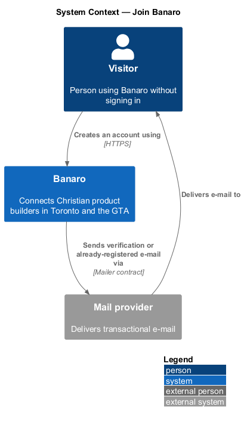
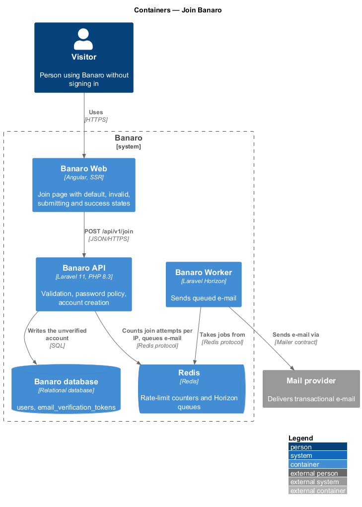
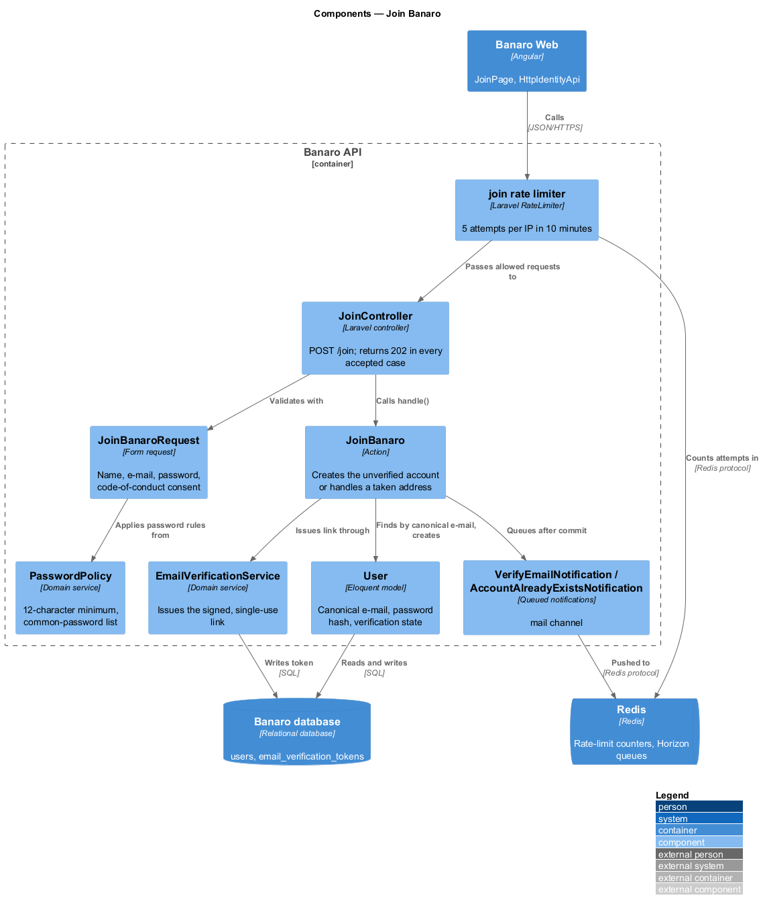
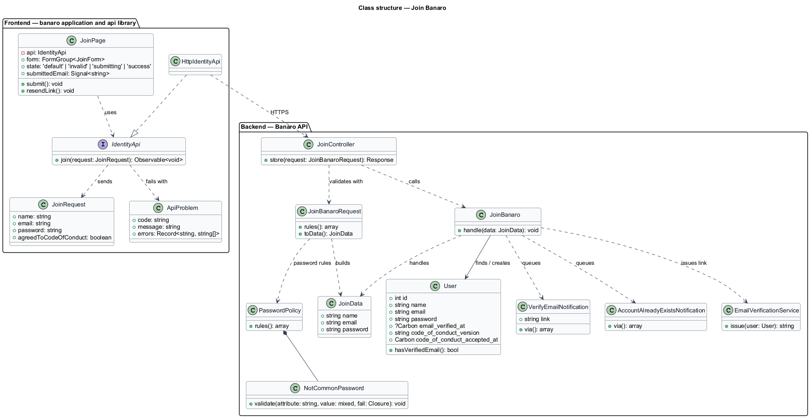
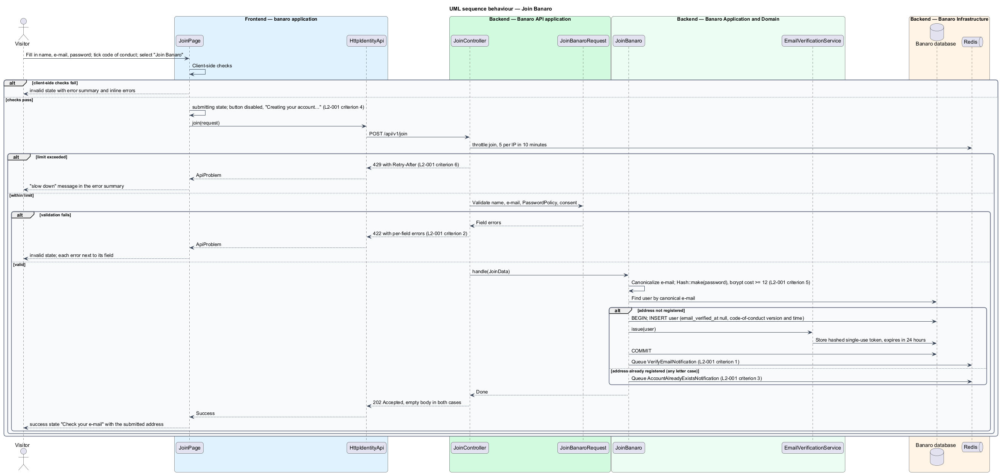

# Join Banaro

## Overview

Banaro connects Christian product builders in Toronto and the GTA. Every member area depends on an
account, and this feature creates one. It belongs to the `identity` subsystem and runs on the join
page (`/join`). It is the first step of a chain: the `verify-email` feature confirms the address, and
the `complete-onboarding` feature in the `profiles` subsystem builds the profile.

Terms used in this design:

- **account** — `User` row that holds a person's name, e-mail address, password hash and verification state
- **unverified account** — account whose e-mail address has not yet been confirmed through a verification link
- **compliant password** — password of at least 12 characters that is absent from the common-password list
- **common-password list** — fixed list of frequently used passwords that Banaro refuses
- **canonical e-mail** — e-mail address trimmed and lower-cased, used for the uniqueness check
- **code of conduct** — public community rules at `/code-of-conduct` that every member agrees to

A visitor enters a full name, an e-mail address and a password, and ticks the code-of-conduct box. The
API validates the input and creates an unverified account. It then queues a verification e-mail. The
page shows a "Check your e-mail" success state. When the address already belongs to an account, the
API creates nothing. It returns the same response and e-mails the address owner instead. The response
therefore never tells a visitor whether an address is registered.

Joining does not start a session. A session for a brand-new account would reveal, by contrast, that a
duplicate attempt created nothing. The member signs in after verifying the address.

## Description

The slice runs from the join page in Banaro Web through the Banaro API to the Banaro database. The
Banaro Worker sends the e-mail.

### Frontend — `banaro` application and libraries

- **`JoinPage`** (`pages/join/`) — routed page for `/join`, with the states `default`, `invalid`,
  `submitting` and `success`. It holds a typed reactive form with the fields `name`, `email`,
  `password` and `agree`.
  - On submit it runs client-side checks that mirror the server rules. Errors appear in the
    `bn-form-layout` error summary ("Fix these before continuing") and under each field. Focus moves
    to the first invalid field, and the summary is announced as an alert (`L2-001` criterion 13).
  - The consent label links to `/code-of-conduct` with `target="_blank"`, `rel="noopener"` and the
    visually hidden text " (opens in a new tab)" (`L2-034` criterion 2).
  - While the request is in flight, the `bn-button` submit control is disabled, carries `aria-busy`
    and reads "Creating your account…". A second submission cannot start (`L2-001` criterion 4).
  - A 422 response maps each field error from the API to its field (`L2-001` criterion 2).
  - A 202 response shows the `success` state "Check your e-mail" with the submitted address. "Send
    the link again" calls the resend operation that the `verify-email` feature defines. "I have
    confirmed my e-mail" goes to `/sign-in`, because joining starts no session (`L2-001` criterion 12).
  - The password value never leaves the form except in the request body. It is never echoed back.
- **`bn-form-layout`**, **`bn-text-field`**, **`bn-checkbox`** and **`bn-button`** (`components`
  library) — the error summary, labelled inputs with inline errors, the consent checkbox and the busy
  submit button.
- **`IdentityApi`** / **`IDENTITY_API`** / **`HttpIdentityApi`** (`api` library) — the identity
  contract, its injection token and its HTTP implementation. `join(request: JoinRequest)` sends
  `POST /api/v1/join`. The implementation maps camel-case model fields to the snake-case JSON fields
  the API expects. The `banaro` application binds the token in `app.config.ts`.
- **`JoinRequest`** (`api` library model) — `name`, `email`, `password` and `agreedToCodeOfConduct`.
- **`ApiProblem`** (`api` library model) — the error body: `code`, `message` and `errors` (a map of
  field name to messages).
- **`InMemoryIdentityApi`** (`api` library testing) — fake of the contract for component tests.

### Backend — Banaro API

- **Route** — `POST /api/v1/join` in `routes/api_public.php`, the deliberate anonymous exception. The
  route carries the `throttle:join` middleware.
- **`join` rate limiter** — defined in `AppServiceProvider::boot()`. It allows 5 attempts per IP
  address in 10 minutes. The next attempt receives 429 with a `Retry-After` header (`L2-001`
  criterion 6). Logging of limited requests follows the `limit-request-rates` feature (`L2-046`).
- **`JoinController`** (`Controllers/Api/V1/Identity/`) — `store()` validates through
  `JoinBanaroRequest`, calls `JoinBanaro` and returns 202 Accepted with an empty body. The status
  and body are the same whether or not the address was new (`L2-001` criterion 3).
- **`JoinBanaroRequest`** (`Requests/Identity/`) — form request with these rules:
  - `name` — required string, at most 100 characters (`L2-001` criterion 7).
  - `email` — required, RFC-valid e-mail, at most 254 characters.
  - `password` — required string of at most 128 characters, validated by `PasswordPolicy::rules()`.
  - `agreed_to_code_of_conduct` — required and accepted.
  - On failure it returns 422 with per-field errors, and no account is created (`L2-001` criterion 2).
- **`PasswordPolicy`** (`Services/Identity/`) — owns the password rules shared with the
  `recover-password` feature. `rules()` returns a minimum of 12 characters, a maximum of 128 and the
  `NotCommonPassword` rule. `NotCommonPassword` reads the common-password list from
  `resources/security/common-passwords.txt`, a bundled file of the 10,000 most common passwords that
  it compares case-insensitively (`L2-001` criterion 8).
- **`JoinBanaro`** (`Actions/Identity/`) — `handle(JoinData)` applies the join rules:
  1. It canonicalizes the e-mail address.
  2. It hashes the password through `Hash::make()` in every path, including the duplicate path. The
     password is first pre-hashed (SHA-256, base64) so bcrypt's 72-byte limit never truncates it
     (`L2-001` criterion 7). Both paths therefore take similar time.
  3. When no account holds the canonical e-mail, it creates a `User` in one transaction. The `User`
     has `email_verified_at` set to null. It also stores the accepted code-of-conduct version and
     the acceptance time (`L2-034` criterion 3). It creates no `Builder` profile; onboarding does
     (`L2-001` criterion 11).
  4. It asks `EmailVerificationService` to issue a link and queues `VerifyEmailNotification`
     (`L2-001` criterion 1).
  5. When the address is taken, it creates nothing and queues `AccountAlreadyExistsNotification` to
     that address (`L2-001` criterion 3).
- **`User`** (`Models/`) — the account. The unique index on `email` holds the canonical form, so
  `Amara@Example.com` and `amara@example.com` collide. A unique-index violation from a concurrent join
  is caught and handled as the duplicate path. `password` and `remember_token` are in `$hidden`, so no
  resource returns them (`L2-001` criterion 5).
- **Password hashing** — `config/hashing.php` selects `bcrypt` with `rounds` of at least 12, a salted
  adaptive algorithm (`L2-001` criterion 5). `password` and `password_confirmation` are in the
  exception handler's `dontFlash` list. The request logger redacts both, so no log holds a password.
- **`EmailVerificationService`** (`Services/Identity/`) — issues the signed, single-use verification
  link. The `verify-email` feature describes it in full.

### Backend — Banaro Worker

- **`VerifyEmailNotification`** and **`AccountAlreadyExistsNotification`** (`Notifications/`) — queued
  notifications on the `mail` channel only. They are security e-mail, so member e-mail preferences do
  not suppress them (`L2-029` criterion 2). The Worker sends them through the `Mailer` contract.
  `AccountAlreadyExistsNotification` has the subject "You already have a Banaro account", says that
  someone tried to join with the address, links to `/sign-in` and `/forgot-password`, and carries no
  verification link (`L2-001` criterion 10).

### Failure handling

A failed transaction rolls back, so no partial account remains. The page keeps the entered name and
e-mail address and shows a danger `bn-alert` with a retry. A 429 response shows a "slow down" message
in the error summary (`L2-046` criterion 2).

### Resolved decisions

- Focus after a failed submit goes to the first invalid field, with the summary announced as an alert
  (`L2-001` criterion 13; `join/invalid.html` note updated).
- The code-of-conduct link opens in a new tab and its accessible name ends in "(opens in a new tab)"
  (`L2-034` criterion 2; all three form states of `join` updated).
- A common password shows "That password is too common. Choose something harder to guess." beside
  the password field (`L2-001` criterion 8).
- A 429 shows a danger `bn-alert`: "You're trying too fast. Wait N minutes, then try again." (`L2-001`
  criterion 9). No mock state shows it; it uses the same alert as the failed-request state.
- The common-password list is a bundled file of the 10,000 most common passwords, compared
  case-insensitively (`L2-001` criterion 8).
- `name` is at most 100 characters and `password` at most 128 (`L2-001` criterion 7).
- The already-registered e-mail has the subject "You already have a Banaro account" and no
  verification link (`L2-001` criterion 10).
- `JoinBanaro` creates no `Builder` profile; `complete-onboarding` creates it (`L2-001` criterion 11).
  The `accept-code-of-conduct` design owns the final shape of the stored acceptance.
- "I have confirmed my e-mail" on the success state goes to `/sign-in` (`L2-001` criterion 12;
  `join/success.html`).

## Requirements

| L2 ID | Refines (L1) | Requirement |
|-------|--------------|-------------|
| `L2-001` | `L1-001` | A visitor shall be able to create an account with name, e-mail and password and shall agree to the code of conduct. Passwords shall be at least 12 characters and shall not be on a common-password list. The e-mail address shall be unique case-insensitively. |

The design realizes all thirteen acceptance criteria of `L2-001`. The Description cites each criterion
where a component enforces it.

## Diagrams

### System context

A visitor joins through Banaro. Banaro sends the verification e-mail, or the already-registered
e-mail, through the mail provider.

### Containers

The join page in Banaro Web calls the Banaro API. The API writes the account to the Banaro database
and queues the e-mail on Redis, and the Banaro Worker sends it.

### Components

Inside the Banaro API, `JoinController` validates through `JoinBanaroRequest` and `PasswordPolicy`,
then calls `JoinBanaro`. `JoinBanaro` creates the `User` and asks `EmailVerificationService` for a
link.

### Class structure

`JoinPage` depends on the `IdentityApi` contract, not on `HttpIdentityApi`. On the backend,
`JoinBanaro` depends on `User`, `EmailVerificationService` and the two notifications.

### Behaviour — join Banaro

The API validates the form, hashes the password and checks the canonical e-mail. A new address gets
an unverified account and a verification e-mail. A taken address gets the same 202 response and a
different e-mail.

