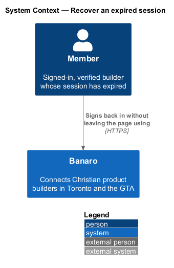
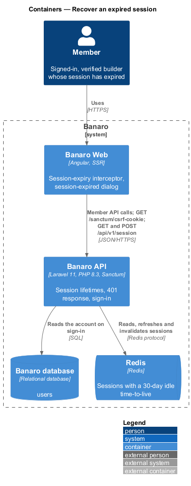
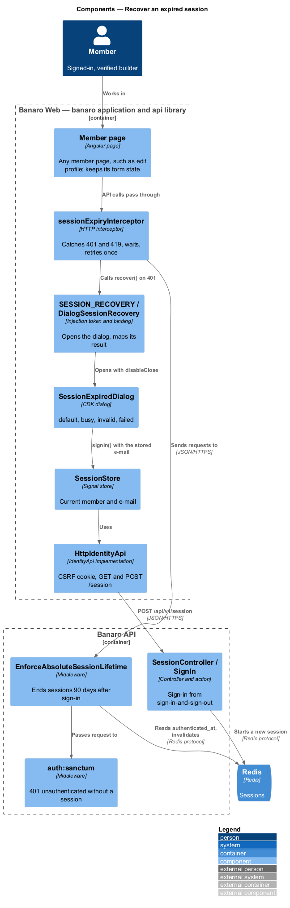
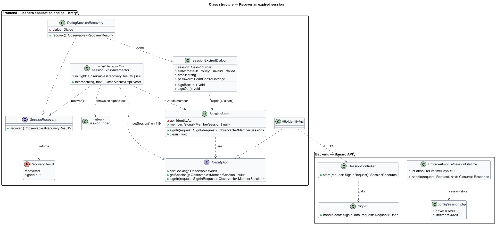
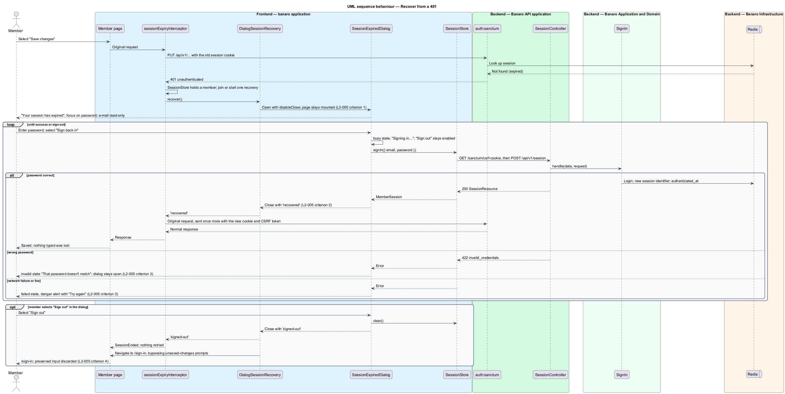
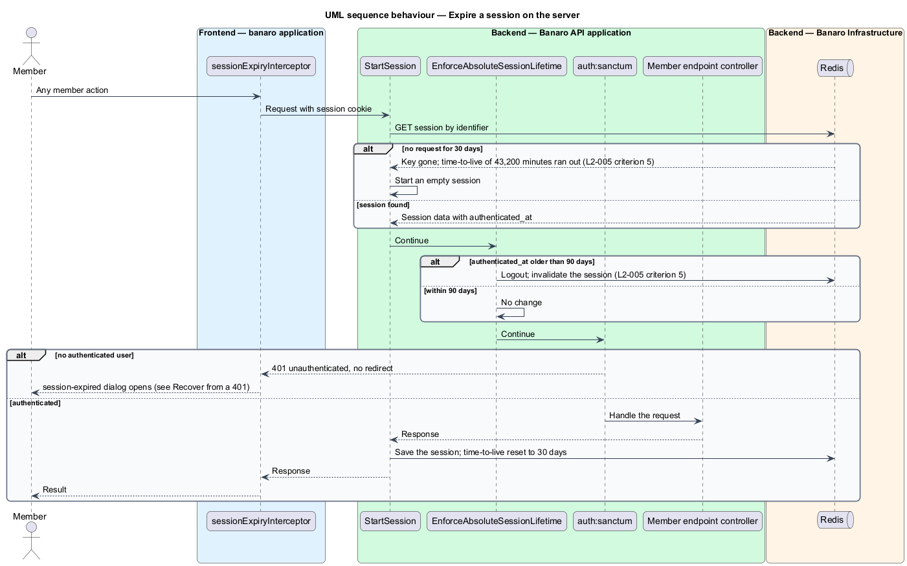

# Recover an expired session

## Overview

A member can spend a long time on one Banaro screen, such as the edit-profile form. When the session
ends during that time, the next save would otherwise fail and the typed input would be lost. This
feature catches the expiry, asks the member to sign back in over the current page, and then repeats
the action that failed. It belongs to the `identity` subsystem. It runs in the `session-expired`
dialog, which can open over any member page, and in the session lifetime rules of the Banaro API.

Terms used in this design:

- **idle lifetime** — period without any request after which the server ends a session; 30 days
- **absolute lifetime** — period after sign-in after which the server ends a session regardless of activity; 90 days
- **expired session** — session that the server no longer accepts, because a lifetime passed or the session was revoked
- **original action** — API request that failed because the session had expired
- **preserved state** — in-memory page state, including unsent form input, that survives the dialog because no navigation happens
- **recovery** — single re-authentication through the dialog that every waiting request shares

When any member API call returns 401, Banaro Web opens the `session-expired` dialog over the page and
moves focus into it. The page stays mounted underneath, so nothing typed is lost. The dialog shows the
member's e-mail address read-only and asks for the password. On success the dialog closes and the
original action runs once more. "Sign out" in the dialog goes to `/sign-in` and discards the preserved
input.

## Description

The slice runs from an HTTP interceptor and the `session-expired` dialog in Banaro Web to the Banaro
API's session middleware and the sign-in endpoint that the `sign-in-and-sign-out` feature defines.
Redis holds the sessions.

### Frontend — `banaro` application and libraries

- **`sessionExpiryInterceptor`** (`api` library, `lib/auth/`) — HTTP interceptor on every API call
  except the identity session endpoints.
  - On a 401 while `SessionStore` holds a member, it asks `SESSION_RECOVERY` to recover (`L2-005`
    criterion 1). The failed request waits for the result.
  - Requests that fail while a recovery is in progress share that recovery, so only one dialog opens.
  - After a successful recovery it sends the original request again, once. A second 401 for the same
    request goes to the caller as an error, so no loop can form (`L2-005` criterion 2).
  - A state-changing request with an expired session can fail with 419 before authentication runs,
    because the CSRF token belonged to the old session. On 419 the interceptor calls `getSession()`.
    A `null` member is handled as a 401. Otherwise it refreshes the CSRF cookie and retries once.
  - When the member signs out instead, the waiting requests fail with a `SessionEnded` error that
    pages ignore. A `BroadcastChannel` tells other tabs of a recovery or sign-out (`L2-005`
    criterion 7).
- **`SessionRecovery`** / **`SESSION_RECOVERY`** (`api` library, `lib/auth/`) — the contract
  `recover(): Observable<'recovered' | 'signed-out'>` and its injection token. The `api` library
  therefore does not depend on application dialogs. The `banaro` application binds the token in
  `app.config.ts`.
- **`DialogSessionRecovery`** (`banaro` application, `shared/`) — implements `SessionRecovery`. It
  opens `SessionExpiredDialog` through CDK `Dialog` with `disableClose: true`, so Escape and backdrop
  clicks do not close it. It maps the dialog result to the recovery result.
- **`SessionExpiredDialog`** (`dialogs/session-expired/`) — CDK dialog with the states `default`,
  `busy`, `invalid` and `failed`, titled "Your session has expired".
  - Focus starts on the password field. The e-mail field is read-only and comes from `SessionStore`.
  - "Sign back in" calls `SessionStore.signIn()`, which fetches a fresh CSRF cookie and sends
    `POST /api/v1/session`. In the `busy` state the fields are read-only and the button reads
    "Signing in…". "Sign out" stays enabled.
  - Success closes the dialog with `recovered` (`L2-005` criterion 2).
  - A 422 `invalid_credentials` shows the `invalid` state "That password doesn't match. Try again, or
    reset it." with "reset it" linking to `/forgot-password` in a new tab. Focus returns to the password field and the dialog stays open (`L2-005` criterion 3).
  - A network failure or 5xx shows the `failed` state with a danger `bn-alert`, "We couldn't sign you
    in", and "Try again". The alert never auto-dismisses (`L2-005` criterion 3).
  - "Sign out" clears `SessionStore` and closes the dialog with `signed-out`. It then navigates to
    `/sign-in` and bypasses unsaved-changes prompts, so the page and its preserved input are
    discarded (`L2-005` criterion 4).
- **`SessionStore`** (`api` library, `lib/auth/`) — keeps the member while the dialog is open. The
  interceptor knows from it that a session existed, and the dialog reads the e-mail address from it.
- **`bn-dialog`**, **`bn-text-field`**, **`bn-alert`** and **`bn-button`** (`components` library) — the
  dialog frame, the fields, the danger alert and the busy button.

### Backend — Banaro API

- **Idle lifetime** — `config/session.php` sets `lifetime` to 43,200 minutes (30 days). Each request
  rewrites the Redis session with a fresh time-to-live. A session without activity for 30 days
  therefore expires (`L2-005` criterion 5).
- **`EnforceAbsoluteSessionLifetime`** (`Http/Middleware/`) — runs in the stateful API middleware
  after the session starts and before authentication. It reads the `authenticated_at` value that
  `SignIn` stored. After 90 days it logs out and invalidates the session, so the request continues
  unauthenticated (`L2-005` criterion 5). `config/security.php` holds the 90-day value.
- **Unauthenticated response** — `bootstrap/app.php` renders `AuthenticationException` on API routes
  as 401 with code `unauthenticated` and no redirect. Wrong credentials answer 422, not 401, so a
  failed sign-in never triggers the dialog.
- **`SessionController`** and **`SignIn`** (`Controllers/Api/V1/Identity/`, `Actions/Identity/`) —
  the sign-in endpoint from `sign-in-and-sign-out`. The dialog reuses it unchanged, including its
  throttle and its new session identifier.

### Failure handling

The dialog keeps the page usable underneath after every failure. A wrong password keeps the dialog
open. A failed request keeps the input and offers "Try again". The original action is not retried
until a sign-in succeeds.

### Resolved decisions

- A 429 from the sign-in throttle keeps the dialog open and shows a danger `bn-alert`, "Too many
  sign-in attempts. Try again in N minutes." (`L2-005` criterion 6); no dialog state shows it.
- Two tabs on one expired session coordinate through a `BroadcastChannel`: when one recovers, the
  other's dialog closes and its original action retries; when one signs out, the other goes to
  `/sign-in` (`L2-005` criterion 7).
- The original action is retried once without a confirmation, whatever its method, because a 401
  means the server did not process it (`L2-005` criterion 8).
- When a password reset revoked the session, the dialog adds no explanation. The `invalid` state's
  "reset it" link opens `/forgot-password` in a new tab so the preserved input survives (`L2-005`
  criterion 9; `session-expired/invalid.html`).

## Requirements

| L2 ID | Refines (L1) | Requirement |
|-------|--------------|-------------|
| `L2-005` | `L1-001`, `L1-013` | When a member's session expires while they work, the app shall let them sign in again without losing work. |

The design realizes all nine acceptance criteria of `L2-005`. The Description cites each criterion
where a component enforces it.

## Diagrams

### System context

A member signs back in to Banaro from the page in use. No external system takes part.

### Containers

Banaro Web catches the 401 and calls the Banaro API to sign in again. The API keeps sessions, with
their idle and absolute lifetimes, in Redis.

### Components

Inside Banaro Web, `sessionExpiryInterceptor` reaches `SessionExpiredDialog` through the
`SESSION_RECOVERY` token. Inside the Banaro API, `EnforceAbsoluteSessionLifetime` ends old sessions
and `SessionController` signs the member in again.

### Class structure

The interceptor depends on the `SessionRecovery` contract, which `DialogSessionRecovery` implements
with the dialog. The dialog depends on `SessionStore`, which depends on the `IdentityApi` contract.

### Behaviour — recover from a 401

A member API call returns 401, and the dialog opens over the page. A correct password closes it, and
the original request runs once more. A wrong password, a failure and "Sign out" are the alternates.

### Behaviour — expire a session on the server

The Redis time-to-live ends an idle session after 30 days. The middleware ends any session 90 days
after sign-in. Either way the next member request receives 401.

