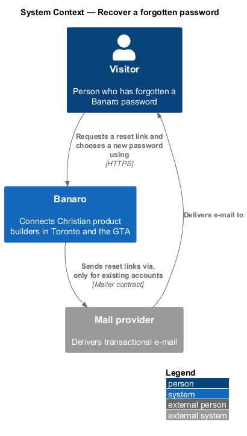
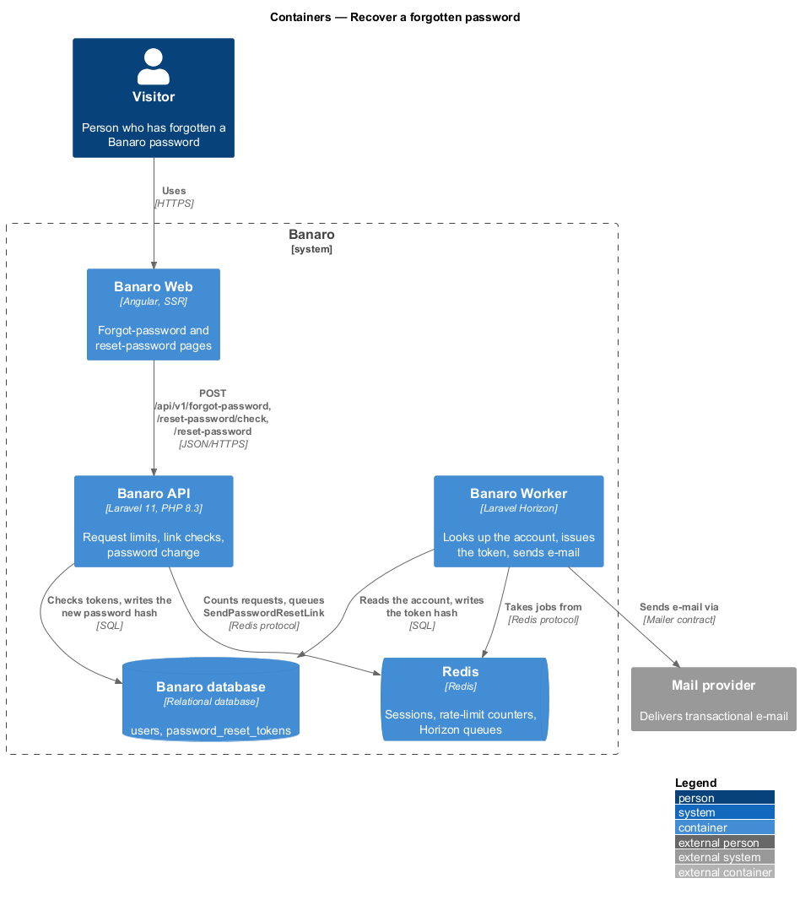
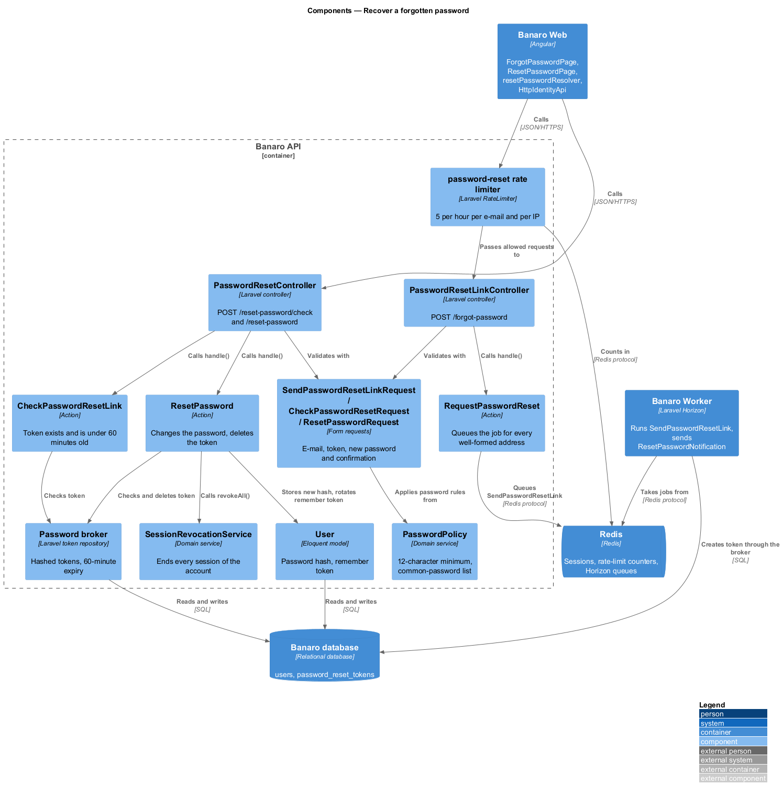
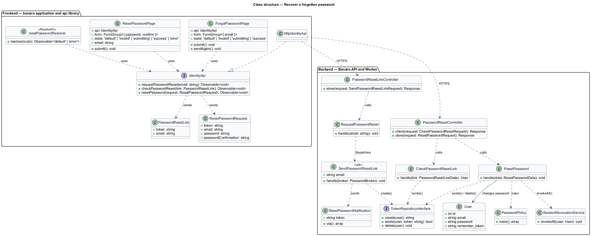
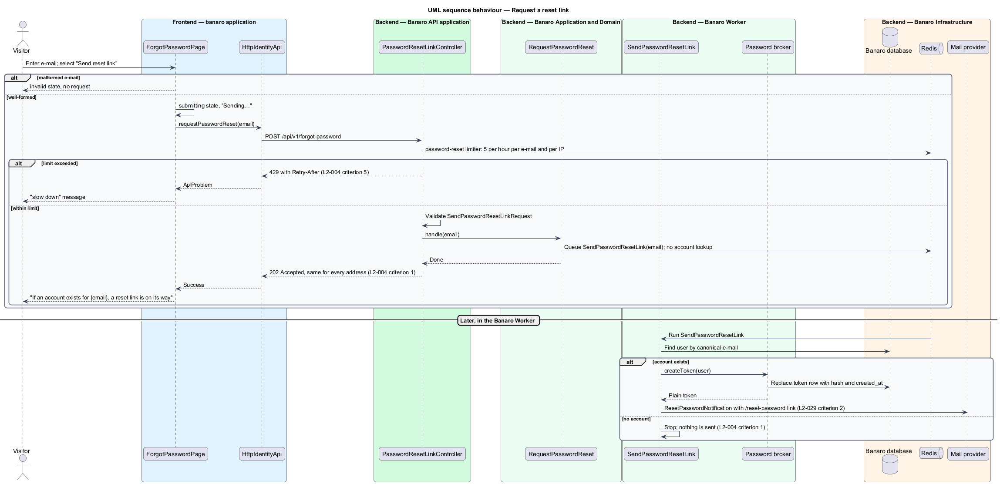
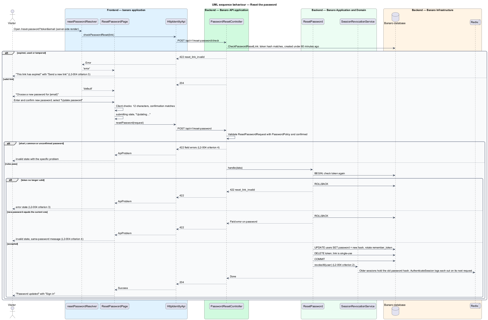

# Recover a forgotten password

## Overview

A member who forgets a password needs a way back into Banaro that does not help an attacker probe for
registered addresses. This feature sends a reset link by e-mail and lets the holder of the link choose
a new password. It belongs to the `identity` subsystem. It runs on two pages: the forgot-password page
(`/forgot-password`) and the reset-password page (`/reset-password`).

Terms used in this design:

- **reset link** — URL to `/reset-password` that carries a reset token and the account's e-mail address
- **reset token** — 64-character random secret; the database stores only its hash, with a creation time
- **expired link** — reset link whose token is 60 minutes old or older
- **used link** — reset link whose token was deleted by a completed reset or replaced by a newer request
- **tampered link** — reset link whose token or e-mail address does not match a stored token
- **session revocation** — ending every existing session of an account so each one needs a new sign-in

A person enters an e-mail address on `/forgot-password`. The page always shows the same `success`
state, "If an account exists for {email}, a reset link is on its way". The link is e-mailed only when
an account exists. The link opens `/reset-password`, which checks it before the form appears. With a
valid link, the person enters and confirms a new password. The password changes, every session of the
account ends, and the `success` state links to sign-in.

## Description

The slice runs from the two pages in Banaro Web through the Banaro API to the Banaro database. The
Banaro Worker looks up the account and sends the e-mail.

### Frontend — `banaro` application and libraries

- **`ForgotPasswordPage`** (`pages/forgot-password/`) — routed page for `/forgot-password`, with the
  states `default`, `invalid`, `submitting` and `success`.
  - A malformed address shows the `invalid` state without a request.
  - While the request is in flight, the button reads "Sending…".
  - Any accepted request shows the `success` state with the submitted address and "It works for
    60 minutes" (`L2-004` criterion 1). "Send it again" repeats the request.
  - A 429 shows a danger `bn-alert`: "Too many requests. Try again in N minutes." (`L2-004`
    criteria 5 and 7, `L2-046` criterion 2).
- **`ResetPasswordPage`** (`pages/reset-password/`) — routed page for `/reset-password`, with the states
  `default`, `invalid`, `submitting`, `success` and `error`.
  - It renders the outcome of `resetPasswordResolver`. A rejected link shows the `error` state "This
    link has expired" with "Send a new link" to `/forgot-password` (`L2-004` criterion 3).
  - The `default` state reads "Choose a new password for {email}" and has "New password" and "Confirm
    new password" fields.
  - Client-side checks cover the 12-character minimum and the confirmation match.
  - Server errors map to the `invalid` state with the specific problem: reuse of the current password
    reads "Choose a different password. This one is your current password." and a common password
    reads "That password is too common. Choose something harder to guess." (`L2-004` criteria 4
    and 6).
  - The `success` state "Password updated" links to `/sign-in`. `SessionStore` clears any member it
    held.
- **`resetPasswordResolver`** (`pages/reset-password/`) — Angular route resolver that calls
  `checkPasswordReset()` during server-side rendering. A submit that finds the link expired since
  then also switches the page to `error`.
- **`IdentityApi`** / **`IDENTITY_API`** / **`HttpIdentityApi`** (`api` library) —
  `requestPasswordReset(email)` sends `POST /api/v1/forgot-password`. `checkPasswordReset(link)`
  sends `POST /api/v1/reset-password/check`. `resetPassword(request)` sends
  `POST /api/v1/reset-password`.
- **`PasswordResetLink`** and **`ResetPasswordRequest`** (`api` library models) — `token` and
  `email`; and the same two fields with `password` and `passwordConfirmation`.
- **`bn-form-layout`**, **`bn-text-field`** and **`bn-button`** (`components` library) — the error
  summary, the fields and the busy submit button.

### Backend — Banaro API

- **Routes** — `POST /api/v1/forgot-password`, `POST /api/v1/reset-password/check` and
  `POST /api/v1/reset-password` in `routes/api_public.php`. The person resetting a password is not
  signed in.
- **`password-reset` rate limiter** — defined in `AppServiceProvider::boot()` and applied to
  `POST /forgot-password`. It allows 5 requests per hour per canonical e-mail and 5 per hour per IP
  address. The next request receives 429 with `Retry-After` (`L2-004` criterion 5). Unknown addresses
  are limited the same way, so a 429 reveals nothing.
- **`PasswordResetLinkController`** (`Controllers/Api/V1/Identity/`) — `store()` validates through
  `SendPasswordResetLinkRequest`, calls `RequestPasswordReset` and returns 202 with an empty body.
- **`PasswordResetController`** (`Controllers/Api/V1/Identity/`) — `check()` validates through
  `CheckPasswordResetRequest`, calls `CheckPasswordResetLink` and returns 204. `store()` validates
  through `ResetPasswordRequest`, calls `ResetPassword` and returns 204. A rejected link returns 422
  with code `reset_link_invalid`.
- **`SendPasswordResetLinkRequest`**, **`CheckPasswordResetRequest`** and **`ResetPasswordRequest`**
  (`Requests/Identity/`) — form requests. `ResetPasswordRequest` applies `PasswordPolicy::rules()`
  and `confirmed` to `password`.
- **`RequestPasswordReset`** (`Actions/Identity/`) — dispatches the `SendPasswordResetLink` job for
  every well-formed address. It does no account lookup, so the response and its timing do not depend
  on registration (`L2-004` criterion 1).
- **`CheckPasswordResetLink`** (`Actions/Identity/`) — loads the account by canonical e-mail and asks
  the password broker's token repository whether the token exists and is under 60 minutes old.
- **`ResetPassword`** (`Actions/Identity/`) — `handle(ResetPasswordData)` runs in one transaction:
  1. It checks the token as `CheckPasswordResetLink` does, and rejects an expired, used or tampered
     link (`L2-004` criterion 3).
  2. It rejects a new password that matches the current hash, with a field error on `password`
     (`L2-004` criterion 4). `PasswordPolicy` has already rejected a short or common password.
  3. It stores the new hash, rotates `remember_token` and deletes the token, so the link is
     single-use (`L2-004` criterion 2).
  4. It calls `SessionRevocationService::revokeAll()`.
  5. When `email_verified_at` is null it sets it, because the link proves control of the address
     (`L2-004` criterion 8).
  6. It queues `PasswordChangedNotification` (below) (`L2-004` criterion 9).
- **`PasswordPolicy`** (`Services/Identity/`) — the password rules shared with `join-banaro`: a
  12-character minimum and the common-password list.
- **`SessionRevocationService`** (`Services/Identity/`) — ends every session of an account. The
  stateful API middleware includes Laravel's `AuthenticateSession`, which stores the password hash in
  each session. After the hash changes, each older session is logged out on its next request with
  401 (`L2-004` criterion 2). `revokeAll()` also ends the current request's session when one exists.
- **Password broker** — Laravel's database token repository on the `password_reset_tokens` table.
  `config/auth.php` sets `expire` to 60 minutes and `throttle` to 0, since the rate limiter already
  limits requests. A new token replaces any earlier token for the account.

### Backend — Banaro Worker

- **`SendPasswordResetLink`** (`Jobs/Identity/`) — queued job. It loads the account by canonical
  e-mail and stops when none exists. Otherwise it creates a token through the password broker and
  sends `ResetPasswordNotification`.
- **`ResetPasswordNotification`** (`Notifications/`) — `mail` channel notification with the link to
  `/reset-password` on the Banaro Web origin. It is security e-mail, so preferences do not suppress it
  (`L2-029` criterion 2).
- **`PasswordChangedNotification`** (`Notifications/`) — security `mail` notification "Your Banaro
  password was changed", with a link to `/forgot-password` and to the contact page. Preferences do not
  suppress it.

### Failure handling

A failed reset transaction rolls back, so the password, the token and the sessions stay unchanged. The
page keeps the `default` state and shows a danger `bn-alert` with a retry. A failed request for a link
shows the same alert on `/forgot-password`.

### Resolved decisions

- Reuse of the current password reads "Choose a different password. This one is your current password."
  and a common password reads "That password is too common. Choose something harder to guess."
  (`L2-004` criterion 6; the `reset-password` invalid mock keeps its length and confirmation errors,
  and the same field-error slot carries these two).
- The 429 on `/forgot-password` shows "Too many requests. Try again in N minutes." in a danger
  `bn-alert` above the form (`L2-004` criterion 7); no mock state shows it.
- A completed reset marks an unverified account verified (`L2-004` criterion 8).
- A completed reset e-mails the member "Your Banaro password was changed" (`L2-004` criterion 9,
  `L2-029` criterion 2).
- Revocation takes effect on each old session's next request, which is accepted (`L2-004`
  criterion 10); the current request's session ends at once. The `reset-password` success mock says
  "we signed you out everywhere else".

## Requirements

| L2 ID | Refines (L1) | Requirement |
|-------|--------------|-------------|
| `L2-004` | `L1-001` | A person shall be able to reset a forgotten password by e-mail without learning whether an address is registered. |

The design realizes all ten acceptance criteria of `L2-004`. The Description cites each criterion
where a component enforces it.

## Diagrams

### System context

A person asks Banaro for a reset link and receives it through the mail provider when an account
exists. The person then chooses a new password in Banaro.

### Containers

Banaro Web calls the Banaro API, which queues the link request on Redis. The Banaro Worker looks up
the account, writes the token to the Banaro database and sends the e-mail.

### Components

`PasswordResetLinkController` calls `RequestPasswordReset`, which queues `SendPasswordResetLink`.
`PasswordResetController` calls `CheckPasswordResetLink` or `ResetPassword`. `ResetPassword` relies
on `PasswordPolicy`, the password broker and `SessionRevocationService`.

### Class structure

The two pages depend on the `IdentityApi` contract. On the backend, the actions share the password
broker's token repository, and `ResetPassword` changes the `User`.

### Behaviour — request a reset link

The API queues the job for every well-formed address and answers 202. The Worker sends the e-mail
only when the account exists.

### Behaviour — reset the password

The resolver checks the link during server-side rendering. On submit, `ResetPassword` checks the link
again, rejects reuse of the current password, stores the new hash, deletes the token and revokes every
session.

