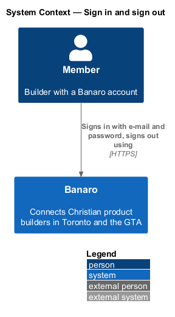
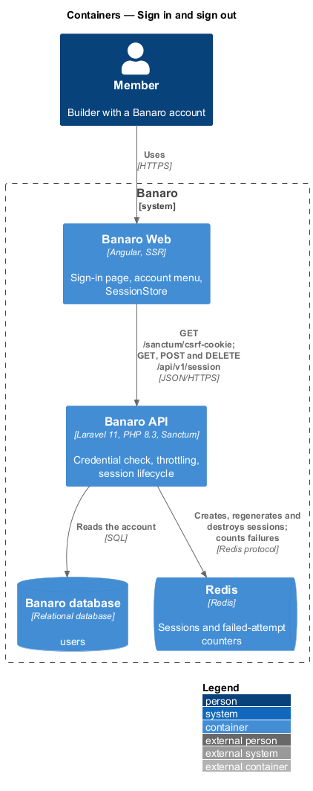
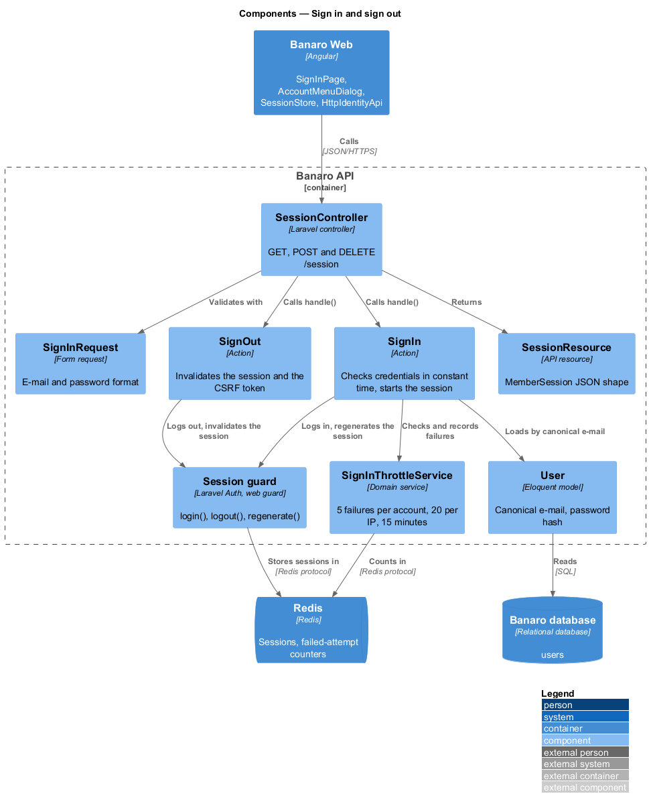
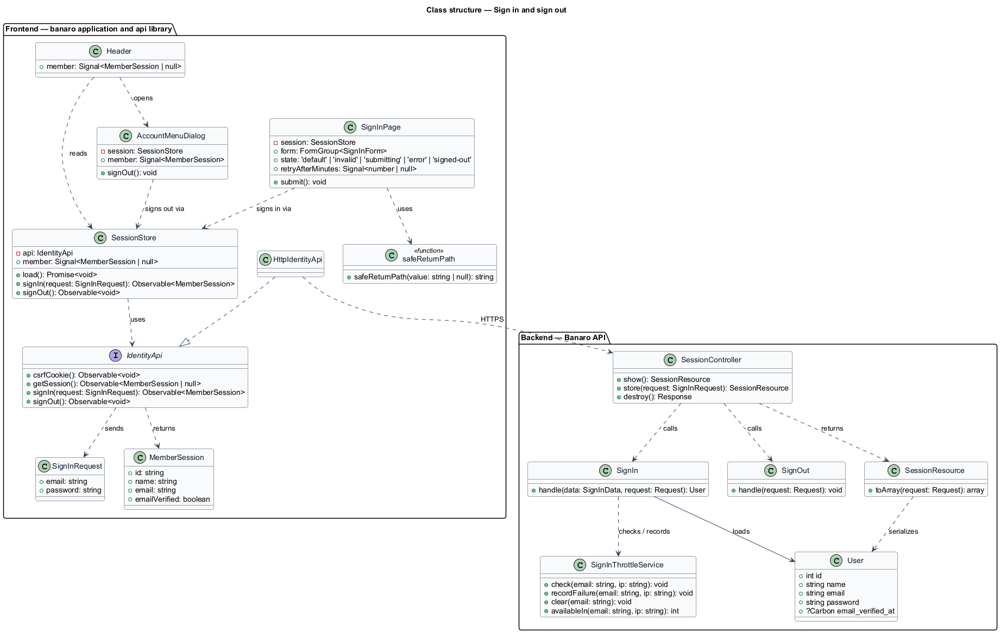
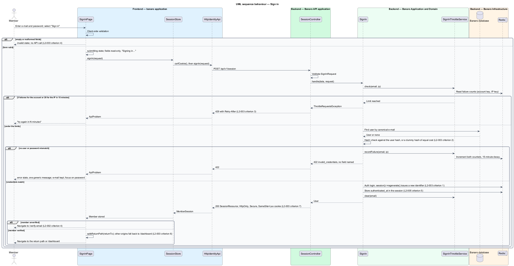
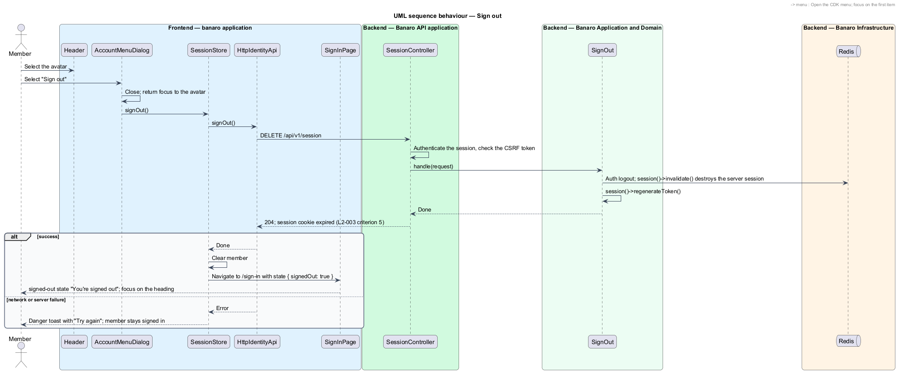

# Sign in and sign out

## Overview

Every member area of Banaro sits behind a signed-in session. This feature starts that session from an
e-mail address and a password, and ends it on request. It belongs to the `identity` subsystem. Sign-in
runs on the sign-in page (`/sign-in`). Sign-out runs from the account menu, which opens from the
avatar in the signed-in header.

Terms used in this design:

- **session** — server-side record in Redis that ties the browser's session cookie to one signed-in account
- **session identifier** — random value in the session cookie that names the session record
- **session fixation** — attack that plants a known session identifier before sign-in; a new identifier on sign-in defeats it
- **credential guessing** — repeated sign-in attempts with guessed e-mail addresses or passwords
- **failed attempt** — sign-in request whose e-mail and password do not match an account
- **return path** — same-origin path, passed as `returnTo`, that the member lands on after sign-in
- **account menu** — non-modal menu anchored to the header avatar, with the "Sign out" item

A member enters an e-mail address and a password. With valid credentials the API starts a session
under a new session identifier, and the member lands on the dashboard or on a safe return path. With
wrong credentials the page shows one generic message. The message never says whether the e-mail
address or the password was wrong. After 5 failed attempts for one account, or 20 from one IP address,
within 15 minutes, the API refuses further attempts with 429.

"Sign out" destroys the server session and clears the cookie. The page then shows the `signed-out`
state of `/sign-in`.

## Description

The slice runs from the sign-in page and the account menu in Banaro Web through the Banaro API to
Redis, which holds sessions and rate-limit counters, and to the Banaro database.

### Frontend — `banaro` application and libraries

- **`SignInPage`** (`pages/sign-in/`) — routed page for `/sign-in`, with the states `default`,
  `invalid`, `submitting`, `error` and `signed-out`.
  - On submit it validates the form on the client. Empty or malformed fields show the `invalid` state
    with the error summary and field errors, focus on the first invalid field, and no request leaves
    the browser (`L2-003` criterion 4, `L2-001` criterion 13).
  - While the request is in flight, the fields are read-only and the button reads "Signing in…".
  - A rejected sign-in shows the `error` state: one `role="alert"` message, "Those details don't
    match", that names neither field, with the e-mail address kept and focus on the password field
    (`L2-003` criterion 2).
  - A 429 response shows a danger `bn-alert` at the top of the form: "Too many sign-in attempts. Try
    again in N minutes." N is the `Retry-After` value rounded up to whole minutes, and the e-mail
    address is kept (`L2-003` criteria 3 and 8).
  - On success it stores the member in `SessionStore`. It then navigates to `safeReturnPath(returnTo)`
    or to `/dashboard` (`L2-003` criteria 1 and 6). An unverified member goes to `/verify-email`
    instead (`L2-002` criterion 4).
  - Router navigation state `{ signedOut: true }` selects the `signed-out` state "You're signed out".
    Focus lands on its heading. Navigation state, not a query parameter, selects it, so a crafted link
    cannot show it.
- **`AccountMenuDialog`** (`dialogs/account-menu/`) — non-modal menu built on the CDK Menu overlay
  (`CdkMenuTrigger` on the header avatar, `CdkMenu` and `CdkMenuItem` inside). Focus goes to the first
  item, arrow keys move, and Escape closes the menu and returns focus to the avatar. The items are
  "View profile", "Edit profile", "Settings", "Your projects" and "Sign out". "Sign out" closes the
  menu, then calls `SessionStore.signOut()` (`L2-003` criterion 11).
- **`Header`** (`shell/`) — renders the avatar button that opens the account menu for a signed-in
  member, and the "Sign in" and "Join Banaro" actions for a visitor.
- **`SessionStore`** (`api` library, `lib/auth/`) — holds the current member as a signal.
  - `load()` calls `getSession()` once at start-up, during server-side rendering as well.
  - `signIn()` fetches the CSRF cookie, then calls `signIn()` on the contract.
  - `signOut()` calls `signOut()`, clears the member and navigates to `/sign-in` with the
    `signedOut` state.
- **`safeReturnPath()`** (`api` library, `lib/auth/`) — returns the given value only when it is a
  path that starts with a single `/`. The path also resolves to the Banaro Web origin, so `//host` and
  `/\host` fail the check. Any other value yields `/dashboard` (`L2-003` criterion 6).
- **`memberGuard`** (`api` library, `lib/auth/`) — sends a visitor who opens a member route to
  `/sign-in?returnTo={path}`.
- **`IdentityApi`** / **`IDENTITY_API`** / **`HttpIdentityApi`** (`api` library) — `csrfCookie()`
  sends `GET /sanctum/csrf-cookie`. `getSession()` sends `GET /api/v1/session`. `signIn(request)`
  sends `POST /api/v1/session`. `signOut()` sends `DELETE /api/v1/session`. Angular's
  `withXsrfConfiguration()` copies the `XSRF-TOKEN` cookie into the `X-XSRF-TOKEN` header.
- **`SignInRequest`** and **`MemberSession`** (`api` library models) — `email` and `password`; and
  `id`, `name`, `email` and `emailVerified`.
- **`bn-menu`**, **`bn-avatar`**, **`bn-form-layout`**, **`bn-text-field`**, **`bn-alert`** and
  **`bn-button`** (`components` library) — the menu, the header avatar and the form building blocks.

### Backend — Banaro API

- **Routes** — `GET /api/v1/session` and `POST /api/v1/session` in `routes/api_public.php`, because a
  visitor calls them. `GET` answers 200 with `member: null` for a visitor. `DELETE /api/v1/session` is
  in `routes/api.php`, in the authenticated group without `RequireVerifiedEmail`, so an unverified
  member can also sign out.
- **`SessionController`** (`Controllers/Api/V1/Identity/`) — `show()` returns the current
  `SessionResource`. `store()` validates through `SignInRequest`, calls `SignIn` and returns
  `SessionResource`. `destroy()` calls `SignOut` and returns 204.
- **`SignInRequest`** (`Requests/Identity/`) — `email` is required, RFC-valid and at most
  254 characters. `password` is a required string. A password longer than 128 characters is counted
  as a failed attempt and answered with the same generic message (`L2-003` criterion 9).
- **`SignInThrottleService`** (`Services/Identity/`) — counts failed attempts in Redis under two keys.
  The account key is the SHA-256 of the canonical e-mail; the IP key is the SHA-256 of the client
  address. The limits are 5 failures per account key and 20 per IP key in a 15-minute window. Unknown
  e-mail addresses are counted the same way, so a 429 reveals nothing about registration. `check()`
  rejects with 429 and `Retry-After` once a limit is reached (`L2-003` criterion 3). A successful
  sign-in clears the account key.
- **`SignIn`** (`Actions/Identity/`) — `handle(SignInData, Request)`:
  1. It calls `SignInThrottleService::check()`.
  2. It loads the account by canonical e-mail. With no account, it runs `Hash::check()` against a
     fixed dummy hash of equal cost, so unknown and known addresses take the same time (`L2-003`
     criterion 2).
  3. On a mismatch it records a failure and throws 422 with code `invalid_credentials` and no field
     errors. 401 stays reserved for a missing or expired session (`L2-005`).
  4. On a match it calls `Auth::guard('web')->login()` and `session()->regenerate()`, which issues a
     new session identifier (`L2-003` criterion 1). It records `authenticated_at` in the session for
     the absolute lifetime check (`L2-005` criterion 5). It rehashes the password when
     `Hash::needsRehash()` is true. Passwords are pre-hashed (SHA-256, base64) before `Hash::check()`,
     as in `join-banaro`.
  5. It compares the browser and IP network with those of the account's sessions in the last 90 days.
     For a first sight on a non-first sign-in it queues `NewSignInNotification`, a security e-mail
     with the time, approximate city and browser (`L2-003` criterion 10, `L2-029` criterion 2).
- **`SignOut`** (`Actions/Identity/`) — calls `Auth::guard('web')->logout()`,
  `session()->invalidate()` and `session()->regenerateToken()`. The response expires the session
  cookie (`L2-003` criterion 5).
- **`SessionResource`** (`Resources/Identity/`) — `member` with `id`, `name`, `email` and
  `email_verified`, or `null`.
- **Session cookie** — `config/session.php` sets `driver` to `redis`, `http_only` to true, `secure` to
  true and `same_site` to `lax` (`L2-003` criterion 7).
- **Code-of-conduct prompt** — the `accept-code-of-conduct` feature owns the prompt that follows
  sign-in when the code of conduct has changed (`L2-034` criterion 3).

### Failure handling

A network or server failure during sign-in returns the page to its `default` state with a danger
`bn-alert` and keeps the e-mail address. A failed sign-out leaves the member signed in and shows a
danger toast with a retry. The `system-notifications` feature (`L2-028`) owns its timing.

### Resolved decisions

- The error message is "Those details don't match", with the body "Check your e-mail and password and
  try again, or reset your password." (`L2-003` criterion 2; `sign-in/error.html` updated).
- A 429 shows a danger `bn-alert`, "Too many sign-in attempts. Try again in N minutes." (`L2-003`
  criterion 8). It uses the same alert as `sign-in/error.html`; no separate mock state exists.
- "Sign out" in the account menu closes the menu and calls `DELETE /api/v1/session`; the mock's link
  now leads to `sign-in/signed-out.html`, the result of that call (`L2-003` criteria 5 and 11;
  `dialogs/account-menu/default.html`).
- "New device" means a browser and IP network the account has not used in the last 90 days, excluding
  the account's first sign-in; it queues one security e-mail (`L2-003` criterion 10).
- A password longer than 128 characters counts as a failed attempt with the same generic message
  (`L2-003` criterion 9).

## Requirements

| L2 ID | Refines (L1) | Requirement |
|-------|--------------|-------------|
| `L2-003` | `L1-001`, `L1-014` | A verified member shall be able to sign in with e-mail and password, and sign out, with protection against credential guessing. |

The design realizes all eleven acceptance criteria of `L2-003`. The Description cites each criterion
where a component enforces it.

## Diagrams

### System context

A member signs in to Banaro and signs out of it. No external system takes part.

### Containers

Banaro Web calls the Banaro API. The API reads the account from the Banaro database. It keeps the
session and the failed-attempt counters in Redis.

### Components

`SessionController` calls `SignIn` or `SignOut`. `SignIn` relies on `SignInThrottleService` for the
attempt limits and on the Laravel session guard for the new session identifier.

### Class structure

`SignInPage` and `AccountMenuDialog` depend on `SessionStore`. `SessionStore` depends on the
`IdentityApi` contract. On the backend, `SignIn` depends on `User` and `SignInThrottleService`.

### Behaviour — sign in

The page validates on the client, then the API checks the throttle and the credentials. A match
starts a session under a new identifier, and the page navigates to a safe return path or the
dashboard.

### Behaviour — sign out

"Sign out" in the account menu destroys the server session and expires the cookie. The page then
shows the `signed-out` state.

