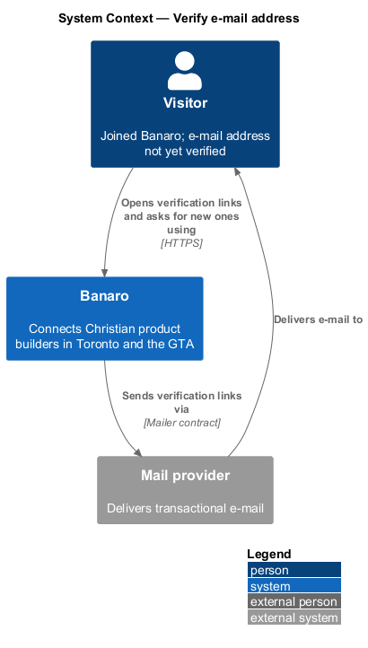
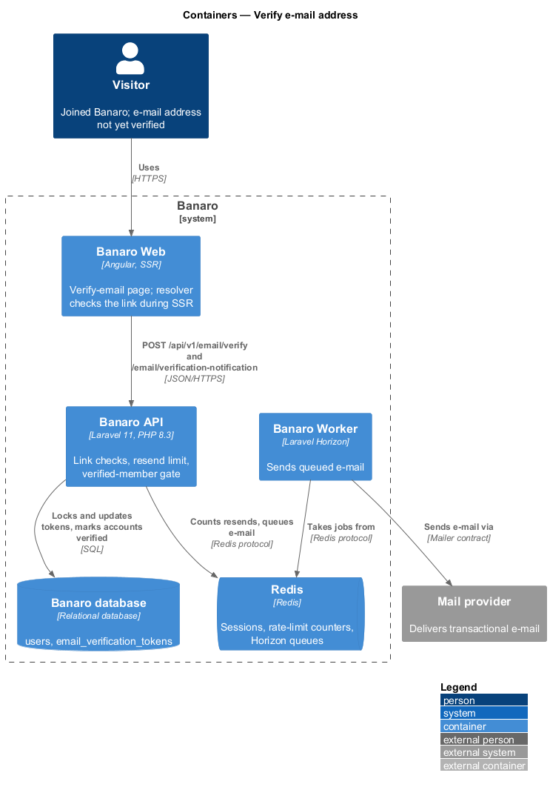
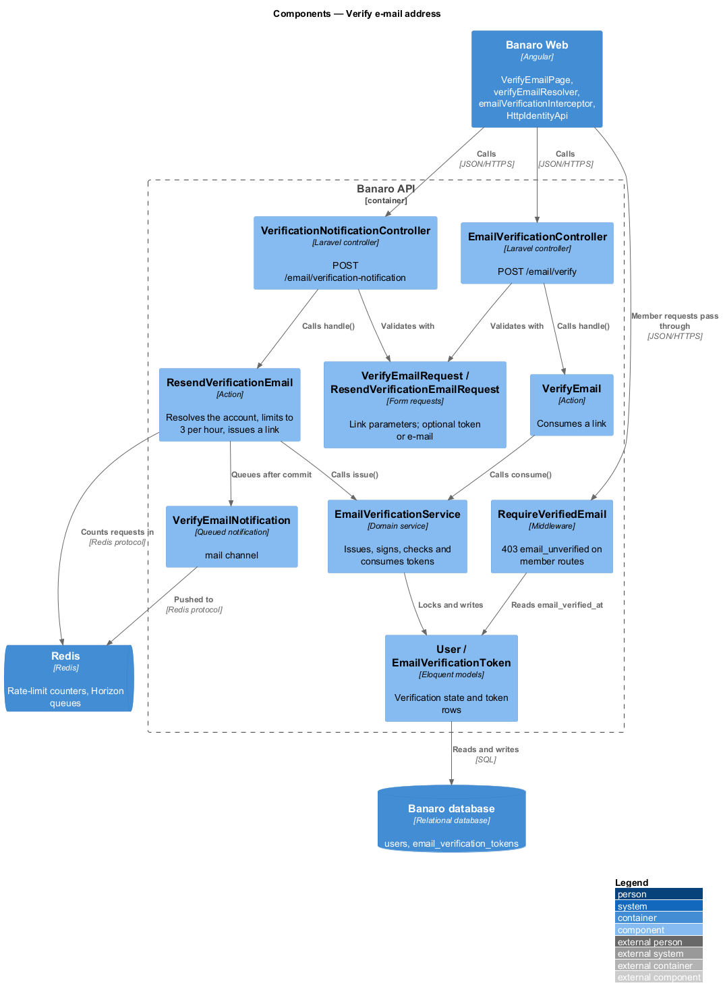
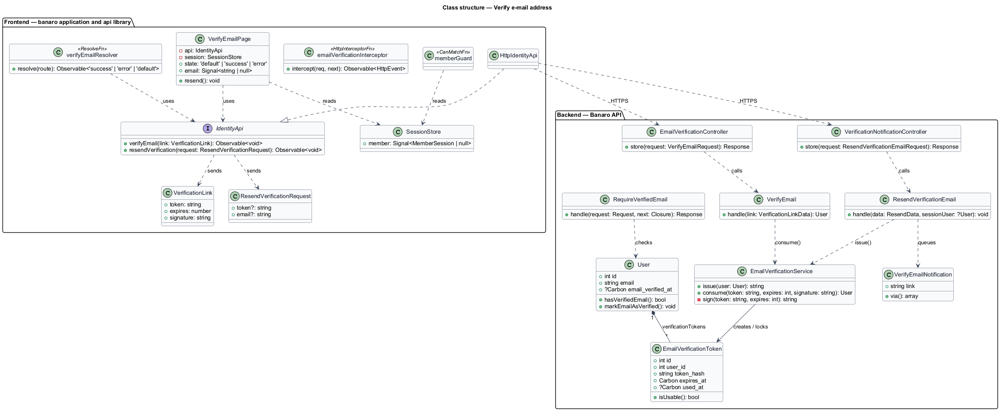
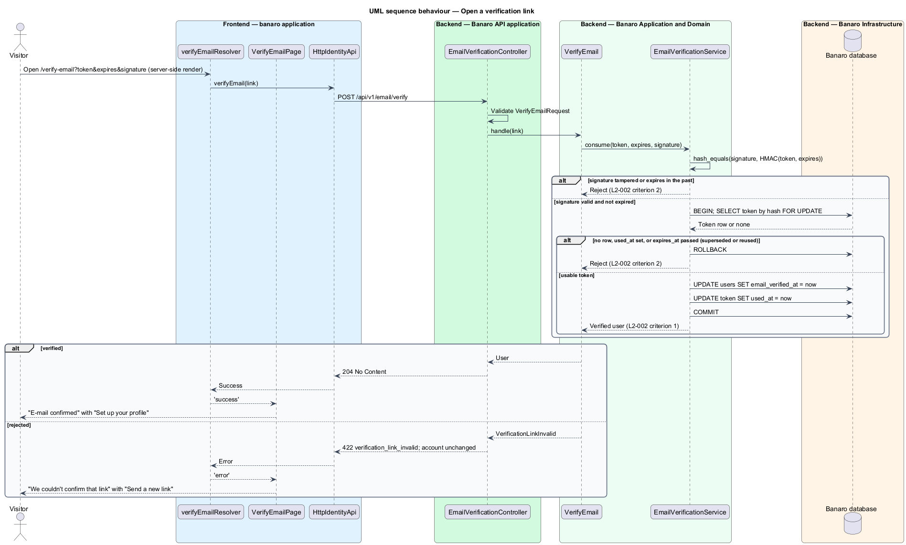
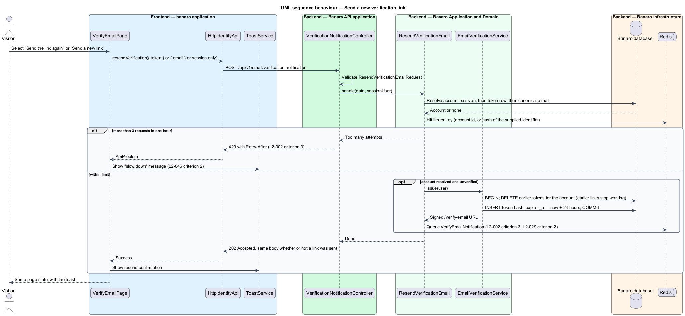
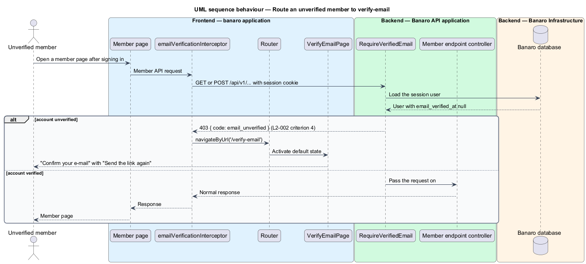

# Verify e-mail address

## Overview

Banaro accepts only builders who control the e-mail address they joined with. This feature confirms
that control. It belongs to the `identity` subsystem and runs on the verify-email page
(`/verify-email`). The `join-banaro` feature sends the first link. After a successful verification the
page leads to onboarding, which the `complete-onboarding` feature in the `profiles` subsystem owns.

Terms used in this design:

- **verification link** — URL to `/verify-email` that carries a random token, an expiry time and a signature
- **verification token** — random secret in the link; the database stores only its SHA-256 hash
- **signature** — HMAC-SHA256 over the token and expiry time, keyed with the application key
- **single-use** — property of a token that stops working once it verifies an account
- **superseded link** — earlier link that stops working when a newer link is issued for the same account
- **unverified member** — signed-in person whose account has no `email_verified_at` value

A person opens the link from the e-mail. Banaro Web checks the link on the server before the page
renders, so the page shows either the `success` or the `error` state. A valid link marks the account
verified. A link that is older than 24 hours, has a bad signature or was already used changes nothing.
The `error` state then offers "Send a new link".

An unverified member may sign in, but every member-only endpoint answers 403 with code
`email_unverified`. Banaro Web then routes the member to `/verify-email`, whose `default` state offers
"Send the link again".

## Description

The slice runs from the verify-email page in Banaro Web through the Banaro API to the Banaro database.
The Banaro Worker sends each new link.

### Frontend — `banaro` application and libraries

- **`VerifyEmailPage`** (`pages/verify-email/`) — routed page for `/verify-email`, with the states
  `default`, `success` and `error`.
  - With `token`, `expires` and `signature` query parameters, it renders the outcome that
    `verifyEmailResolver` produced. The `success` state reads "E-mail confirmed" and links to
    onboarding with "Set up your profile" (`L2-002` criterion 1). The `error` state reads "We couldn't
    confirm that link" and offers "Send a new link" and "Back to sign in" (`L2-002` criterion 2).
  - Without a token, it renders the `default` state "Confirm your e-mail". The address shown comes
    from the signed-in member in `SessionStore`, or from the address the join page passed in
    navigation state.
  - "Send the link again" and "Send a new link" call `resendVerification()`. The request carries the
    session, the link's token, or the address from navigation state, whichever is present. When none
    identifies an account, "Send a new link" navigates to `/sign-in?returnTo=/verify-email` instead.
- **`verifyEmailResolver`** (`pages/verify-email/`) — Angular route resolver. It runs during
  server-side rendering, calls `verifyEmail()` once, and maps the result to `success` or `error`. The
  page therefore never shows a loading state.
- **`emailVerificationInterceptor`** (`api` library, `lib/auth/`) — HTTP interceptor. A 403 response
  with code `email_unverified` sends the router to `/verify-email` (`L2-002` criterion 4).
- **`memberGuard`** (`api` library, `lib/auth/`) — `canMatch` guard on member routes. It routes an
  unverified member in `SessionStore` to `/verify-email` before any member API call.
- **`IdentityApi`** / **`IDENTITY_API`** / **`HttpIdentityApi`** (`api` library) —
  `verifyEmail(link: VerificationLink)` sends `POST /api/v1/email/verify`.
  `resendVerification(request: ResendVerificationRequest)` sends
  `POST /api/v1/email/verification-notification`.
- **`VerificationLink`** and **`ResendVerificationRequest`** (`api` library models) — the link
  parameters, and the optional `token` or `email` that identifies the account for a resend.
- **`ToastService`** (`components` library) — shows the success toast after a resend. Its copy and
  timing follow the `system-notifications` feature (`L2-028`).

### Backend — Banaro API

- **Routes** — `POST /api/v1/email/verify` and `POST /api/v1/email/verification-notification` in
  `routes/api_public.php`. Both are deliberate anonymous exceptions, because the person opening a
  link is not always signed in.
- **`EmailVerificationController`** (`Controllers/Api/V1/Identity/`) — `store()` validates through
  `VerifyEmailRequest`, calls `VerifyEmail` and returns 204. A rejected link returns 422 with code
  `verification_link_invalid`. One code covers expiry, a bad signature and reuse, so the response does
  not explain which check failed.
- **`VerificationNotificationController`** (`Controllers/Api/V1/Identity/`) — `store()` validates
  through `ResendVerificationEmailRequest`, calls `ResendVerificationEmail` and returns 202 with an
  empty body in every accepted case.
- **`VerifyEmailRequest`** and **`ResendVerificationEmailRequest`** (`Requests/Identity/`) — form
  requests. The first requires `token`, `expires` and `signature` with fixed formats. The second
  accepts an optional `token` or an optional `email`, and no other fields.
- **`EmailVerificationService`** (`Services/Identity/`) — owns verification links.
  - `issue(User)` deletes the account's earlier tokens, so earlier links stop working (`L2-002`
    criterion 3). It creates a 32-byte random token and stores its hash with `expires_at` set
    24 hours ahead. It returns the signed `/verify-email` URL on the Banaro Web origin.
  - `consume(token, expires, signature)` checks the signature with `hash_equals()`, then the expiry.
    It loads the token row with `lockForUpdate()` and rejects a used or expired row. It sets
    `email_verified_at` on the account and `used_at` on the token in one transaction (`L2-002`
    criteria 1 and 2). The row lock makes two concurrent openings of one link verify once.
- **`VerifyEmail`** (`Actions/Identity/`) — `handle(VerificationLinkData)` calls `consume()`. An
  already verified account opening a fresh, unused link stays verified and the token is marked used.
- **`ResendVerificationEmail`** (`Actions/Identity/`) — `handle(ResendData, ?User)` resolves the
  account from the session, then from the token row (even when expired or used), then from the
  canonical e-mail.
  - It applies a limit of 3 requests per hour. The key is the account identifier when an account
    resolves, otherwise a hash of the supplied identifier. The fourth request receives 429 with
    `Retry-After` (`L2-002` criterion 3). Unknown addresses are limited the same way, so a 429 does
    not reveal registration.
  - For an unverified account it calls `issue()` and queues `VerifyEmailNotification`. For a verified
    or unknown account it sends nothing.
- **`RequireVerifiedEmail`** (`Http/Middleware/`) — middleware on the member route group in
  `routes/api.php`. It returns 403 with code `email_unverified` for a signed-in account without
  `email_verified_at` (`L2-002` criterion 4). Session routes that an unverified member still needs,
  such as sign-out, sit in a group without it.
- **`EmailVerificationToken`** (`Models/`) — `user_id`, `token_hash` (unique), `expires_at` and
  `used_at`.
- **`User`** (`Models/`) — `email_verified_at` and `hasVerifiedEmail()`.

### Backend — Banaro Worker

- **`VerifyEmailNotification`** (`Notifications/`) — queued notification on the `mail` channel with
  the signed link. It is security e-mail, so preferences do not suppress it (`L2-029` criterion 2).

### Failure handling

A failed transaction rolls back, so the account and token stay unchanged. The resolver then maps the
error to the `error` state, which still offers a new link. A failed resend shows a danger toast with a
retry. A 429 shows "You've asked for too many links. Try again in N minutes." (`L2-002` criterion 5,
`L2-046` criterion 2).

### Resolved decisions

- Mail scanners: the link verifies when opened, including by a scanner, and Banaro accepts that
  because verification proves only control of the mailbox. A person who then opens the used link sees
  the `error` state with "Back to sign in"; a resend for a verified account sends nothing (`L2-002`
  criterion 6; `verify-email/error.html`).
- No session starts when a link is opened. "Set up your profile" reaches onboarding through
  `/sign-in?returnTo=/onboarding` for a person without a session (`L2-002` criterion 7;
  `verify-email/success.html`).
- A link that identifies no account sends "Send a new link" to `/sign-in?returnTo=/verify-email`,
  where the signed-in `default` state resends (`L2-002` criterion 8).
- The resend toast reads "If this address still needs confirming, a new link is on its way."; the 429
  message reads "You've asked for too many links. Try again in N minutes." (`L2-002` criterion 5).
- The `join` success mock's "I have confirmed my e-mail" now goes to `/sign-in`, so `verify-email`
  `default` is reached only by an unverified member the guard routes there (`L2-001` criterion 12).

## Requirements

| L2 ID | Refines (L1) | Requirement |
|-------|--------------|-------------|
| `L2-002` | `L1-001` | A new account shall verify its e-mail address through a signed, single-use, expiring link before using member features. |

The design realizes all eight acceptance criteria of `L2-002`. The Description cites each criterion
where a component enforces it.

## Diagrams

### System context

A person receives the verification link through the mail provider and opens it in Banaro. Banaro
sends new links through the same provider.

### Containers

Banaro Web checks the link through the Banaro API during server-side rendering. The API reads and
writes tokens in the Banaro database, counts resends in Redis, and queues e-mail for the Banaro
Worker.

### Components

`EmailVerificationController` and `VerificationNotificationController` each call one action. Both
actions rely on `EmailVerificationService`. `RequireVerifiedEmail` guards every member route.

### Class structure

A `User` has many `EmailVerificationToken` rows, of which at most one is active.
`EmailVerificationService` issues and consumes them. On the frontend, `VerifyEmailPage` and its
resolver depend on the `IdentityApi` contract.

### Behaviour — open a verification link

The resolver sends the link parameters during server-side rendering. The service checks the
signature, the expiry and single use under a row lock, then marks the account verified.

### Behaviour — send a new link

The action resolves the account, applies the limit of 3 per hour and issues a new link. The new link
supersedes every earlier one. The response is 202 whether or not a link was sent.

### Behaviour — route an unverified member

A signed-in, unverified member calls a member-only endpoint. `RequireVerifiedEmail` answers 403 with
`email_unverified`, and the interceptor routes the member to `/verify-email`.

