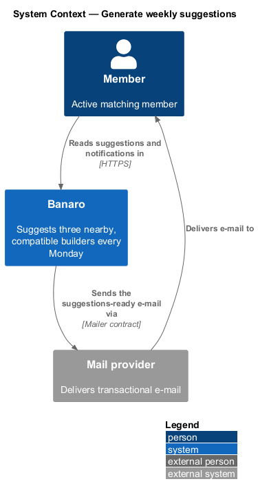
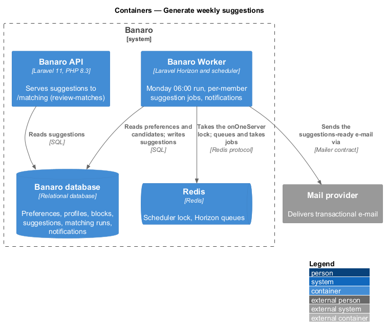
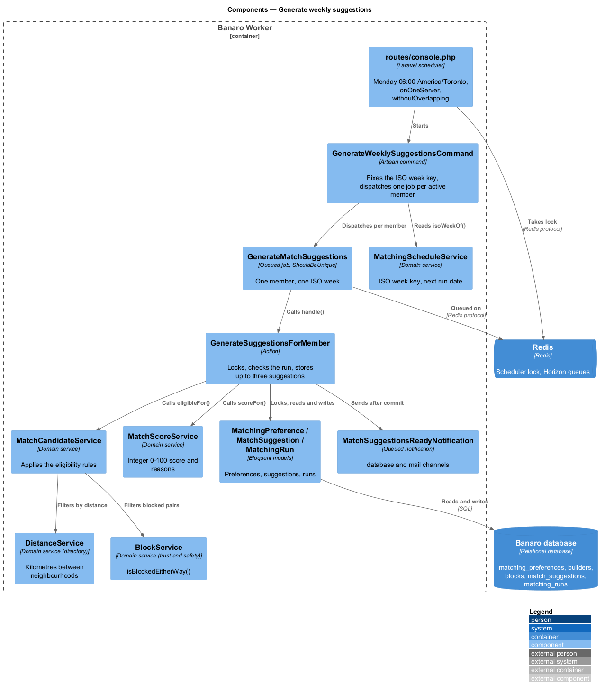
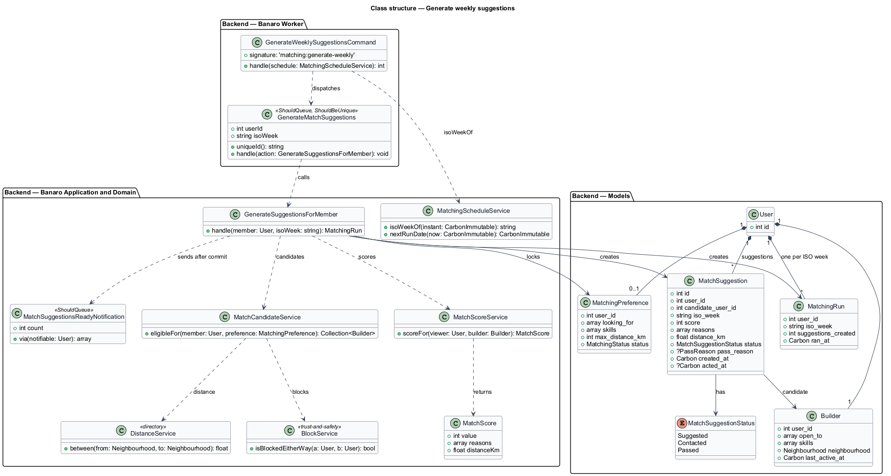
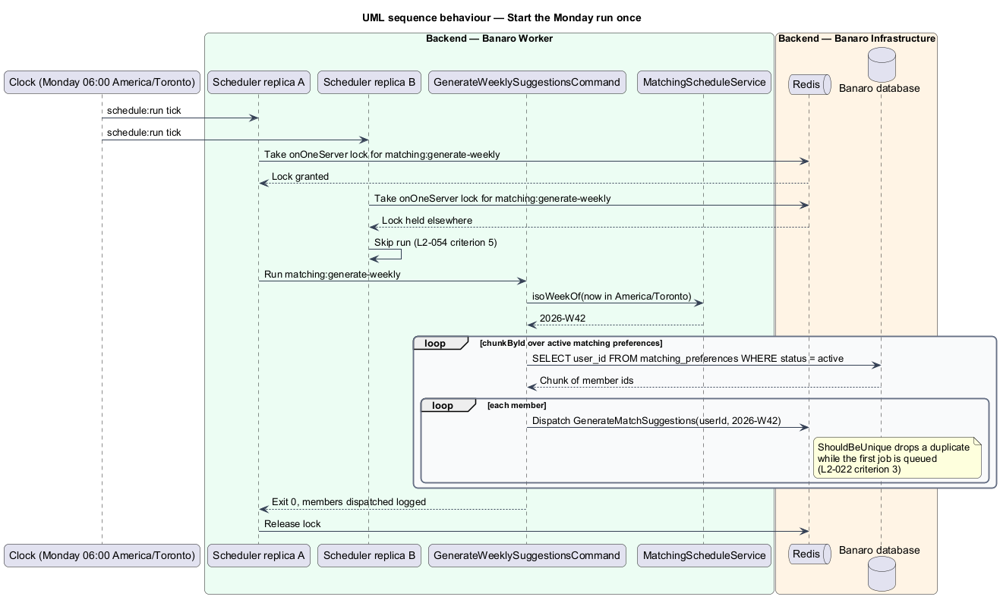
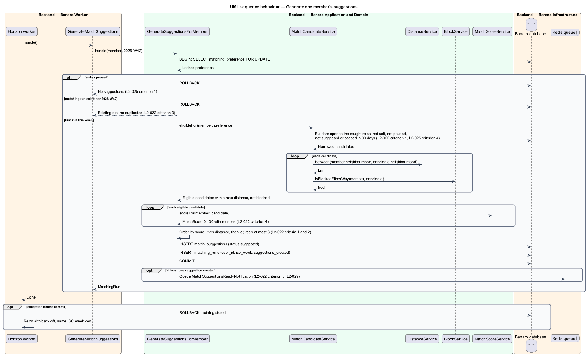

# Generate weekly suggestions

## Overview

Banaro promises each matching member three nearby, compatible builders every Monday. This feature is
the scheduled work that keeps that promise. Every Monday at 06:00 America/Toronto, the Banaro Worker
picks up to three builders for each active matching member, scores them and stores them as match
suggestions. It then tells each member that the suggestions are ready. The feature belongs to the
`matching` subsystem. It reads the preferences that `set-up-matching` stores, and `review-matches`
shows its output at `/matching`.

Terms used in this design:

- **active matching member** — set-up member whose matching status is `active`
- **candidate** — builder who could be suggested to a given member
- **eligible candidate** — candidate who passes every eligibility rule of `L2-022` criterion 1
- **match suggestion** — stored pairing of a member with one eligible candidate for one ISO week,
  with a score and the reasons for the match
- **match score** — integer from 0 to 100 that ranks a candidate for a member
- **ISO week key** — ISO 8601 week of the run in America/Toronto, written as `2026-W42`
- **matching run** — record that the job has processed one member for one ISO week
- **unreviewed suggestion** — suggestion of the current week that the member has neither contacted
  nor passed

A candidate is eligible for a member when all the following hold (`L2-022` criterion 1):

1. The candidate is open to the role the member seeks. Co-founder maps to "Co-founding", Advisor to
   "Advising" and Contributor to "Contributing" on the candidate's profile.
2. The candidate is within the member's maximum distance.
3. Neither builder has blocked the other.
4. The candidate has not been suggested to the member, or passed by the member, in the last 90 days.
5. The candidate is not the member and has not paused matching (`L2-025` criterion 4).

## Description

The slice runs entirely on the Banaro Worker against the Banaro database. It has no page of its own.
Its only outbound effects are the stored suggestions and one notification per member.

### Scheduling — Banaro Worker

- **`routes/console.php`** — registers the run:
  `Schedule::command('matching:generate-weekly')->weeklyOn(1, '06:00')->timezone('America/Toronto')`.
  The entry adds `onOneServer()` and `withoutOverlapping()`. Both take a lock in Redis, so the run
  starts exactly once across Worker replicas (`L2-054` criterion 5). The `timezone()` call keeps
  06:00 local across daylight-saving changes (`L2-022` criterion 1).
- **`GenerateWeeklySuggestionsCommand`** (`Console/Commands/`, signature `matching:generate-weekly`)
  — computes the ISO week key once through `MatchingScheduleService::isoWeekOf()`. It then walks the
  active `MatchingPreference` rows with `chunkById()` and dispatches one `GenerateMatchSuggestions`
  job per member with that key. An operator may re-run the command for the same week; the key makes
  the re-run safe (`L2-022` criterion 3).
- **`GenerateMatchSuggestions`** (`Jobs/Matching/`) — queued job for one member and one ISO week. It
  implements `ShouldBeUnique` with the unique id `{user_id}:{iso_week}`, so a duplicate dispatch is
  dropped while the first job is queued. Its `handle()` calls `GenerateSuggestionsForMember`. Its
  retry count and back-off are `<TO SUPPLY>`.

### Backend — application and domain

- **`GenerateSuggestionsForMember`** (`Actions/Matching/`) — creates one member's suggestions in one
  database transaction:
  1. It locks the member's `MatchingPreference` row with `lockForUpdate()`.
  2. It returns without changes when the status is `paused`, since the member may have paused after
     dispatch (`L2-025` criterion 1).
  3. It returns without changes when a `MatchingRun` row exists for the member and the ISO week. The
     unique index on (`user_id`, `iso_week`) is the second guard (`L2-022` criterion 3).
  4. It asks `MatchCandidateService` for the eligible candidates.
  5. It scores each candidate with `MatchScoreService`.
  6. It orders the candidates by score, highest first. Ties go to the shorter distance, then the lower
     user id. It keeps at most three (`L2-022` criterion 1).
  7. It inserts one `MatchSuggestion` per kept candidate with status `suggested`. With fewer than three
     eligible candidates it inserts only those, and with none it inserts nothing (`L2-022`
     criterion 2).
  8. It inserts the `MatchingRun` row with the number created, and commits.
  9. After commit, when at least one suggestion exists, it sends `MatchSuggestionsReadyNotification`
     (`L2-022` criterion 5).
- **`MatchCandidateService`** (`Services/Matching/`) — `eligibleFor(member, preference)` applies the
  five eligibility rules. A database query narrows the candidates by open-to role, self, paused status
  and the 90-day history of `match_suggestions`. `DistanceService` and `BlockService` then filter the
  remainder.
- **`DistanceService`** (`Services/Directory/`) — `between(from, to)` returns the distance in
  kilometres between two neighbourhood centroids. The `directory` subsystem owns it. The action stores the computed distance
  on the suggestion for display and tie-breaks.
- **`BlockService`** (`Services/TrustAndSafety/`) — `isBlockedEitherWay(a, b)` is true when either
  builder has blocked the other (`L2-032` criterion 1). The `trust-and-safety` subsystem owns it.
- **`MatchScoreService`** (`Services/Matching/`) — `scoreFor(viewer, builder)` returns a `MatchScore`
  with an integer value and the reasons for the match (`L2-022` criterion 4). It reads the viewer's
  `MatchingPreference` itself. The `directory` designs call the same method for "Best match" and on
  profiles. See the next section.
- **`MatchingScheduleService`** (`Services/Matching/`) — `isoWeekOf(instant)` and `nextRunDate(now)`,
  shared with `set-up-matching`.

### Match score

`MatchScoreService` computes four factors, each a number from 0 to 1:

| Factor | Meaning | Weight key | Weight |
|--------|---------|------------|--------|
| Skill complement | Share of the member's wanted skills that the candidate lists | `skill_complement` | `<TO SUPPLY>` |
| Open-to alignment | Share of the member's looking-for roles that the candidate is open to | `open_to` | `<TO SUPPLY>` |
| Distance | 1 at 0 km, falling linearly to 0 at the member's maximum distance | `distance` | `<TO SUPPLY>` |
| Recent activity | 1 for activity within `<TO SUPPLY>` days, falling to 0 at `<TO SUPPLY>` days | `recent_activity` | `<TO SUPPLY>` |

The score is the weighted mean of the four factors, multiplied by 100, rounded to the nearest integer
and clamped to 0–100. The weights live in `config/banaro.php` under `matching.score_weights`. This
table is their documentation (`L2-022` criterion 4). Service tests in
`backend/tests/Feature/Matching/` cover the factors and the weights.

The member's stored pass reasons adjust the weights for that member (`L2-024` criterion 3). For
example, a "Too far" reason may raise the distance weight. The adjustment rules are `<TO SUPPLY>`.

`MatchScore::reasons` lists reason codes with parameters, such as shared skills, the open-to role,
the distance and the candidate's project. The `review-matches` page renders them as text through the
translation catalogue (`L2-052`).

### Models and notification

- **`MatchSuggestion`** (`Models/`) — one row per member, candidate and ISO week, enforced by a unique
  index on (`user_id`, `candidate_user_id`, `iso_week`). It holds `score`, `reasons` (JSON),
  `distance_km`, `status` (`MatchSuggestionStatus`), `pass_reason` (nullable `PassReason`),
  `created_at` and `acted_at`. An index on (`user_id`, `candidate_user_id`, `created_at`) serves the
  90-day check.
- **`MatchSuggestionStatus`** (`Enums/`) — `Suggested`, `Contacted` and `Passed`.
- **`MatchingRun`** (`Models/`) — one row per member and ISO week, with `suggestions_created` and
  `ran_at`. It makes a run with zero suggestions as final as a run with three.
- **`MatchSuggestionsReadyNotification`** (`Notifications/`) — queued notification on the `database`
  and `mail` channels. The database entry feeds `/notifications` and the header count (`L2-027`). The
  e-mail belongs to the Matches category and follows the delivery rules of the
  `email-notifications` feature (`L2-029`).
- **Unreviewed count** — the number of the member's current-week suggestions with status `suggested`.
  The `review-matches` overview and the dashboard badge read it (`L2-022` criterion 5, `L2-030`).

### Failure handling

A failed job rolls back its transaction, so no partial set of suggestions and no `MatchingRun` row
remains. Horizon retries the job. The retry recomputes the set from the same data and ISO week key.
When a retry finds a `MatchingRun` row, it ends without changes.

### Open points

- Weights of the four factors: `<TO SUPPLY>`.
- Recent-activity windows, measured from the builder's `last_active_at`: `<TO SUPPLY>`.
- Score for a viewer without matching preferences, as the directory's "Best match" sort needs it:
  `<TO SUPPLY>`.
- Rules by which pass reasons adjust the weights: `<TO SUPPLY>`.
- Whether suspended or deleted accounts are excluded as candidates beyond the five rules:
  `<TO SUPPLY>`.
- Job retry count and back-off for `GenerateMatchSuggestions`: `<TO SUPPLY>`.
- E-mail time: the job runs at 06:00 and `L2-029` criterion 1 sends within 5 minutes. The
  `settings/email` mock says the weekly matches e-mail arrives "every Monday at 8 am", and the
  `notifications` mock stamps the matches item "8:00 am". Resolution: `<TO SUPPLY>`.
- Order copy: `L2-022` criterion 1 orders by match score. The `matching` mock says "nearest and
  strongest first" but lists the builders by score. Confirmation of the copy: `<TO SUPPLY>`.

## Requirements

| L2 ID | Refines (L1) | Requirement |
|-------|--------------|-------------|
| `L2-022` | `L1-007` | The system shall suggest three nearby, compatible builders to each active matching member every Monday. |

The design realizes all five acceptance criteria of `L2-022`. The weight values that criterion 4
documents remain `<TO SUPPLY>`.

## Diagrams

### System context

The Banaro scheduler generates suggestions for each member. Banaro tells members by e-mail through
the mail provider.

### Containers

The Banaro Worker runs the scheduled command and the per-member jobs. It reads preferences and
profiles from the Banaro database and writes suggestions back. Redis holds the scheduler lock and the
job queue.

### Components

Inside the Banaro Worker, the command dispatches `GenerateMatchSuggestions` jobs. Each job calls
`GenerateSuggestionsForMember`, which relies on `MatchCandidateService` and `MatchScoreService`.

### Class structure

A member has one `MatchingPreference`, many `MatchSuggestion` rows and one `MatchingRun` per ISO
week. The action depends on the candidate, score, distance and block services.

### Behaviour — start the Monday run once

The scheduler starts the command at 06:00 America/Toronto under a lock held in Redis. The command
fixes the ISO week key and dispatches one job per active member.

### Behaviour — generate one member's suggestions

The job locks the member's preference and skips a paused member or a processed week. It then filters,
scores, orders and stores up to three suggestions and notifies the member after commit.

