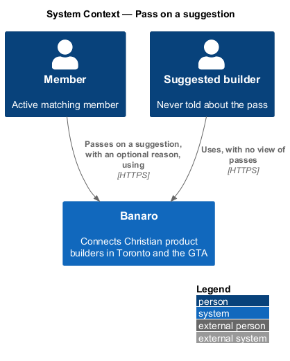
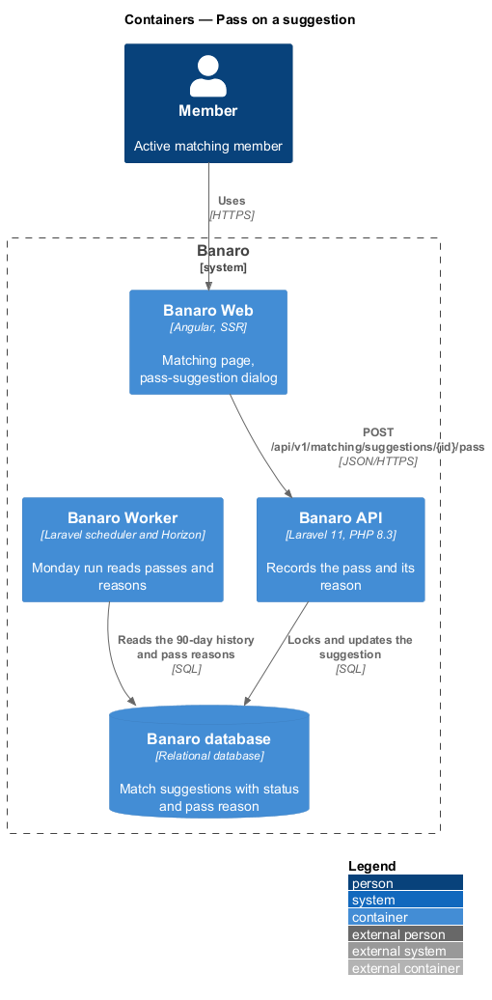
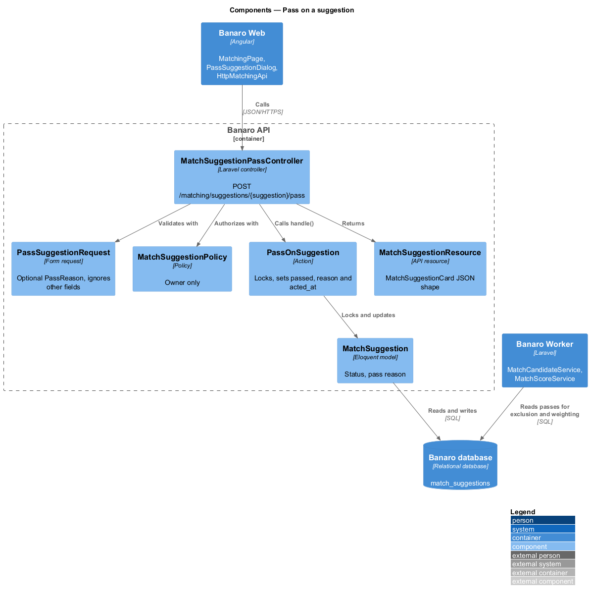
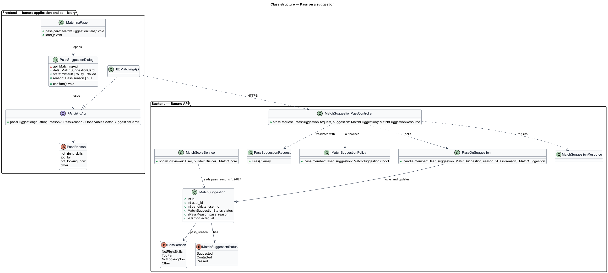
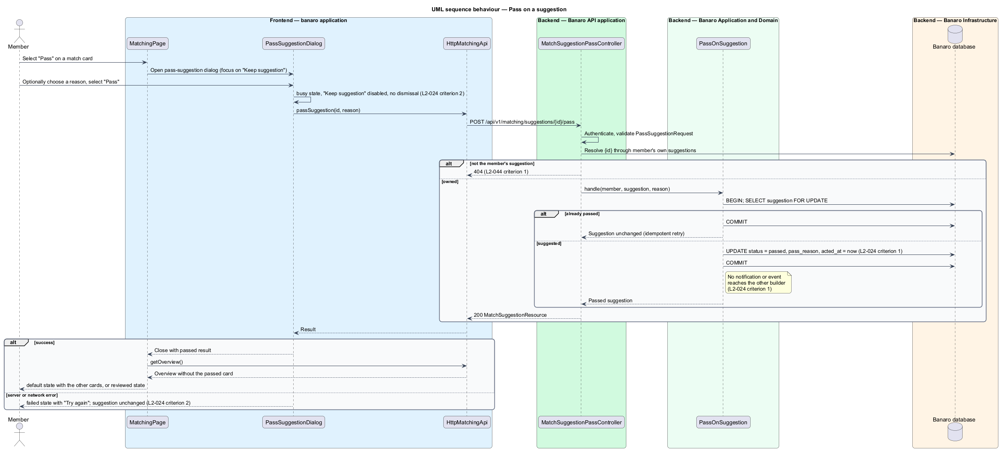

# Pass on a suggestion

## Overview

A member who sees a weekly match suggestion that does not fit can pass on it. Passing removes the
builder from the member's list and keeps that builder out of the member's suggestions for 90 days.
The other builder is never told. The member may give a reason, and the matching engine uses stored
reasons to weight that member's future suggestions. This feature belongs to the `matching` subsystem.
It starts from the "Pass" action on a match card at `/matching`, which the `review-matches` feature
describes.

Terms used in this design:

- **pass** — member's decision to decline one match suggestion
- **pass reason** — optional cause the member gives for a pass: Not the right skills, Too far, Not
  looking now or Other
- **exclusion window** — 90-day period after a suggestion during which the same builder is not
  suggested to the same member again

The member selects "Pass" on a card, and the `pass-suggestion` dialog asks for confirmation. On
confirm, the Banaro API records the pass and the reason on the suggestion. The page then reloads the
matching overview, and the card is gone. A failed request leaves the suggestion unchanged and lets the
member retry.

## Description

The slice runs from the matching page and the `pass-suggestion` dialog in Banaro Web through the
Banaro API to the Banaro database. It sends no notification.

### Frontend — `banaro` application and libraries

- **`PassSuggestionDialog`** (`dialogs/pass-suggestion/`) — CDK dialog with the `default`, `busy` and
  `failed` states. It shows the builder's name, role, neighbourhood and score, as the mock does.
  - Focus starts on "Keep suggestion". Escape closes the dialog, and focus returns to the "Pass"
    button that opened it (`L2-050` criterion 3).
  - The optional pass reason offers Not the right skills, Too far, Not looking now and Other
    (`L2-024` criterion 1). The mock has no reason control, so its presentation is `<TO SUPPLY>`.
  - On confirm, the dialog enters the `busy` state. "Keep suggestion" is disabled and the dialog
    cannot be dismissed (`L2-024` criterion 2).
  - On failure, the dialog shows the `failed` state with the error message and "Try again" (`L2-024`
    criterion 2). The suggestion stays in the list.
  - On success, the dialog closes with a passed result.
- **`MatchingPage`** (`pages/matching/`) — opens the dialog from a match card. After a passed result,
  it reloads the overview, so the card leaves the list or the `reviewed` state appears (`L2-024`
  criterion 1, `L2-023` criterion 2).
- **`MatchingApi`** / **`MATCHING_API`** / **`HttpMatchingApi`** (`api` library) —
  `passSuggestion(suggestionId, reason?)` sends `POST /api/v1/matching/suggestions/{id}/pass` and
  returns a `MatchSuggestionCard`.
- **`PassReason`** (`api` library model) — `not_right_skills`, `too_far`, `not_looking_now` or
  `other`.

### Backend — Banaro API

- **`MatchSuggestionPassController`** (`Controllers/Api/V1/Matching/`) — `store()` handles
  `POST /matching/suggestions/{suggestion}/pass`. It resolves `{suggestion}` through the member's own
  `matchSuggestions()` relation, so another member's id yields 404 (`L2-044` criterion 1). It calls
  `PassOnSuggestion` and returns a `MatchSuggestionResource`. The route is in `routes/api.php`.
- **`PassSuggestionRequest`** (`Requests/Matching/`) — accepts `reason` as an optional `PassReason`
  value and ignores every other field (`L2-045` criterion 1, `L2-044` criterion 4).
- **`MatchSuggestionPolicy`** (`Policies/`) — `pass()` allows the owner only.
- **`PassOnSuggestion`** (`Actions/Matching/`) — records the pass in one transaction:
  1. It locks the suggestion row with `lockForUpdate()`.
  2. It returns the suggestion unchanged when it is already `passed`, so a retried request is
     idempotent.
  3. Otherwise it sets `status` to `passed`, stores `pass_reason` and stamps `acted_at` (`L2-024`
     criterion 1).
  4. It sends no notification, raises no event toward the other builder, and exposes the pass in no
     response to that builder (`L2-024` criterion 1).
- **`PassReason`** (`Enums/`) — `NotRightSkills`, `TooFar`, `NotLookingNow` and `Other`.
- **`MatchSuggestion`** (`Models/`) — defined by `generate-weekly-suggestions`; this feature writes
  `status`, `pass_reason` and `acted_at`.

### Effects on later runs

- **Exclusion window** — `MatchCandidateService` excludes any builder suggested to the member in the
  last 90 days, which includes every passed suggestion (`L2-024` criterion 1, `L2-022` criterion 1).
- **Weighting** — `MatchScoreService` reads the member's stored pass reasons and adjusts that member's
  factor weights on the next run (`L2-024` criterion 3). The adjustment rules are `<TO SUPPLY>`; the
  `generate-weekly-suggestions` design holds them.

### Open points

- Pass reason control: `L2-024` criterion 1 offers an optional reason, but the `pass-suggestion` mock
  has no reason field and the manifest says the dialog has no inputs. Control and copy:
  `<TO SUPPLY>`.
- Exclusion copy: the mock says the builder will not be shown "again this week", while `L2-024`
  criterion 1 sets 90 days. Copy: `<TO SUPPLY>`.
- Passing after saying hello: whether a `contacted` suggestion may still be passed: `<TO SUPPLY>`.
- Rules by which pass reasons adjust weights: `<TO SUPPLY>`.

## Requirements

| L2 ID | Refines (L1) | Requirement |
|-------|--------------|-------------|
| `L2-024` | `L1-007` | A member shall be able to pass on a suggestion, optionally with a reason. |

The design realizes all three acceptance criteria of `L2-024`. The weighting rules of criterion 3
remain `<TO SUPPLY>`.

## Diagrams

### System context

A member passes on a suggested builder in Banaro. The passed builder receives nothing.

### Containers

The dialog in Banaro Web calls the Banaro API, which updates the suggestion in the Banaro database.
The Banaro Worker reads the stored reasons on the next Monday run.

### Components

Inside the Banaro API, `MatchSuggestionPassController` validates with `PassSuggestionRequest` and calls
`PassOnSuggestion`. `MatchSuggestionPolicy` limits the action to the suggestion's owner.

### Class structure

`PassSuggestionDialog` depends on the `MatchingApi` contract. On the backend, `PassOnSuggestion`
writes `status`, `pass_reason` and `acted_at` on a `MatchSuggestion`.

### Behaviour — pass on a suggestion

The member confirms the dialog. The action locks the suggestion, records the pass and commits. The
page reloads the overview, and a failure shows the `failed` state with retry.

