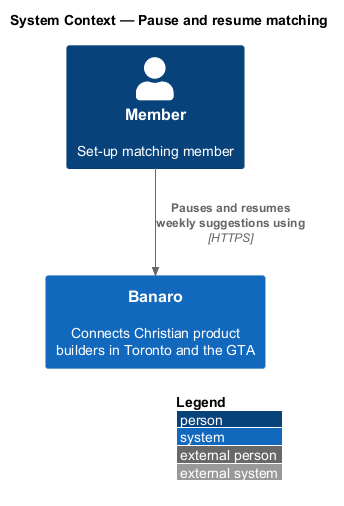
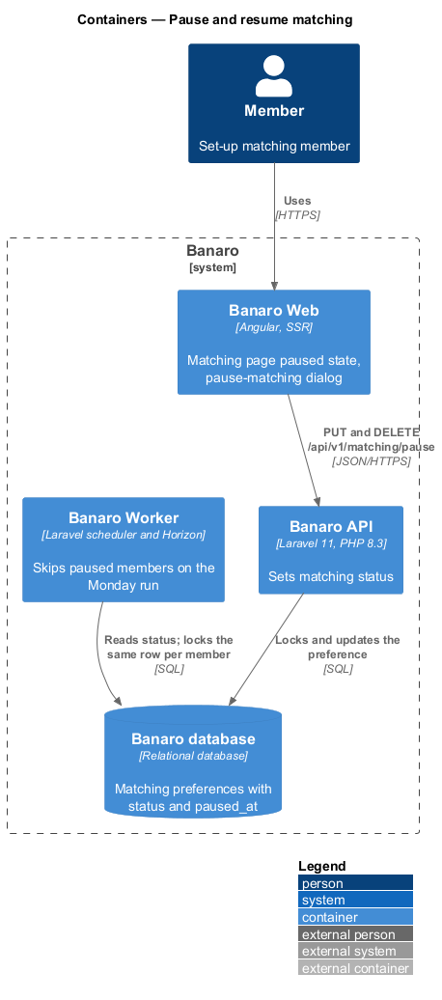
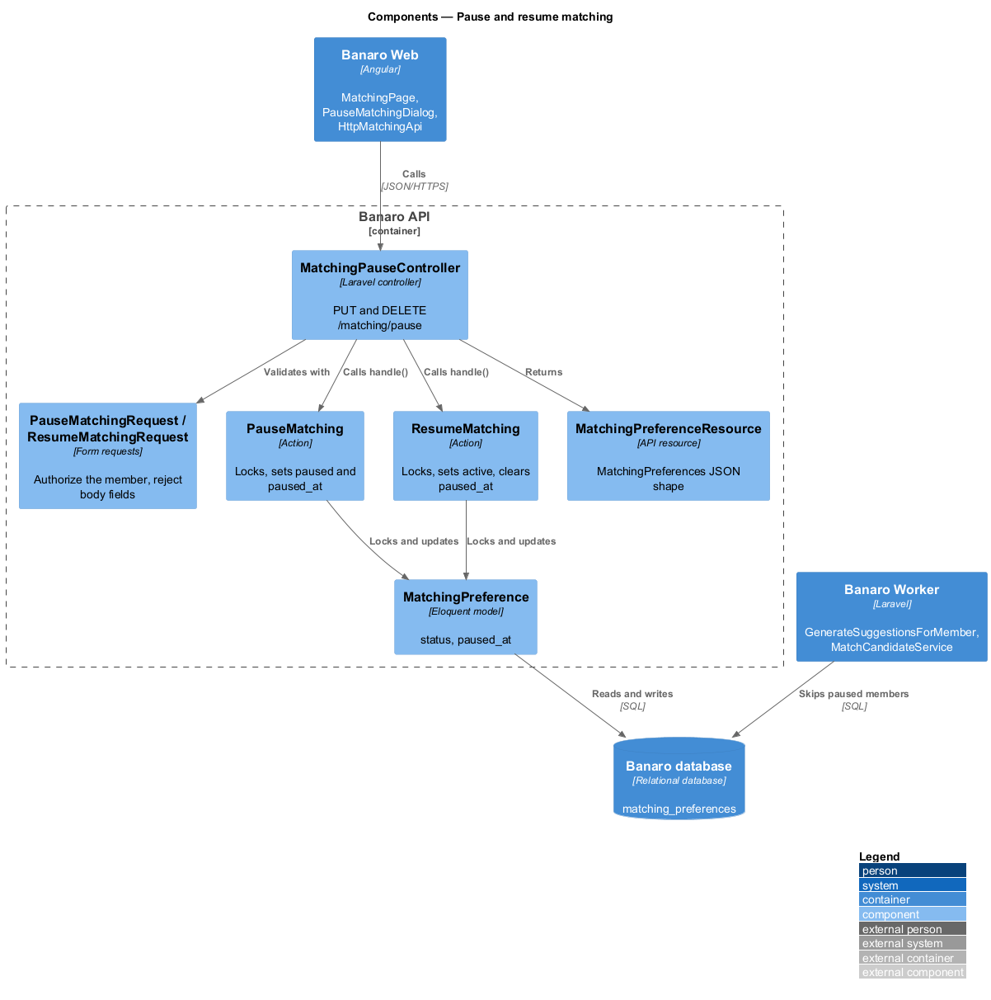
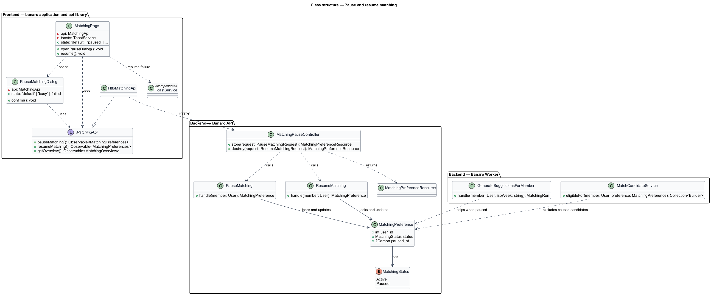
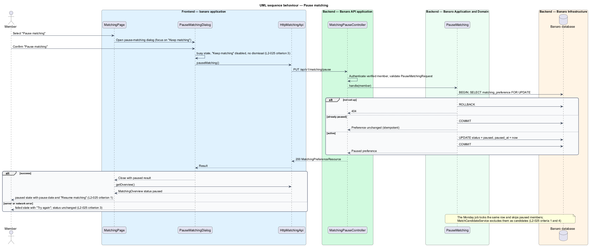
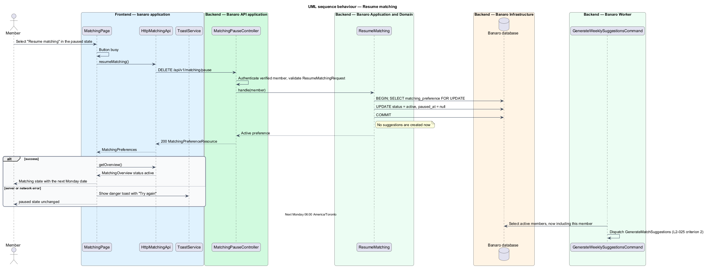

# Pause and resume matching

## Overview

A member may need a break from weekly suggestions, for example while a venture is on hold. This
feature lets a set-up member pause matching and resume it later. While paused, the member receives no
suggestions and no Monday e-mail, and is not suggested to anyone else. The stored search and past
suggestions stay as they are. The feature belongs to the `matching` subsystem. It starts from the
"Pause matching" link on `/matching`, which the `review-matches` feature describes, and it owns the
page's `paused` state.

Terms used in this design:

- **matching status** — `active` or `paused` state of a set-up member's matching, stored on the
  member's `MatchingPreference`
- **paused member** — set-up member whose matching status is `paused`
- **pause date** — instant at which the member paused, shown as "Paused since Friday 9 October"

The member selects "Pause matching" and confirms the `pause-matching` dialog. The Banaro API sets the
status to `paused`, and `/matching` shows the `paused` state with a "Resume matching" action. When the
member resumes, the status returns to `active`. The next Monday run then includes the member again.
Resuming never creates suggestions on the spot.

## Description

The slice runs from the matching page and the `pause-matching` dialog in Banaro Web through the Banaro
API to the Banaro database. The Banaro Worker honours the status on each Monday run.

### Frontend — `banaro` application and libraries

- **`PauseMatchingDialog`** (`dialogs/pause-matching/`) — CDK dialog with the `default`, `busy` and
  `failed` states.
  - Focus starts on "Keep matching". Escape closes the dialog, and focus returns to "Pause matching"
    (`L2-050` criterion 3).
  - On confirm, the dialog enters the `busy` state. "Keep matching" is disabled and the dialog cannot
    be dismissed (`L2-025` criterion 3).
  - On failure, it shows the `failed` state, which says matching is still running, with "Try again".
    The status does not change (`L2-025` criterion 3).
  - On success, it closes with a paused result.
- **`MatchingPage`** (`pages/matching/`) — opens the dialog from the "Pause matching" link. After a
  paused result, it reloads the overview and shows the `paused` state (`L2-025` criterion 1):
  - the heading "Matching is paused" and the pause date, formatted in America/Toronto (`L2-052`)
  - the "Resume matching" button and the note that the next three arrive the following Monday
    (`L2-025` criterion 2)
  - the search summary, with the Monday e-mail shown as paused
- Selecting "Resume matching" calls `resumeMatching()` and reloads the overview. The button is busy
  while the request runs. A failed resume shows a danger toast with "Try again" through `ToastService`
  (`L2-028`); its copy is `<TO SUPPLY>`.
- **`MatchingApi`** / **`MATCHING_API`** / **`HttpMatchingApi`** (`api` library) —
  `pauseMatching()` sends `PUT /api/v1/matching/pause`. `resumeMatching()` sends
  `DELETE /api/v1/matching/pause`. Both return `MatchingPreferences`.
- **Account banner** — while the status is `paused`, the `system-notifications` feature shows the
  paused-matching account banner on member pages (`L2-028` criterion 4).

### Backend — Banaro API

- **`MatchingPauseController`** (`Controllers/Api/V1/Matching/`) — `store()` handles
  `PUT /matching/pause` and calls `PauseMatching`. `destroy()` handles `DELETE /matching/pause` and
  calls `ResumeMatching`. Both return a `MatchingPreferenceResource`. Both routes are in
  `routes/api.php`. Neither carries an identifier, so a member can change only their own status
  (`L2-044` criterion 1).
- **`PauseMatchingRequest`** and **`ResumeMatchingRequest`** (`Requests/Matching/`) — authorize the
  verified member and reject any body field.
- **`PauseMatching`** (`Actions/Matching/`) — in one transaction:
  1. It locks the member's `MatchingPreference` row with `lockForUpdate()`, and returns 404 when the
     member is not set up.
  2. It returns the preference unchanged when it is already paused, so a retry is idempotent.
  3. Otherwise it sets `status` to `paused` and `paused_at` to now.
- **`ResumeMatching`** (`Actions/Matching/`) — locks the same row, sets `status` to `active` and
  clears `paused_at`. It creates no suggestions; the next Monday run does (`L2-025` criterion 2).
- **`MatchingPreference`** (`Models/`) — defined by `set-up-matching`; this feature writes `status` and
  `paused_at`.

### Effects on the Monday run

- `GenerateWeeklySuggestionsCommand` dispatches jobs for active members only, and
  `GenerateSuggestionsForMember` re-checks the status under the row lock. A paused member therefore
  gets no suggestions, even when the pause lands after dispatch (`L2-025` criterion 1).
- `MatchCandidateService` excludes paused members as candidates, so a paused member is not suggested
  to others (`L2-025` criterion 4).
- `PauseMatching` and `GenerateSuggestionsForMember` lock the same row. A pause that races the Monday
  run therefore applies either wholly before or wholly after that member's run.
- No suggestions means no `MatchSuggestionsReadyNotification`, so the Monday e-mail stops while
  paused.

### Open points

- Resume failure: no mock covers a failed resume. Presentation and copy: `<TO SUPPLY>`.
- Current week after a mid-week resume: whether the week's remaining suggestions show again or the
  page waits for the next Monday: `<TO SUPPLY>`.
- Pause from elsewhere: whether the dashboard or settings also offer pause: `<TO SUPPLY>`.

## Requirements

| L2 ID | Refines (L1) | Requirement |
|-------|--------------|-------------|
| `L2-025` | `L1-007` | A member shall be able to pause weekly suggestions and resume them. |

The design realizes all four acceptance criteria of `L2-025`. The Description cites each criterion
where a component enforces it.

## Diagrams

### System context

A member pauses and resumes matching in Banaro. No external system takes part in this slice.

### Containers

The matching page and the `pause-matching` dialog in Banaro Web call the Banaro API, which stores the
status in the Banaro database. The Banaro Worker reads the status on each Monday run.

### Components

Inside the Banaro API, `MatchingPauseController` calls `PauseMatching` or `ResumeMatching`. Both lock
the member's `MatchingPreference` row.

### Class structure

`PauseMatchingDialog` and `MatchingPage` depend on the `MatchingApi` contract. On the backend, the two
actions change `status` and `paused_at` on `MatchingPreference`.

### Behaviour — pause matching

The member confirms the dialog. The action locks the preference and sets it to paused. The page then
shows the `paused` state; a failure keeps the status and offers retry.

### Behaviour — resume matching

The member selects "Resume matching". The action sets the status to active, and the next Monday run
creates suggestions again.

