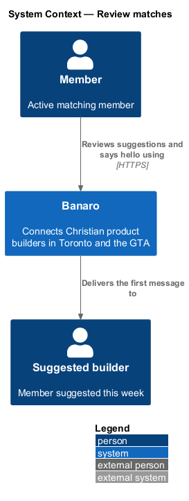
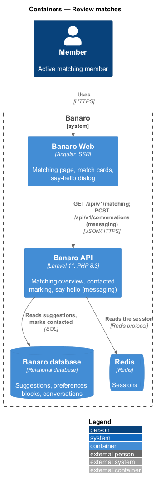
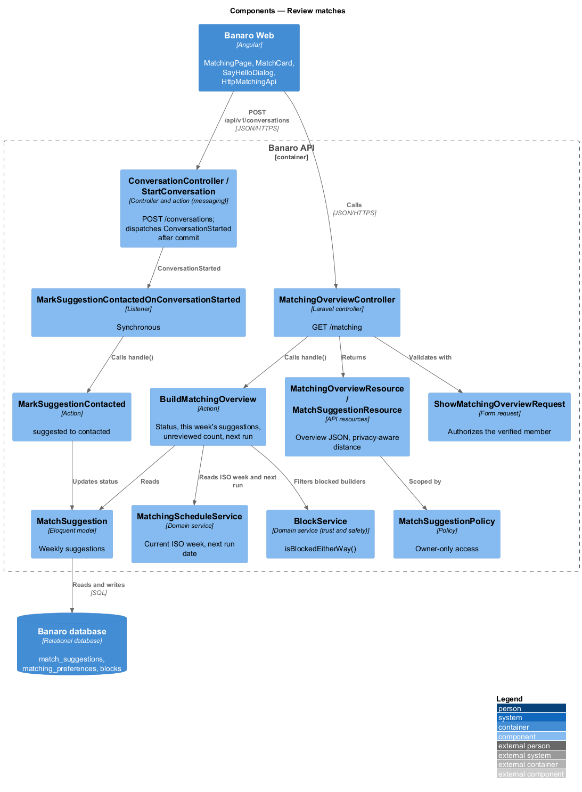
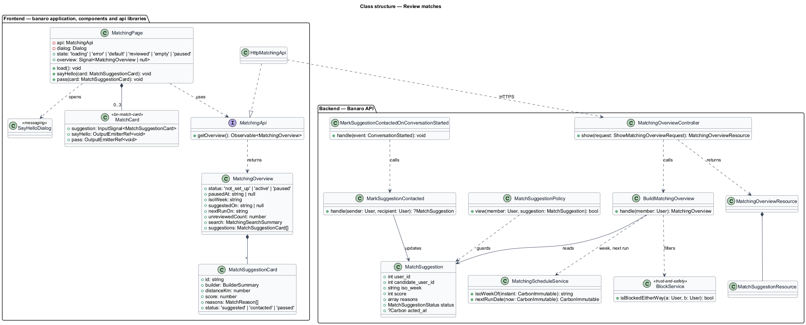
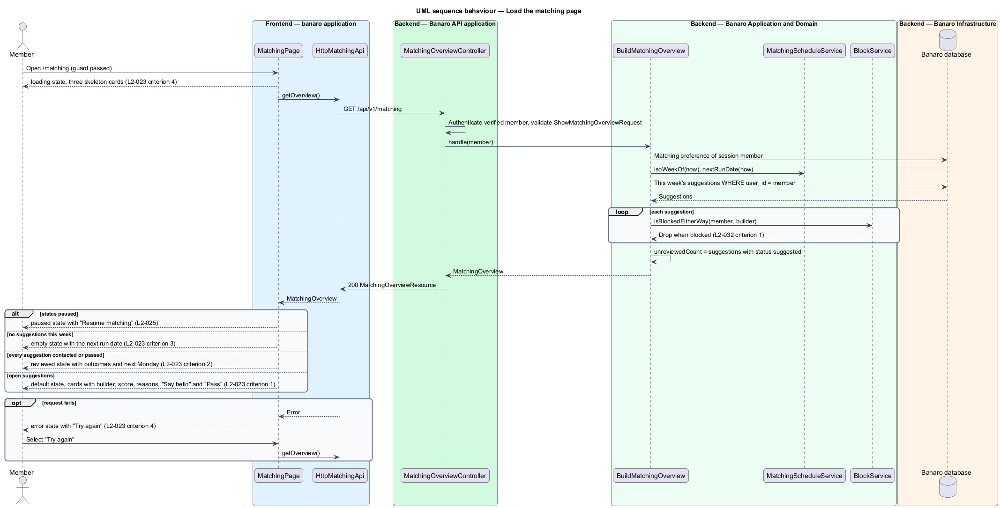
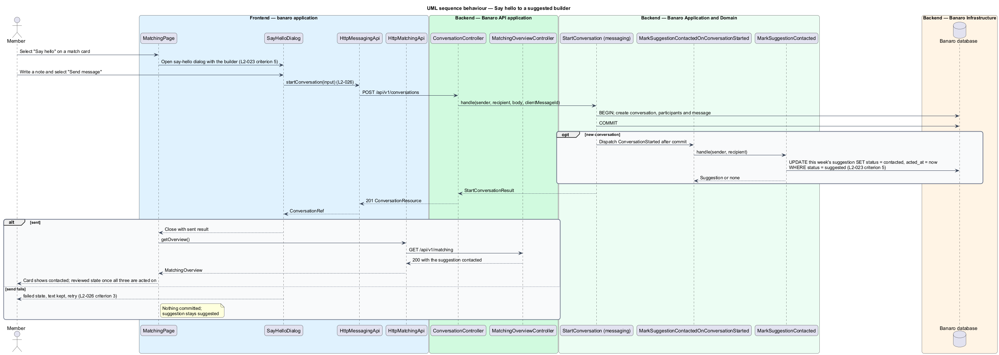

# Review matches

## Overview

Each Monday the `generate-weekly-suggestions` feature stores up to three match suggestions for every
active matching member. This feature shows those suggestions at `/matching` and lets the member act on
each one. The member either says hello, which opens a first conversation, or passes. It belongs to the
`matching` subsystem. The "Say hello" action hands over to the `messaging/say-hello` feature, the
"Pass" action to `pass-on-suggestion`, and the "Pause matching" link to `pause-and-resume-matching`.

Terms used in this design:

- **match suggestion** — stored pairing of a member with one builder for one ISO week, with a match
  score and the reasons for the match
- **match card** — card that shows one suggestion: the builder, the match score, the reasons and the
  actions
- **contacted** — status of a suggestion after the member has sent a first message to its builder
- **passed** — status of a suggestion the member has declined; the `pass-on-suggestion` feature sets it
- **reviewed week** — week in which every suggestion is contacted or passed
- **matching overview** — single API response that carries the matching status, this week's
  suggestions, the unreviewed count and the next run date

The page reads the matching overview and picks one state. A week with open suggestions shows the
`default` state with up to three match cards. A week in which every suggestion has been acted on
shows the `reviewed` state, which says when the next suggestions arrive. A week without suggestions
shows the `empty` state. A paused member sees the `paused` state, which the
`pause-and-resume-matching` feature describes.

## Description

The slice runs from the matching page in Banaro Web through the Banaro API to the Banaro database. The
say-hello step crosses into the `messaging` subsystem.

### Frontend — `banaro` application and libraries

- **`MatchingPage`** (`pages/matching/`, selector `bn-matching-page`) — routed page for `/matching`,
  behind `matchingSetUpGuard` (`L2-021` criterion 4). It loads the overview through `MATCHING_API`
  and selects a state:
  - `loading` — three skeleton cards in the final card size, so the swap causes no layout shift
    (`L2-023` criterion 4, `L2-048` criterion 4)
  - `error` — the error panel with "Try again", which repeats the request, and "Browse builders"
    (`L2-023` criterion 4)
  - `default` — the weekly heading, the suggestion date, the match cards, the next
    run date and a "Pause matching" link (`L2-023` criterion 1)
  - `reviewed` — the summary of this week's suggestions with their outcomes, such as "Passed", and
    the next run date (`L2-023` criterion 2)
  - `empty` — the explanation of when suggestions arrive, built from `nextRunOn` (`L2-023`
    criterion 3)
  - `paused` — owned by `pause-and-resume-matching`
- The page also shows the search summary with an edit link to `/matching/setup`.
- The page never derives a status locally. After any action it reloads the overview, as the
  `events/rsvp-to-event` design does for counts.
- **`MatchCard`** (`components` library, `lib/match-card/`, selector `bn-match-card`) — presents one
  suggestion: photo or initials, name, role, neighbourhood, distance, the score as text such as "94%
  match", the reasons for the match and the "Say hello" and "Pass" buttons. The score is text,
  not colour alone (`L2-050` criterion 7). The card is a repeated composition, so a `MatchCard`
  perf-test scenario accompanies it.
- **`SayHelloDialog`** (`dialogs/say-hello/`) — CDK dialog that the `messaging/say-hello` feature owns
  (`L2-026`). `MatchingPage` opens it with the suggestion's builder. When the dialog closes with a
  sent result, the page reloads the overview (`L2-023` criterion 5).
- **`MatchingApi`** / **`MATCHING_API`** / **`HttpMatchingApi`** (`api` library) — `getOverview()`
  sends `GET /api/v1/matching` and returns a `MatchingOverview`.
- **`MatchingOverview`** (`api` library model) — `status` (`not_set_up`, `active` or `paused`),
  `pausedAt`, `isoWeek`, `suggestedOn`, `nextRunOn`, `unreviewedCount`, `search` and `suggestions`.
- **`MatchSuggestionCard`** (`api` library model) — `id`, `builder` (id, name, photo URL, role,
  neighbourhood), `distanceKm`, `score`, `reasons` and `status` (`suggested`, `contacted` or `passed`).
  The page formats reason codes into text through the translation catalogue (`L2-052`).

### Backend — Banaro API

- **`MatchingOverviewController`** (`Controllers/Api/V1/Matching/`) — `show()` handles
  `GET /matching`, calls `BuildMatchingOverview` and returns a `MatchingOverviewResource`. The route is
  in `routes/api.php`.
- **`ShowMatchingOverviewRequest`** (`Requests/Matching/`) — authorizes the verified member and
  accepts no parameters (`L2-045` criterion 1).
- **`BuildMatchingOverview`** (`Actions/Matching/`) — assembles the overview for the session member:
  1. It returns status `not_set_up` when the member has no `MatchingPreference` (`L2-021`
     criterion 4).
  2. It reads the member's suggestions for the current ISO week from `MatchingScheduleService`.
  3. It drops any suggestion whose builder is now blocked in either direction, through
     `BlockService::isBlockedEitherWay()` (`L2-032` criterion 1, `L2-044` criterion 5).
  4. It counts the suggestions with status `suggested` as `unreviewedCount` (`L2-022` criterion 5).
  5. It adds `nextRunOn` from `MatchingScheduleService::nextRunDate()`.
- **`MatchingOverviewResource`** and **`MatchSuggestionResource`** (`Resources/Matching/`) —
  serialize the overview and each suggestion. `MatchSuggestionResource` applies the builder's
  neighbourhood-precision setting. For "City only" it shows the city and the distance rounded to the
  nearest 5 km (`L2-036` criterion 3).
- **`MatchSuggestionPolicy`** (`Policies/`) — allows a member to view or act on a suggestion only when
  its `user_id` is theirs. Lookups go through the member's own relation, so another member's
  suggestion id yields 404 (`L2-044` criterion 1).
- **`MarkSuggestionContactedOnConversationStarted`** (`Listeners/`) — synchronous listener for
  `ConversationStarted`. The messaging action `StartConversation` dispatches that event after commit
  when it creates a new conversation. The listener calls `MarkSuggestionContacted` with the sender and
  the recipient. It logs its own failure and does not fail the say-hello request, which has already
  committed.
- **`MarkSuggestionContacted`** (`Actions/Matching/`) — sets the sender's current-week suggestion for
  that recipient from `suggested` to `contacted` and stamps `acted_at` (`L2-023` criterion 5). It
  changes nothing when no such suggestion exists. The listener runs within the say-hello request, so
  the next overview read already shows the new status.
- **`MatchSuggestion`** (`Models/`) — defined by `generate-weekly-suggestions`.

### Failure handling

A failed overview read shows the `error` state; "Try again" repeats the read. A failed say-hello stays
inside `SayHelloDialog`, which keeps the text and offers retry (`L2-026` criterion 3). The suggestion
then stays `suggested`, because `ConversationStarted` is dispatched only after the conversation is
committed.

### Open points

- Empty state: `L2-023` criterion 3 needs an empty state for a set-up member with no suggestions this
  week. The `matching/empty` mock instead shows the "Not set up yet" invitation, and no mock covers
  the set-up case. Copy and layout: `<TO SUPPLY>`.
- Partly reviewed week: no mock shows a card after the member has said hello but before all three are
  acted on. Presentation of a contacted card: `<TO SUPPLY>`.
- Existing conversation: `StartConversation` dispatches `ConversationStarted` only for a new
  conversation. Saying hello to a suggested builder who already shares a conversation with the member
  therefore leaves the suggestion `suggested`. Rule for that case: `<TO SUPPLY>`.
- Reason text: the mock shows free-form reasons such as "He is the technical half Harvest is
  missing." The catalogue of reason codes and their templates: `<TO SUPPLY>`.

## Requirements

| L2 ID | Refines (L1) | Requirement |
|-------|--------------|-------------|
| `L2-023` | `L1-007` | A member shall be able to review each suggestion and act on it. |

The design realizes all five acceptance criteria of `L2-023`. The Description cites each criterion
where a component enforces it.

## Diagrams

### System context

A member reviews suggested builders in Banaro and starts conversations with them. No external system
takes part in this slice.

### Containers

The matching page in Banaro Web calls the Banaro API for the overview and, through the say-hello
dialog, for the first message. The API reads and updates suggestions in the Banaro database.

### Components

Inside the Banaro API, `MatchingOverviewController` calls `BuildMatchingOverview`. A listener on the
messaging subsystem's `ConversationStarted` event calls `MarkSuggestionContacted`.

### Class structure

`MatchingPage` depends on the `MatchingApi` contract and opens `SayHelloDialog`. On the backend,
`BuildMatchingOverview` reads `MatchSuggestion` rows and filters them through `BlockService`.

### Behaviour — load the matching page

The page loads the overview and picks the `default`, `reviewed`, `empty` or `paused` state. A failed
read shows the `error` state with retry.

### Behaviour — say hello to a suggested builder

The member opens the say-hello dialog from a match card and sends a first message. `StartConversation`
creates the conversation and commits; the listener then marks the suggestion as contacted.

