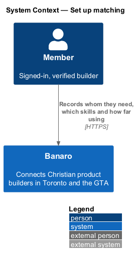
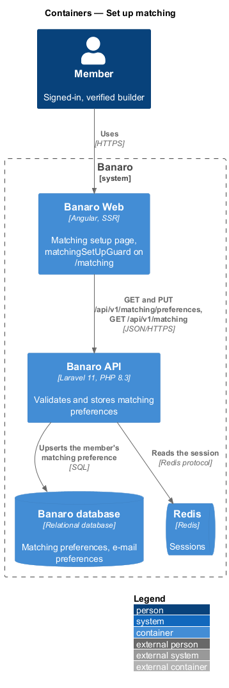
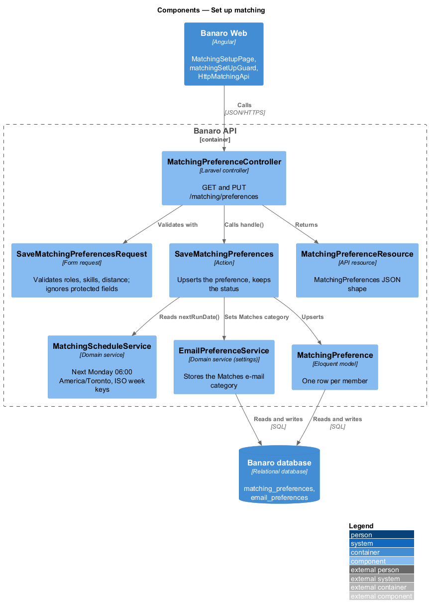
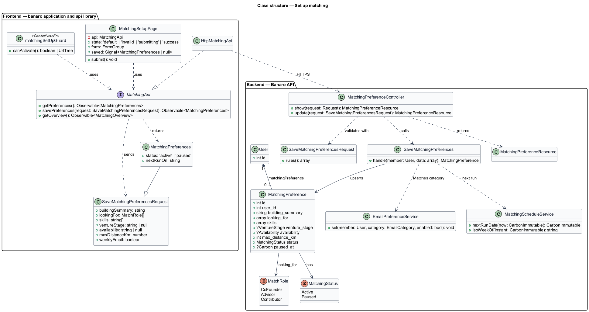
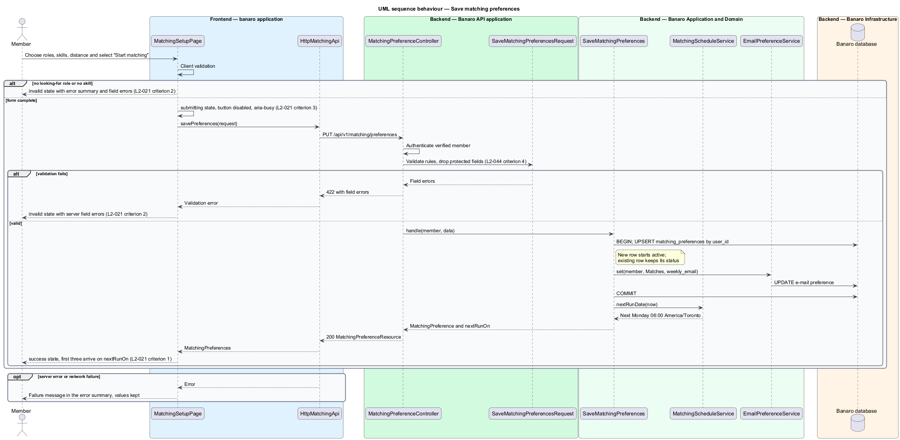
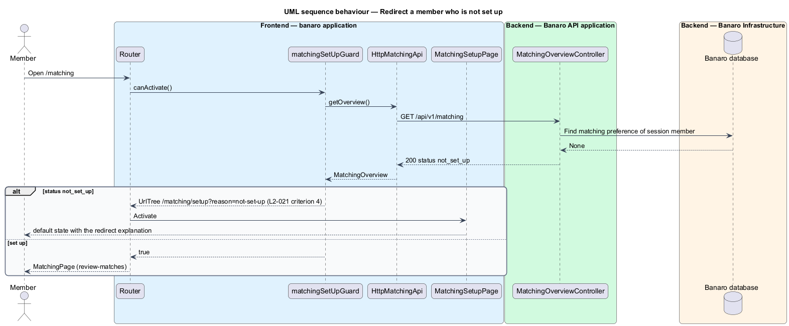

# Set up matching

## Overview

Banaro suggests three nearby, compatible builders to each matching member every Monday. Before it
can do that, a member states whom they need. This feature lets a member record that search at
`/matching/setup`. It is the first feature of the `matching` subsystem. The
`generate-weekly-suggestions` feature reads the stored search every Monday, and the `review-matches`
feature shows the results at `/matching`.

Terms used in this design:

- **matching preferences** — member's stored search: kinds of person sought, skills wanted, venture
  stage, availability and maximum distance
- **looking-for role** — kind of person a member seeks: Co-founder, Advisor or Contributor
- **maximum distance** — farthest distance, in kilometres from the member's neighbourhood, at which a
  builder may be suggested; 40 km unless the member changes it
- **set-up member** — member who has saved matching preferences at least once
- **matching status** — `active` or `paused` state of a set-up member's matching; the
  `pause-and-resume-matching` feature changes it
- **next run** — next Monday at 06:00 America/Toronto, when the weekly suggestion job runs

A member opens the setup page from the matching call to action, the dashboard or the edit link on
`/matching`. The member describes the venture, picks one or more looking-for roles and skills, sets
the maximum distance and saves. The Banaro API validates and stores the preferences and returns the
date of the next run. The page then confirms that the first suggestions arrive that Monday. A member
who opens `/matching` before setting up is redirected to the setup page with an explanation.

## Description

The slice runs from the matching setup page in Banaro Web through the Banaro API to the Banaro
database. It sends no e-mail and queues no job.

### Frontend — `banaro` application and libraries

- **`MatchingSetupPage`** (`pages/matching-setup/`, selector `bn-matching-setup-page`) — routed page
  for `/matching/setup` with the `default`, `invalid`, `submitting` and `success` states. The form has
  the fields of the mock:
  - venture description — text area `building`
  - looking-for roles — checkboxes `need` with the values `cofounder`, `advisor` and `contributor`
  - skills wanted — toggle chips with `aria-pressed`, drawn from the shared skill vocabulary
  - maximum distance — range input from 5 km to 60 km in 5 km steps, preset to 40 km
  - weekly e-mail — switch for the Monday e-mail
- The page validates on submit and shows the `invalid` state: an error summary titled "Fix these
  before continuing" that links to each field, plus an error under each field (`L2-021` criterion 2).
  The server remains the authority. The page maps 422 field errors from the API onto the same
  summary.
- While the request is in flight, the page shows the `submitting` state. The save button reads
  "Starting matching", carries `aria-busy="true"`, and every control is disabled without a layout
  shift (`L2-021` criterion 3).
- On success, the page shows the `success` state. It summarizes the search and formats `nextRunOn`
  from the response in the America/Toronto zone, for example "Monday 12 October" (`L2-021`
  criterion 1, `L2-052`). It offers "See matching" and "Browse builders meanwhile".
- When the member is already set up, the page pre-fills the form from `getPreferences()`. When the
  query string carries `reason=not-set-up`, the page shows the redirect explanation (`L2-021`
  criterion 4).
- **`matchingSetUpGuard`** (`api` library, `lib/auth/`) — `CanActivateFn` on the `/matching` route. It
  reads the matching overview from `MATCHING_API`. When the status is `not_set_up`, it returns a
  `UrlTree` for `/matching/setup?reason=not-set-up` (`L2-021` criterion 4).
- **`MatchingApi`** / **`MATCHING_API`** / **`HttpMatchingApi`** (`api` library, `lib/services/`) —
  the matching contract, its injection token and its HTTP implementation. This feature uses three
  methods:
  - `getPreferences()` sends `GET /api/v1/matching/preferences`
  - `savePreferences(request)` sends `PUT /api/v1/matching/preferences`
  - `getOverview()` sends `GET /api/v1/matching`; the `review-matches` feature defines its response
- **`MatchingPreferences`** and **`SaveMatchingPreferencesRequest`** (`api` library models) —
  `buildingSummary`, `lookingFor`, `skills`, `ventureStage`, `availability`, `maxDistanceKm` and
  `weeklyEmail`. The response adds `status` and `nextRunOn`.
- **`InMemoryMatchingApi`** (`api` library, `lib/testing/`) — in-memory fake of the contract for page
  tests.

### Backend — Banaro API

- **`MatchingPreferenceController`** (`Controllers/Api/V1/Matching/`) — `show()` handles
  `GET /matching/preferences` and returns 404 when the member is not set up. `update()` handles
  `PUT /matching/preferences`, calls `SaveMatchingPreferences` and returns a
  `MatchingPreferenceResource`. Both routes are in `routes/api.php`, so they require a verified
  member.
- **`SaveMatchingPreferencesRequest`** (`Requests/Matching/`) — form request with these rules
  (`L2-045` criterion 1):
  - `looking_for` — required array of at least one `MatchRole` value (`L2-021` criterion 2)
  - `skills` — required array of at least one skill from the shared vocabulary (`L2-021`
    criterion 2); maximum count `<TO SUPPLY>`
  - `building_summary` — string; whether it is required and its maximum length are `<TO SUPPLY>`
  - `venture_stage` and `availability` — values of `VentureStage` and `Availability`; whether they are
    required is `<TO SUPPLY>`
  - `max_distance_km` — integer from 5 to 60 in steps of 5; 40 when absent (`L2-021` criterion 1)
  - `weekly_email` — boolean
  - The request ignores `user_id`, `status` and any other field the member may not set (`L2-044`
    criterion 4).
- **`SaveMatchingPreferences`** (`Actions/Matching/`) — stores the preferences in one transaction:
  1. It inserts or updates the member's single `MatchingPreference` row, keyed by `user_id`.
  2. A new row starts with status `active`. An existing row keeps its status, so saving a search
     never resumes paused matching; only the `pause-and-resume-matching` feature changes the status.
  3. It writes the `weekly_email` choice to the Matches e-mail category through `EmailPreferenceService`,
     which the `settings/manage-email-preferences` feature owns (`L2-037`).
  4. It returns the preference with `nextRunOn` from `MatchingScheduleService` (`L2-021`
     criterion 1).
- **`MatchingScheduleService`** (`Services/Matching/`) — owns the matching calendar.
  `nextRunDate(now)` returns the next Monday at 06:00 America/Toronto, or today when it is Monday
  before 06:00. `isoWeekOf(instant)` returns the ISO week key, such as `2026-W42`. The
  `generate-weekly-suggestions` feature uses the same service.
- **`MatchingPreference`** (`Models/`) — one row per member, enforced by a unique index on `user_id`.
  It holds `building_summary`, `looking_for` (JSON array of `MatchRole`), `skills` (JSON array of skill
  keys), `venture_stage`, `availability`, `max_distance_km`, `status` (`MatchingStatus`) and
  `paused_at`.
- **`MatchRole`**, **`VentureStage`**, **`Availability`** and **`MatchingStatus`** (`Enums/`) —
  closed vocabularies. `MatchRole` holds `CoFounder`, `Advisor` and `Contributor`. `MatchingStatus`
  holds `Active` and `Paused`. The values of `VentureStage` and `Availability` are `<TO SUPPLY>`.
- **`MatchingPreferenceResource`** (`Resources/Matching/`) — serializes the preference, its status
  and `nextRunOn` into the `MatchingPreferences` shape.

### Data scoping

Neither route carries an identifier. The controller always reads and writes the preference of the
session member, so one member can never reach another member's preferences (`L2-044` criterion 1).

### Failure handling

A 422 response returns the page to the `invalid` state with field errors. A 5xx response or a network
failure keeps the entered values and shows a failure message in the same error summary, as the mock
manifest describes. The save is an upsert, so a retried request is safe.

### Open points

- Venture stage and availability: `L2-021` criterion 1 lists both, but the mock has no field for
  either. Their vocabularies, controls and whether they are required: `<TO SUPPLY>`.
- Venture description: the mock's `invalid` state requires it, while `L2-021` criterion 2 names
  only the looking-for choice and the skills. Rule: `<TO SUPPLY>`.
- Redirect explanation: `L2-021` criterion 4 redirects a member who is not set up to the setup page
  with an explanation. The mock instead shows a "Not set up yet" explanation in the `matching/empty`
  state, and the setup page has no explanation variant. Explanation copy and placement:
  `<TO SUPPLY>`.
- Distance range: the mock bounds the range at 5–60 km; the specification states only the 40 km
  default. Confirmation of the bounds: `<TO SUPPLY>`.
- Weekly e-mail switch: the switch duplicates the Matches category of `L2-037`. Confirmation that both
  controls write the same preference: `<TO SUPPLY>`.
- Editing an existing search: the manifest marks `loading` and `error` as not applicable, but
  pre-filling the form needs a read. Loading and load-error presentation: `<TO SUPPLY>`.

## Requirements

| L2 ID | Refines (L1) | Requirement |
|-------|--------------|-------------|
| `L2-021` | `L1-007` | A builder shall be able to declare who they are looking for at `/matching/setup`. |

The design realizes all four acceptance criteria of `L2-021`. The Description cites each criterion
where a component enforces it.

## Diagrams

### System context

A member records a matching search in Banaro. No external system takes part in this slice.

### Containers

The matching setup page in Banaro Web calls the Banaro API. The API stores the matching preferences
and the Matches e-mail choice in the Banaro database.

### Components

Inside the Banaro API, `MatchingPreferenceController` validates with `SaveMatchingPreferencesRequest`
and calls `SaveMatchingPreferences`. The action reads the next run date from `MatchingScheduleService`.

### Class structure

A `User` has at most one `MatchingPreference`, which holds `MatchRole` values and a `MatchingStatus`.
On the frontend, `MatchingSetupPage` and `matchingSetUpGuard` depend on the `MatchingApi` contract,
not on `HttpMatchingApi`.

### Behaviour — save matching preferences

The member submits the form. The API validates it, stores the preferences in one transaction and
returns the next run date. The page shows the `invalid` state on a 422 response and the `success`
state otherwise.

### Behaviour — redirect a member who is not set up

The guard on `/matching` reads the matching overview. When the member has no preferences, it
redirects to `/matching/setup` with an explanation.

