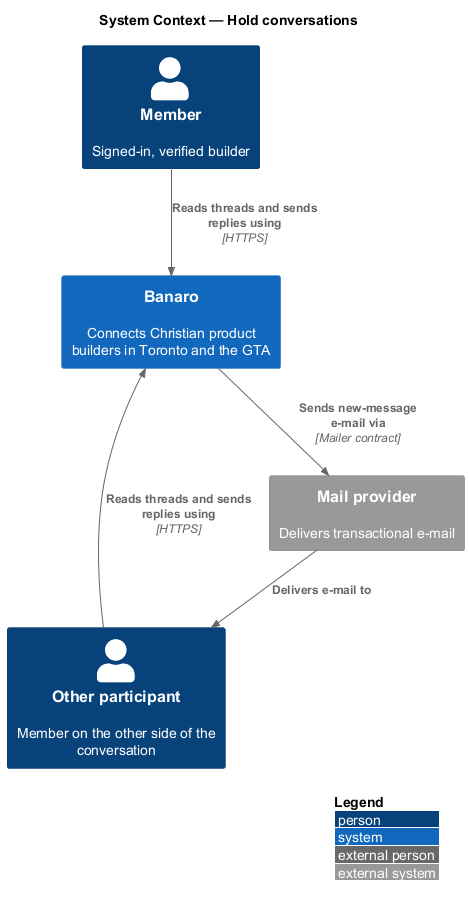
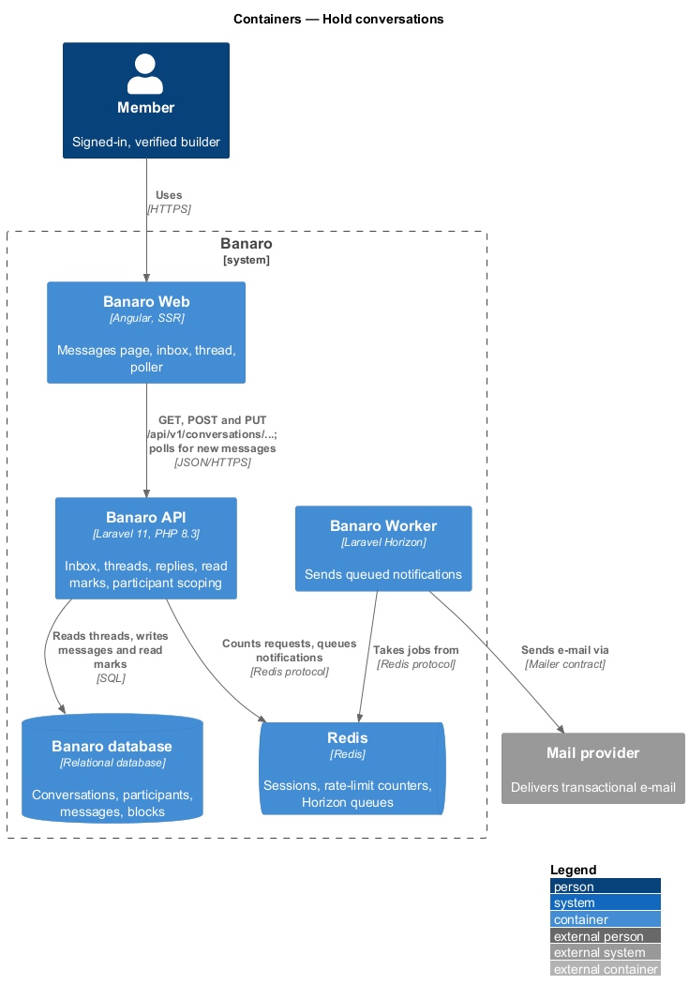
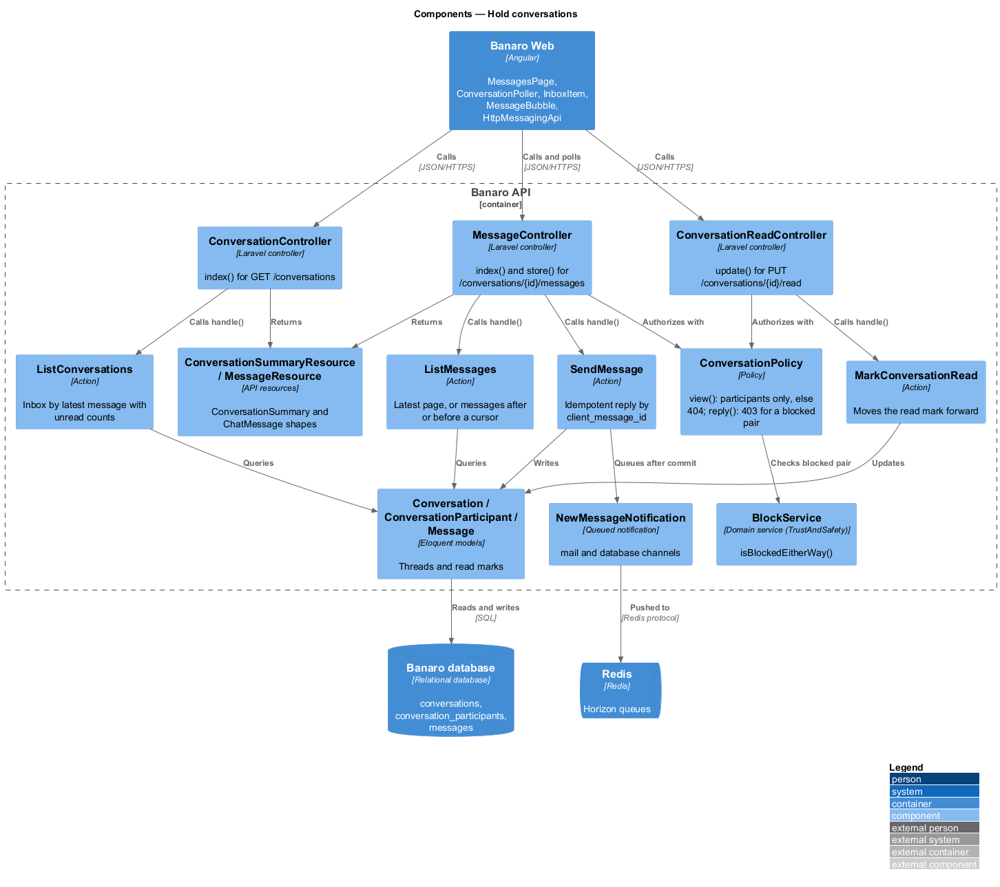
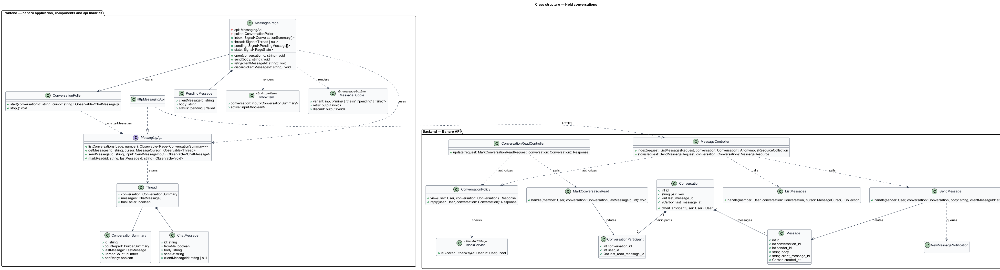
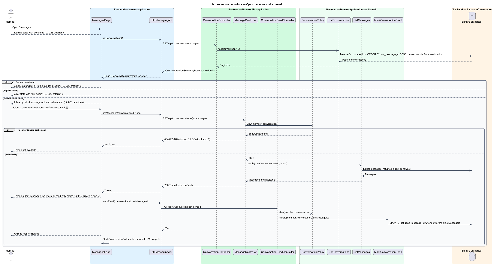
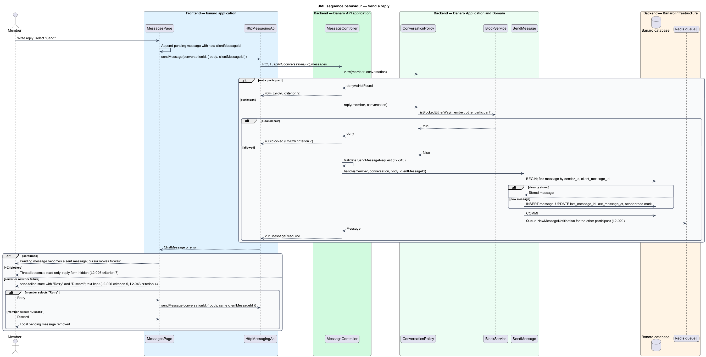
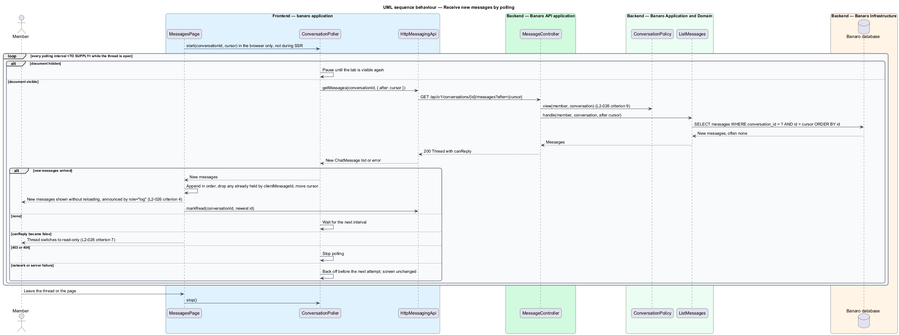

# Hold conversations

## Overview

Once two Banaro members have said hello, they keep talking in `/messages`. This feature delivers
that inbox and the conversation thread beside it. It belongs to the `messaging` subsystem. The
`say-hello` feature creates each conversation; this feature lists conversations, shows threads,
sends replies and brings in new messages while the page is open.

Terms used in this design:

- **inbox** — list of the member's conversations, most recent message first
- **thread** — messages of one conversation, oldest to newest
- **unread marker** — badge on an inbox entry that holds messages the member has not yet read
- **read mark** — id of the last message a participant has read (`last_read_message_id`)
- **pending message** — reply shown in the thread before the API has confirmed it
- **send-failed message** — pending message whose request failed; it offers retry and discard
- **read-only thread** — thread without a reply form because the two members are a blocked pair
- **polling** — periodic request from the browser for messages newer than the last one shown
- **poll cursor** — id of the newest message the page holds; the next poll asks for messages after it

Conversations appear in the inbox by the time of their latest message, with unread markers. Opening
one shows its thread and marks it read. A reply appears at once as a pending message and becomes a
normal message when the API confirms it. While the thread is open, the page polls for new messages
and appends them without reloading. Only the two participants can read a thread; any other member
receives 404.

### Delivery of new messages

The design uses polling, not a push channel. The architecture baseline has no WebSocket server, and
a push channel such as Laravel Reverb would add a new container to Banaro. Polling uses only the
existing Banaro API, Redis and database. Its cost is a delay of up to one polling interval and a
steady read load. The choice shall be recorded as an ADR in `docs/adr/` before implementation
(`<TO SUPPLY>` ADR number). A later move to a push channel needs its own ADR and a new container in
the baseline.

## Description

The slice runs from the messages page in Banaro Web through the Banaro API to the Banaro database. A
reply's e-mail notification leaves through the Banaro Worker.

### Frontend — `banaro` application and libraries

- **`MessagesPage`** (`pages/messages/`) — routed page for `/messages` and
  `/messages/{conversationId}`. The second route opens a thread, so each thread has its own URL. It
  shows the `default`, `loading`, `empty`, `error` and `send-failed` states from the mock.
  - `default` shows the inbox beside the open thread. Entries are ordered by latest message, newest
    first, each with an unread marker when it holds unread messages (`L2-026` criterion 4).
  - The thread renders oldest to newest inside a `role="log"` region, so new messages are announced
    without moving focus (`L2-050` criterion 4).
  - `empty` explains how to start a conversation and links to the builder directory. `loading`
    shows skeletons; `error` shows "Try again" (`L2-026` criterion 6).
  - A reply appears at once as a pending message. A failed send marks that message with the
    `send-failed` state and offers "Retry" and "Discard" (`L2-026` criterion 5). The reply text
    survives a lost connection (`L2-043` criterion 4).
  - When `canReply` is false, the page hides the reply form and shows a read-only notice (`L2-026`
    criterion 7).
- **`ConversationPoller`** (`pages/messages/`) — app-only helper that runs only in the browser, never
  during server-side rendering. While a thread is open and the document is visible, it calls
  `getMessages(conversationId, { after: cursor })` once per polling interval. It refreshes the first
  inbox page at a slower cadence. It pauses when the tab is hidden, backs off after failures and
  stops on 403 or 404. The polling interval and inbox cadence are `<TO SUPPLY>`. Together they shall
  keep a member below the limit of 120 requests per minute (`L2-046` criterion 1).
- **`InboxItem`** (`components` library, selector `bn-inbox-item`) — one inbox entry with avatar, name,
  last-message preview, time and unread badge. Its accessible name includes "unread" when the marker
  shows (`L2-050` criterion 7).
- **`MessageBubble`** (`components` library, selector `bn-message-bubble`) — one message with sender
  and time, in the `mine`, `theirs`, `pending` and `failed` variants. The `failed` variant holds the
  "Retry" and "Discard" actions and uses `role="alert"`.
- **Perf-test scenarios** — `InboxItem.ts`, `MessageBubble.ts` and a composite `MessageThread.ts` in
  `frontend/projects/perf-test/src/scenarios/`, because both components are new and repeat on the
  screen.
- **`DateFormatter`** (`api` library, `lib/i18n/`) — formats message times ("8:42 am", "Wed",
  "Thu 8 Oct, 7:15 pm") in the America/Toronto zone. The `localize-and-format` feature owns it.
- **`MessagingApi`** / **`MESSAGING_API`** / **`HttpMessagingApi`** (`api` library) — the contract
  shared with `say-hello`. This feature adds four methods:
  - `listConversations(page)` — `GET /api/v1/conversations?page={n}`, returns
    `Page<ConversationSummary>`.
  - `getMessages(conversationId, cursor)` — `GET /api/v1/conversations/{id}/messages` with `after` or
    `before`, returns a `Thread`.
  - `sendMessage(conversationId, input)` — `POST /api/v1/conversations/{id}/messages`, returns a
    `ChatMessage`.
  - `markRead(conversationId, lastMessageId)` — `PUT /api/v1/conversations/{id}/read`.
  `InMemoryMessagingApi` (`lib/testing/`) is the fake.
- **`ConversationSummary`** (`api` library model) — `id`, `counterpart` (`BuilderSummary`),
  `lastMessage` (preview, `sentAt`, `fromMe`), `unreadCount` and `canReply`.
- **`ChatMessage`** (`api` library model) — `id`, `fromMe`, `body`, `sentAt` and `clientMessageId`.
- **`Thread`** (`api` library model) — `conversation` (`ConversationSummary`), `messages` (oldest
  first) and `hasEarlier`.

### Backend — Banaro API

All routes below are in `routes/api.php`, so each requires a verified member.

- **`ConversationController`** (`Controllers/Api/V1/Messaging/`) — `index()` handles
  `GET /conversations`. It calls `ListConversations` and returns `ConversationSummaryResource` items.
- **`MessageController`** (`Controllers/Api/V1/Messaging/`) — `index()` handles
  `GET /conversations/{conversation}/messages` and calls `ListMessages`. `store()` handles
  `POST /conversations/{conversation}/messages` and calls `SendMessage`.
- **`ConversationReadController`** (`Controllers/Api/V1/Messaging/`) — `update()` handles
  `PUT /conversations/{conversation}/read` and calls `MarkConversationRead`.
- **Form requests** (`Requests/Messaging/`):
  - `ListConversationsRequest` — `page`, and `per_page` from 1 to 50, default 12 (`L2-047`
    criterion 4).
  - `ListMessagesRequest` — at most one of `after` and `before`, each a message id, and `limit` up
    to 50.
  - `SendMessageRequest` — `body` as a trimmed string and `client_message_id` as a UUID. The reply
    length limits are `<TO SUPPLY>`.
  - `MarkConversationReadRequest` — `last_message_id` as an integer.
  - Each request authorizes through `ConversationPolicy` before validation.
- **`ConversationPolicy`** (`Policies/`) — `view()` allows only the two participants. It denies
  every other member with `Response::denyAsNotFound()`, so the API answers 404 and reveals nothing
  (`L2-026` criterion 9, `L2-044` criterion 1). `reply()` denies a blocked pair with 403, using
  `BlockService::isBlockedEitherWay()` from `Services/TrustAndSafety` (`L2-026` criterion 7).
- **`ListConversations`** (`Actions/Messaging/`) — selects the member's conversations through
  `conversation_participants`, ordered by `last_message_at` then `id`, descending. It computes
  `unreadCount` from the read mark and excludes messages the member sent (`L2-026` criterion 4).
- **`ListMessages`** (`Actions/Messaging/`) — without a cursor, returns the latest page of messages
  in ascending order. With `after`, it returns newer messages for polling. With `before`, it returns
  earlier ones.
- **`SendMessage`** (`Actions/Messaging/`) — in one transaction it returns the stored message for a
  repeated `client_message_id`, or inserts the message. It then updates `last_message_id`,
  `last_message_at` and the sender's read mark. After commit it queues `NewMessageNotification` for
  the other participant.
- **`MarkConversationRead`** (`Actions/Messaging/`) — moves the member's read mark forward to the
  given message id, never backward.
- **`Conversation`**, **`ConversationParticipant`** and **`Message`** (`Models/`) — the models defined
  in `say-hello`. Indexes on `conversation_participants (user_id)`,
  `conversations (last_message_at)` and `messages (conversation_id, id)` keep the inbox and polling
  queries within the read budget (`L2-047` criterion 1).
- **`ConversationSummaryResource`** and **`MessageResource`** (`Resources/Messaging/`) — serialize the
  `ConversationSummary` and `ChatMessage` shapes. `canReply` comes from the same block check as
  `reply()`. Message bodies are plain text, encoded on output (`L2-045` criterion 5).
- **`NewMessageNotification`** (`Notifications/`) — the notification from `say-hello`, on the `mail`
  and `database` channels, subject to the Messages e-mail preference (`L2-029`, `L2-037`).

### Failure handling

A failed send leaves the pending message in the `send-failed` state. "Retry" resends with the same
client message id, so the API stores the message at most once. "Discard" removes only the local copy.
When the failed request had in fact reached the server, the next poll shows the stored message. A
403 on send switches the thread to read-only. A failed poll changes nothing on screen; the poller
backs off and tries again.

### Open points

- The `send-failed` mock labels the second action "Delete"; `L2-026` criterion 5 names it
  "Discard". The label is `<TO SUPPLY>`.
- In the `send-failed` mock the failed text appears both in the thread and in the reply field.
  Whether the reply field keeps or clears the text after a failed send is `<TO SUPPLY>`.
- `L2-026` criterion 7 makes existing threads read-only for a blocked pair, but `L2-032` criterion 4
  returns 404 when the blocked party fetches the blocker's conversations. The proposed
  reconciliation is read-only for the blocker and 404 for the blocked party, which also drops the
  thread from that party's inbox (`L2-044` criterion 5). The final rule is `<TO SUPPLY>`. The
  directional check it needs belongs to `BlockService`; its method name is `<TO SUPPLY>` from
  `block-builder`.
- No mock shows the read-only thread or a "load earlier messages" control. Both are `<TO SUPPLY>`.
- The polling interval, inbox refresh cadence and back-off schedule are `<TO SUPPLY>`, as is the
  ADR number that records the polling decision.
- The reply length limits and any reply-specific rate limit under `L2-046` criterion 2 are
  `<TO SUPPLY>`; `L2-026` sets limits only for first messages.
- The source of the header's unread-message count ("Messages, 1 unread") is `<TO SUPPLY>`; the shell
  owns the header.
- The mock links every inbox entry to `/messages`; the per-thread route `/messages/{conversationId}`
  is a design decision awaiting confirmation (`<TO SUPPLY>`).

## Requirements

| L2 ID | Refines (L1) | Requirement |
|-------|--------------|-------------|
| `L2-026` | `L1-008` | A member shall be able to send a first message to another builder and continue the conversation in `/messages`. |

This design realizes acceptance criteria 4, 5, 6 and 9 of `L2-026` and the read-only threads of
criterion 7; `say-hello` realizes criteria 1, 2, 3 and 8 and the 403 on a first message.

## Diagrams

### System context

Two members exchange messages through Banaro. Banaro tells a member about a new reply by e-mail
through the mail provider.

### Containers

The messages page in Banaro Web calls the Banaro API for the inbox, threads, replies and read marks,
and polls it for new messages. The Banaro Worker sends the e-mail queued in Redis.

### Components

Inside the Banaro API, three controllers call one action each. `ConversationPolicy` guards every
thread route, and its block rule comes from `BlockService`.

### Class structure

`MessagesPage` uses `ConversationPoller` and the `MessagingApi` contract, and renders `InboxItem` and
`MessageBubble`. On the backend, the four actions work on `Conversation`, `ConversationParticipant`
and `Message`.

### Behaviour — open the inbox and a thread

The page loads the inbox, then the selected thread, and marks the thread read. A member who is not a
participant receives 404.

### Behaviour — send a reply

The reply shows at once as a pending message. The API confirms it, refuses it for a blocked pair, or
fails, which leads to the `send-failed` state with retry and discard.

### Behaviour — receive new messages by polling

While the thread is open and visible, the poller asks for messages after the poll cursor and appends
any that arrive. It pauses while the tab is hidden and backs off after failures.

