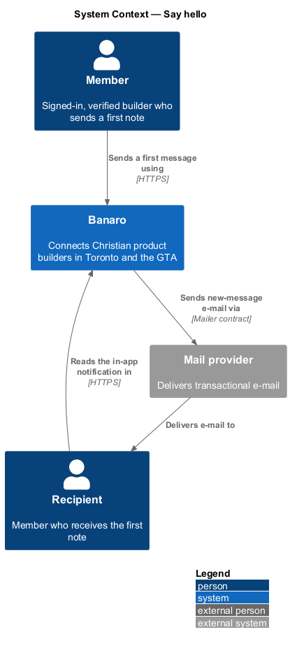
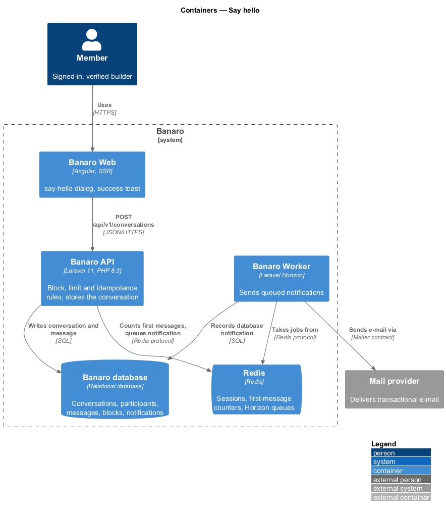
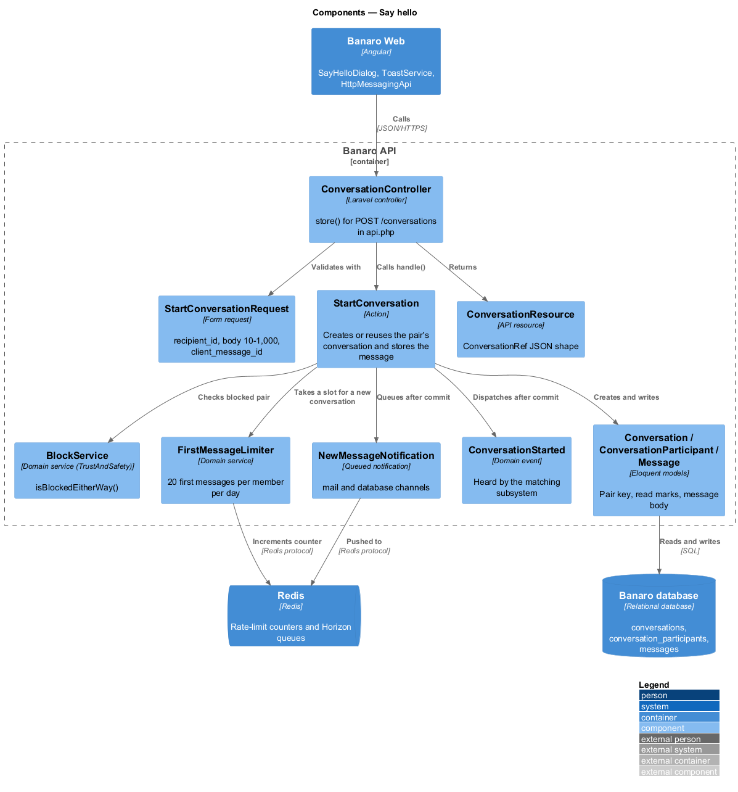
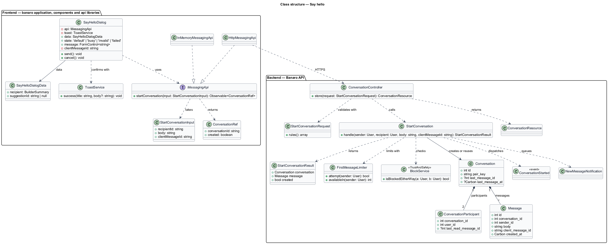
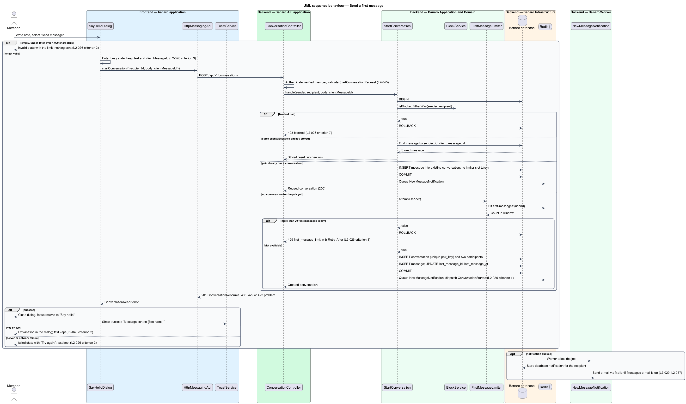

# Say hello

## Overview

Banaro exists so that Christian product builders who live near one another can start working
together. The first step is usually a short note. This feature lets a member send that first note to
another builder through the `say-hello` dialog. It belongs to the `messaging` subsystem. The
`hold-conversations` feature carries the exchange on from there in `/messages`.

Terms used in this design:

- **first message** — message that creates a new conversation between two members
- **conversation** — one-to-one thread between exactly two members; at most one exists per pair
- **participant** — one of the two members of a conversation
- **sender** — member who writes a message
- **recipient** — member to whom a first message is addressed
- **blocked pair** — two members where either one has blocked the other (`L2-032`)
- **client message id** — UUID that the browser generates for each message, so that a repeated
  request stores the message once
- **first-message limit** — cap of 20 first messages per member per day (`L2-026` criterion 8)

The dialog opens from every place that offers "Say hello": a directory card, a builder profile, a
match card on `/matching` and a match card on the dashboard. The member writes 10 to 1,000
characters and sends. The API refuses a blocked pair with 403 and a member over the daily limit with
429. Otherwise it creates the conversation, stores the message and notifies the recipient. The
dialog closes and a success toast confirms the send.

This feature defines the `StartConversation` action. Other subsystems reuse it whenever a
conversation between two members begins, for example when a project owner accepts a help offer
(`L2-017` criterion 4).

## Description

The slice runs from the `say-hello` dialog in Banaro Web through the Banaro API to the Banaro
database. The Banaro Worker delivers the recipient's e-mail.

### Frontend — `banaro` application and libraries

- **`SayHelloDialog`** (`dialogs/say-hello/`) — CDK dialog opened with a `SayHelloDialogData` value.
  Its states are `default`, `busy`, `invalid` and `failed`.
  - Focus starts in the message field. Escape closes the dialog, except while busy, and focus
    returns to the "Say hello" control (`L2-050` criterion 3).
  - "Send message" checks the length client-side first. An empty message, or one under 10 or over
    1,000 characters, shows the `invalid` state with the limit and sends nothing (`L2-026`
    criterion 2). Both sides count Unicode code points (`Array.from(text).length` and `mb_strlen`).
  - While the request is in flight, the dialog shows `busy` with the label "Sending…". "Cancel"
    stays enabled and aborts the request, as the mock specifies (`L2-026` criterion 3).
  - A failure shows the `failed` state with "Try again". The text stays in the field, including when
    the connection drops (`L2-026` criterion 3, `L2-043` criterion 4). "Try again" resends with the
    same client message id.
  - A 422 response maps field errors onto the message field. A 403 or 429 response shows the
    matching explanation in the dialog (`L2-026` criteria 7 and 8, `L2-046` criterion 2).
  - On success the dialog closes with a `ConversationRef` result and shows the success toast.
- **`SayHelloDialogData`** (`dialogs/say-hello/`) — `recipient` (a `BuilderSummary` with id, name,
  role, neighbourhood, photo and online status, already filtered by `L2-036` privacy settings) and an
  optional `suggestionId` when the dialog opens from a match card.
- **`ToastService`** (`components` library) — shows the success toast "Message sent to {first name}".
  Toast timing follows the `system-notifications` feature (`L2-028`).
- **`MessagingApi`** / **`MESSAGING_API`** / **`HttpMessagingApi`** (`api` library) — the messaging
  contract, its injection token and its HTTP implementation, shared with `hold-conversations`. This
  feature adds `startConversation(input)`, which sends `POST /api/v1/conversations` and returns a
  `ConversationRef`. `InMemoryMessagingApi` (`lib/testing/`) is the fake.
- **`StartConversationInput`** (`api` library model) — `recipientId`, `body` and `clientMessageId`.
- **`ConversationRef`** (`api` library model) — `conversationId` and `created` (false when the pair
  already had a conversation).

### Backend — Banaro API

- **`ConversationController`** (`Controllers/Api/V1/Messaging/`) — `store()` handles
  `POST /conversations`. The route is in `routes/api.php`, so it requires a verified member. The
  method calls `StartConversation` and returns a `ConversationResource` with 201 for a new
  conversation, or 200 when it reuses one.
- **`StartConversationRequest`** (`Requests/Messaging/`) — validates `recipient_id` as an integer,
  `body` as a trimmed string of 10 to 1,000 characters, and `client_message_id` as a UUID (`L2-026`
  criterion 2, `L2-045` criterion 1). It ignores any other field, so the sender always comes from
  the session (`L2-044` criterion 4).
- **`StartConversation`** (`Actions/Messaging/`) — single public `handle(User $sender, User $recipient,
  string $body, string $clientMessageId): StartConversationResult`. It runs in one database
  transaction:
  1. It returns 404 when the recipient is the sender, does not exist, or is deleted or suspended. The
     response does not say which reason applies.
  2. It calls `BlockService::isBlockedEitherWay($sender, $recipient)` from `Services/TrustAndSafety`.
     A blocked pair receives 403 with code `blocked` (`L2-026` criterion 7).
  3. It returns the stored result unchanged when a message with the same sender and client message
     id exists. A retried or aborted request therefore stores one message.
  4. It looks up the conversation by the pair key. When none exists, it asks `FirstMessageLimiter`
     for a slot, then creates the `Conversation` and two `ConversationParticipant` rows (`L2-026`
     criterion 1).
  5. It stores the `Message` and updates the conversation's `last_message_id` and `last_message_at`.
     It marks the message read for the sender.
  6. After commit, it queues `NewMessageNotification` for the recipient. For a new conversation it
     also dispatches the `ConversationStarted` event.
- **`FirstMessageLimiter`** (`Services/Messaging/`) — wraps the Laravel `RateLimiter` on Redis with
  the key `first-messages:{userId}` and 20 attempts per window. It counts only conversations that are
  created, not validation failures or replies. Over the limit, the action returns 429 with code
  `first_message_limit` and a `Retry-After` header (`L2-026` criterion 8). The general limit of 120
  requests per minute still applies (`L2-046` criterion 1).
- **`BlockService`** (`Services/TrustAndSafety/`) — owned by `block-builder`. This feature calls only
  `isBlockedEitherWay()`.
- **`Conversation`** (`Models/`) — `id`, `pair_key` (lower user id, a colon and the higher user id,
  with a unique index), `last_message_id`, `last_message_at` and `created_at`. The unique pair key
  keeps one conversation per pair even under concurrent first messages.
- **`ConversationParticipant`** (`Models/`) — `conversation_id`, `user_id` and
  `last_read_message_id`. `hold-conversations` uses the last field for unread markers.
- **`Message`** (`Models/`) — `id`, `conversation_id`, `sender_id`, `body` (plain text, encoded on
  output per `L2-045` criterion 5), `client_message_id` and `created_at`. A unique index on
  (`sender_id`, `client_message_id`) enforces idempotence.
- **`ConversationResource`** (`Resources/Messaging/`) — serializes the result into the
  `ConversationRef` shape.
- **`ConversationStarted`** (`Events/`) — domain event carrying the conversation, sender and
  recipient. The `matching` subsystem listens to it to mark a suggestion as contacted (`L2-023`
  criterion 5); the `review-matches` feature owns that listener.
- **`NewMessageNotification`** (`Notifications/`) — queued notification on the `mail` and `database`
  channels (`L2-026` criterion 1). The Banaro Worker sends the e-mail through the `Mailer` contract,
  subject to the member's Messages e-mail preference (`L2-029`, `L2-037`).

### Failure handling

A failed transaction rolls back, so no conversation, participant or message remains. The dialog then
shows its `failed` state with the text intact. Because the client message id stays the same, "Try
again" cannot store the message twice. A request that the browser aborts may still complete on the
server; a later resend then returns the stored result.

### Open points

- `L2-026` criterion 1 requires a recipient "who accepts messages". No L2 criterion defines how a
  builder declines messages, and the response for such a recipient is `<TO SUPPLY>`.
- When the pair already has a conversation, the design appends the note to it and does not count it
  against the first-message limit. Whether the dialog should instead link to the existing thread is
  `<TO SUPPLY>`.
- Whether "in a day" (`L2-026` criterion 8) means a rolling 24 hours or a calendar day in
  America/Toronto is `<TO SUPPLY>`. Whether conversations that other actions open, such as an
  accepted help offer, count against the limit is also `<TO SUPPLY>`.
- The `invalid` mock shows only a prompt to write a short note for an empty message. It shows
  neither the 10-character minimum nor the 1,000-character maximum that `L2-026` criterion 2
  requires. The copy and any character counter are `<TO SUPPLY>`.
- No mock state covers the 403 (blocked pair) or 429 (first-message limit) responses in the dialog.
  Their copy is `<TO SUPPLY>`.
- The dialog description and the toast copy use gendered pronouns ("He'll …"). Profiles
  hold no pronoun field (`L2-007`), so the neutral copy is `<TO SUPPLY>`.
- The success toast mock dismisses after 8 s, while `L2-028` criterion 1 says 6 s. The
  `system-notifications` feature owns the timing; `<TO SUPPLY>`.
- The `busy` mock keeps "Cancel" enabled to abort the send, while `L2-050` criterion 3 only exempts
  Escape while busy. The design follows the mock.

## Requirements

| L2 ID | Refines (L1) | Requirement |
|-------|--------------|-------------|
| `L2-026` | `L1-008` | A member shall be able to send a first message to another builder and continue the conversation in `/messages`. |

This design realizes acceptance criteria 1, 2, 3, 7 and 8 of `L2-026`; `hold-conversations` realizes
criteria 4, 5, 6 and 9 and the read-only half of criterion 7.

## Diagrams

### System context

A member sends a first note to another member through Banaro. Banaro tells the recipient in the app
and by e-mail through the mail provider.

### Containers

The dialog in Banaro Web calls the Banaro API. The API writes the conversation and message to the
Banaro database and counts first messages in Redis. The Banaro Worker sends the queued e-mail.

### Components

Inside the Banaro API, `ConversationController` calls `StartConversation`. The action checks the block
rule through `BlockService` and the daily cap through `FirstMessageLimiter`. After commit it queues
`NewMessageNotification` and dispatches `ConversationStarted`.

### Class structure

A `Conversation` has two `ConversationParticipant` rows and many `Message` rows. On the frontend,
`SayHelloDialog` depends on the `MessagingApi` contract, not on `HttpMessagingApi`.

### Behaviour — send a first message

The dialog validates the length, then posts the message. The action applies the recipient, block,
idempotence and first-message rules in one transaction. The alternates show each refusal and the
failed state with retry.

