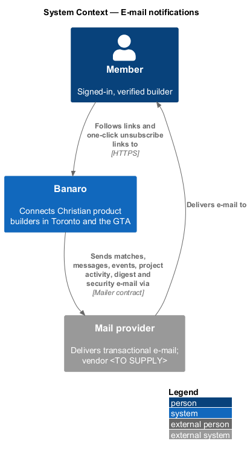
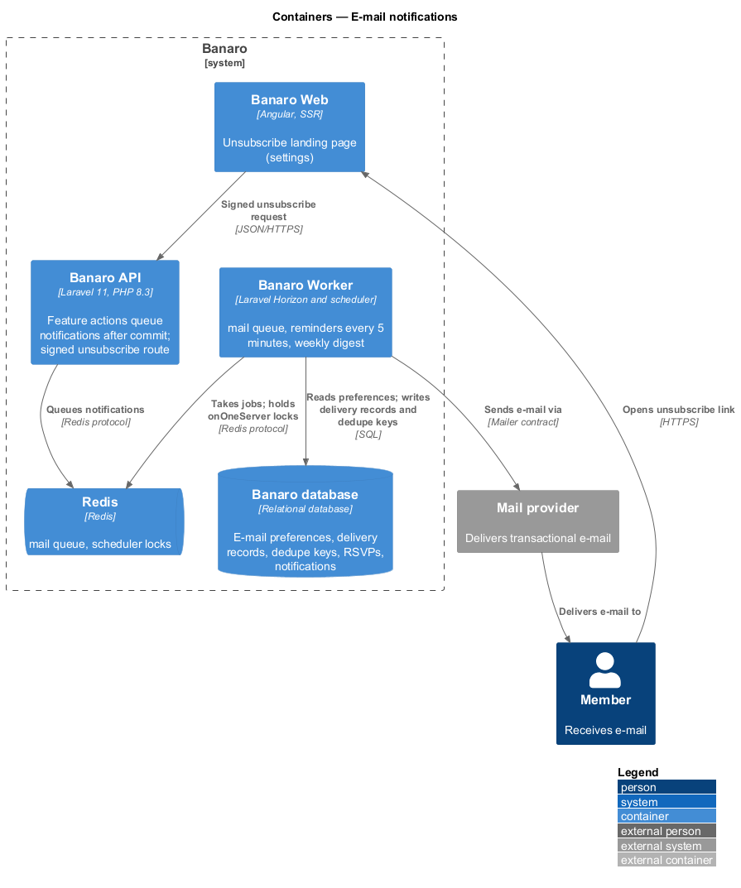
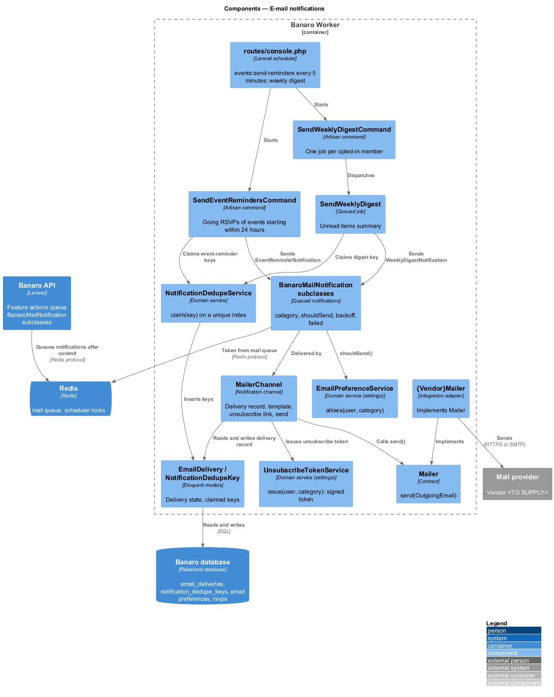
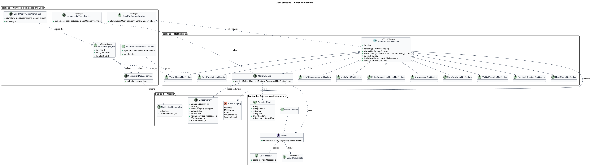
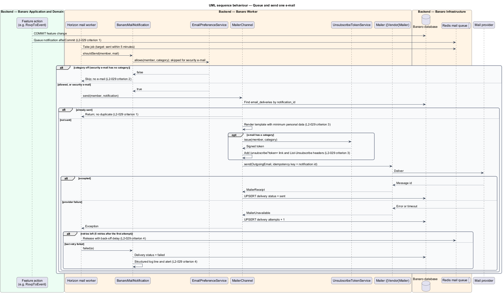
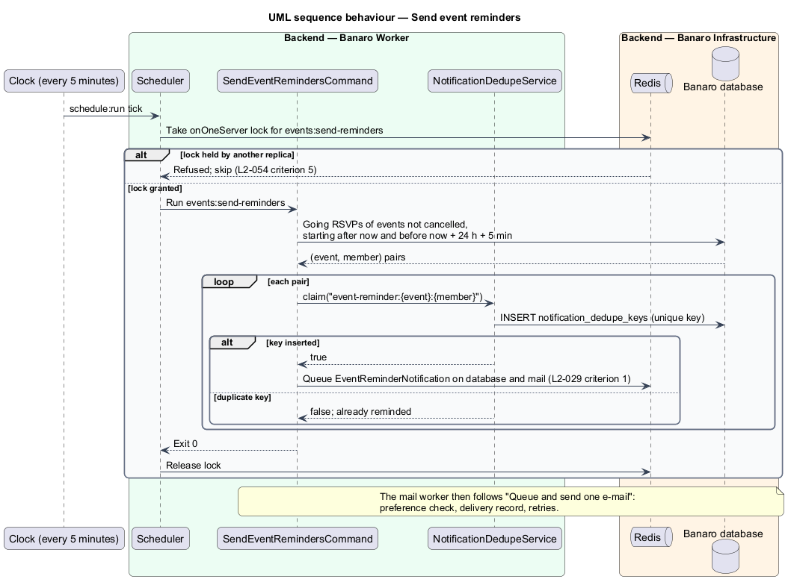
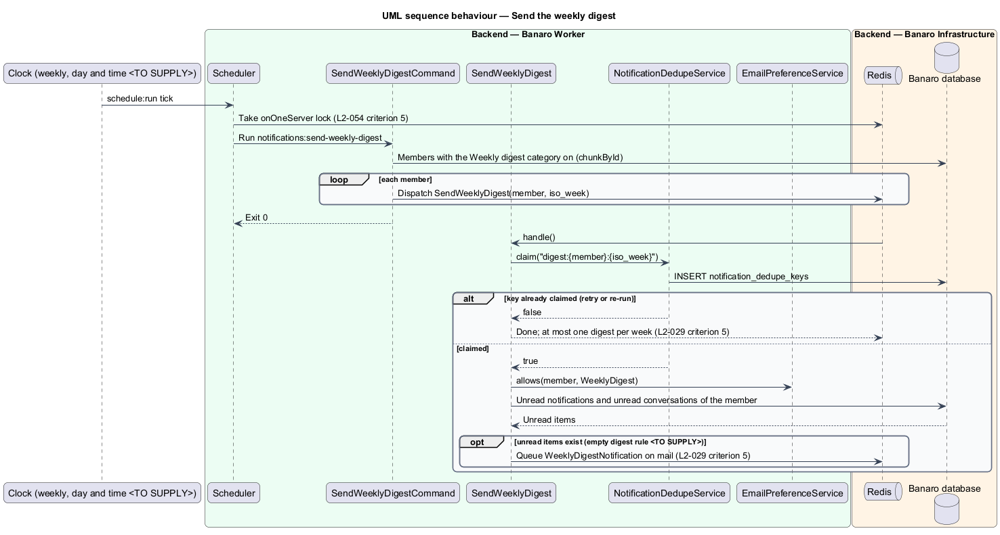

# E-mail notifications

## Overview

Members do not keep Banaro open all day, so the things that concern them also arrive by e-mail. This
feature sends transactional e-mail for new match suggestions, new messages, RSVP confirmations and
waitlist promotions, new feedback or help offers on a member's project, and a reminder 24 hours before
an event the member attends. It also sends a weekly digest to members who want one. It belongs to the
`notifications` subsystem. Other features decide when something happened; this feature owns how the
e-mail is queued, filtered by preference, sent once, retried and unsubscribed.

Terms used in this design:

- **e-mail category** — group of e-mail that a member can turn on or off as a unit: Matches, Messages,
  Events, Project activity or Weekly digest
- **security e-mail** — e-mail about account security (verification, password reset, sign-in from a
  new device) that preferences never suppress
- **trigger** — occurrence that calls for one e-mail, such as a new message or an event starting in 24
  hours
- **dedupe key** — string that names one trigger for one member, such as
  `event-reminder:{event}:{user}`; the first claim wins and later claims are refused
- **delivery record** — row that tracks one e-mail from queue to provider, keyed by the notification id
- **back-off** — growing delay between retries of a failed send
- **one-click unsubscribe link** — link carrying a signed token that turns one category off without
  sign-in
- **weekly digest** — single weekly e-mail that summarizes a member's unread items

A feature sends a Laravel notification that extends `BanaroMailNotification`, for example
`RsvpConfirmedNotification`. Laravel queues it on Redis after the database transaction commits. The
Banaro Worker takes the job, checks the member's preference for the category, renders the e-mail and
hands it to the `Mailer` contract. A provider failure leads to retries with back-off. After the last
retry the job is logged as failed and raises an alert.

## Description

The slice runs on the Banaro API, which queues notifications, and on the Banaro Worker, which sends
them through the mail provider. It has no page of its own. The unsubscribe landing page belongs to
the `settings/manage-email-preferences` feature (`L2-037` criteria 2 and 3).

### Notification classes — `backend/app/Notifications/`

- **`BanaroMailNotification`** — abstract base class for every e-mail notification. It implements
  `ShouldQueue` and calls `afterCommit()`, so no e-mail leaves for a rolled-back change. It runs on the
  `mail` queue.
  - `category()` returns the `EmailCategory`, or `null` for security e-mail.
  - `via()` returns `MailerChannel`, plus `database` when the class also feeds `/notifications`
    (`L2-027`).
  - `shouldSend($notifiable, $channel)` asks `EmailPreferenceService::allows()` for the mail channel.
    Laravel calls `shouldSend()` when the queued job runs, so a preference changed after queueing
    still applies. A turned-off category sends nothing. Security e-mail, with a `null` category, never
    calls the service and always sends (`L2-029` criterion 2).
  - `backoff()` returns the delays between retries, and the retry limit allows 5 retries after the
    first attempt (`L2-029` criterion 4). The delay values are `<TO SUPPLY>`.
  - `failed()` marks the delivery record `failed`, writes a structured log line and raises an alert
    (`L2-029` criterion 4).
- **Notification classes and categories** — each trigger of `L2-029` criterion 1 has one class:

  | Class | Owning feature | Category |
  |-------|----------------|----------|
  | `MatchSuggestionsReadyNotification` | `matching/generate-weekly-suggestions` | Matches |
  | `NewMessageNotification` | `messaging/say-hello`, `messaging/hold-conversations` | Messages |
  | `RsvpConfirmedNotification`, `WaitlistPromotedNotification` | `events/rsvp-to-event` | Events |
  | `EventReminderNotification` | this feature | Events |
  | `FeedbackReceivedNotification` | `projects/give-feedback` | Project activity |
  | `HelpOfferedNotification`, `HelpOfferAnsweredNotification` | `projects/offer-to-help` | Project activity |
  | `WeeklyDigestNotification` | this feature | Weekly digest |
  | `VerifyEmailNotification`, `ResetPasswordNotification`, new-device sign-in | `identity` features | none (security) |

### Delivery — Banaro Worker

- **Horizon `mail` queue** — a dedicated supervisor processes the `mail` queue. The target is a send
  within 5 minutes of the trigger (`L2-029` criterion 1). A Horizon wait-time alert on the queue fires
  before that budget is spent; its threshold is `<TO SUPPLY>`.
- **`MailerChannel`** (`Notifications/Channels/`) — custom notification channel:
  1. It loads the `EmailDelivery` row for the notification id, and returns at once when the row is
     already `sent`. A retry after a successful hand-off therefore sends nothing twice (`L2-029`
     criterion 1).
  2. It renders the Blade template under `resources/views/emails/{category}/`.
  3. For any e-mail with a category, it asks `UnsubscribeTokenService::issue()` for a token. It adds
     a link to `/unsubscribe?token=…` in the body. It also adds a `List-Unsubscribe` header that
     points at `POST /api/v1/email-preferences/unsubscribe`, with
     `List-Unsubscribe-Post: List-Unsubscribe=One-Click` (`L2-029` criterion 3).
  4. It calls `Mailer::send()` and passes the notification id as the idempotency key where the vendor
     supports one.
  5. It records the delivery as `sent` with the provider's message id.
- **`Mailer`** (`Contracts/`) — port with `send(OutgoingEmail): MailerReceipt`. It throws
  `MailerUnavailable` on a transient failure, which lets the job retry.
- **`{Vendor}Mailer`** (`Integrations/Mail/`) — adapter for the mail provider; vendor `<TO SUPPLY>`.
- **`UnsubscribeTokenService`** (`Services/Settings/`) — `issue(user, category)` returns the signed
  token. The `settings/manage-email-preferences` feature owns it, the `/unsubscribe` page and the
  anonymous `POST /email-preferences/unsubscribe` route in `routes/api_public.php`. Token lifetime is
  an open point of that feature.
- **`EmailPreferenceService`** (`Services/Settings/`) — `allows(user, category)` reads the member's
  stored choice. The `settings/manage-email-preferences` feature owns it.
- **Minimum personal data** — each template carries the recipient's first name, the subject's title,
  the other member's display name where one exists, and a link into Banaro. It carries no other
  member's e-mail address (`L2-029` criterion 3).

### One e-mail per trigger

- **`NotificationDedupeService`** (`Services/Notifications/`) — `claim(key)` inserts a
  `NotificationDedupeKey` row and returns `false` when the unique index refuses the key. Scheduled
  triggers claim a key before they send (`L2-029` criteria 1 and 5):
  - `event-reminder:{event}:{user}`
  - `digest:{user}:{iso_week}`
- Event-driven triggers send from the action that records the change, after commit. The action runs
  once per change, and the delivery record stops duplicate sends on retry.

### Scheduled commands — `routes/console.php`

Both commands use `onOneServer()` and `withoutOverlapping()`, so each runs once across Worker replicas
(`L2-054` criterion 5).

- **`SendEventRemindersCommand`** (`Console/Commands/`, signature `events:send-reminders`) — runs every
  five minutes. It selects going RSVPs for events that are not cancelled and start between now and 24
  hours plus five minutes from now. For each pair it claims `event-reminder:{event}:{user}` and sends
  `EventReminderNotification` on the `database` and mail channels (`L2-029` criterion 1). For an event
  at 7:00 pm on Thursday, the e-mail leaves at about 7:00 pm on Wednesday.
- **`SendWeeklyDigestCommand`** (`Console/Commands/`, signature `notifications:send-weekly-digest`) —
  runs once a week; day and time `<TO SUPPLY>`. It dispatches one `SendWeeklyDigest` job per member
  with the Weekly digest category on.
- **`SendWeeklyDigest`** (`Jobs/Notifications/`) — claims `digest:{user}:{iso_week}` (`L2-029`
  criterion 5). It gathers the member's unread notifications and unread conversations, and sends
  `WeeklyDigestNotification`. Whether a digest with no unread items is sent is `<TO SUPPLY>`.

### Models and enums

- **`EmailDelivery`** (`Models/`) — `notification_id` (unique), `user_id`, `category`, `status`
  (`queued`, `sent` or `failed`), `attempts`, `provider_message_id`, `sent_at` and `failed_at`.
- **`NotificationDedupeKey`** (`Models/`) — `key` (unique) and `created_at`.
- **`EmailCategory`** (`Enums/`) — `Matches`, `Messages`, `Events`, `ProjectActivity` and
  `WeeklyDigest`, as `settings/manage-email-preferences` defines it. Security e-mail has no category.

### Observability

Every send, retry and failure writes one structured log line with the notification id, category and
member id. It never logs the e-mail address or the body (`L2-053` criterion 3). The alert channel
for failed sends is `<TO SUPPLY>`.

### Open points

- Category set: `L2-037` and `L2-029` name Matches, Messages, Events, Project activity and Weekly
  digest. The `settings/email` mock shows "Weekly matches on Monday", "Event reminders", "New
  messages", "Feedback on my projects" and "Banaro news", with no weekly digest switch. Category list:
  `<TO SUPPLY>`.
- Matches e-mail time: the `settings/email` mock says "every Monday at 8 am", while the job runs at
  06:00 and this feature sends within 5 minutes. Resolution: `<TO SUPPLY>`.
- Messages e-mail condition: the mock sends it only when the member is away from Banaro. No
  requirement defines "away": `<TO SUPPLY>`.
- Retry count: the design reads "retried with back-off up to 5 times" as 5 retries after the first
  attempt. Confirmation and delay values: `<TO SUPPLY>`.
- Late RSVPs: whether a member who RSVPs less than 24 hours before an event still receives a
  reminder: `<TO SUPPLY>`.
- Digest day: the `privacy` mock mentions "a Monday digest"; the specification says only weekly. Day
  and time: `<TO SUPPLY>`.
- Message e-mail content: whether the e-mail quotes the message text: `<TO SUPPLY>`.
- E-mail templates: the mocks do not cover e-mail templates. Template design: `<TO SUPPLY>`.
- Retention of delivery records and dedupe keys: `<TO SUPPLY>`.

## Requirements

| L2 ID | Refines (L1) | Requirement |
|-------|--------------|-------------|
| `L2-029` | `L1-009` | The system shall send transactional e-mail for events a member cares about, subject to their preferences. |

The design realizes all five acceptance criteria of `L2-029`. The vendor, retry delays and digest
schedule remain `<TO SUPPLY>`.

## Diagrams

### System context

Banaro sends e-mail to members through the mail provider. A member may follow a one-click
unsubscribe link back to Banaro.

### Containers

The Banaro API queues notifications on Redis after commit. The Banaro Worker sends them through the
mail provider and records each delivery in the Banaro database.

### Components

Inside the Banaro Worker, `MailerChannel` checks the delivery record and the preference, adds the
unsubscribe link and calls the `Mailer` contract. Two scheduled commands raise the reminders and the
digest.

### Class structure

Every e-mail notification extends `BanaroMailNotification` and names an `EmailCategory`. `MailerChannel`
depends on the `Mailer` contract, not on the vendor adapter.

### Behaviour — queue and send one e-mail

A feature queues a notification after commit. The Worker checks the preference and the delivery
record, sends through the `Mailer`, retries with back-off and alerts after the last retry.

### Behaviour — send event reminders

Every five minutes the reminder command finds going members of events that start within the next 24
hours. It claims one dedupe key per member and event before it sends.

### Behaviour — send the weekly digest

Once a week the digest command dispatches one job per opted-in member. Each job claims the week's key,
so a member receives at most one digest a week.

