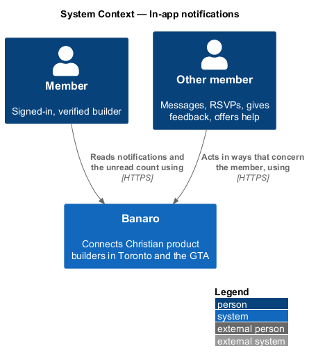
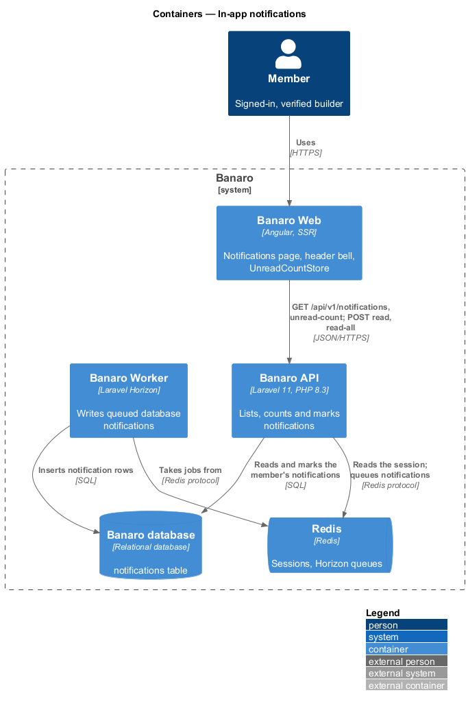
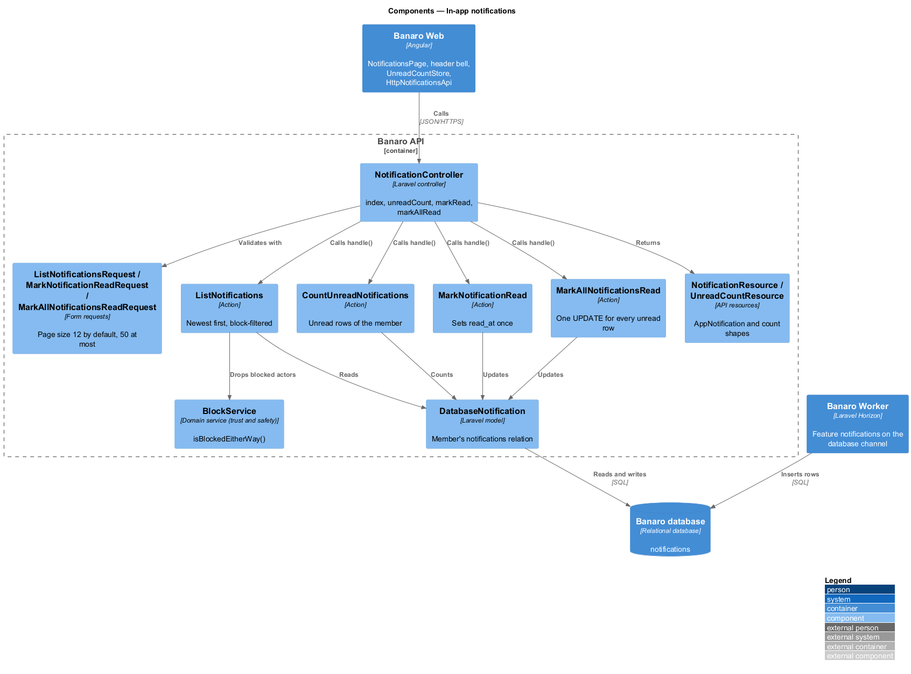
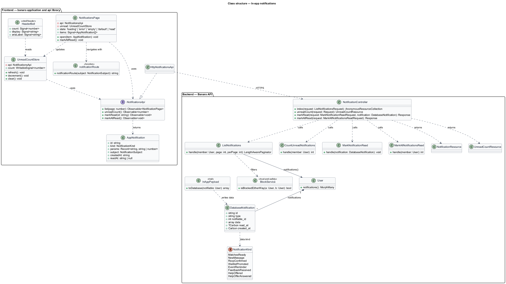
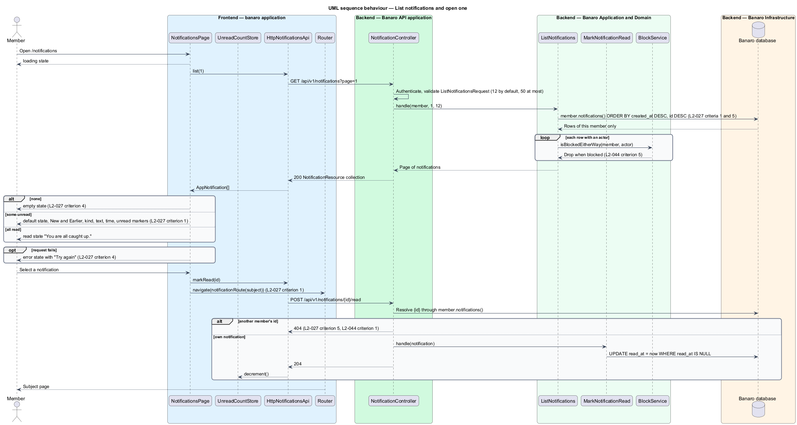
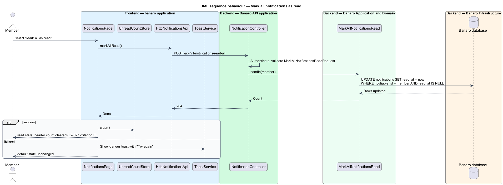
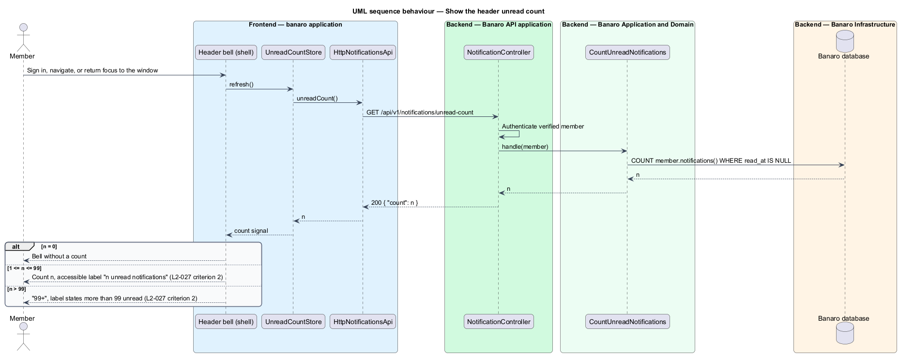

# In-app notifications

## Overview

Members need to know when something on Banaro concerns them: new match suggestions, a reply, an RSVP
outcome, feedback or an offer of help on a project. This feature gives each member a notification list
at `/notifications` and an unread count on the bell in the header. It belongs to the `notifications`
subsystem. Other features create the notifications; this feature stores, lists and marks them. The
`email-notifications` feature sends the matching e-mail, and `system-notifications` covers transient
toasts and banners.

Terms used in this design:

- **notification** — stored record that tells one member about one occurrence that concerns them
- **notification kind** — closed category of a notification, such as new matches or a new message,
  that selects its icon, text and subject
- **subject** — record a notification is about, such as a conversation or an event; selecting the
  notification opens it
- **unread notification** — notification whose `read_at` is empty
- **unread count** — number of the member's unread notifications, shown on the header bell

A feature that wants to tell a member something sends a Laravel notification on the `database`
channel. The `RsvpConfirmedNotification` of `events/rsvp-to-event` is one example. Laravel writes the
row to the `notifications` table. The member opens `/notifications` and sees the list, newest first,
with unread items marked. Selecting an item marks it read and opens its subject. "Mark all as read"
marks every item read and clears the header count.

## Description

The slice runs from the notifications page and the header bell in Banaro Web through the Banaro API
to the Banaro database.

### Frontend — `banaro` application and libraries

- **`NotificationsPage`** (`pages/notifications/`, selector `bn-notifications-page`) — routed page
  for `/notifications` with the `loading`, `error`, `empty`, `default` and `read` states (`L2-027`
  criterion 4).
  - `default` — a "New" section of unread items above an "Earlier" section of read items, with the
    sub-heading stating the unread count. Each item shows a kind icon, a title link, a short text, a
    time and, when unread, a "New" badge (`L2-027` criterion 1).
  - The kind icon carries a visually hidden kind label, so the kind is not conveyed by the icon alone
    (`L2-050` criterion 7).
  - Times follow `L2-052`: a time alone for today ("8:00 am"), "Yesterday, 4:20 pm" for yesterday,
    and a short date ("Thu 8 Oct") before that.
  - `read` — the same list with every item read and a sub-heading that says nothing is unread
  - `empty` — the "No notifications yet" panel with "Browse builders".
  - `error` — the error panel with "Try again", which repeats the request, and a link back to the dashboard.
  - Selecting an item calls `markRead(id)` and navigates to the route of its subject (`L2-027`
    criterion 1).
  - "Mark all as read" calls `markAllRead()`. On success the page shows the `read` state and the
    unread count drops to zero (`L2-027` criterion 3).
- **`notificationRoute(subject)`** (`banaro` application, `shared/`) — maps a subject to a route:
  matches to `/matching`, a conversation to `/messages/{id}`, a project to `/projects/{id}` and an
  event to `/events/{id}`.
- **`UnreadCountStore`** (`banaro` application, `shared/`) — signal store for the unread count. It
  loads the count after sign-in, after each navigation and when the window regains focus. It also
  updates after `markRead()` and `markAllRead()`. A periodic refresh interval is `<TO SUPPLY>`.
- **`HeaderBell`** (`shell/header/`) — icon link to `/notifications` that shows the count from
  `UnreadCountStore`. Counts above 99 show as "99+". The link's accessible label states the count, for
  example "3 unread notifications" (`L2-027` criterion 2). The count badge is positioned over the
  icon, so it causes no layout shift when it appears.
- **`NotificationsApi`** / **`NOTIFICATIONS_API`** / **`HttpNotificationsApi`** (`api` library) — the
  contract, its token and its HTTP implementation:
  - `list(page)` sends `GET /api/v1/notifications?page={n}`
  - `unreadCount()` sends `GET /api/v1/notifications/unread-count`
  - `markRead(id)` sends `POST /api/v1/notifications/{id}/read`
  - `markAllRead()` sends `POST /api/v1/notifications/read-all`
- **`AppNotification`** (`api` library model) — `id`, `kind`, `params`, `subject` (`type` and `id`),
  `createdAt` and `readAt`. The page builds the title and text from the translation catalogue keys
  `notifications.{kind}.title` and `notifications.{kind}.body` with `params` (`L2-052` criterion 1).
- **`InMemoryNotificationsApi`** (`api` library, `lib/testing/`) — in-memory fake of the contract.

### Backend — Banaro API

- **`NotificationController`** (`Controllers/Api/V1/Notifications/`) — four methods, each calling one
  action and returning a resource. All four routes are in `routes/api.php`.
  - `index()` — `GET /notifications`, calls `ListNotifications`
  - `unreadCount()` — `GET /notifications/unread-count`, calls `CountUnreadNotifications`
  - `markRead()` — `POST /notifications/{notification}/read`, calls `MarkNotificationRead`
  - `markAllRead()` — `POST /notifications/read-all`, calls `MarkAllNotificationsRead`
- **`ListNotificationsRequest`**, **`MarkNotificationReadRequest`** and
  **`MarkAllNotificationsReadRequest`** (`Requests/Notifications/`) — `ListNotificationsRequest`
  accepts `page` and `per_page`. `per_page` defaults to 12 and is capped at 50 (`L2-047`
  criterion 4). The other two accept no body fields.
- **`ListNotifications`** (`Actions/Notifications/`) — reads `$member->notifications()` ordered by
  `created_at` descending, then `id` descending (`L2-027` criterion 1). It drops items whose actor is
  blocked in either direction, through `BlockService::isBlockedEitherWay()` (`L2-044` criterion 5).
- **`CountUnreadNotifications`** (`Actions/Notifications/`) — counts the member's rows with an empty
  `read_at`.
- **`MarkNotificationRead`** (`Actions/Notifications/`) — sets `read_at` to now when it is empty. A
  repeated call changes nothing.
- **`MarkAllNotificationsRead`** (`Actions/Notifications/`) — sets `read_at` on every unread row of the
  member in one `UPDATE` (`L2-027` criterion 3).
- **Scoping** — every query starts from `$request->user()->notifications()`. The
  `{notification}` binding resolves through the same relation, so another member's id yields 404
  (`L2-027` criterion 5, `L2-044` criterion 1).
- **`DatabaseNotification`** (Laravel model, table `notifications`) — `id` (UUID), `type`,
  `notifiable_type`, `notifiable_id`, `data` (JSON), `read_at` and `created_at`. An index on
  (`notifiable_id`, `read_at`, `created_at`) serves the list and the count.
- **`NotificationKind`** (`Enums/`) — `MatchesReady`, `NewMessage`, `RsvpConfirmed`,
  `WaitlistPromoted`, `EventReminder`, `FeedbackReceived`, `HelpOffered` and `HelpOfferAnswered`. The
  list follows the triggers of `L1-009`, `L2-017` and `L2-029`.
- **`InAppPayload`** (`Notifications/Concerns/`) — trait that each notification class uses for
  `toDatabase()`. It writes `kind`, `subject`, `actor_user_id` and `params`. The payload holds only the
  values the text needs, such as a first name or a short excerpt.
- **`NotificationResource`** (`Resources/Notifications/`) — serializes a row into the
  `AppNotification` shape. **`UnreadCountResource`** returns `{ "count": n }`.

### Failure handling

A failed list read shows the `error` state with retry. A failed `markRead()` leaves the item unread;
the navigation to the subject still happens. A failed "Mark all as read" keeps the current state and
shows a danger toast with "Try again" through `ToastService` (`L2-028`); its copy is `<TO SUPPLY>`.

### Open points

- Accessible label: `L2-027` criterion 2 gives "3 unread notifications", while the mock header uses
  "Notifications, 3 unread". Label copy: `<TO SUPPLY>`.
- Extra kinds: the mock lists an attendee update ("Grace Liu is going to Design Critique Circle") and
  a profile-view count ("12 builders viewed" the profile). No requirement defines these kinds or their
  triggers: `<TO SUPPLY>`.
- In-app reminder time: the mock shows an event reminder a week before the event ("Fall Demo Night is
  next Thursday"), while `L2-029` sets the e-mail reminder at 24 hours. Timing of in-app reminders:
  `<TO SUPPLY>`.
- More than one page of notifications: the mock shows no "load more" control. Paging control:
  `<TO SUPPLY>`.
- Retention period of notifications: `<TO SUPPLY>`.
- Periodic refresh of the unread count: `<TO SUPPLY>`.

## Requirements

| L2 ID | Refines (L1) | Requirement |
|-------|--------------|-------------|
| `L2-027` | `L1-009` | Members shall see a list of their notifications at `/notifications` and an unread count in the header. |

The design realizes all five acceptance criteria of `L2-027`. The Description cites each criterion
where a component enforces it.

## Diagrams

### System context

A member reads notifications in Banaro. Other Banaro features create them; no external system takes
part in this slice.

### Containers

The notifications page and the header bell in Banaro Web call the Banaro API. The API and the Banaro
Worker write notification rows to the Banaro database; the API reads and marks them.

### Components

Inside the Banaro API, `NotificationController` calls one of four actions. Each action queries the
member's own `notifications` relation.

### Class structure

A `User` has many `DatabaseNotification` rows, each with a `NotificationKind` in its payload. On the
frontend, `NotificationsPage` and `UnreadCountStore` depend on the `NotificationsApi` contract.

### Behaviour — list notifications and open one

The page loads the member's notifications, newest first. Selecting one marks it read and opens its
subject.

### Behaviour — mark all as read

The member selects "Mark all as read". One update marks every unread row, and the page and the header
count reflect it.

### Behaviour — show the header unread count

The store loads the count after sign-in, navigation and window focus. The bell caps the display at
"99+" and states the count in its accessible label.

