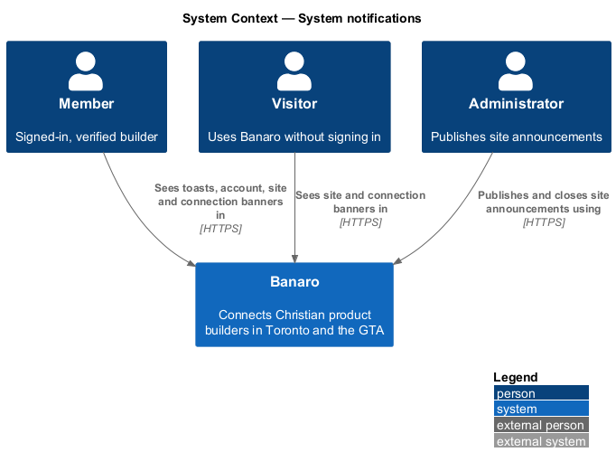
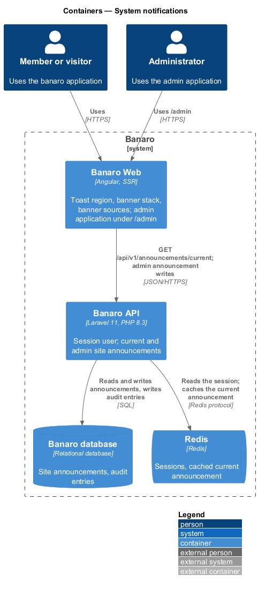
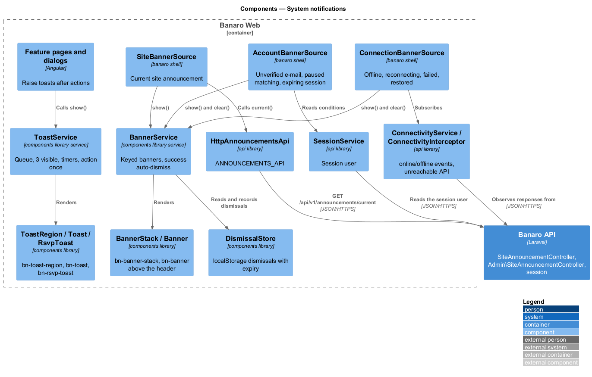
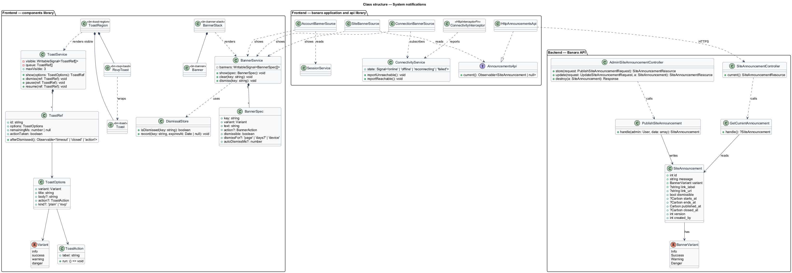
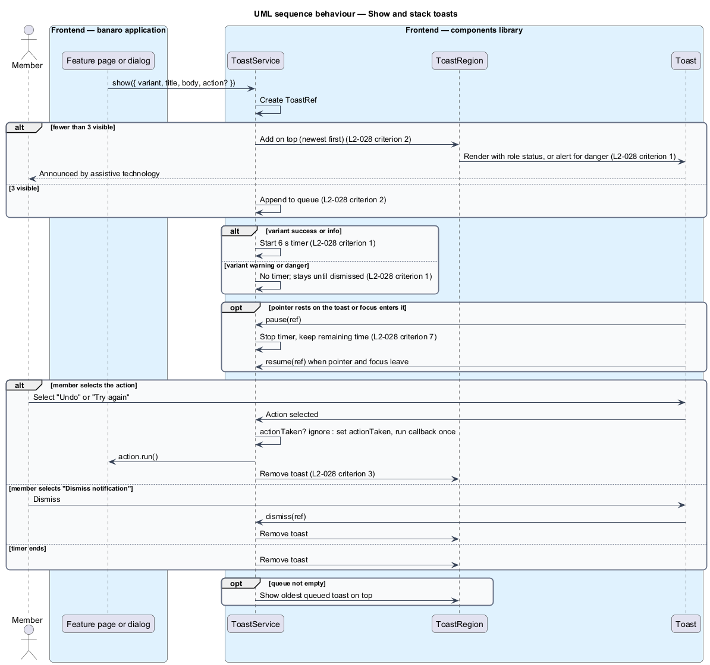
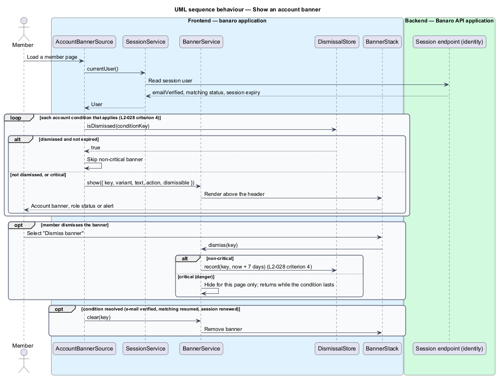
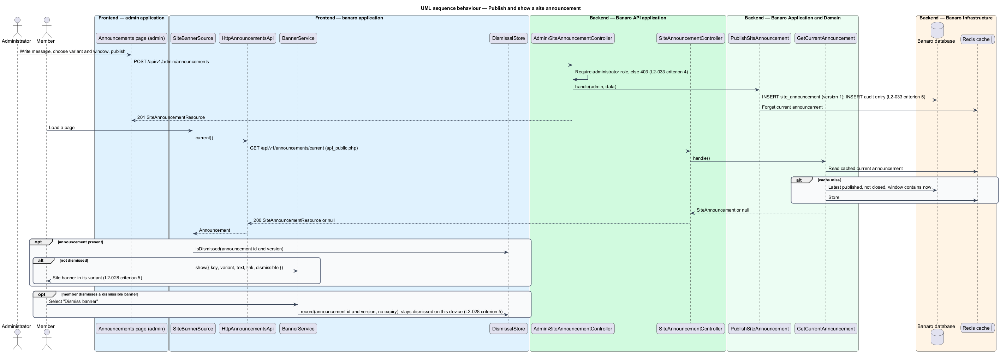
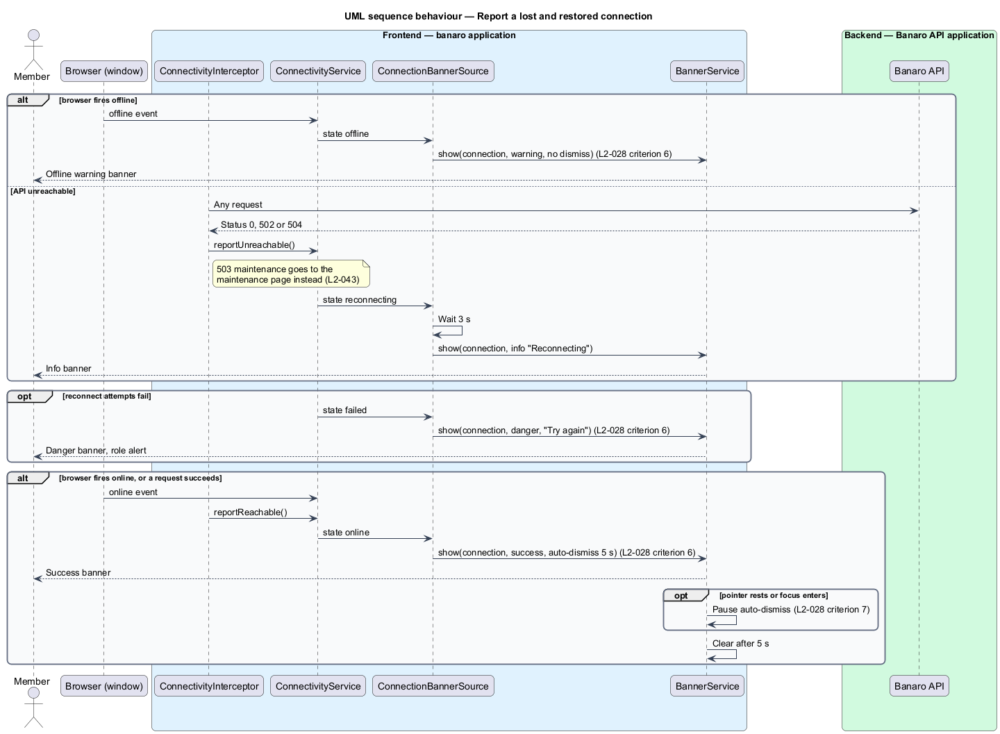

# System notifications

## Overview

Banaro tells people about the result of an action, a condition on their account, a site-wide notice
or a lost connection. Each of these needs one consistent presentation, so that people learn to read it
once. This feature defines that presentation for the whole `banaro` application: toasts, RSVP toasts,
account banners, site banners and connection banners. It belongs to the `notifications` subsystem.
It is led by the frontend: shared components and services in the `components` library do the work.
The Banaro API takes part only for site announcements, which administrators publish.

Terms used in this design:

- **toast** — short, transient message that appears after an action, in one of four variants: info,
  success, warning or danger
- **RSVP toast** — toast that reports an RSVP outcome for one event, such as going or waitlisted
- **toast action** — single button inside a toast, such as "Undo" or "Try again"
- **banner** — full-width message above the header that stays while its condition lasts
- **account banner** — banner about the signed-in member's account, such as an unverified e-mail,
  paused matching or an expiring session
- **critical banner** — banner in the danger variant
- **site banner** — banner that shows a site announcement to everyone
- **site announcement** — notice that an administrator publishes, with a variant, a message, an
  optional link and an optional time window
- **connection banner** — banner that reports a lost, recovering or restored connection
- **auto-dismiss** — removal of a toast or banner after a set time without user action

A feature that needs feedback calls `ToastService`, for example "Message sent to Daniel" after
say-hello. The service shows the toast in the toast region and removes it on time or on dismissal.
Banners come from three sources: the session for account banners, the API for site banners and the
browser for connection banners. All three feed `BannerService`, which renders them above the header.

## Description

### Frontend — `components` library

- **`Toast`** (`lib/toast/`, selector `bn-toast`) — renders one toast with the mock's BEM classes
  (`toast`, `toast--success`, `toast__title`, `toast__body`, `toast__action`, `toast__close`). Info,
  success and warning toasts carry `role="status"`; danger toasts carry `role="alert"` (`L2-028`
  criterion 1). The close button is labelled "Dismiss notification".
- **`RsvpToast`** (`lib/rsvp-toast/`, selector `bn-rsvp-toast`) — toast content for RSVP outcomes:
  the going message with "Add to calendar", the waitlist position, the few-spots-left warning and the
  danger message with "Try again". The `events/rsvp-to-event` feature raises it.
- **`ToastRegion`** (`lib/toast/`, selector `bn-toast-region`) — fixed region in the application
  shell that renders the visible toasts, newest on top.
- **`ToastService`** (`lib/toast/`, root-provided) — owns the toast queue:
  - `show(options)` returns a `ToastRef`. `options` holds `variant`, `title`, `body` and an optional
    `action` with a label and a callback. `kind: 'rsvp'` renders the content through `RsvpToast`.
  - At most three toasts are visible. Further toasts wait in a first-in, first-out queue and appear as
    visible ones close (`L2-028` criterion 2).
  - Success and info toasts dismiss after 6 seconds. Warning and danger toasts stay until dismissed
    (`L2-028` criterion 1).
  - The timer pauses while the pointer rests on the toast or focus is inside it, and resumes when both
    leave (`L2-028` criterion 7).
  - Selecting the action runs its callback once and closes the toast. A second activation is ignored
    (`L2-028` criterion 3).
- **`Banner`** (`lib/banner/`, selector `bn-banner`) — renders one banner with the mock's classes
  (`banner`, `banner--warning`, `banner__inner`, `banner__text`). Danger banners carry
  `role="alert"`, others `role="status"`. An optional action and an optional dismiss button labelled
  "Dismiss banner" follow the text.
- **`BannerStack`** (`lib/banner/`, selector `bn-banner-stack`) — renders the active banners above the
  header.
- **`BannerService`** (`lib/banner/`, root-provided) — keyed registry of active banners. `show(spec)`
  adds or replaces the banner with the same key, and `clear(key)` removes it. A success banner
  auto-dismisses; its timer pauses on hover and focus (`L2-028` criterion 7). The order of banners
  from different sources is `<TO SUPPLY>`.
- **`DismissalStore`** (`lib/banner/`) — records dismissals in `localStorage`, keyed by banner key,
  with an optional expiry. Every read and write sits in `try`/`catch`. Without storage, a dismissal
  lasts for the page's lifetime.
- **Perf-test scenarios** — `Toast`, `RsvpToast` and `Banner` each get a scenario in
  `frontend/projects/perf-test/src/scenarios/`. The three-toast stack in `ToastRegion` gets a composite
  scenario.

### Frontend — `banaro` application and `api` library

- **`AccountBannerSource`** (`banaro` application, `shell/`) — runs on member pages. It reads the
  session user from `SessionService` (`api` library, `lib/auth/`) and maps each account condition to a
  banner (`L2-028` criterion 4):
  - unverified e-mail — warning banner with "Resend e-mail"; the `identity/verify-email` feature owns
    the action
  - paused matching — banner with a link to `/matching`; the `matching/pause-and-resume-matching`
    feature owns the status; copy `<TO SUPPLY>`
  - expiring session — warning banner; the `identity/recover-expired-session` feature owns the expiry
  - The banner stays until the condition clears or the member dismisses it. A dismissed non-critical
    banner stays dismissed for 7 days through `DismissalStore`. A dismissed critical banner returns on
    the next page load while its condition lasts.
- **`SiteBannerSource`** (`banaro` application, `shell/`) — on application start, it reads the current
  announcement through `ANNOUNCEMENTS_API`. It shows the announcement in its variant unless
  `DismissalStore` holds a dismissal for that announcement id and version (`L2-028` criterion 5). A
  non-dismissible announcement renders without a dismiss button, as in the `persistent` mock state.
- **`ConnectivityService`** (`api` library, `lib/auth/`) — tracks reachability. The browser's `online`
  and `offline` events feed it, and so does `ConnectivityInterceptor`. The interceptor reports
  responses with status 0, 502 or 504 as unreachable. A 503 maintenance response goes to the
  `resilience/handle-offline-and-maintenance` feature instead (`L2-043`).
- **`ConnectionBannerSource`** (`banaro` application, `shell/`) — maps reachability to the connection
  banner (`L2-028` criterion 6):
  - offline — warning banner with no dismiss button
  - reconnecting — info banner, shown after 3 seconds without a connection, as the mock states
  - reconnect failed — danger banner with "Try again"
  - restored — success banner that auto-dismisses after 5 seconds, as the mock states
  - The source subscribes only in the browser, never during server-side rendering.
- **`AnnouncementsApi`** / **`ANNOUNCEMENTS_API`** / **`HttpAnnouncementsApi`** (`api` library) —
  `current()` sends `GET /api/v1/announcements/current` and returns a `SiteAnnouncement` or `null`.

### Backend — Banaro API

- **`SiteAnnouncementController`** (`Controllers/Api/V1/Notifications/`) — `current()` handles
  `GET /announcements/current`, calls `GetCurrentAnnouncement` and returns a
  `SiteAnnouncementResource`. The route is in `routes/api_public.php`, because the site banner
  shows to visitors as well as members. The response carries no personal data.
- **`GetCurrentAnnouncement`** (`Actions/Notifications/`) — returns the most recently published
  announcement whose window contains now, or `null`. It caches the result in Redis and clears the
  cache when an announcement changes.
- **`Admin\SiteAnnouncementController`** (`Controllers/Api/V1/Admin/`) — `store()`, `update()` and
  `destroy()` under `/api/v1/admin/announcements` in `routes/api.php`. Administrator middleware
  returns 403 to anyone else (`L2-033` criterion 4).
- **`PublishSiteAnnouncementRequest`** and **`UpdateSiteAnnouncementRequest`**
  (`Requests/Notifications/`) — validate `message` (length `<TO SUPPLY>`), `variant`, `link_label`,
  `link_url` (HTTPS), `dismissible`, `starts_at` and `ends_at`.
- **`PublishSiteAnnouncement`**, **`UpdateSiteAnnouncement`** and **`CloseSiteAnnouncement`**
  (`Actions/Notifications/`) — write the announcement, bump its `version`, clear the cache and write an
  audit-log entry through the audit service of `trust-and-safety/moderate-reports` (`L2-033`
  criterion 5).
- **`SiteAnnouncement`** (`Models/`) — `message`, `variant` (`BannerVariant`), `link_label`,
  `link_url`, `dismissible`, `starts_at`, `ends_at`, `published_at`, `closed_at`, `version` and
  `created_by`.
- **`BannerVariant`** (`Enums/`) — `Info`, `Success`, `Warning` and `Danger`.

### Open points

- Toast timing: `L2-028` criterion 1 sets 6 seconds for success and info toasts. The `toast` and
  `rsvp-toast` mocks state 8 seconds. The design follows the specification until resolved:
  `<TO SUPPLY>`.
- Warning toasts: `L2-028` criterion 1 keeps them until dismissed. The `toast/warning` and
  `rsvp-toast/warning` mocks auto-dismiss them after 12 seconds. Rule: `<TO SUPPLY>`.
- Toasts with an action: the `toast/with-action` mock keeps a success toast with "Undo" for 12 seconds;
  `L2-028` criterion 1 gives no separate time. Rule: `<TO SUPPLY>`.
- Site banner dismissal: `L2-028` criterion 5 keeps a dismissed site banner dismissed on that device.
  The `site-banner/info` and `site-banner/warning` mocks remember it "for the session". Rule:
  `<TO SUPPLY>`.
- Site banner window: the `site-banner/info` mock shows the notice "from 48 hours before". Default
  window and whether visitors see announcements (the mock says everyone; `L2-028` criterion 5 says
  members): `<TO SUPPLY>`.
- Account banner rule: the `account-banner/persistent` and `account-banner/danger` mocks state that
  matching pauses when the e-mail is not verified by a date. No requirement defines that rule:
  `<TO SUPPLY>`.
- Banner order and the maximum number of banners at once: `<TO SUPPLY>`.
- Admin screen for announcements: no mock exists for the `admin` application. Screen design:
  `<TO SUPPLY>`.

## Requirements

| L2 ID | Refines (L1) | Requirement |
|-------|--------------|-------------|
| `L2-028` | `L1-009`, `L1-013` | The app shall communicate transient and persistent messages consistently using toasts, RSVP toasts, account banners, site banners and connection banners. |

The design realizes all seven acceptance criteria of `L2-028`. The timing conflicts listed under Open
points affect criterion 1.

## Diagrams

### System context

People see toasts and banners in Banaro. An administrator publishes site announcements. No external
system takes part.

### Containers

Banaro Web renders every toast and banner. It reads the session and the current site announcement from
the Banaro API, which stores announcements in the Banaro database and caches the current one in Redis.

### Components

Inside Banaro Web, `ToastService` and `BannerService` in the `components` library render all messages.
Three banner sources in the `banaro` application feed `BannerService`.

### Class structure

`ToastService` owns a queue of `ToastRef` objects, and `BannerService` owns keyed `BannerSpec` entries.
`DismissalStore` records banner dismissals. On the backend, `SiteAnnouncement` holds the published
notices.

### Behaviour — show and stack toasts

A feature calls `ToastService`. The service shows at most three toasts, queues the rest, runs timers
by variant, pauses them on hover or focus and runs an action once.

### Behaviour — show an account banner

`AccountBannerSource` maps the session's account conditions to banners. It honours a 7-day dismissal
for non-critical banners.

### Behaviour — publish and show a site announcement

An administrator publishes an announcement through the admin API. Pages then load it from the public
endpoint, and a dismissal is remembered on the device.

### Behaviour — report a lost and restored connection

Browser events and failed API calls feed `ConnectivityService`. `ConnectionBannerSource` shows the
warning, info, danger and success banners in turn.

