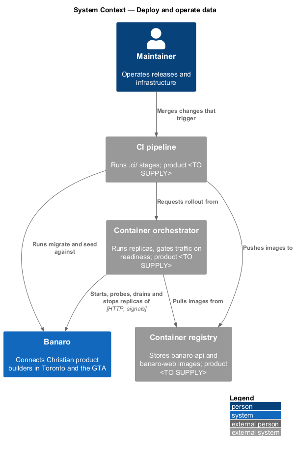
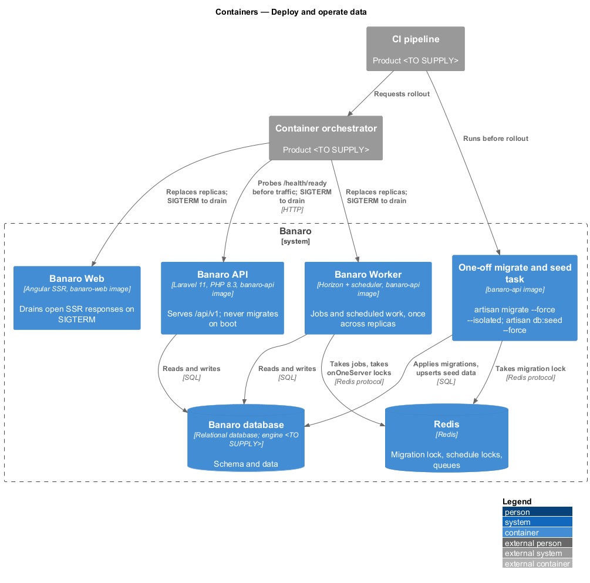
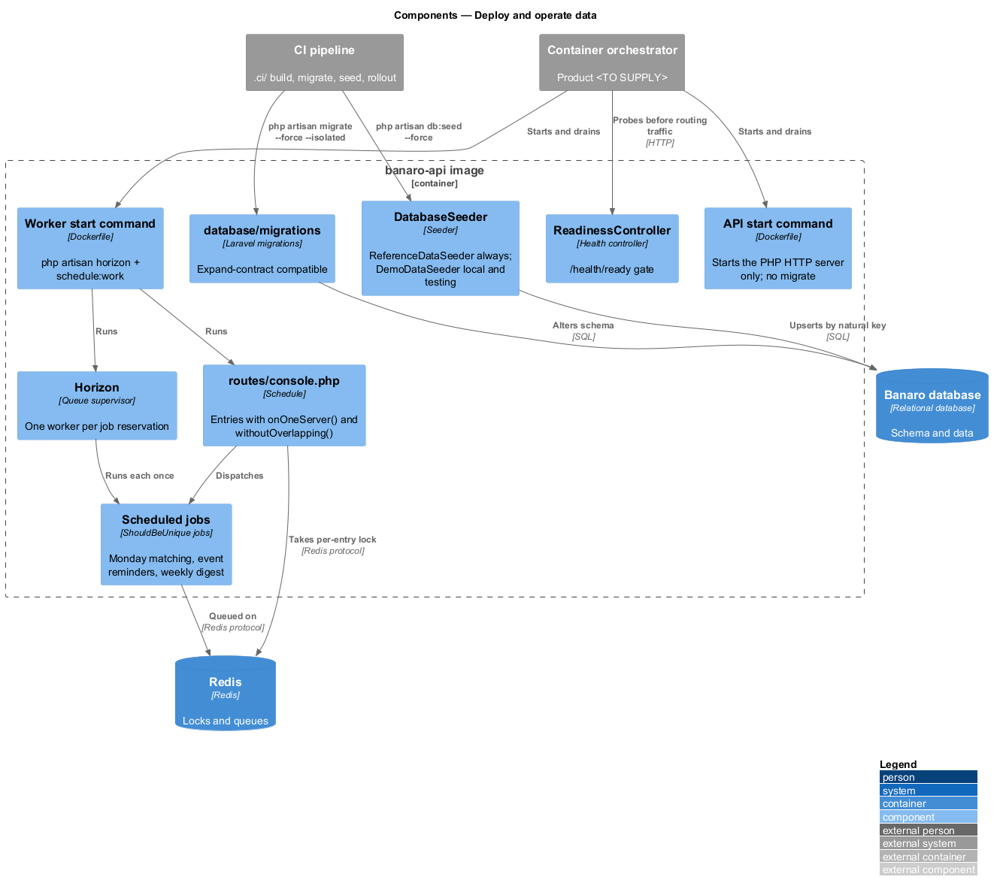
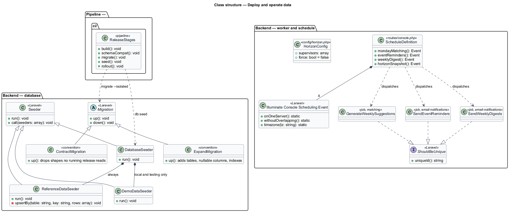
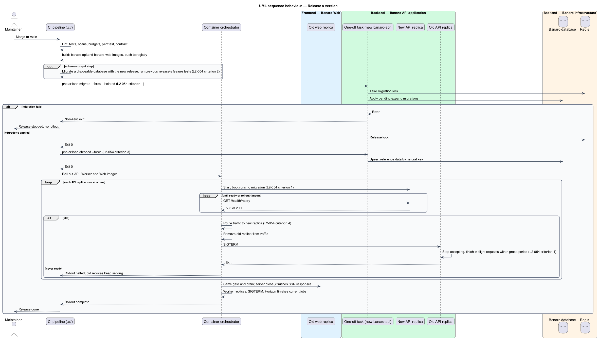
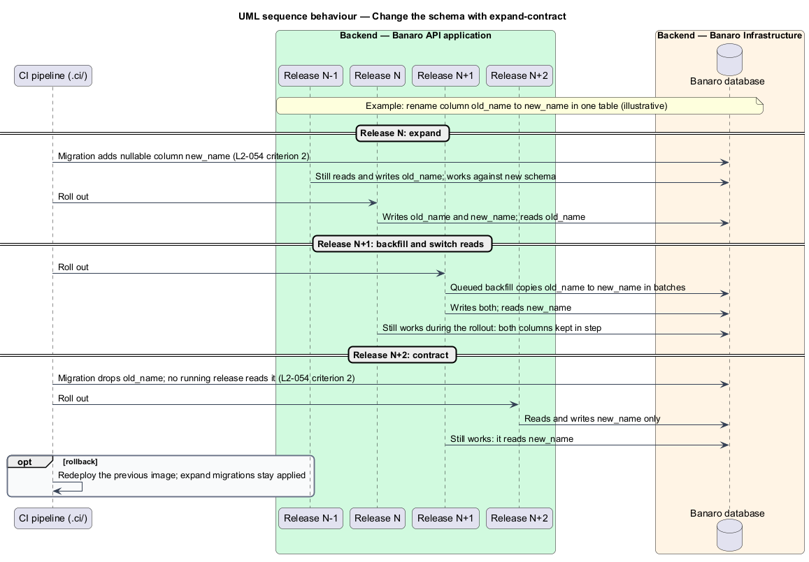
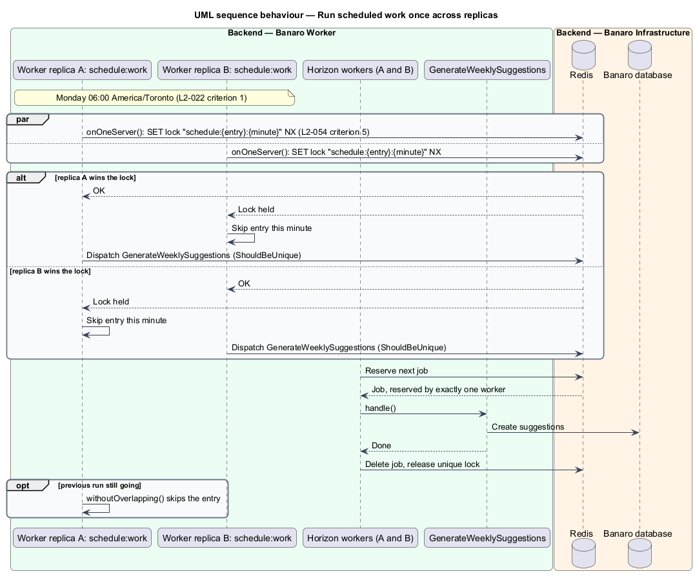

# Deploy and operate data

## Overview

Banaro ships often, and each release changes code and sometimes the database schema. A release has to
be repeatable, and members should not notice it: no failed requests while instances change, no
broken pages while old and new code run side by side, and no duplicate Monday matches because two
worker instances both ran the schedule. This feature defines how Banaro is released and how its data
is migrated and seeded. It belongs to the `operations` subsystem.

Terms used in this design:

- **pipeline** — automated build-and-release process defined in `.ci/`; product `<TO SUPPLY>`
- **orchestrator** — platform that starts, probes, routes traffic to and stops container instances;
  product `<TO SUPPLY>`
- **migration** — versioned schema change in `backend/database/migrations/`
- **migrate step** — explicit pipeline step that applies pending migrations before new code receives
  traffic
- **expand–contract** — way of changing a schema in two or more releases: first add the new shape
  alongside the old (expand), then remove the old shape once no running release uses it (contract)
- **seeder** — class that writes required data, such as reference vocabularies, to the database
- **idempotent seeding** — property that running the seeders twice leaves the same database state as
  running them once
- **readiness-gated rollout** — rollout in which a new instance receives traffic only after
  `/health/ready` returns 200
- **draining** — step in which an instance, already removed from traffic, finishes its in-flight
  requests or jobs before it stops
- **replica** — one running instance of a container
- **maintainer** — person who operates Banaro's releases and infrastructure

The API never migrates the database on boot. With several replicas starting at once, boot-time
migration would race and would tie schema changes to process restarts. The pipeline runs migrations
once, as their own step, before the rollout. Because every migration is expand–contract compatible,
the release still serving traffic during the rollout keeps working against the new schema.

## Description

The slice spans the `.ci/` pipeline, the `banaro-api` and `banaro-web` images, the Banaro database,
Redis and the orchestrator.

### Pipeline — `.ci/`

- **Release stages** — after lint, tests, scans, budgets, the perf test and the contract checks pass,
  the release runs these stages in order:
  1. `build` — builds the `banaro-api` and `banaro-web` images and pushes them to the container
     registry, tagged with the commit.
  2. `migrate` — runs a one-off container of the new `banaro-api` image with
     `php artisan migrate --force --isolated` (`L2-054` criterion 1). `--isolated` takes a Redis lock,
     so two pipelines cannot migrate at the same time. A failed migration stops the release before
     any rollout.
  3. `seed` — runs `php artisan db:seed --force` in the same way (`L2-054` criterion 3).
  4. `rollout` — asks the orchestrator to replace the Banaro API, Banaro Worker and Banaro Web
     replicas with the new images (`L2-054` criterion 4).
- **`schema-compat` step** — before `migrate` reaches production, the pipeline should migrate a
  disposable database with the new release and run the previous release's API feature tests against
  it. A failure shows that a migration is not expand–contract compatible (`L2-054` criterion 2).

### Backend — `banaro-api` image

- **`Dockerfile`** (`backend/`) — one image, two start commands. The API command starts the PHP HTTP
  server only. The worker command starts `php artisan horizon` and `php artisan schedule:work`. No
  entry point, service provider or boot hook calls `migrate` (`L2-054` criterion 1). The PHP server
  runtime and the worker's process supervisor are open points.
- **Migrations** (`database/migrations/`) — each follows expand–contract (`L2-054` criterion 2):
  - Expand release: add tables, add nullable or defaulted columns, add indexes. Code writes the old
    and the new shape.
  - Backfill: a queued job or an artisan command copies existing rows into the new shape in batches.
  - Contract release: once no running release reads the old shape, a later release drops it.
  - Renames and type changes become add-copy-drop sequences across releases. A migration never drops
    or renames a column that the previous release reads.
  - Rollback is by redeploying the previous image. Expand migrations stay applied, because the
    previous release works with them.
- **`DatabaseSeeder`** (`database/seeders/`) — calls `ReferenceDataSeeder` in every environment. It
  calls `DemoDataSeeder` only when the environment is `local` or `testing`.
- **`ReferenceDataSeeder`** — writes closed vocabularies with `upsert()` keyed by a natural key, such
  as a slug. A unique index backs each key. It never truncates and never uses plain inserts, so a
  second run changes nothing and raises no error (`L2-054` criterion 3). Which vocabularies live in
  tables rather than in `Enums/` is open.
- **`DemoDataSeeder`** — writes the cast from `docs/mocks/README.md` with `updateOrCreate()` keyed by
  e-mail address or slug, so it is idempotent too.

### Rollout and draining

- **Readiness gate** — the orchestrator probes `/health/ready` (`observe-health`, `L2-053`) on each new
  API replica. It routes traffic to the replica only after a 200, and replaces old replicas one at a
  time (`L2-054` criterion 4). A new replica that never becomes ready stops the rollout, and the old
  replicas keep serving.
- **Liveness** — the orchestrator probes `/health/live` and restarts a replica that stops answering.
- **Draining the API** — the orchestrator removes an old replica from traffic, then sends `SIGTERM`.
  The PHP server stops accepting connections and finishes in-flight requests within the grace period
  before it exits (`L2-054` criterion 4).
- **Draining Banaro Web** — `server.ts` handles `SIGTERM` by calling `server.close()`, which finishes
  open SSR responses before exit.
- **Draining the worker** — Horizon handles `SIGTERM` by finishing each job in progress and taking no
  new jobs. `schedule:work` stops before the next minute starts.

### Banaro Worker — exactly once across replicas

- **Queued jobs** — every worker replica runs Horizon against the same Redis queues. Redis hands each
  job to one worker at a time, so a job runs once per dispatch. Jobs that shall not run twice for one
  trigger implement `ShouldBeUnique` (`L2-029` criterion 1).
- **Scheduled work** (`routes/console.php`) — every replica runs the scheduler, and each entry uses
  `->onOneServer()` and `->withoutOverlapping()` (`L2-054` criterion 5). `onOneServer()` takes an
  atomic lock in the Redis cache store for the entry and minute, so one replica runs it and the others
  skip it. The entries, with `->timezone('America/Toronto')`:
  - Monday matching — weekly on Monday at 06:00 (`L2-022` criterion 1); job
    `GenerateWeeklySuggestions`, owned by the `generate-weekly-suggestions` feature.
  - Event reminders — schedule `<TO SUPPLY>`; reminder sent 24 hours before each event (`L2-029`
    criterion 1); job `SendEventReminders`, owned by the `email-notifications` feature.
  - Weekly digest — day and time `<TO SUPPLY>`; at most one per member per week (`L2-029`
    criterion 5); job `SendWeeklyDigests`, owned by the `email-notifications` feature.
  - `horizon:snapshot` — every five minutes, for Horizon metrics.
  The owning features may rename these jobs; this design fixes only the schedule rules.
- **Horizon configuration** (`config/horizon.php`) — one supervisor set per environment, with `force`
  set to `false` so the worker pauses during maintenance mode (`handle-offline-and-maintenance`).

### Open points

- Pipeline product and container registry: `<TO SUPPLY>`.
- Orchestrator product, replica counts, rollout surge and unavailability settings, and the drain grace
  period: `<TO SUPPLY>`.
- PHP HTTP server runtime in the `banaro-api` image (for example PHP-FPM behind a web server):
  `<TO SUPPLY>`.
- Whether the worker runs Horizon and the scheduler in one container under a process supervisor, or
  as two deployments of the same image: `<TO SUPPLY>`.
- Database engine (also open in the architecture baseline) and its backup and restore policy:
  `<TO SUPPLY>`.
- Which reference vocabularies are seeded into tables: `<TO SUPPLY>`.
- Whether the `schema-compat` step is adopted, given its pipeline time: `<TO SUPPLY>`.
- Schedules for event reminders and the weekly digest: `<TO SUPPLY>`; the `email-notifications`
  feature owns them.

## Requirements

| L2 ID | Refines (L1) | Requirement |
|-------|--------------|-------------|
| `L2-054` | `L1-018` | Releases shall be repeatable and safe. |

The design realizes all five acceptance criteria of `L2-054`. The platform-specific settings for
criterion 4 depend on the orchestrator, which is open.

## Diagrams

### System context

A maintainer merges a change, and the pipeline builds, migrates, seeds and rolls out Banaro. The
orchestrator runs the replicas and gates traffic on readiness.

### Containers

The pipeline migrates and seeds the Banaro database through a one-off API container, then asks the
orchestrator to roll out the API, the worker and the web replicas. Worker replicas share Redis for
queues and schedule locks.

### Components

Inside the `banaro-api` image, the API start command never migrates. The migrations and seeders run
only from the pipeline. The worker runs Horizon and a scheduler whose entries lock through Redis.

### Class structure

`DatabaseSeeder` composes the reference and demo seeders. Each scheduled entry dispatches a unique
job and carries the `onOneServer()` lock.

### Behaviour — release a version

The pipeline builds the images, migrates with an isolation lock, seeds, and rolls out. Each new
replica receives traffic only after `/health/ready` returns 200. Each old replica drains before it
stops.

### Behaviour — change the schema with expand–contract

A column rename spans three releases: expand, backfill and switch reads, then contract. At every step
the release still serving traffic works against the current schema.

### Behaviour — run scheduled work once across replicas

Two worker replicas reach Monday 06:00 together. One wins the Redis lock and dispatches the matching
job; the other skips. Horizon hands the job to one worker.

