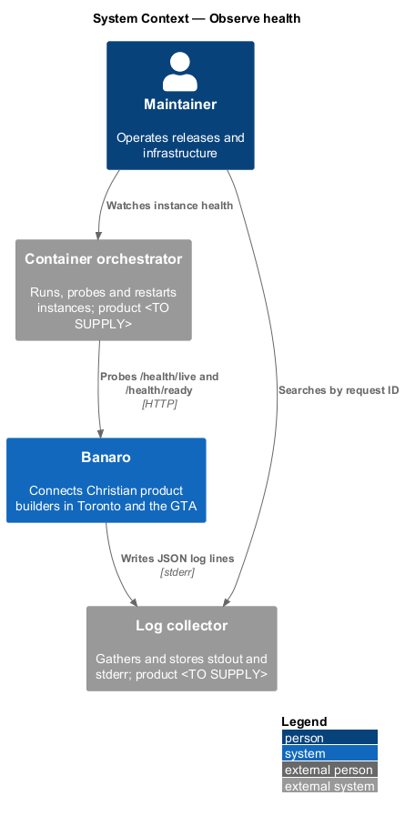
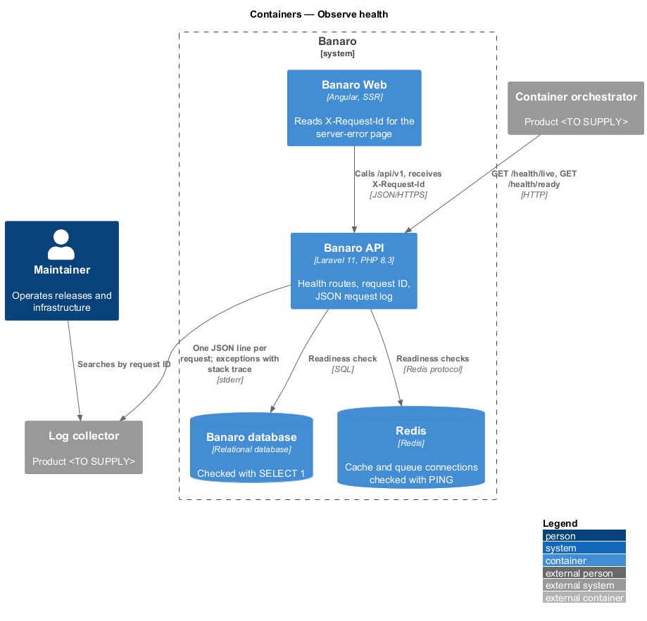
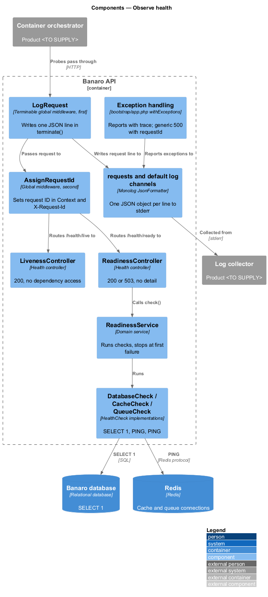
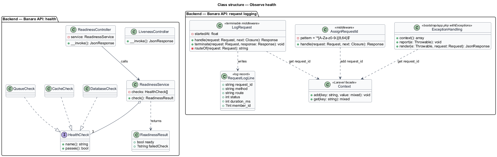
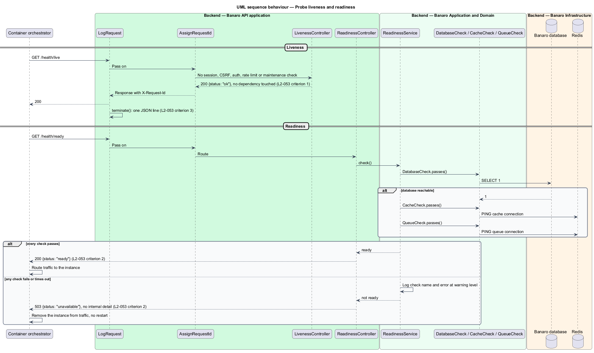
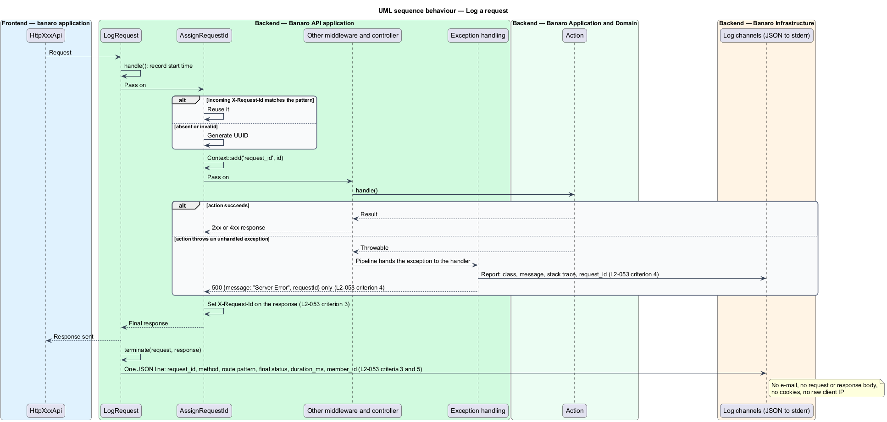

# Observe health

## Overview

Banaro runs as several container instances. The platform that runs them has to know whether each
instance is alive and whether it can serve traffic. The people who operate Banaro have to trace any
request, and any failure, from what a member saw to what the server did. This feature provides health
endpoints and structured request logs for the Banaro API. It belongs to the `operations` subsystem.

Terms used in this design:

- **liveness** — fact that the API process is running and can answer HTTP; a failed liveness probe
  leads the orchestrator to restart the instance
- **readiness** — fact that the instance can reach the database, the cache and the queue; a failed
  readiness probe removes the instance from traffic without restarting it
- **orchestrator** — platform that starts, probes, routes traffic to and stops container instances;
  product `<TO SUPPLY>`
- **request ID** — identifier assigned to one HTTP request, returned in the `X-Request-Id` header and
  written to every log line for that request
- **request log line** — single JSON object written when a request completes, with the request ID,
  route, status, duration and member ID
- **exception handler** — Laravel component that turns an unhandled exception into an HTTP response
- **maintainer** — person who operates Banaro's releases and infrastructure

`/health/live` answers from the process alone, so a slow database never causes a restart loop.
`/health/ready` checks the three dependencies and answers 503 when any of them is unreachable. Each
request produces one JSON log line. That line is written after the response is final, outside the
exception handling, so a request that ended in a handled exception logs the status the client
actually received.

## Description

The slice lives in the Banaro API. The orchestrator and the log collector sit outside Banaro.

### Backend — health routes

- **Health routes** — `GET /health/live` and `GET /health/ready` are registered in
  `bootstrap/app.php` through the `withRouting(then: …)` callback. They sit outside `/api/v1` and
  outside the `api` middleware group: no session, no CSRF, no authentication and no rate limit. They
  are exempt from maintenance mode (`L2-043` criterion 3).
- **`LivenessController`** (`Http/Controllers/Health/`) — invokable controller that returns 200 with
  `{ "status": "ok" }`. It touches no database, cache or queue (`L2-053` criterion 1).
- **`ReadinessController`** (`Http/Controllers/Health/`) — invokable controller that calls
  `ReadinessService::check()`. It returns 200 with `{ "status": "ready" }` when every check passes. It
  returns 503 with `{ "status": "unavailable" }` otherwise. The body never names the failed dependency
  or the error (`L2-053` criterion 2).
- **`ReadinessService`** (`Services/Operations/`) — runs the checks in sequence, each with a short
  timeout, and stops at the first failure. It logs a failed check, with its name and error, at
  `warning` level; the log carries the detail that the body omits.
- **`HealthCheck`** (`Contracts/`) — interface with `name(): string` and `passes(): bool`. Three
  implementations live in `Services/Operations/`:
  - `DatabaseCheck` — runs `SELECT 1` on the default connection.
  - `CacheCheck` — sends `PING` to the Redis cache connection.
  - `QueueCheck` — sends `PING` to the Redis queue connection that Horizon uses.

### Backend — request ID and request log

- **Global middleware order** (`bootstrap/app.php`) — `LogRequest` is prepended first, then
  `AssignRequestId`, then the remaining global middleware such as `RespondDuringMaintenance`. Laravel
  renders an exception into a response inside the pipeline, before that response passes back out
  through the outer middleware. `LogRequest` therefore sees the final response, never the exception.
- **`AssignRequestId`** (`Http/Middleware/`) — takes the incoming `X-Request-Id` when it matches
  `^[A-Za-z0-9-]{8,64}$`, so the Banaro Web SSR server can pass its ID on. Otherwise it generates a
  UUID. It stores the ID with `Context::add('request_id', …)`. Laravel then adds it to every log
  entry of the request and carries it into queued jobs. It sets the same `X-Request-Id` on the
  response (`L2-053` criterion 3).
- **`LogRequest`** (`Http/Middleware/`) — terminable middleware. `handle()` records a monotonic start
  time. `terminate()` runs after the response is sent and writes one line through the `requests` log
  channel (`L2-053` criteria 3 and 5). The line holds:
  - `request_id`
  - `method`
  - `route` — the route name, or the URI pattern such as `/api/v1/events/{event}/rsvp`, never the raw
    path or query string
  - `status` — the final response status, including statuses produced by the exception handler
  - `duration_ms`
  - `member_id` — the authenticated user's ID, or `null`
  It never logs an e-mail address, a request body, a response body, cookies or the raw client IP.
- **Log channels** (`config/logging.php`) — the `requests` and default channels write to `stderr`
  through Monolog's `JsonFormatter`, one JSON object per line. The orchestrator collects `stderr`.
- **Exception handling** (`bootstrap/app.php`, `withExceptions`) — `context()` adds the request ID to
  each report. `report()` writes the exception class, message and stack trace at `error` level. For an
  exception that is not an HTTP exception, `render()` returns 500 with
  `{ "message": "Server Error", "requestId": "…" }` and nothing else (`L2-053` criterion 4).
  `APP_DEBUG` is `false` outside local development, so no trace reaches a response.

### Open points

- Orchestrator product, probe intervals, timeouts and failure thresholds: `<TO SUPPLY>`.
- Per-check timeout inside `ReadinessService`: `<TO SUPPLY>`.
- Log collector or aggregation service, log retention period and alert rules: `<TO SUPPLY>`.
- Whether the Banaro Web SSR server writes its own structured log and generates request IDs:
  `<TO SUPPLY>`.
- Whether `/health/live` is reachable from the public internet. The `handle-offline-and-maintenance`
  feature probes it from the browser; its body carries no detail. Exposure decision: `<TO SUPPLY>`.

## Requirements

| L2 ID | Refines (L1) | Requirement |
|-------|--------------|-------------|
| `L2-053` | `L1-018` | The system shall expose health endpoints and structured logs. |

The design realizes all five acceptance criteria of `L2-053`. The Description cites each criterion
where a component enforces it.

## Diagrams

### System context

The orchestrator probes Banaro's health endpoints and collects its logs. A maintainer reads the logs
to trace a request by its ID.

### Containers

The orchestrator probes the Banaro API. The readiness check reaches the Banaro database and Redis.
The API writes JSON log lines to `stderr`, which the log collector gathers.

### Components

Inside the Banaro API, `LogRequest` wraps every request, then `AssignRequestId`. The health
controllers sit outside `/api/v1`. `ReadinessController` runs the three `HealthCheck` implementations
through `ReadinessService`.

### Class structure

`ReadinessService` aggregates `HealthCheck` implementations. `LogRequest` and the exception handling
both read the request ID that `AssignRequestId` stores in the log context.

### Behaviour — probe liveness and readiness

The liveness probe returns 200 without touching a dependency. The readiness probe checks the database,
the cache and the queue, and returns 503 with no detail when any check fails.

### Behaviour — log a request

`AssignRequestId` sets the request ID. When the action throws, the exception handler renders a generic
500 with the request ID. `LogRequest` then writes one line with the final status.

