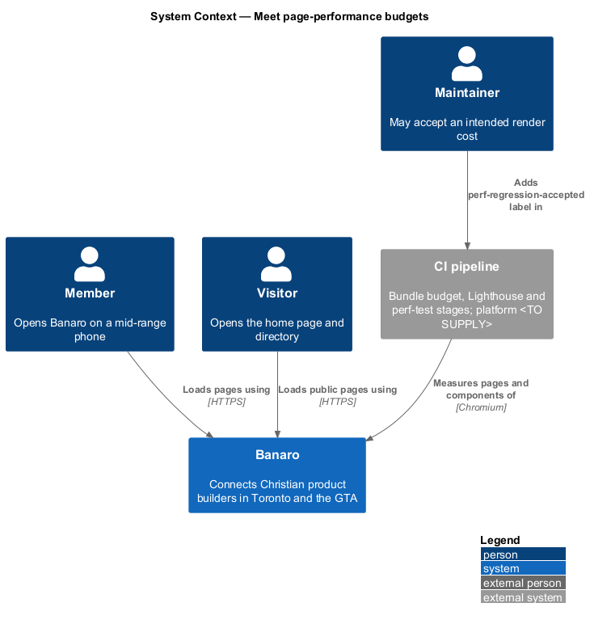
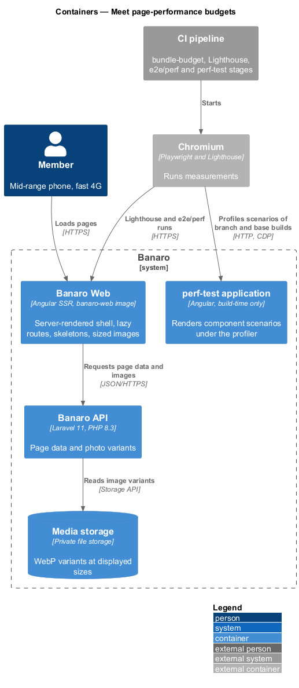
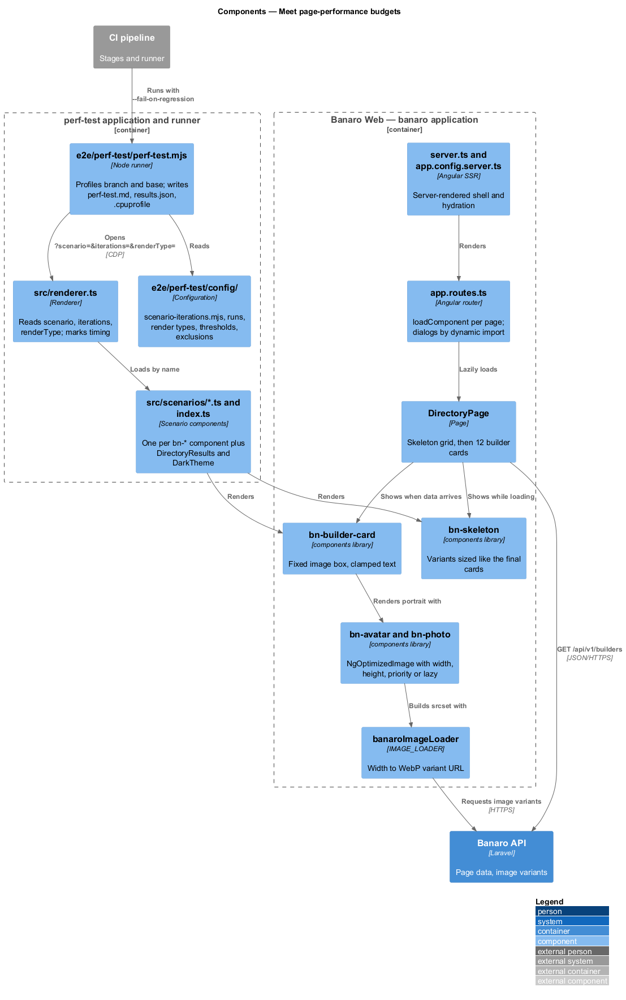
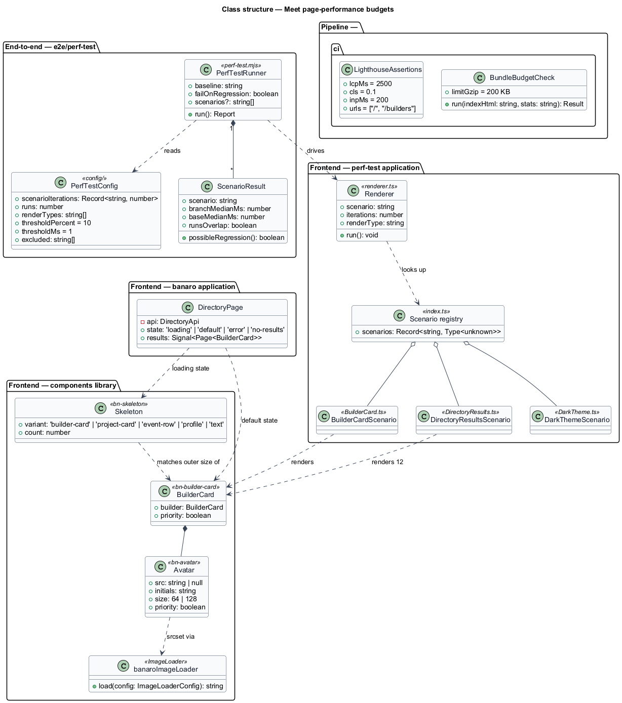
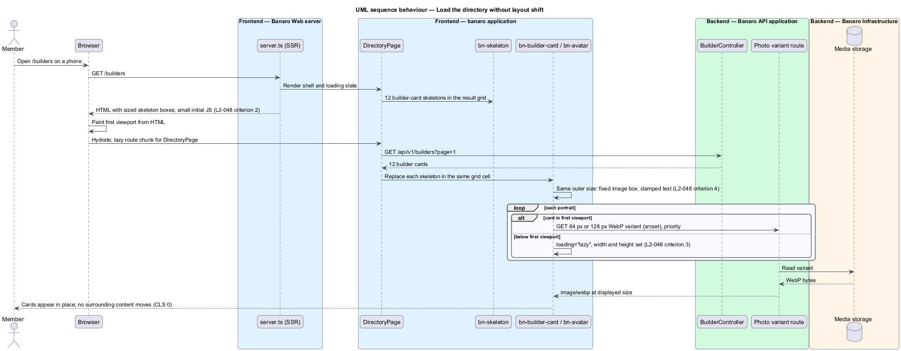
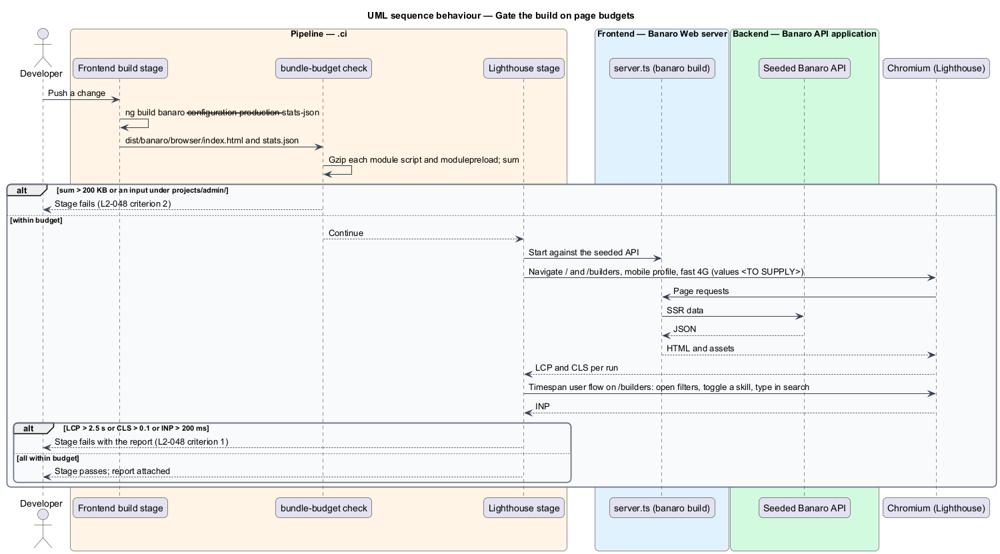
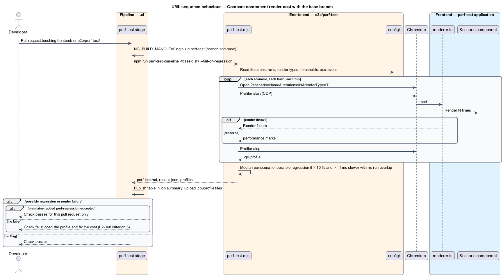

# Meet page-performance budgets

## Overview

Banaro members often open the site on a phone between meetings. A page that loads slowly or jumps
while it loads loses them. This feature is the mechanism that keeps pages fast on a mid-range mobile
device and stable while they load, and that stops a change that makes them worse. It belongs to the
`performance` subsystem. It has no screen of its own; it governs how the `banaro` application is built,
how images and loading states render, and which checks the pipeline runs.

Terms used in this design:

- **Largest Contentful Paint (LCP)** — time until the largest text block or image in the first viewport is painted
- **Cumulative Layout Shift (CLS)** — score of how far visible content moves unexpectedly while the page is open
- **Interaction to Next Paint (INP)** — delay between a user interaction and the next frame the browser paints
- **initial bundle** — JavaScript that the browser downloads before the first route renders, as opposed to lazily loaded route chunks
- **skeleton** — placeholder block shown in the place and size of content that has not arrived
- **component perf test** — measurement that renders one `bn-*` component a configured number of times in Chromium under the V8 CPU profiler and compares the result with the base branch
- **scenario** — standalone Angular component in `frontend/projects/perf-test/src/scenarios/` that renders one realistic instance of a component or composition
- **possible regression** — scenario whose median render time is more than 10 % and at least 1 ms slower than the base branch, with no overlap between the two branches' runs

The budgets come from `L2-048`:

| Measure | Budget | Where measured |
|---------|--------|----------------|
| LCP | ≤ 2.5 s | Home page and directory, simulated mid-range mobile, fast 4G |
| CLS | ≤ 0.1 | Same |
| INP | ≤ 200 ms | Same |
| Initial JavaScript of the public bundle | ≤ 200 KB gzip, no admin code | `banaro` production build |
| Skeleton replacement | CLS 0 | Every loading state |
| Component render cost | No possible regression | Every scenario against the base branch |

## Description

The representative flow is a member opening the directory on a phone: the server renders the shell,
skeleton cards hold the layout, and the results replace them without movement.

### Frontend — build and bundle

- **Separate applications** — the `admin` application is its own project in `angular.json`. The
  `banaro` application never imports from `projects/admin`, so administrator code cannot enter the
  public bundle (`L2-048` criterion 2).
- **Lazy routes** — every page in `app.routes.ts` uses `loadComponent`. Every dialog is imported
  with a dynamic `import()` when it opens. The initial bundle holds the shell, the router, the `api`
  library's auth and i18n parts, and the components the shell uses.
- **Server-side rendering and hydration** — `provideClientHydration()` lets the browser reuse the
  server's HTML instead of re-rendering it. The first viewport is therefore painted from HTML, which
  supports the LCP budget.
- **`angular.json` budgets** — the `banaro` production configuration declares an `initial` budget
  and an `anyComponentStyle` budget. Angular measures raw bytes, so the raw values are `<TO SUPPLY>`
  and act as an early warning only. The scaffold's current values (500 kB warning, 1 MB error) are
  replaced.
- **`.ci/` bundle-budget check** — reads the production `index.html` of the `banaro` build, collects
  every `<script type="module">` and `<link rel="modulepreload">` file, compresses each with gzip and
  sums the sizes. The stage fails above 200 KB (`L2-048` criterion 2). It also reads the build's
  `stats.json` and fails if any input path lies under `projects/admin/`.

### Frontend — images

- **`bn-avatar`** and **`bn-photo`** (`components` library) — render images through Angular's
  `NgOptimizedImage` (`ngSrc`). Each declares `width` and `height`, so the browser reserves space
  before the image arrives (`L2-048` criterion 3).
- **Lazy loading** — `NgOptimizedImage` loads images lazily by default. Only the image that can be
  the LCP element in the first viewport sets `priority`, which loads it eagerly with high fetch
  priority (`L2-048` criterion 3).
- **`banaroImageLoader`** (`components` library, bound with `IMAGE_LOADER` in each `app.config.ts`) —
  maps the requested width to a stored variant URL. `NgOptimizedImage` then emits a `srcset`, so the
  browser downloads the variant closest to the displayed size.
- **Variants** — when a photo is accepted, the `change-profile-photo` slice's job writes WebP
  variants at the displayed sizes from the mocks: 64 px and 128 px for portraits and 480 px for the
  profile page. AVIF variants are `<TO SUPPLY>`.
- **Fonts** — Manrope is self-hosted as WOFF2 with `font-display: swap` and a metric-matched
  fallback (`size-adjust`), so the swap does not shift text.

### Frontend — skeletons and layout stability

- **`bn-skeleton`** (`components` library) — renders placeholder blocks whose sizes come from the
  same tokens and layout rules as the final component. Each card component pairs with a skeleton
  variant of identical outer size: `bn-builder-card` with `bn-skeleton variant="builder-card"`, and so
  on.
- **Same slot, same size** — a page renders its skeletons inside the same grid container that later
  holds the results. The directory shows 12 skeleton cards, one per page item (`L2-009` criterion 7).
  Cards fix their image box with `aspect-ratio`, clamp text to a set number of lines and keep empty
  rows out of the flow by rule, not by measurement (`L2-010` criterion 7). The replacement therefore
  changes no box size (`L2-048` criterion 4).
- **Reserved regions** — toasts and banners render in overlay layers or in reserved header space, so
  their arrival does not push page content.

### Pipeline — Lighthouse

- **`.ci/` Lighthouse stage** — builds the `banaro` application, serves it through `server.ts`
  against a seeded API, and runs Lighthouse in Chromium on `/` and `/builders` (`L2-048`
  criterion 1).
- **Device profile** — Lighthouse's mobile form factor with CPU slowdown and network throttling set
  to the "mid-range mobile, fast 4G" profile. The throttling values are `<TO SUPPLY>`, because
  Lighthouse's default mobile profile is slow 4G.
- **Assertions** — `largest-contentful-paint` ≤ 2,500 ms and `cumulative-layout-shift` ≤ 0.1. A
  navigation run cannot measure INP, so the stage also runs a Lighthouse user flow in timespan mode.
  The flow opens the filters and toggles a skill on `/builders` and types in the search box. It asserts
  INP ≤ 200 ms.
- **Runs** — the number of runs per URL and the aggregate (median) are `<TO SUPPLY>`.

### End-to-end — `e2e/perf/`

Page-level checks in Playwright, Chromium only, that use page objects for every selector:

- **`layout-shift.spec.ts`** — for each loading state in `routes.manifest.ts`, holds the API
  response, records `layout-shift` entries with a `PerformanceObserver`, releases the response and
  asserts that the sum of shifts during the replacement is 0 (`L2-048` criterion 4).
- **`images.spec.ts`** — on the home page and directory, asserts that each image has `width` and
  `height`, that images below the first viewport carry `loading="lazy"`, and that image responses are
  `image/webp` or `image/avif` (`L2-048` criterion 3).

Each spec carries the acceptance-test header naming `L2-048`.

### Component perf tests — `frontend/projects/perf-test` and `e2e/perf-test`

The component perf test follows Fluent UI's `apps/perf-test` and its Saturdaze port, as `AGENTS.md`
describes (`L2-048` criterion 5).

- **`src/scenarios/<Name>.ts`** — one scenario per `bn-*` component in the `components` library,
  exported from `src/scenarios/index.ts`. Its default export renders one realistic instance with the
  cast and copy from `docs/mocks/README.md`, such as Daniel Reyes's builder card.
- **Composite scenarios** — render-heavy compositions get their own scenario, such as
  `DirectoryResults` (12 builder cards in the result grid) and `DarkTheme` (the same composition
  inside a `data-theme="dark"` wrapper).
- **`src/renderer.ts`** — reads `?scenario=`, `?iterations=` and `?renderType=` from the URL. It
  renders the scenario the requested number of times and marks the start and end with
  `performance.mark()`.
- **`e2e/perf-test/perf-test.mjs`** — serves the branch build and the base-branch build, opens each
  scenario in Chromium through Playwright, and records a V8 CPU profile through the DevTools
  protocol. It repeats each scenario for the configured number of runs. It writes
  `logfiles/perf-test.md`, `logfiles/results.json` and one `.cpuprofile` per scenario.
- **`e2e/perf-test/config/`** — `scenario-iterations.mjs` tunes each scenario to render in roughly
  100–300 ms. The folder also holds the run count, render types, the regression thresholds (10 % and
  1 ms) and the excluded-scenario list. Iterations are never lowered and thresholds never loosened
  to clear a flag.
- **`.ci/` perf-test stage** — on every pull request that touches `frontend/` or `e2e/perf-test/`,
  builds both branches with `NG_BUILD_MANGLE=0`, runs the runner with `--fail-on-regression`,
  publishes the comparison table in the job summary and uploads the profiles. A possible regression
  or a scenario that fails to render fails the check. Only a maintainer's
  `perf-regression-accepted` label lets an intended cost through; agents never add it.

### Open points

- Lighthouse throttling values for "mid-range mobile, fast 4G", and the number of runs: `<TO SUPPLY>`.
- Raw-byte values for the `angular.json` `initial` budget: `<TO SUPPLY>`.
- Whether AVIF variants are produced besides WebP: `<TO SUPPLY>`.
- Render types used by the component perf test beyond a first mount: `<TO SUPPLY>`.
- **SSR render mode.** The scaffold's `app.routes.server.ts` prerenders every route. The
  `switch-theme` feature needs per-request rendering to carry the stored theme. The effect of
  per-request rendering on LCP, and any HTML caching for anonymous pages, is `<TO SUPPLY>`.

## Requirements

| L2 ID | Refines (L1) | Requirement |
|-------|--------------|-------------|
| `L2-048` | `L1-015`, `L1-016` | Pages shall load quickly on mid-range mobile devices and not shift while loading. |

The design realizes all five acceptance criteria of `L2-048`. The Description cites each criterion
where a component, check or pipeline stage enforces it.

## Diagrams

### System context

Members load Banaro pages on mobile devices. The CI pipeline measures those pages with Lighthouse and
the components with the perf-test runner, both in Chromium.

### Containers

Banaro Web serves server-rendered HTML, small initial JavaScript and sized image variants from media
storage through the API. The pipeline's Chromium runs measure Banaro Web and the perf-test build.

### Components

Inside Banaro Web, pages use lazy routes, `bn-skeleton` and `NgOptimizedImage`-based image
components. The perf-test application renders the same components under the profiler.

### Class structure

Card components pair with skeleton variants of the same size. The perf-test renderer loads scenarios
from the index, and the runner compares results with the base branch through its configuration.

### Behaviour — load the directory without layout shift

The server renders the shell and 12 skeleton cards. The results replace the skeletons in the same
boxes, and only first-viewport images load eagerly.

### Behaviour — gate the build on page budgets

The pipeline checks the gzip size of the initial bundle and the absence of admin code, then runs
Lighthouse on the home page and the directory.

### Behaviour — compare component render cost with the base branch

The runner profiles each scenario on both builds and flags a possible regression with the overlap
rule. A flag fails the check unless a maintainer accepts it.

