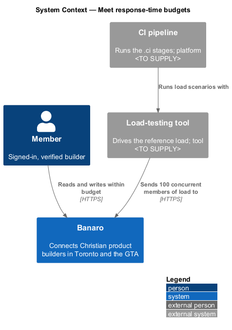
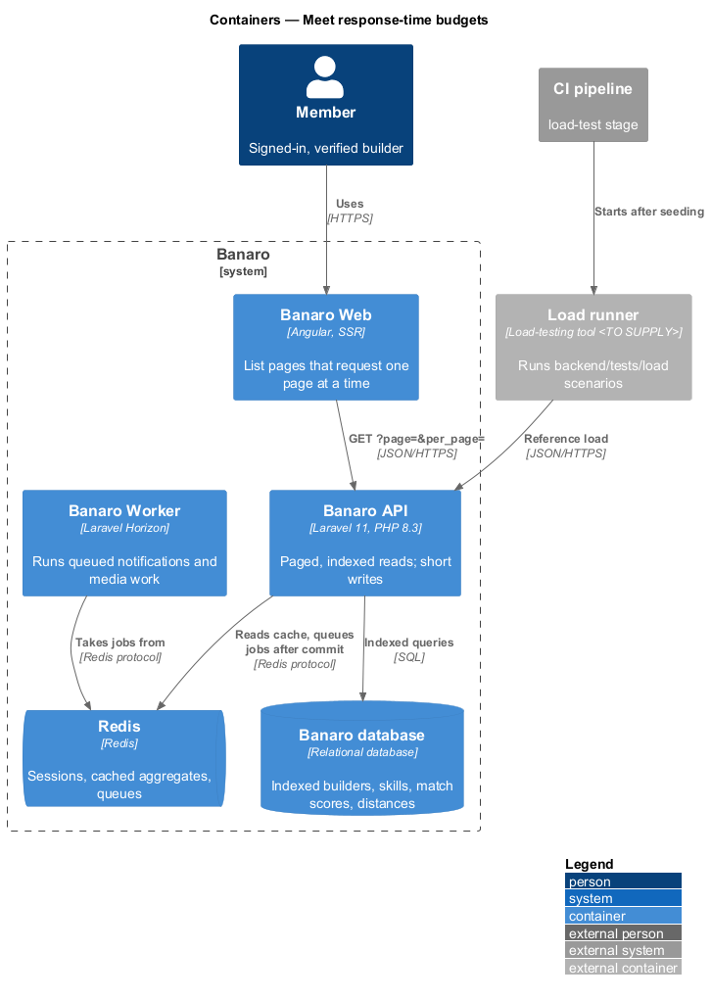
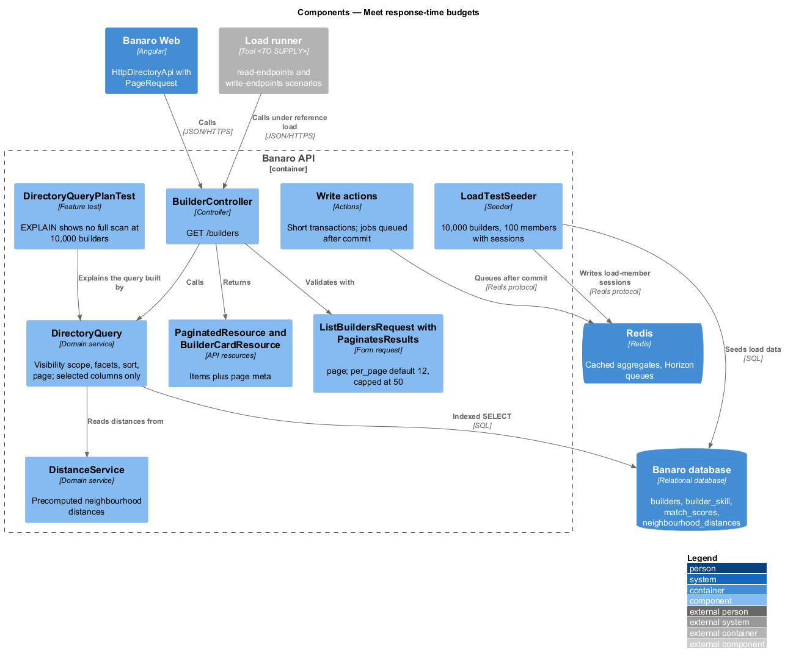
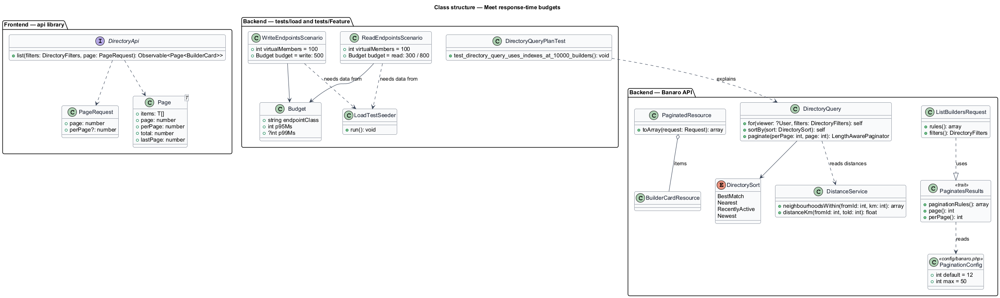
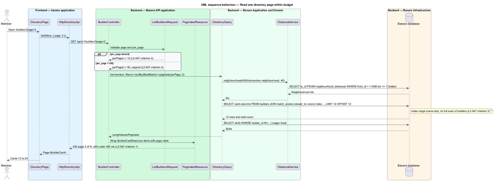
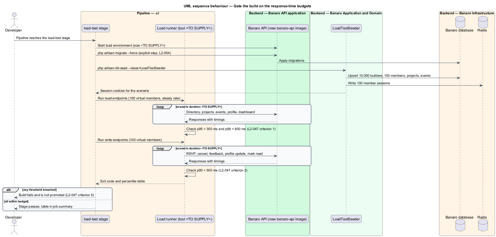

# Meet response-time budgets

## Overview

Banaro pages wait on the Banaro API for their data. A slow API makes every page slow, however well
the frontend is built. This feature is the mechanism that keeps API response times within fixed budgets
under a documented reference load, and that stops a release that breaks them. It belongs to the
`performance` subsystem. It has no screen of its own; it shapes how every list and read endpoint queries
and pages its data, and it adds a load-test gate to the pipeline.

Terms used in this design:

- **response-time budget** — upper limit on a percentile of server response time for a class of endpoints
- **reference load** — 100 concurrent members sending requests at a steady rate, the load under which the budgets apply
- **95th percentile (p95)** — response time that 95 % of measured requests do not exceed
- **read endpoint** — `GET` endpoint for the directory, projects, events, a profile or the dashboard
- **write endpoint** — `POST`, `PUT`, `PATCH` or `DELETE` endpoint
- **load scenario** — scripted mix of requests from virtual members, stored in `backend/tests/load/`
- **page size** — number of items one list response returns
- **full table scan** — query plan that reads every row of a table instead of using an index

The budgets come from `L2-047`:

| Endpoint class | p95 | p99 |
|----------------|-----|-----|
| Read endpoints | under 300 ms | under 800 ms |
| Write endpoints | under 500 ms | not stated |

The design has four parts. List endpoints page their results with a default of 12 and a cap of 50.
The directory query runs on indexes, measured against 10,000 builders. Slow work, such as e-mail,
leaves the request path through queued jobs. Load scenarios run in the pipeline, and a breached budget
fails the build.

## Description

The representative request is a member opening the builder directory at `/builders`.

### Backend — paging

- **`PaginatesResults`** (`app/Http/Requests/Concerns/`) — trait used by every list form request. It
  adds the rules `page: integer|min:1` and `per_page: integer|min:1`. Its `perPage()` method returns
  `min($this->validated('per_page') ?? 12, 50)` (`L2-047` criterion 4). A larger value is lowered
  to 50, not rejected.
- **`config/banaro.php`** — holds `pagination.default` (12) and `pagination.max` (50). The trait reads
  them, so the two numbers live in one place. The default also matches the directory's 12 cards per
  page (`L2-009`).
- **`PaginatedResource`** (`app/Http/Resources/`) — wraps a page of items with `meta.page`,
  `meta.per_page`, `meta.total` and `meta.last_page`. A page beyond the last returns the last page
  (`L2-009` criterion 5).
- **Frontend** — each list method in the `api` library accepts a `PageRequest` (`page`, optional
  `perPage`) and returns a `Page<T>` model with the same meta fields.

### Backend — the directory query and its indexes

- **`DirectoryQuery`** (`app/Services/Directory/`) — builds the directory query from the validated
  filters. It applies the visibility scope from the `scope-data-access` feature, the facet filters
  (`L2-010`), the sort and the page. It selects only the columns `BuilderCardResource` needs and
  eager-loads skills in one extra query.
- **Indexes** (migrations in `database/migrations/`) — the query uses only indexed predicates:
  - `builders (neighbourhood_id)`, `builders (role)`, `builders (last_active_at)` and
    `builders (created_at)` for filters and the "Nearest", "Recently active" and "Newest" sorts
  - `builder_skill (skill_id, builder_id)` and `builder_open_to (open_to, builder_id)` for facets
  - `match_scores (viewer_id, score)` for the "Best match" sort (`L2-009` criterion 2)
  - `neighbourhood_distances (from_id, km, to_id)` for the distance filter. Distances between GTA
    neighbourhoods are precomputed by `DistanceService` (`app/Services/Directory/`), so the query
    compares stored values and computes no geometry per row.
  - a normalized, accent-folded `search_text` column with an index suited to the database engine for
    the search box (`L2-009` criterion 4); the index type is `<TO SUPPLY>` until the engine is chosen
- **`DirectoryQueryPlanTest`** (`tests/Feature/Directory/`) — seeds 10,000 builders through
  factories, runs the query for each sort and a representative filter set, and reads the engine's
  `EXPLAIN` output. It asserts that no step scans the whole `builders` table (`L2-047` criterion 3).
  It carries the acceptance-test header naming `L2-047`.
- **Lazy-loading guard** — `AppServiceProvider` calls `Model::preventLazyLoading(!
  app()->isProduction())`. A query that loads relations one row at a time fails in tests.

### Backend — keeping writes short

- **After-commit jobs** — actions queue notifications, e-mail and media work with `afterCommit()`.
  The Banaro Worker runs them, so a write endpoint returns once its transaction commits (`L2-047`
  criterion 2).
- **Short transactions** — actions hold row locks only for the rows they change, as `RsvpToEvent`
  does for one event row.
- **Cached aggregates** — values that every visit to a page reads, such as the home statistics, are cached in
  Redis for at most 10 minutes (`L2-039` criterion 5).

### Load scenarios — `backend/tests/load/`

- **Tool** — the load-testing tool is `<TO SUPPLY>`. The scenarios, thresholds and data set below
  do not depend on the choice.
- **`read-endpoints` scenario** — 100 virtual members, each with a session, at a steady arrival
  rate. Each iteration calls the directory (first page and a filtered page), the project list, the
  event list, one builder profile and the dashboard. Thresholds: p95 under 300 ms and p99 under
  800 ms per endpoint group (`L2-047` criterion 1).
- **`write-endpoints` scenario** — the same 100 members RSVP to and cancel an event, give feedback,
  update their profile and mark notifications read. Threshold: p95 under 500 ms (`L2-047`
  criterion 2).
- **Steady rate** — the request rate per member is `<TO SUPPLY>`. Each member stays below the
  120-per-minute limit of `L2-046`, and the write mix stays within the `feedback` limiter's 10 per
  hour, so throttling never distorts the result.
- **`LoadTestSeeder`** (`database/seeders/`) — idempotent seeder that creates 10,000 builders, 100
  load members with completed profiles, projects, events and match scores. It runs only in the load
  environment.
- **Sessions** — the seeder writes one session per load member into Redis and exports the cookies to
  the scenario. The scenario therefore never signs in from one address, which the `sign-in` limiter
  would block.
- **Measured value** — "server response time" is the time from the request reaching the API to its
  last byte. The scenario measures time to last byte from a runner in the same network as the API.
  The `duration` field of the API's request log (`L2-053` criterion 3) is the cross-check.

### Pipeline — budget gate

- **`.ci/` load-test stage** — runs after the images are built (`L2-047` criterion 5):
  1. Start a load environment with the new `banaro-api` image, the Banaro database and Redis.
  2. Run migrations through the explicit migration step (`L2-054`) and run `LoadTestSeeder`.
  3. Run `read-endpoints`, then `write-endpoints`.
  4. The tool exits non-zero when any threshold is breached. The stage then fails, and the build
     cannot be promoted.
  5. Publish the percentile table in the job summary.
- **Reference environment** — CPU, memory and replica counts of the load environment are
  `<TO SUPPLY>`. Budgets measured on different hardware are not comparable.

### Open points

- Load-testing tool: `<TO SUPPLY>`.
- Request rate per virtual member and scenario duration: `<TO SUPPLY>`.
- Size of the reference load environment and where it runs: `<TO SUPPLY>`.
- Database engine, and with it the search index type and `EXPLAIN` format: `<TO SUPPLY>`.
- Whether the load stage runs on every pull request or only before release: `<TO SUPPLY>`.

## Requirements

| L2 ID | Refines (L1) | Requirement |
|-------|--------------|-------------|
| `L2-047` | `L1-015` | The API shall meet response-time budgets under a documented reference load. |

The design realizes all five acceptance criteria of `L2-047`. The Description cites each criterion
where a component, test or pipeline stage enforces it.

## Diagrams

### System context

Members read and write through Banaro. The CI pipeline drives the reference load against a load
environment and decides whether the build may proceed.

### Containers

The load runner calls the Banaro API directly. The API reads indexed data from the Banaro database
and cached values from Redis, and hands slow work to the Banaro Worker.

### Components

Inside the Banaro API, list requests share `PaginatesResults`. `DirectoryQuery` builds the indexed
directory query with precomputed distances from `DistanceService`. The load scenarios and the plan
test sit beside the API.

### Class structure

List form requests use `PaginatesResults`, and list responses use `PaginatedResource`. The load
scenarios share one threshold definition per endpoint class.

### Behaviour — read one directory page within budget

The member opens the directory. The API clamps the page size, runs the indexed query and returns one
page of cards.

### Behaviour — gate the build on the budgets

The pipeline seeds the load environment, runs both scenarios and fails the build when a percentile
exceeds its budget.

