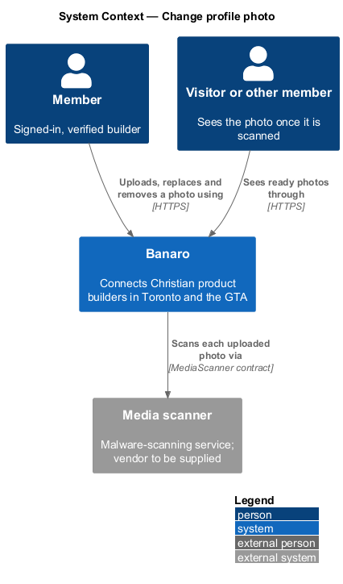
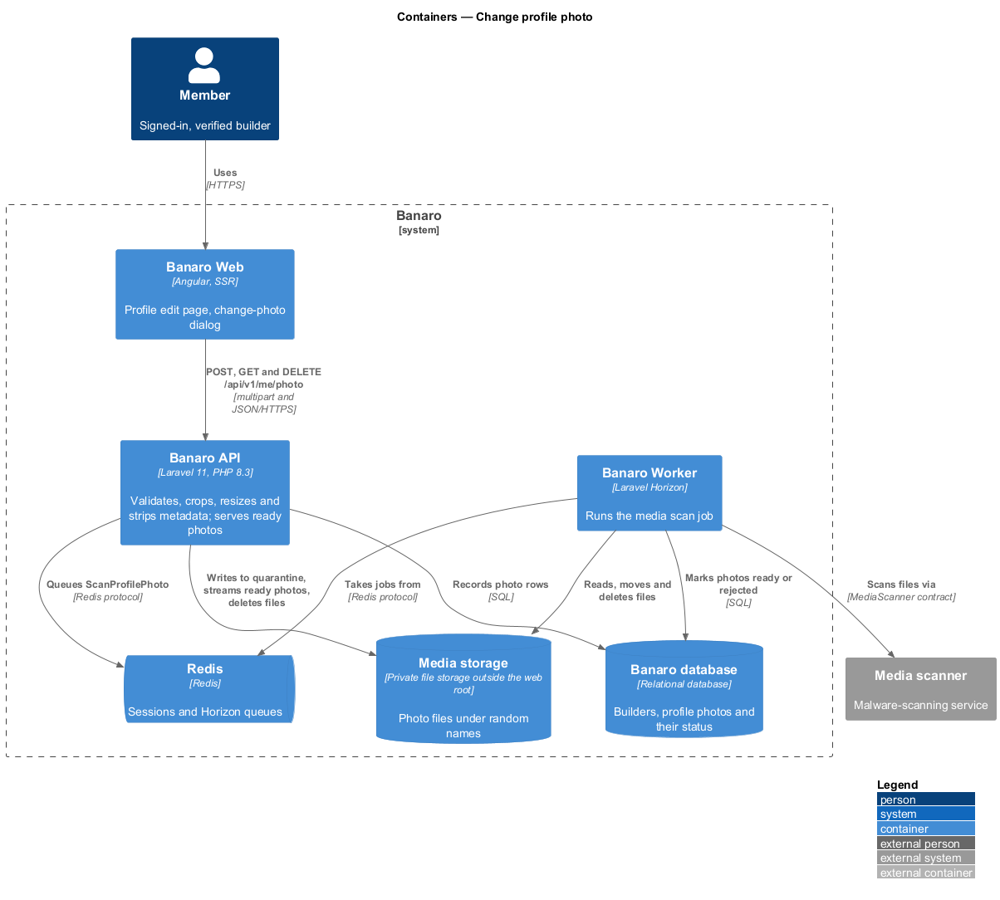
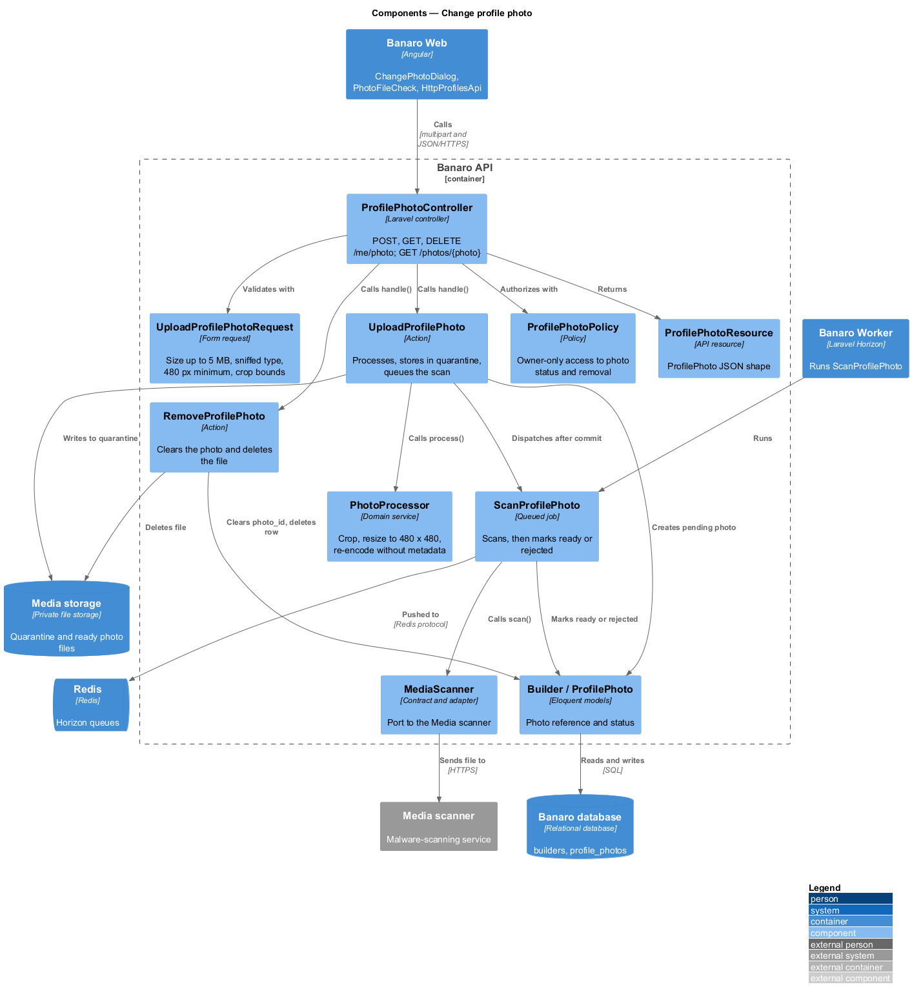
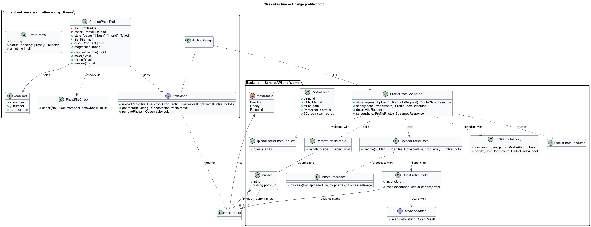
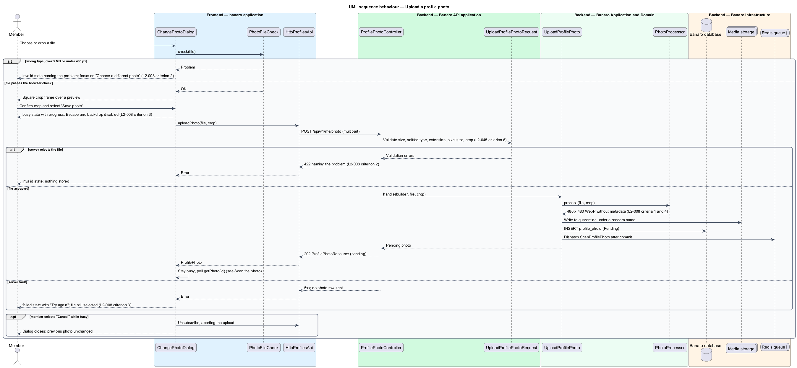
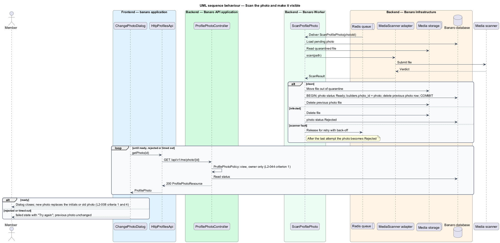
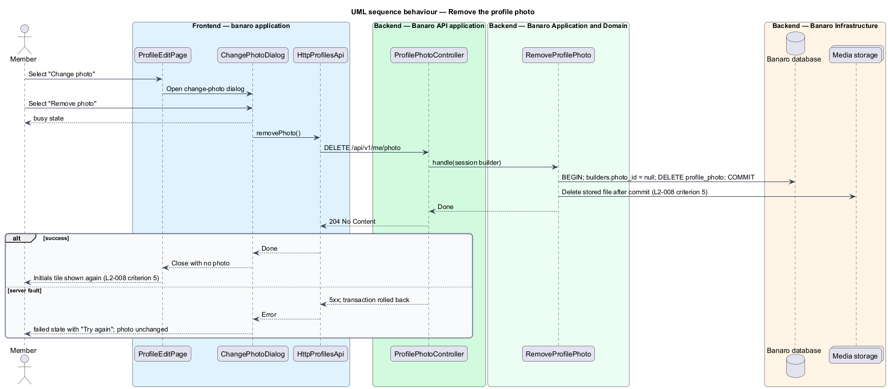

# Change profile photo

## Overview

A small square photo helps builders recognise each other before they meet in person. This feature lets
a member set, change and remove their profile photo. It belongs to the `profiles` subsystem. It runs
in the `change-photo` dialog, which opens from "Change photo" on the profile edit page
(`/profile/edit`, see `edit-own-profile`).

Terms used in this design:

- **profile photo** — square 480 × 480 px image shown on a builder's profile, directory card and header avatar
- **initials tile** — coloured square with a builder's initials, shown when the builder has no photo
- **square crop** — square region of the uploaded image that the member confirms before upload
- **metadata stripping** — removal of embedded data such as EXIF camera details and GPS coordinates
  by decoding the image and encoding a new file
- **content sniffing** — detection of a file's real type from its bytes, not from its name or declared type
- **quarantine** — state of an uploaded photo that is stored but not yet scanned, and is not shown to anyone
- **media scan** — malware check of a stored file through the `MediaScanner` contract

The dialog checks the chosen file in the browser for fast feedback, but the Banaro API decides. The API
validates the file, applies the crop, resizes the image to 480 × 480 px and encodes a new file without
metadata. It stores that file in Media storage under a random name, in quarantine. The Banaro Worker
then sends it to the Media scanner. Only a clean photo becomes visible and replaces the previous one.
Removing a photo deletes the stored file and shows the initials tile again.

## Description

The slice runs from the `change-photo` dialog in Banaro Web through the Banaro API to the Banaro
database and Media storage. The Banaro Worker runs the media scan through the Media scanner.

### Frontend — `banaro` application and libraries

- **`ChangePhotoDialog`** (`dialogs/change-photo/`) — CDK dialog for choosing a new photo, with the
  mock states `default`, `busy`, `invalid` and `failed`.
  - **Default.** Focus starts on "Choose a photo". The drop zone accepts a dropped file or a file
    chosen from the device. "Save photo" stays `aria-disabled` until a valid file and crop exist.
  - **Browser check.** As soon as a file is picked, `PhotoFileCheck` reads its type, size and pixel
    size. A file that fails moves the dialog to `invalid` and names the problem, for example "That file
    is a HEIC and 14.8 MB" (`L2-008` criterion 2). Focus moves to "Choose a different photo".
  - **Crop.** A valid file shows a square crop frame over a preview. The dialog sends the crop
    rectangle with the original file; it does not crop in the browser (`L2-008` criterion 1).
  - **Busy.** During upload the dialog shows the file name, its size, a progress bar and "Uploading…".
    It sets `disableClose`, so Escape and a backdrop click do not dismiss it (`L2-008` criterion 3).
    "Cancel" stays enabled as a deliberate action and aborts the request.
  - **Waiting for the scan.** After the upload is accepted, the dialog stays busy and polls
    `getPhoto(id)` until the photo is `ready` or `rejected`.
  - **Failed.** On a server fault or a timeout a danger alert reports that the upload failed.
    The chosen file stays selected and "Try again" resends it (`L2-008` criterion 3). The alert does
    not auto-dismiss.
  - **Ready.** The dialog closes with the new photo URL. The edit page and the header avatar replace
    the initials tile or the old photo (`L2-008` criterion 1).
  - **Remove.** When the member has a photo, the dialog offers "Remove photo". Confirming it calls
    `removePhoto()` and closes with no photo, so the initials tile returns (`L2-008` criterion 5).
- **`PhotoFileCheck`** (`banaro` application, `shared/`) — browser-side check of type, size and pixel
  size using `createImageBitmap`. It mirrors the server rules for fast feedback only.
- **`Avatar`** (`bn-avatar`) (`components` library) — renders a photo with declared width and height,
  or the initials tile. It has an `Avatar.ts` perf-test scenario.
- **`ProfilesApi`** / **`PROFILES_API`** / **`HttpProfilesApi`** (`api` library) — this slice adds three
  methods to the profiles contract:
  - `uploadPhoto(file, crop)` sends `POST /api/v1/me/photo` as `multipart/form-data` with upload
    progress events. It returns a `ProfilePhoto` with status `pending`.
  - `getPhoto(id)` sends `GET /api/v1/me/photo/{id}` and returns the current `ProfilePhoto`.
  - `removePhoto()` sends `DELETE /api/v1/me/photo`.
- **`ProfilePhoto`** (`api` library model) — `id`, `status` (`pending`, `ready` or `rejected`) and
  `url` (set once ready).

### Backend — Banaro API

- **Routes** — `POST /me/photo`, `GET /me/photo/{photo}` and `DELETE /me/photo` are in
  `routes/api.php` and require a verified member. `GET /photos/{photo}` is in `routes/api_public.php`,
  because visitors see photos in the directory (`L2-009` criterion 6).
- **`ProfilePhotoController`** (`Controllers/Api/V1/Profiles/`) — `store()` calls `UploadProfilePhoto`.
  `show()` returns the member's own photo status. `destroy()` calls `RemoveProfilePhoto`. `serve()`
  streams a ready photo from Media storage. It answers 404 for a photo that is not ready, or that the
  viewer may not see under the owner's privacy settings (the `ProfileVisibility` filter of `L2-036`).
- **`UploadProfilePhotoRequest`** (`Requests/Profiles/`) — validates on the server (`L2-008`
  criterion 2, `L2-045` criterion 6):
  - `photo` is a file of at most 5 MB.
  - Its sniffed content type and its extension are both JPEG, PNG or WebP, and they agree. A HEIC file
    renamed to `.jpg` fails.
  - Its pixel size is at least 480 × 480.
  - `crop` holds integer `x`, `y` and `size` within the image, with `size` at least 480.
  - Each failure returns 422 with a message that names the problem.
- **`UploadProfilePhoto`** (`Actions/Profiles/`) — handles an accepted upload:
  1. It calls `PhotoProcessor::process()` with the file and the crop.
  2. It writes the result to Media storage under a random name in the quarantine area (`L2-045`
     criterion 6).
  3. It creates a `ProfilePhoto` row with status `Pending` for the member's builder.
  4. After commit it dispatches the `ScanProfilePhoto` job and returns 202 with the photo.
- **`PhotoProcessor`** (`Services/Profiles/`) — decodes the image, applies the square crop and resizes
  it to 480 × 480 px. It encodes a new WebP file (`L2-048` criterion 3). Encoding a new file drops all
  metadata, including GPS EXIF (`L2-008` criterion 4). The image library is `<TO SUPPLY>`.
- **`ScanProfilePhoto`** (`Jobs/Profiles/`) — queued job on the Banaro Worker. It reads the file and
  calls `MediaScanner::scan()` (`L2-008` criterion 4):
  - For a clean file it moves the file out of quarantine, sets the photo to `Ready` and points
    `builders.photo_id` at it. It then deletes the previous photo row and file.
  - For an infected file it deletes the file and sets the photo to `Rejected`.
  - Scanner faults are retried with back-off. A photo that is still unscanned after the last attempt
    becomes `Rejected`.
- **`RemoveProfilePhoto`** (`Actions/Profiles/`) — clears `builders.photo_id` and deletes the
  `ProfilePhoto` row in one transaction. After commit it deletes the stored file from Media storage
  (`L2-008` criterion 5).
- **`MediaScanner`** (`Contracts/`) and its adapter (`Integrations/`) — the port to the Media scanner
  from the architecture baseline. The vendor is `<TO SUPPLY>`.
- **`ProfilePhoto`** (`Models/`) — `id` (random UUID), `builder_id`, `path`, `status`
  (`PhotoStatus`), `scanned_at`.
- **`PhotoStatus`** (`Enums/`) — `Pending`, `Ready`, `Rejected`.
- **`ProfilePhotoResource`** (`Resources/Profiles/`) — serializes a photo into the `ProfilePhoto` shape.
  It includes `url` only for a ready photo.
- **`ProfilePhotoPolicy`** (`Policies/`) — `view` and `delete` allow only the owning builder's user, so
  `GET /me/photo/{photo}` for another member's photo returns 404 (`L2-044` criterion 1).

### Failure handling

A rejected upload stores nothing. A failed processing step or transaction leaves the previous photo in
place, and the dialog offers a retry. A photo in quarantine is never served, so a failed or slow scan
never exposes an unscanned file. A `Rejected` photo leaves the previous photo, or the initials tile,
unchanged.

### Open points

- Accepted types: `L2-008` accepts JPEG, PNG and WebP; the mock's help text and file `accept` list
  say "JPG or PNG". The design follows the specification. The mock copy: `<TO SUPPLY>`.
- Crop step: `L2-008` criterion 1 requires a square crop, but no mock state shows it. Its layout and
  controls: `<TO SUPPLY>`.
- "Remove photo": `L2-008` criterion 5 requires it, but no mock shows the action or a confirmation.
  Its placement and whether it asks for confirmation: `<TO SUPPLY>`.
- Copy and state for a photo the scanner rejects: `<TO SUPPLY>`.
- Polling interval and the time after which the dialog stops waiting for the scan: `<TO SUPPLY>`.
- Number of scanner retries and the back-off schedule: `<TO SUPPLY>`.
- Whether smaller renditions (for example 64 px for cards) are generated alongside the 480 px file:
  `<TO SUPPLY>`.
- Media storage provider, and whether photos are streamed by the API or served through signed URLs:
  `<TO SUPPLY>`. The design streams them through `ProfilePhotoController::serve()`.
- Upload rate limit beyond the general limit of `L2-046` criterion 1: `<TO SUPPLY>`.

## Requirements

| L2 ID | Refines (L1) | Requirement |
|-------|--------------|-------------|
| `L2-008` | `L1-002` | A member shall be able to set, change and remove a profile photo through the `change-photo` dialog. |

The design realizes all five acceptance criteria of `L2-008`. The Description cites each criterion
where a component enforces it.

## Diagrams

### System context

A member uploads and removes a profile photo through Banaro. Banaro checks every upload with the
Media scanner before anyone sees it.

### Containers

The dialog in Banaro Web uploads to the Banaro API, which processes the image and stores it in Media
storage. The API queues a scan on Redis. The Banaro Worker sends the file to the Media scanner and
records the result in the Banaro database.

### Components

Inside the Banaro API, `ProfilePhotoController` calls `UploadProfilePhoto` or `RemoveProfilePhoto`.
`UploadProfilePhoto` relies on `PhotoProcessor` and dispatches `ScanProfilePhoto`, which the worker runs
against the `MediaScanner` contract.

### Class structure

A `Builder` points at one ready `ProfilePhoto` and may own others that are pending or rejected. The
upload action depends on `PhotoProcessor` and Media storage; the scan job depends on the `MediaScanner`
contract. On the frontend, `ChangePhotoDialog` depends on the `ProfilesApi` contract.

### Behaviour — upload a photo

The member picks a file and confirms the crop. The API rejects a bad file with a named problem, or
processes it, stores it in quarantine and queues the scan. The dialog stays busy and cannot be
dismissed by accident.

### Behaviour — scan the photo and make it visible

The Banaro Worker scans the quarantined file. A clean photo becomes the builder's photo and the old
file is deleted; an infected one is deleted. The dialog learns the outcome by polling.

### Behaviour — remove the photo

The member removes their photo. The API clears the reference and deletes the stored file, and the
initials tile returns.

