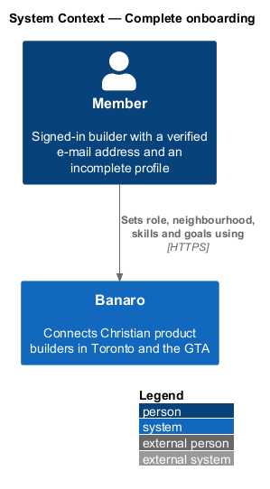
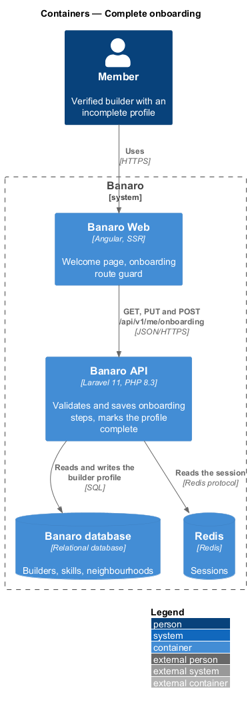
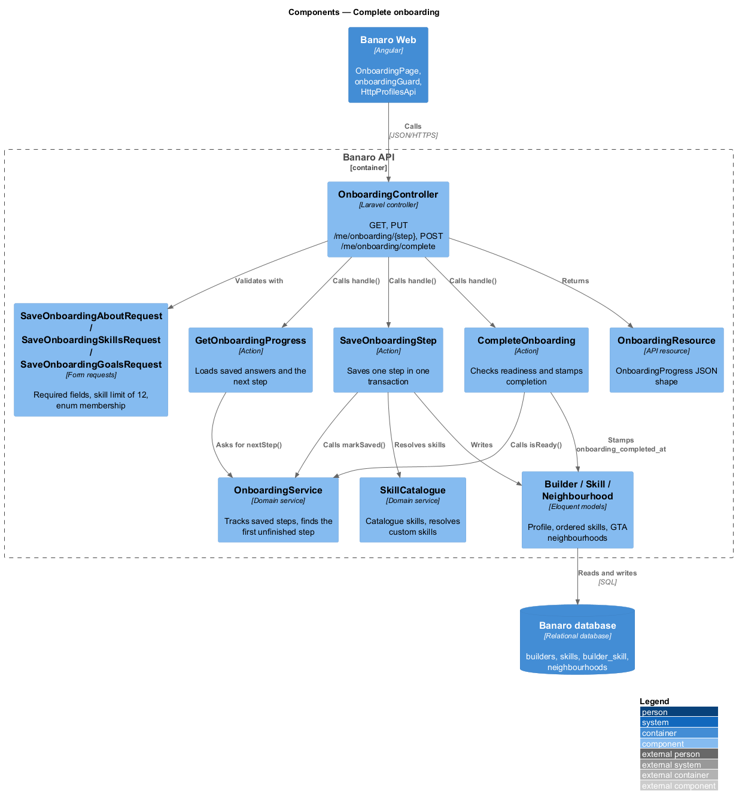
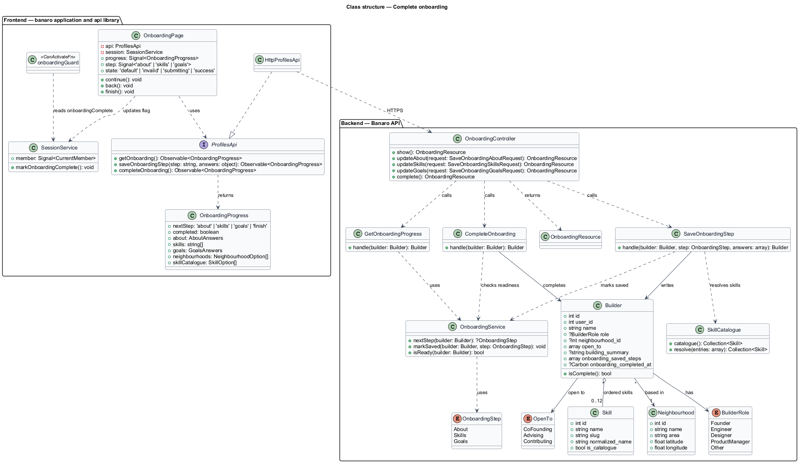
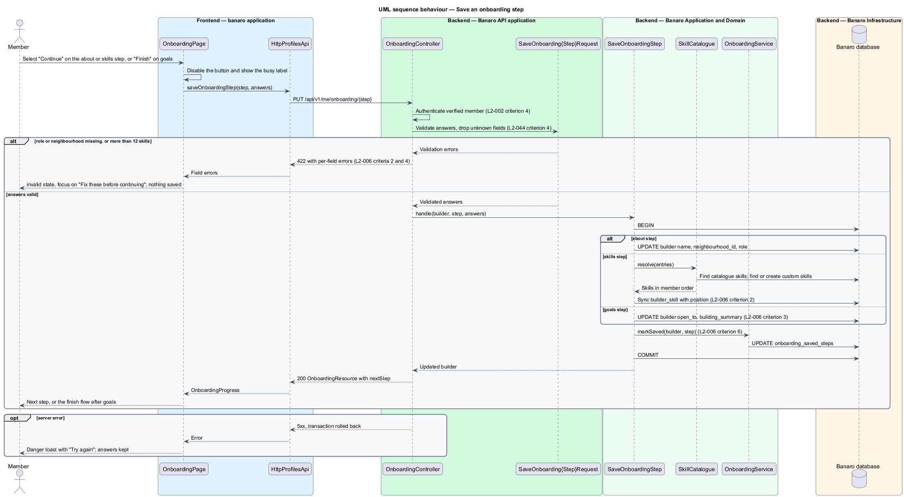
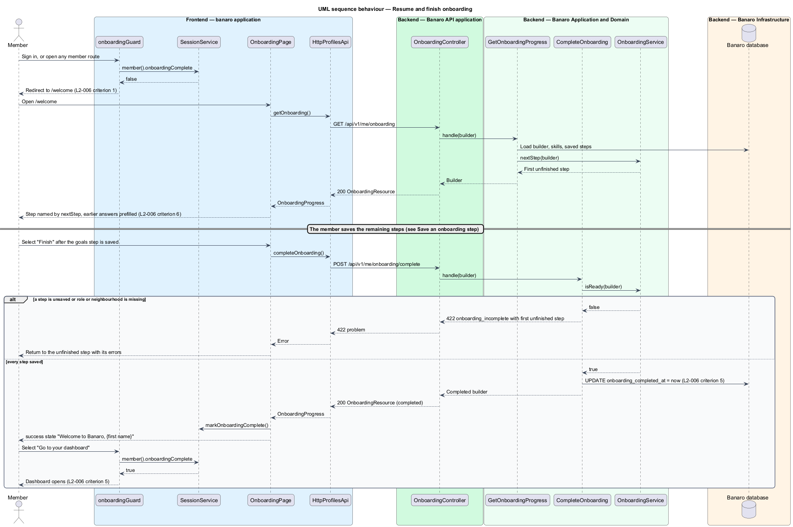

# Complete onboarding

## Overview

Banaro connects Christian product builders in Toronto and the GTA. A builder is only findable once
Banaro knows their role, where they are based, what they bring and what they are open to. This
feature guides a newly verified member through a short onboarding that captures those facts. It
belongs to the `profiles` subsystem. It runs on the welcome page (`/welcome`), which the member reaches
after the `verify-email` feature (`L2-002`) confirms the e-mail address.

Terms used in this design:

- **onboarding** — three-step guided set-up that a member completes once, before using other member areas
- **step** — one screen of onboarding whose answers are saved together; the steps are about, skills and goals
- **about step** — step 1, capturing full name, neighbourhood or city, and role
- **skills step** — step 2, capturing an ordered list of skills from the catalogue or added by the member
- **goals step** — step 3, capturing the "Open to" values and an optional sentence about the product being built
- **skill catalogue** — curated list of skills offered as toggle buttons, such as React, Figma and Laravel
- **custom skill** — skill a member types because the catalogue does not list it
- **"Open to" value** — kind of collaboration a builder welcomes: co-founding, advising or contributing
- **complete profile** — profile whose onboarding has been finished; Banaro records the time it happened
- **first unfinished step** — earliest step whose answers have not yet been saved

The browser never decides that a step is saved. Each step is sent to the Banaro API when the member
selects "Continue" (or "Finish" on the goals step). The API validates the step and saves it in one
transaction. A member who leaves partway and returns resumes at the first unfinished step with earlier
answers in place. Until onboarding is finished, the `banaro` application routes the member to
`/welcome` before any other member area.

## Description

The slice runs from the welcome page in Banaro Web through the Banaro API to the Banaro database. No
external system takes part.

### Frontend — `banaro` application and libraries

- **`OnboardingPage`** (`pages/onboarding/`, selector `bn-onboarding-page`) — routed page for
  `/welcome`. It renders one step at a time under a three-part progress stepper (about,
  skills, goals). It shows the mock states `default` (about step), `skills`, `goals`,
  `invalid`, `submitting` and `success`.
  - On load it calls `getOnboarding()` and opens the step named by `nextStep` (`L2-006` criteria 1 and
    6). Earlier answers prefill the fields.
  - The about step has "Full name", "Neighbourhood or city" and the role select. The
    neighbourhood and role options come from the API response, not from constants in the page.
  - The skills step renders catalogue skills as `bn-skill-toggle` buttons with `aria-pressed`, a polite
    live count ("3 selected") and the optional "Something else?" field for one custom skill.
  - The goals step renders three `bn-choice` checkboxes ("Open to co-founding", "Open to advising",
    "Open to contributing") and an optional text area about the product being built.
  - "Continue" and "Finish" disable themselves and show a busy label while a request is in flight. The
    goals step shows a busy label in the `submitting` state.
  - On a 422 response the page shows the `invalid` state: the error summary "Fix these before
    continuing", one message beside each field, and focus on the summary. The step does not advance
    (`L2-006` criterion 4).
  - After "Finish" succeeds, the page shows the `success` state "Welcome to Banaro, {first name}" with
    next steps and an action that opens the dashboard (`L2-006` criterion 5).
- **`onboardingGuard`** (`api` library, `lib/auth/`) — functional route guard on every member route
  except `/welcome`. It reads `onboardingComplete` from the current-member payload held by
  `SessionService`. It redirects to `/welcome` while the flag is false (`L2-006` criterion 1). A second
  guard on `/welcome` sends a member whose onboarding is complete to the dashboard. The guards run
  during server-side rendering too, so the redirect happens before any member page renders.
- **`SessionService`** (`api` library, `lib/auth/`) — holds the current-member payload from the
  `identity` subsystem. This design adds the `onboardingComplete` field to that payload. The page
  sets the flag to true locally after "Finish" succeeds, so the guard admits the member at once.
- **`SkillToggle`** (`bn-skill-toggle`) and **`Choice`** (`bn-choice`) (`components` library) —
  toggle button and labelled checkbox card. Each has a perf-test scenario (`SkillToggle.ts`,
  `Choice.ts`) in `frontend/projects/perf-test/src/scenarios/`.
- **`Stepper`** (`bn-stepper`) (`components` library) — labelled progress list for multi-step forms,
  with its own `Stepper.ts` perf-test scenario.
- **`ProfilesApi`** / **`PROFILES_API`** / **`HttpProfilesApi`** (`api` library) — the profiles
  contract, its injection token and its HTTP implementation. This slice uses three methods:
  - `getOnboarding()` sends `GET /api/v1/me/onboarding`.
  - `saveOnboardingStep(step, answers)` sends `PUT /api/v1/me/onboarding/{step}`, where `step` is
    `about`, `skills` or `goals`.
  - `completeOnboarding()` sends `POST /api/v1/me/onboarding/complete`.
  - Each returns an `OnboardingProgress`.
- **`OnboardingProgress`** (`api` library model) — `nextStep` (`about`, `skills`, `goals` or `finish`),
  `completed`, the saved `about`, `skills` and `goals` answers, `neighbourhoods` and `skillCatalogue`.
- **`InMemoryProfilesApi`** (`api` library, `lib/testing/`) — in-memory fake of the contract for page
  tests.

### Backend — Banaro API

- **Routes** — `GET /me/onboarding`, `PUT /me/onboarding/about`, `PUT /me/onboarding/skills`,
  `PUT /me/onboarding/goals` and `POST /me/onboarding/complete` are in `routes/api.php`. They require a
  signed-in member with a verified e-mail address (`L2-002` criterion 4). No route takes a builder id;
  the builder is always the session's own.
- **`OnboardingController`** (`Controllers/Api/V1/Profiles/`) — `show()` calls `GetOnboardingProgress`.
  `updateAbout()`, `updateSkills()` and `updateGoals()` each call `SaveOnboardingStep` with their step.
  `complete()` calls `CompleteOnboarding`. Every method returns an `OnboardingResource`.
- **Form requests** (`Requests/Profiles/`) — they run before any action, so an invalid step saves
  nothing (`L2-006` criterion 4, `L2-045` criterion 1). Each request passes only its validated keys on;
  fields such as `user_id` or `onboarding_completed_at` in the body are ignored (`L2-044` criterion 4).
  - `SaveOnboardingAboutRequest` requires `name`, `neighbourhood_id` (an existing `Neighbourhood`) and
    `role` (a `BuilderRole` case).
  - `SaveOnboardingSkillsRequest` accepts `skills`, an ordered array of at most 12 entries. Each entry
    is a catalogue skill id or a custom skill name. Duplicates are compared case-insensitively. A 13th
    entry fails with the message key `onboarding.skills.max`, which explains the limit of 12 (`L2-006`
    criterion 2).
  - `SaveOnboardingGoalsRequest` accepts `open_to`, an array of `OpenTo` cases, and an optional
    `building` text.
- **`GetOnboardingProgress`** (`Actions/Profiles/`) — loads the member's builder with skills and asks
  `OnboardingService` for the first unfinished step.
- **`SaveOnboardingStep`** (`Actions/Profiles/`) — saves one step in one database transaction:
  1. The about step writes `name`, `neighbourhood_id` and `role` on the builder.
  2. The skills step resolves entries through `SkillCatalogue::resolve()`. It then syncs the
     `builder_skill` pivot with a `position` per skill, so the order is kept (`L2-006` criterion 2).
  3. The goals step writes `open_to` and `building_summary` (`L2-006` criterion 3).
  4. It calls `OnboardingService::markSaved()` for the step. A saved step stays saved when the member
     leaves (`L2-006` criterion 6).
- **`CompleteOnboarding`** (`Actions/Profiles/`) — asks `OnboardingService::isReady()` whether every
  step is saved and role and neighbourhood are present. If not, it returns 422 with code
  `onboarding_incomplete` and the first unfinished step. Otherwise it stamps `onboarding_completed_at`
  (`L2-006` criterion 5). Repeating the call on a complete profile returns the profile unchanged.
- **`OnboardingService`** (`Services/Profiles/`) — `nextStep(Builder)` returns the first step not in
  `onboarding_saved_steps`, or `finish`. `markSaved(Builder, OnboardingStep)` adds a step to that set.
  `isReady(Builder)` checks the conditions for completion.
- **`SkillCatalogue`** (`Services/Profiles/`) — `catalogue()` returns the catalogue skills offered on
  the skills step. `resolve(entries)` returns catalogue skills by id and finds or creates custom skills
  by a normalised name (lower case, accents removed). The `edit-own-profile` feature reuses it.
- **`Builder`** (`Models/`) — the public profile, one per `User`. This slice uses `name`, `role`,
  `neighbourhood_id`, `open_to`, `building_summary`, `onboarding_saved_steps` and
  `onboarding_completed_at`. `isComplete()` is true once `onboarding_completed_at` is set.
- **`Skill`** (`Models/`) — `name`, `slug`, `normalized_name` and `is_catalogue`. The `builder_skill`
  pivot holds `position`.
- **`Neighbourhood`** (`Models/`) — GTA neighbourhood or city with `name`, `area` and a centroid
  (`latitude`, `longitude`). The `DistanceService` in the `directory` subsystem reads the centroid.
- **Enums** (`Enums/`) — `OnboardingStep` (`About`, `Skills`, `Goals`), `BuilderRole` (`Founder`,
  `Engineer`, `Designer`, `ProductManager`, `Other`) and `OpenTo` (`CoFounding`, `Advising`,
  `Contributing`).
- **`OnboardingResource`** (`Resources/Profiles/`) — serializes the builder, the next step, the
  neighbourhood list and the skill catalogue into the `OnboardingProgress` shape.

### Failure handling

A failed transaction rolls back, so a step is either saved whole or not at all. On a 5xx response the
page keeps the entered answers and shows a `bn-toast` danger message with "Try again" (`L2-028`).
Saving a step is idempotent: a retried `PUT` writes the same answers again.

### Open points

- Skill limit: `L2-006` criterion 2 allows 12 skills; the `skills` mock says "Choose up to ten". The
  design follows the specification. The mock copy: `<TO SUPPLY>`.
- "Skip for now" on the about step: the mock offers it, but `L2-006` criterion 4 makes role and
  neighbourhood required. Its behaviour and destination: `<TO SUPPLY>`.
- Landing after "Finish": `L2-006` criterion 5 says the member lands on the dashboard; the `success`
  mock shows next steps with an action that opens the dashboard instead of an automatic redirect. The
  design shows the success state and leaves the dashboard one action away; confirmation:
  `<TO SUPPLY>`.
- Whether the skills and goals steps require at least one selection before "Continue" or "Finish":
  `<TO SUPPLY>`.
- Maximum lengths for full name, custom skill names and the text about the product being built:
  `<TO SUPPLY>`.
- Contents of the skill catalogue, and whether custom skills ever join it: `<TO SUPPLY>`.
- Source of the personalised hints on the `success` state (nearest builder, next event, matching
  promise): `<TO SUPPLY>`.
- The neighbourhood list differs between the `onboarding` mock (cities plus "Other GTA") and the
  `profile-edit` mock (neighbourhoods). The authoritative GTA neighbourhood list: `<TO SUPPLY>`.
- Whether the API also rejects other member endpoints for an incomplete profile, instead of relying
  on the route guard: `<TO SUPPLY>`.

## Requirements

| L2 ID | Refines (L1) | Requirement |
|-------|--------------|-------------|
| `L2-006` | `L1-002` | After verifying their e-mail, a new member shall be guided through a short onboarding that captures role, neighbourhood, skills and goals. |

The design realizes all six acceptance criteria of `L2-006`. The Description cites each criterion
where a component enforces it.

## Diagrams

### System context

A newly verified member sets up a profile through Banaro. No external system takes part in this
slice.

### Containers

The welcome page in Banaro Web calls the Banaro API, which reads and writes the builder's profile in
the Banaro database. Redis holds the session that identifies the member.

### Components

Inside the Banaro API, `OnboardingController` validates each step with its form request and calls
`SaveOnboardingStep` or `CompleteOnboarding`. Both actions rely on `OnboardingService` to track saved
steps.

### Class structure

A `Builder` has one `Neighbourhood`, an ordered set of `Skill` rows and a set of `OpenTo` values. On
the frontend, `OnboardingPage` and `onboardingGuard` depend on the `ProfilesApi` contract and on
`SessionService`, not on `HttpProfilesApi`.

### Behaviour — save an onboarding step

The member continues from a step. The API validates the answers and either rejects them with field
errors or saves them in one transaction and names the next step.

### Behaviour — resume and finish onboarding

The route guard sends a member with an incomplete profile to `/welcome`. The page resumes at the first
unfinished step. "Finish" marks the profile complete and opens the success state.

