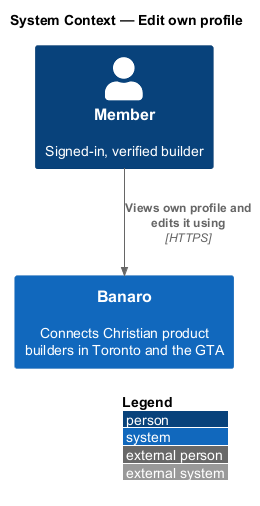
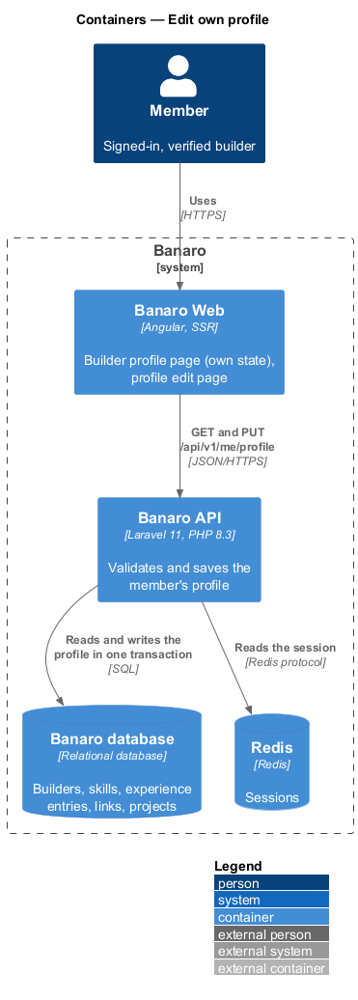
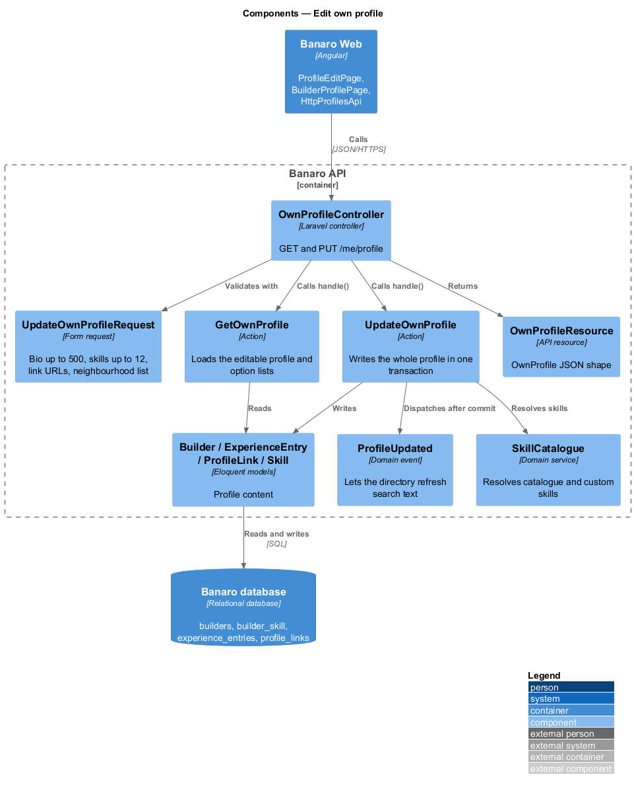
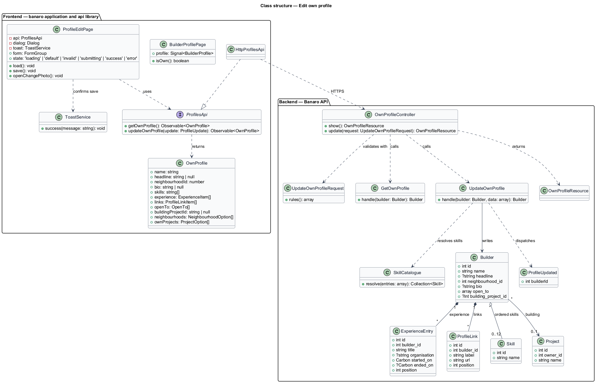
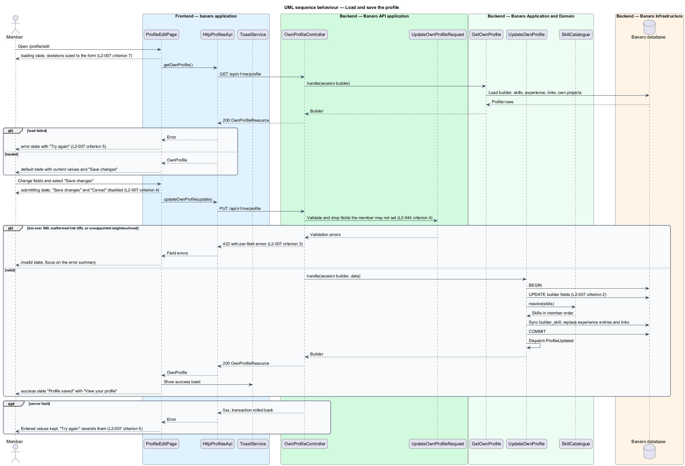
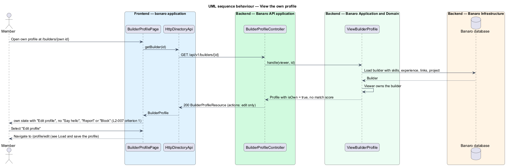

# Edit own profile

## Overview

A builder's profile is how other Christian product builders in Toronto and the GTA decide whether to
reach out. This feature lets a member see their profile as others see it and change it at any time.
It belongs to the `profiles` subsystem. It covers two screens: the `own` state of the builder profile
page (`/builders/{id}` for the member's own id) and the edit form at `/profile/edit`.

Terms used in this design:

- **own profile** — builder profile that belongs to the signed-in member who is viewing it
- **headline role** — short free-text description of what a builder does, such as "Founder · Product"
- **experience entry** — one past or current position, with title, organisation and dates
- **profile link** — labelled external URL on a profile, such as a portfolio or a code repository
- **building project** — project from the `projects` subsystem that the profile names as what the
  builder is building
- **output encoding** — escaping of text at render time so that markup in it displays as characters

The `own` state shows the profile exactly as other members see it, plus an "Edit profile" action. It
shows no "Say hello", "Report" or "Block" action. "Edit profile" navigates to the full-page form; no
field on the profile page edits inline. The form loads the member's current values, and "Save changes"
sends the whole profile to the Banaro API. The API validates it and saves it in one transaction. The
profile photo is not part of this form: "Change photo" opens the `change-photo` dialog, which the
`change-profile-photo` feature describes.

## Description

The slice runs from Banaro Web through the Banaro API to the Banaro database. No external system takes
part.

### Frontend — `banaro` application and libraries

- **`BuilderProfilePage`** (`pages/builder-profile/`) — the profile page that the
  `view-builder-profile` feature describes. When the response marks the profile as the viewer's own,
  the page renders the `own` state (`L2-007` criterion 1):
  - an "Edit profile" action that links to `/profile/edit`, and a "Who can see this" link to the
    privacy section of `/settings` (`L2-036`);
  - a note on how others see the profile, in place of the match panel;
  - the profile-completeness panel with "Finish profile";
  - no "Say hello" action and no "More" menu, so neither "Report" nor "Block" appears.
- **`ProfileEditPage`** (`pages/profile-edit/`, selector `bn-profile-edit-page`) — routed page for
  `/profile/edit` with the mock states `default`, `loading`, `error`, `invalid`, `submitting` and
  `success`.
  - **Loading.** It calls `getOwnProfile()` and shows skeletons sized to the final form, so the layout
    does not shift (`L2-007` criterion 7, `L2-048` criterion 4). "Save changes" is absent until the
    form has loaded, so nothing can overwrite unseen values.
  - **Fields.** "Full name", "Role" (headline role), "Neighbourhood" (a select filled from the GTA
    neighbourhood list), "Bio" with a live character counter, "Skills" as removable chips with an "Add"
    field, experience entries, profile links, "Open to" checkboxes and the building project (`L2-007`
    criterion 2). The page imposes the same limits as the API so most errors show before a request.
  - **Photo.** "Change photo" opens `ChangePhotoDialog` through CDK `Dialog`.
  - **Submitting.** "Save changes" becomes busy ("Saving…") and disabled. "Cancel" is also disabled,
    so a half-saved profile cannot happen (`L2-007` criterion 4).
  - **Success.** The page shows the success alert "Profile saved" with a link to the profile, announced
    through `role="status"`. It also raises a `bn-toast` success message through `ToastService`
    (`L2-007` criterion 4).
  - **Invalid.** On a 422 response it shows the error summary "Fix these before continuing" with one
    link per field, moves focus to the summary and marks each field with `aria-invalid` (`L2-007`
    criterion 3).
  - **Error.** If the profile cannot load, the `error` state offers "Try again" and a link back to
    the profile. If a save fails with a server fault, the form keeps every entered value and the page
    offers "Try again", which resends them (`L2-007` criterion 5).
- **`ToastService`** (`components` library) — shows the success toast. Toast timing follows the
  `system-notifications` feature (`L2-028`).
- **`ChipInput`** (`bn-chip-input`) (`components` library) — chip list with an add field, used for
  skills. It caps the list at 12 chips. It has a `ChipInput.ts` perf-test scenario.
- **`ProfilesApi`** / **`PROFILES_API`** / **`HttpProfilesApi`** (`api` library) — this slice adds two
  methods to the profiles contract. `getOwnProfile()` sends `GET /api/v1/me/profile`.
  `updateOwnProfile(update)` sends `PUT /api/v1/me/profile`. Both return an `OwnProfile`.
- **`OwnProfile`** and **`ProfileUpdate`** (`api` library models) — the member's editable profile:
  `name`, `headline`, `neighbourhoodId`, `bio`, `skills`, `experience`, `links`, `openTo` and
  `buildingProjectId`. `OwnProfile` also carries the option lists the form needs: `neighbourhoods` and
  `ownProjects`.

Every template renders profile text through Angular interpolation, which encodes it. No template binds
profile text to `innerHTML`, so markup in a name, bio or link label shows as text (`L2-007`
criterion 6).

### Backend — Banaro API

- **Routes** — `GET /me/profile` and `PUT /me/profile` are in `routes/api.php` and require a verified
  member. Neither takes a builder id; the builder is always the session's own, so one member cannot
  edit another's profile (`L2-044` criterion 1).
- **`OwnProfileController`** (`Controllers/Api/V1/Profiles/`) — `show()` calls `GetOwnProfile`.
  `update()` calls `UpdateOwnProfile`. Both return an `OwnProfileResource`.
- **`UpdateOwnProfileRequest`** (`Requests/Profiles/`) — validates the whole profile and returns 422
  with field errors on failure (`L2-007` criterion 3, `L2-045` criterion 1):
  - `name` is required.
  - `neighbourhood_id` shall exist in the GTA neighbourhood list.
  - `bio` is at most 500 characters.
  - `skills` holds at most 12 entries, each a catalogue skill id or a custom name.
  - `experience` entries need a title and a start date; an end date, if given, is not before the start.
  - Each `links` entry needs a label and an absolute `https` or `http` URL.
  - `open_to` values are `OpenTo` cases.
  - `building_project_id` is nullable and shall name a project the member owns.
  - Fields outside this list, such as `user_id` or `role`, are dropped (`L2-044` criterion 4).
- **`GetOwnProfile`** (`Actions/Profiles/`) — loads the member's builder with skills in order,
  experience entries, links, neighbourhood and the member's own projects.
- **`UpdateOwnProfile`** (`Actions/Profiles/`) — writes the profile in one database transaction:
  1. It updates `name`, `headline`, `neighbourhood_id`, `bio`, `open_to` and `building_project_id`.
  2. It resolves skills through `SkillCatalogue::resolve()` and syncs `builder_skill` with positions.
  3. It replaces the builder's `ExperienceEntry` and `ProfileLink` rows with the submitted lists.
  4. After commit it dispatches the `ProfileUpdated` event. The `directory` subsystem listens to it to
     refresh the builder's search text (`browse-directory`).
- **`SkillCatalogue`** (`Services/Profiles/`) — shared with `complete-onboarding`; resolves catalogue
  and custom skills.
- **`Builder`** (`Models/`) — this slice adds `headline`, `bio` and `building_project_id` to the
  fields that `complete-onboarding` uses. Text is stored as plain text and encoded on output
  (`L2-045` criterion 5).
- **`ExperienceEntry`** and **`ProfileLink`** (`Models/`) — rows owned by one builder, each with a
  `position` that keeps the member's order.
- **`OwnProfileResource`** (`Resources/Profiles/`) — serializes the editable profile and its option
  lists into the `OwnProfile` shape.
- **`ProfileUpdated`** (`Events/`) — carries the builder id after a successful save.

### Failure handling

A failed transaction rolls back, so the stored profile stays as it was. The browser keeps the entered
values in the form and offers a retry. A retried `PUT` is safe because it replaces the whole profile.
An expired session during a save opens the `session-expired` dialog (`L2-005`), which also keeps the
entered values.

### Open points

- Route: `L2-007` names `/profile/edit`; the mock manifest gives `/me/edit`. The design uses
  `/profile/edit`; confirmation: `<TO SUPPLY>`.
- Bio limit: `L2-007` criterion 3 allows 500 characters; the mock counter and error say 400. The
  design follows the specification. The mock copy: `<TO SUPPLY>`.
- Fields missing from the mock: `L2-007` criterion 2 lists experience entries, links and the product
  being built, but the `profile-edit` mock shows none of them. Their layout: `<TO SUPPLY>`.
- Fields in the mock but not in `L2-007`: "What I am looking for" (described as an input to the Monday
  matches) and "Who can see my profile". The design leaves visibility to the `control-privacy`
  feature (`L2-036`). The mock's options ("Signed-in builders", "Builders within 60 km", "Hidden") also
  differ from the `L2-036` options ("Everyone", "Members only"). Resolution of both fields:
  `<TO SUPPLY>`.
- Whether "Open to" requires at least one value: the `invalid` mock asks for at least one value; `L2-007` is silent. `<TO SUPPLY>`.
- Success feedback: `L2-007` criterion 4 asks for a confirmation toast; the `success` mock shows an
  inline alert, with a mock note that adds a toast when the member has scrolled. The design shows
  both; confirmation: `<TO SUPPLY>`.
- Save failure: the `error` mock covers only a failed load. The look of a failed save that keeps the
  form: `<TO SUPPLY>`.
- Maximum lengths for name, headline, experience fields and link labels, and the maximum number of
  experience entries and links: `<TO SUPPLY>`.
- Formula behind the profile-completeness percentage on the `own` state ("80% complete" in the
  mock): `<TO SUPPLY>`; the `view-dashboard` feature (`L2-030`) shows the same prompt.

## Requirements

| L2 ID | Refines (L1) | Requirement |
|-------|--------------|-------------|
| `L2-007` | `L1-002` | A member shall be able to view how their profile appears to others and edit it. |

The design realizes all seven acceptance criteria of `L2-007`. The Description cites each criterion
where a component enforces it.

## Diagrams

### System context

A member views and edits their own profile through Banaro. No external system takes part in this
slice.

### Containers

The profile and edit pages in Banaro Web call the Banaro API. The API writes the profile to the Banaro
database and reads the session from Redis.

### Components

Inside the Banaro API, `OwnProfileController` validates with `UpdateOwnProfileRequest` and calls
`GetOwnProfile` or `UpdateOwnProfile`. `UpdateOwnProfile` resolves skills through `SkillCatalogue` and
raises `ProfileUpdated` for the directory.

### Class structure

A `Builder` owns ordered `ExperienceEntry` and `ProfileLink` rows, an ordered set of `Skill` rows and an
optional building `Project`. On the frontend, `ProfileEditPage` depends on the `ProfilesApi` contract,
not on `HttpProfilesApi`.

### Behaviour — load and save the profile

The edit page loads the profile behind skeletons, then sends the whole profile on "Save changes". The
API rejects invalid values with field errors or saves them in one transaction. A server fault keeps
the entered values for a retry.

### Behaviour — view the own profile

The member opens their own profile. The API marks it as the viewer's own, and the page shows "Edit
profile" without the actions meant for other builders.

