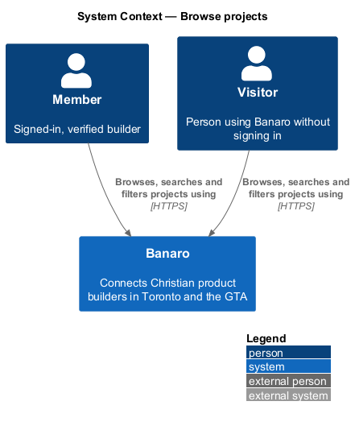
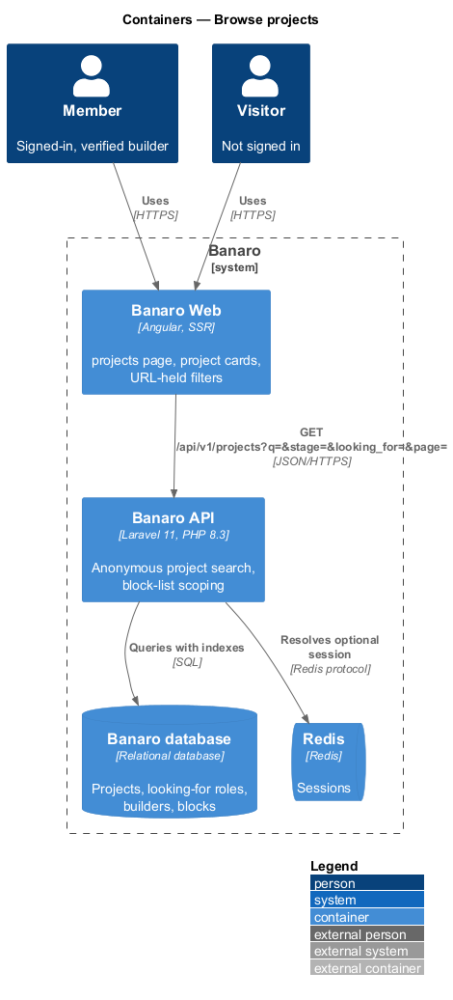
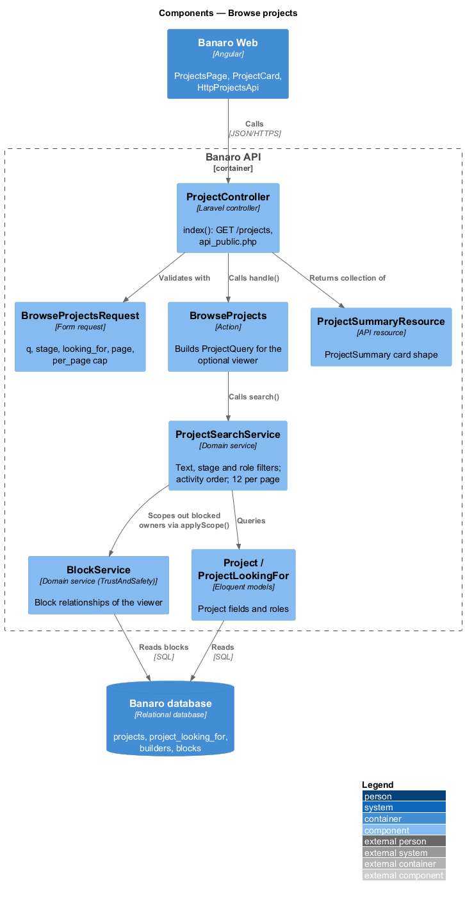
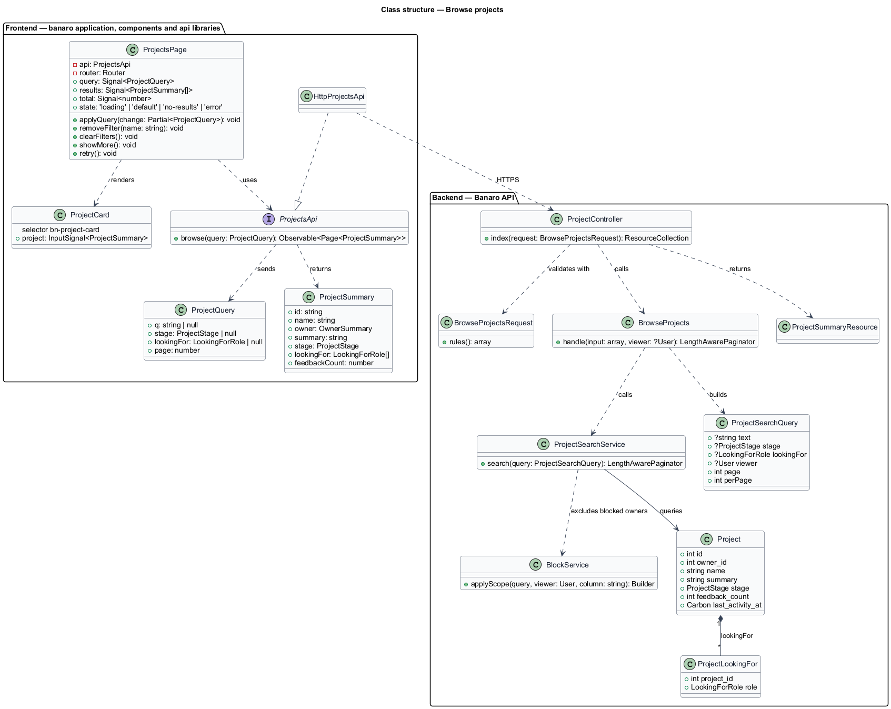
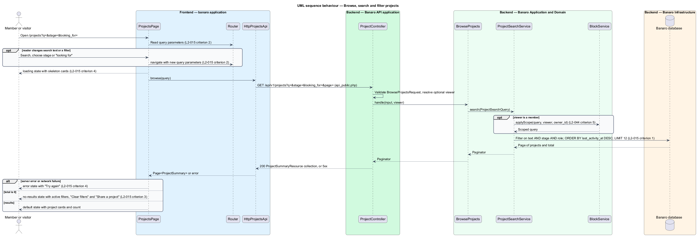

# Browse projects

## Overview

The project showcase list at `/projects` is where members and visitors discover what builders in
Toronto and the GTA are making. This feature lists projects as cards and lets the reader search and
filter them. It belongs to the `projects` subsystem. Each card links to the project page that
`view-project` renders, and the page invites the reader to share a project through `share-project`.

Terms used in this design:

- **project card** — compact summary of one project in the list: name, owner, one-line description,
  stage, "looking for" and feedback count
- **most recent activity** — time of the latest change to a project or its feedback, held in
  `last_activity_at`; the list orders by it, newest first
- **filter** — narrowing of the list by stage or by a "looking for" role
- **search text** — words matched against project name, one-line description and owner name

The list shows 12 projects per page. Search text and filters combine, and a project appears only when
it matches every active filter. The browser keeps the search and filters in the URL, so a reload or a shared link shows the
same list.

## Description

The slice runs from the `projects` page in Banaro Web through an anonymous read endpoint of the Banaro
API to the Banaro database.

### Frontend — `banaro` application and libraries

- **`ProjectsPage`** (`pages/projects/`) — routed page for `/projects`, rendered on the server for the
  first load. It has the `default`, `loading`, `error` and `no-results` states of the mock.
  - It reads `q`, `stage`, `looking_for` and `page` from the query string, then calls
    `ProjectsApi.browse(query)`. A change to the search or a filter writes the new values back to the
    URL with `Router.navigate` and reloads the list (`L2-015` criterion 2).
  - It renders up to 12 `bn-project-card` components ordered by most recent activity (`L2-015`
    criterion 1). It shows the "Showing {from}–{to} of {total}" count and a "Share a project" prompt.
  - "Show more projects" requests the next page and appends it.
  - The `loading` state shows skeleton cards sized to the final layout. The `error` state shows
    "Try again" and "Browse builders" (`L2-015` criterion 4).
  - The `no-results` state lists the active filters, each with "Remove filter". It offers "Clear
    filters" and "Share a project" (`L2-015` criterion 3).
- **`ProjectCard`** (`components` library, selector `bn-project-card`) — renders one project card with
  the mock's BEM classes. Owner initials stand in for a missing logo. The component is new, so it adds
  the `ProjectCard` scenario and a `ProjectCardList` composite scenario to
  `frontend/projects/perf-test`.
- **`ProjectsApi`** / **`PROJECTS_API`** / **`HttpProjectsApi`** (`api` library) — `browse(query)`
  sends `GET /api/v1/projects?q=&stage=&looking_for=&page=` and returns a `Page<ProjectSummary>`.
- **`ProjectQuery`** and **`ProjectSummary`** (`api` library models) — the query fields, and the card
  fields: `id`, `name`, `owner` (`builderId`, `name`), `summary`, `stage`, `lookingFor` and
  `feedbackCount`.

### Backend — Banaro API

- **`ProjectController`** (`Controllers/Api/V1/Projects/`) — `index()` handles `GET /projects`. The
  route is in `routes/api_public.php`, so a visitor may call it. The Sanctum stateful guard resolves a
  member when a session cookie is present.
- **`BrowseProjectsRequest`** (`Requests/Projects/`) — validates `q` as a string (maximum length
  `<TO SUPPLY>`), `stage` as a `ProjectStage` case, `looking_for` as a `LookingForRole` case and
  `page` as a positive integer. `per_page` defaults to 12 and is capped at 50 (`L2-047` criterion 4).
- **`BrowseProjects`** (`Actions/Projects/`) — builds a `ProjectSearchQuery` from the validated input and
  the optional viewer. It calls `ProjectSearchService` and returns the paginator.
- **`ProjectSearchService`** (`Services/Projects/`) — composes one query (`L2-015` criteria 1 and 2):
  - Search text: case-insensitive match on project name, one-line description and owner name, with
    bound parameters (`L2-045` criterion 5).
  - Stage: equality on `projects.stage`.
  - "Looking for": an `EXISTS` on `project_looking_for` for the role.
  - Block list: for a member viewer, it excludes projects whose owner is in a block relationship with
    the viewer. It calls `BlockService::applyScope($query, $viewer, 'owner_id')` from
    `Services/TrustAndSafety`, owned by `block-builder` (`L2-032` criterion 1, `L2-044` criterion 5).
  - Order: `last_activity_at` descending, then `id` descending, 12 per page.
  - Indexes on `projects (last_activity_at, id)`, `projects (stage, last_activity_at)` and
    `project_looking_for (role, project_id)` keep the query inside the read budget (`L2-047`
    criterion 1).
- **`ProjectSummaryResource`** (`Resources/Projects/`) — serializes one row into the `ProjectSummary`
  shape. It eager-loads owners and roles to avoid one query per card.

`last_activity_at` changes when a project is shared or edited, when it receives feedback, and when
its owner replies to feedback. The `share-project`, `edit-and-delete-project` and `give-feedback`
actions set it.

### Open points

- Conflicts between `L2-015` and the `projects` mock:
  - Paging: `L2-015` criterion 1 lists 12 per page; the `default` mock shows 7 cards with "Show more
    projects". The design loads 12 per request and keeps the mock's "Show more projects" control.
    Whether the list pages or appends is `<TO SUPPLY>`.
  - Sort: the mock offers "Most recent", "Most feedback", "Needs feedback" and "Nearest builder".
    `L2-015` defines only the default order by most recent activity. `<TO SUPPLY>`.
  - Filters: the mock uses single-choice selects for stage and "looking for"; `L2-015` does not say
    whether a filter takes one value or several. `<TO SUPPLY>`.
  - Stage order and option labels differ as listed in `share-project` (for example "Contributors"
    against "Contributor").
- Which events count as project activity: the design uses share, edit, new feedback and owner reply.
  Confirmation is `<TO SUPPLY>`.
- Whether search ignores accents, as the directory search does (`L2-009` criterion 4): `<TO SUPPLY>`.
- Whether projects with "Members near me" visibility (from the `project-new` mock) appear to
  visitors: `<TO SUPPLY>`; no L2 requirement defines project visibility.

## Requirements

| L2 ID | Refines (L1) | Requirement |
|-------|--------------|-------------|
| `L2-015` | `L1-004` | Members and visitors shall be able to browse and search projects at `/projects`. |

The design realizes all four acceptance criteria of `L2-015`. The Description cites each criterion
where a component enforces it.

## Diagrams

### System context

Members and visitors browse and search projects in Banaro. No external system takes part.

### Containers

Banaro Web renders the projects list and calls one anonymous read endpoint of the Banaro API. The API
queries projects, roles and blocks in the Banaro database.

### Components

Inside the Banaro API, `ProjectController` calls `BrowseProjects`, which delegates the query to
`ProjectSearchService`. The service consults `BlockService` for a signed-in viewer.

### Class structure

`ProjectSearchService` reads `Project` and `ProjectLookingFor` and returns `ProjectSummaryResource`
rows. `ProjectsPage` depends on the `ProjectsApi` contract and renders `ProjectCard` components.

### Behaviour — browse, search and filter projects

The page restores the query from the URL, loads the list and writes any change back to the URL. The
response selects the `default`, `no-results` or `error` state.

