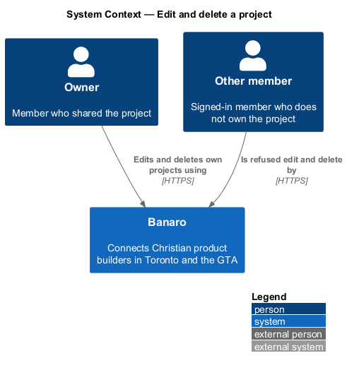
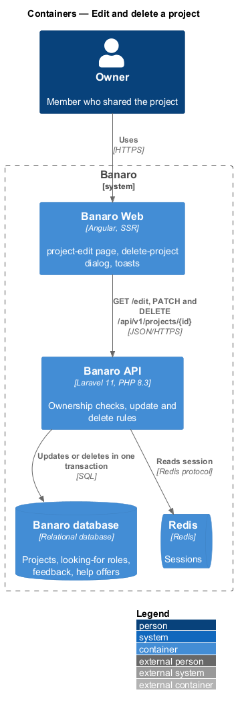
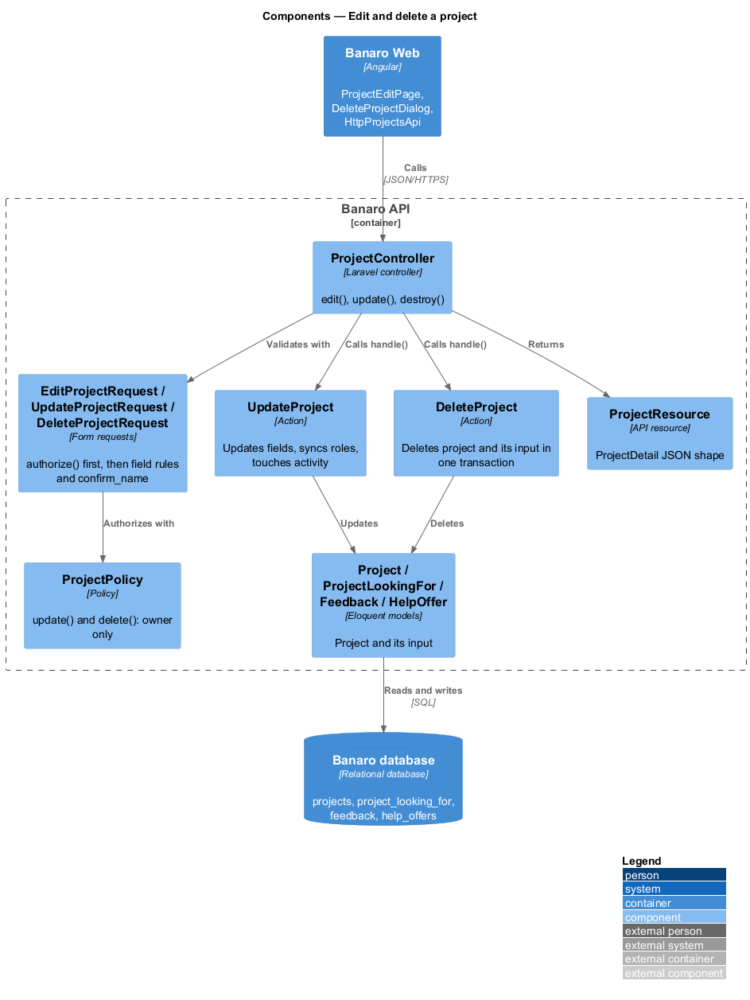
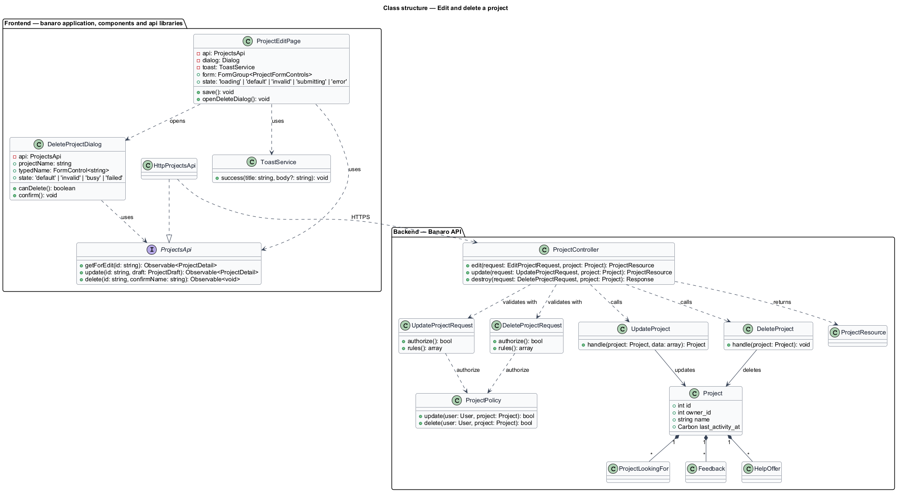
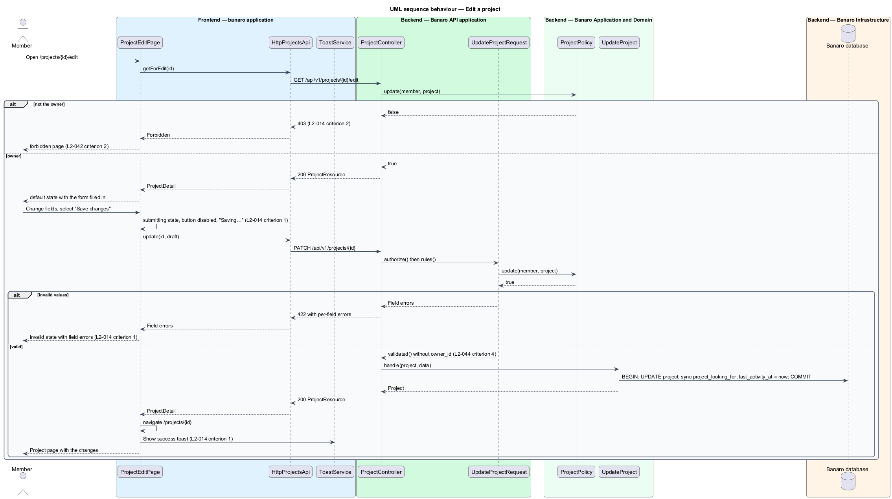
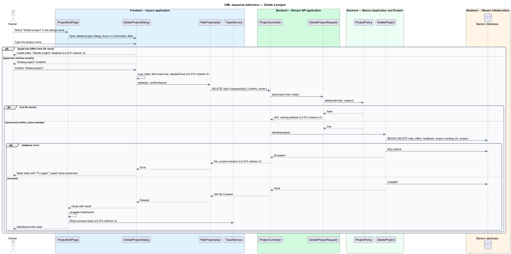

# Edit and delete a project

## Overview

A project changes as its builder works on it: the stage moves on, the roles it needs change, and
sometimes the project ends. This feature lets the owner edit a project at `/projects/{id}/edit` and
delete it through the `delete-project` dialog. It belongs to the `projects` subsystem. It reuses the
form of `share-project` and returns the owner to the page that `view-project` renders.

Terms used in this design:

- **owner** — member who shared a project; the only member who may change or delete it
- **danger zone** — section at the foot of the edit page that holds the "Delete project" action
- **typed confirmation** — exact project name that the owner types before the delete button enables
- **project input** — feedback items and help offers attached to a project

Only the owner may change or remove a project. The Banaro API enforces this with `ProjectPolicy` on
every edit, update and delete request. It returns 403 to any other member before validating the
request, so no change is made. Deletion removes the project and all its project input in one
transaction.

## Description

The slice runs from the `project-edit` page and the `delete-project` dialog in Banaro Web through the
Banaro API to the Banaro database.

### Frontend — `banaro` application and libraries

- **`ProjectEditPage`** (`pages/project-edit/`) — routed page for `/projects/{id}/edit`, behind
  `authGuard`. It has the `default`, `loading`, `error`, `invalid` and `submitting` states of the mock.
  - It loads the editable project through `ProjectsApi.getForEdit(id)`. A 403 routes to the
    `forbidden` page (`L2-042` criterion 2), and a 404 to the `not-found` page.
  - It builds its form with `ProjectFormModel`, shared with `share-project`.
  - "Save changes" enters the `submitting` state: the button is disabled and reads "Saving…". A 422
    shows the `invalid` state with field errors and the "Fix these before continuing" summary. A 200
    navigates to `/projects/{id}` and shows a success toast (`L2-014` criterion 1).
  - A load failure shows the `error` state with "Try again" and "Back to {project}".
  - "Delete project" in the danger zone opens `DeleteProjectDialog`.
- **`DeleteProjectDialog`** (`dialogs/delete-project/`) — CDK dialog with the `default`, `invalid`,
  `busy` and `failed` states of the mock.
  - Focus starts in the confirmation field, not on the danger button.
  - The "Delete project" button stays disabled until the typed text equals the project name exactly,
    case included. A mismatch shows the `invalid` state as the owner types (`L2-014` criterion 3).
  - Confirming enters the `busy` state: the field is read-only, the button reads "Deleting…", and
    the dialog sets `disableClose` while the request is in flight.
  - On 204 the dialog closes, the app navigates to `/dashboard` and shows a success toast (`L2-014`
    criterion 4).
  - On failure it shows the `failed` state with "Try again". The typed name is preserved and the
    project remains (`L2-014` criterion 5).
- **`ToastService`** (`components` library) — shows the success toasts after save and after delete.
  Toast timing follows the `system-notifications` feature (`L2-028`).
- **`ProjectsApi`** / **`PROJECTS_API`** / **`HttpProjectsApi`** (`api` library):
  - `getForEdit(id)` sends `GET /api/v1/projects/{id}/edit` and returns a `ProjectDetail`.
  - `update(id, draft)` sends `PATCH /api/v1/projects/{id}` and returns a `ProjectDetail`.
  - `delete(id, confirmName)` sends `DELETE /api/v1/projects/{id}` with body `{ confirm_name }`.

### Backend — Banaro API

- **`ProjectController`** (`Controllers/Api/V1/Projects/`) — `edit()`, `update()` and `destroy()`
  handle `GET /projects/{project}/edit`, `PATCH /projects/{project}` and `DELETE /projects/{project}`.
  All three routes are in `routes/api.php`.
- **`EditProjectRequest`**, **`UpdateProjectRequest`** and **`DeleteProjectRequest`**
  (`Requests/Projects/`) — each `authorize()` method calls `ProjectPolicy`. Laravel runs `authorize()`
  before the rules, so a non-owner receives 403 and no action runs (`L2-014` criterion 2).
  - `UpdateProjectRequest` applies the same rules as `ShareProjectRequest` and ignores `owner_id`
    (`L2-044` criterion 4).
  - `DeleteProjectRequest` requires `confirm_name` to equal the project name. The API therefore
    enforces the typed confirmation too, not only the dialog.
- **`ProjectPolicy`** (`Policies/`) — `update()` and `delete()` return true only when the user's id
  equals `owner_id`.
- **`UpdateProject`** (`Actions/Projects/`) — in one transaction, updates the editable fields, syncs
  the `project_looking_for` rows to the submitted roles and sets `last_activity_at` to now.
- **`DeleteProject`** (`Actions/Projects/`) — in one transaction, deletes the project's help offers,
  feedback items and looking-for rows, then the project (`L2-014` criterion 4). Foreign keys with
  `ON DELETE CASCADE` back this up. A failure rolls back, so the project and its input remain
  (`L2-014` criterion 5).
- **`ProjectResource`** (`Resources/Projects/`) — returns the updated project.

Conversations that began from an accepted help offer belong to the `messaging` subsystem. Deleting
the project does not delete them.

### Open points

- `L2-014` criterion 2 returns 404 "if the project is private to its owner". No L2 requirement
  defines private projects; the `project-new` mock has a different visibility choice ("Members near
  me"). Until visibility is defined, the design always returns 403 to a non-owner. `<TO SUPPLY>`.
- Conflicts between `L2-014` and the mocks:
  - `L2-013` criterion 2 places "Delete" on the project page; the mocks place it in the edit page's
    danger zone only. `<TO SUPPLY>`.
  - The `delete-project` and `project-edit` mocks say deletion removes "insights" and "saved-by
    counts". No L2 requirement defines either. `<TO SUPPLY>`.
  - The `project-edit` `invalid` mock asks the owner to "Start the website with https://", while
    `L2-012` criterion 5 accepts `http` and `https`. `<TO SUPPLY>`.
  - The `project-edit` form inherits the field conflicts listed in `share-project`.
- Copy of the success toasts after save and after delete: `<TO SUPPLY>`; no toast mock covers them.
- Whether members with pending help offers are told that the project was deleted: `<TO SUPPLY>`.
- Treatment of in-app notifications that point to a deleted project: `<TO SUPPLY>`; the
  `in-app-notifications` feature owns it.

## Requirements

| L2 ID | Refines (L1) | Requirement |
|-------|--------------|-------------|
| `L2-014` | `L1-004`, `L1-014` | Only the owner may change or remove a project. |

The design realizes all five acceptance criteria of `L2-014`. The Description cites each criterion
where a component enforces it.

## Diagrams

### System context

The owner edits and deletes projects in Banaro. Other members reach the same endpoints only to be
refused. No external system takes part.

### Containers

The edit page and the delete dialog in Banaro Web call the Banaro API. The API authorizes each call
and updates or deletes rows in the Banaro database.

### Components

Inside the Banaro API, each form request asks `ProjectPolicy` before validation. `ProjectController`
then calls `UpdateProject` or `DeleteProject`.

### Class structure

A `Project` owns its `Feedback`, `HelpOffer` and `ProjectLookingFor` rows, so deleting it removes
them. `ProjectEditPage` and `DeleteProjectDialog` depend on the `ProjectsApi` contract.

### Behaviour — edit a project

The page loads the editable project, which a non-owner receives as 403. Saving returns field errors
or the updated project, after which the owner returns to the project page with a toast.

### Behaviour — delete a project

The owner types the project name and confirms. `DeleteProject` removes the project and its input in
one transaction, and the owner lands on the dashboard with a toast.

