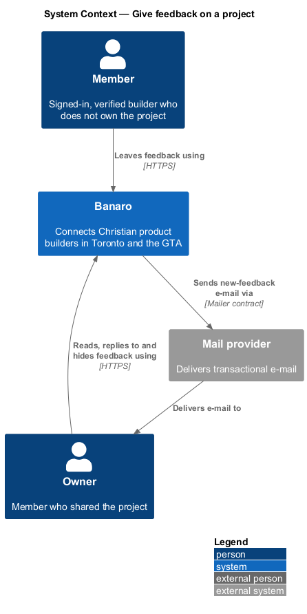
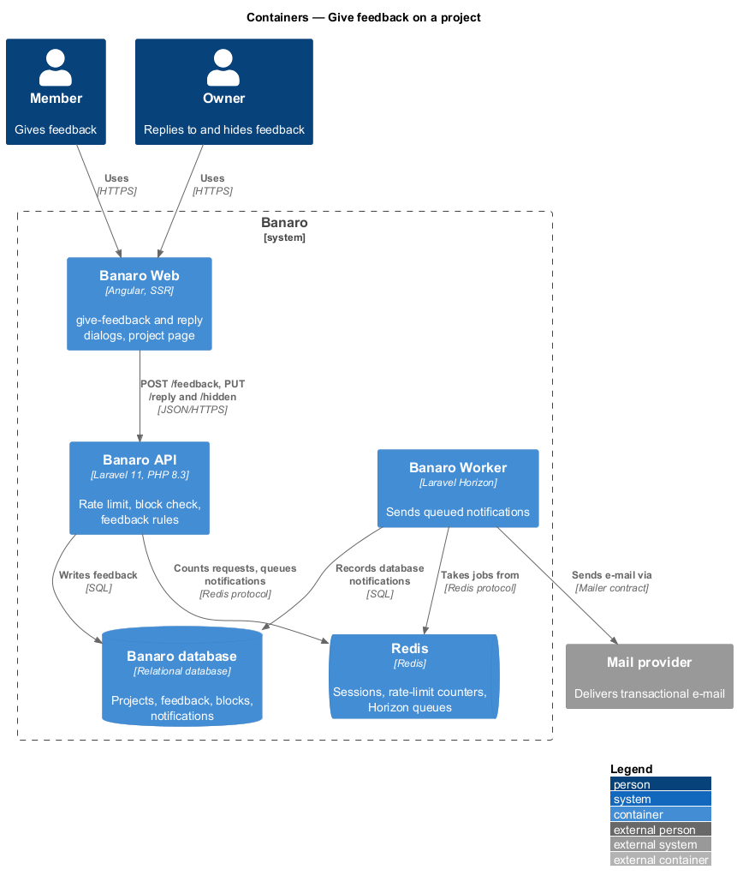
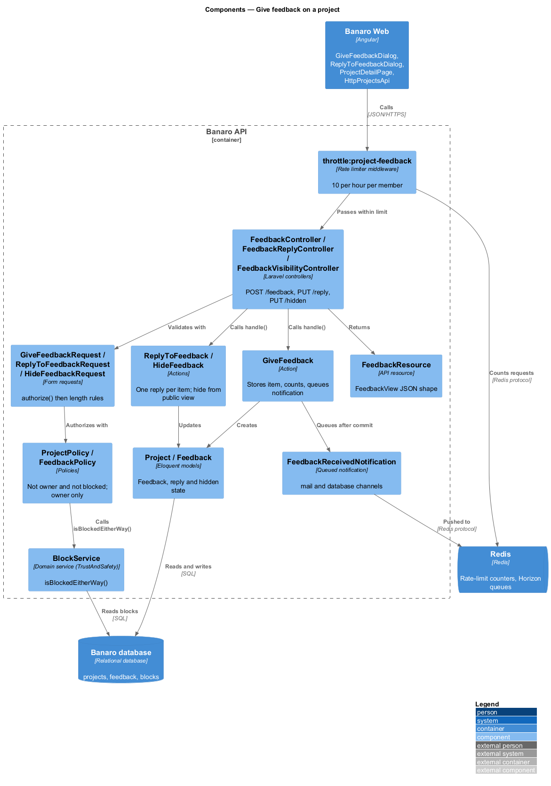
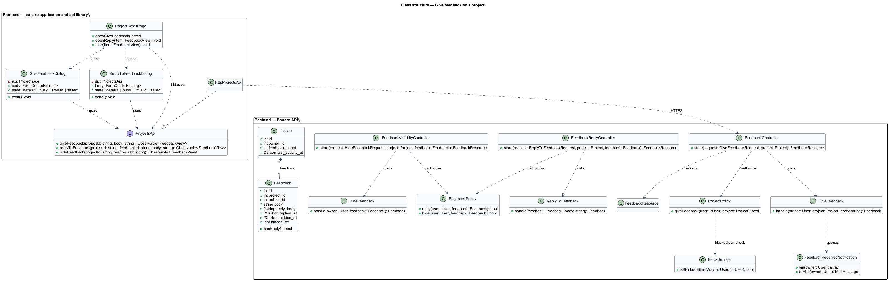
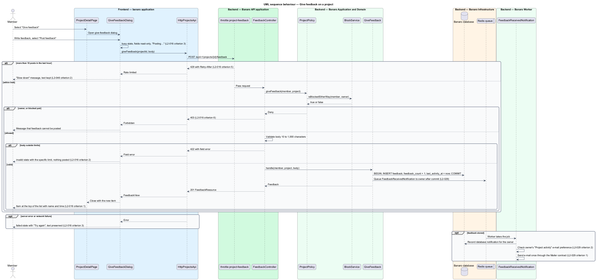
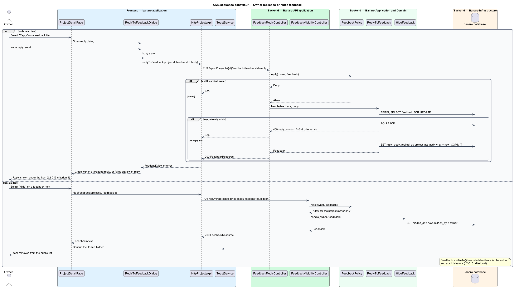

# Give feedback on a project

## Overview

Builders share projects early to hear what other builders think. This feature lets a member who does
not own a project leave feedback on it, and lets the owner reply to each item and hide items from the
public view. It belongs to the `projects` subsystem. The `give-feedback` dialog opens from the project
page that `view-project` renders, and the feedback list on that page shows the result.

Terms used in this design:

- **feedback item** — comment of 10 to 1,000 characters that a member other than the owner leaves on
  a project
- **owner reply** — single threaded answer that the project owner attaches to one feedback item
- **hidden feedback item** — feedback item that the owner removed from the public view; its author and
  administrators still see it
- **blocked pair** — two members where either one has blocked the other (`L2-032`)
- **feedback rate limit** — maximum of 10 feedback items that one member may post in one hour

A member writes feedback in the dialog and selects "Post feedback". The Banaro API checks that the
member is not the owner and not in a blocked pair with the owner. It then validates the length, stores
the item and queues a notification to the owner. The Banaro Worker sends the e-mail. The new item
appears at the top of the project's feedback list.

## Description

The slice runs from the `give-feedback` dialog and the project page in Banaro Web through the Banaro
API to the Banaro database. Owner notifications leave through Redis and the Banaro Worker.

### Frontend — `banaro` application and libraries

- **`GiveFeedbackDialog`** (`dialogs/give-feedback/`) — CDK dialog opened by "Give feedback" on
  `ProjectDetailPage`. It has the `default`, `busy`, `invalid` and `failed` states of the mock.
  - The textarea carries `minlength` 10 and `maxlength` 1,000 as client hints.
  - A server 422 shows the `invalid` state with the specific limit and posts nothing. Focus moves to
    the comment box (`L2-016` criterion 2).
  - While the request is in flight the `busy` state makes the fields read-only and the button reads
    "Posting…" (`L2-016` criterion 3).
  - A failure shows the `failed` state with "Try again" and keeps the typed text (`L2-016`
    criterion 3).
  - A 429 shows a specific "slow down" message (`L2-046` criterion 2). A 403 explains that feedback
    cannot be posted. The copy of both messages is `<TO SUPPLY>`.
  - On 201 the dialog closes with the new `FeedbackView`. Escape closes it at any other time, and focus
    returns to "Give feedback".
- **`ProjectDetailPage`** (`pages/project-detail/`, see `view-project`) — prepends the returned item
  to the feedback list and increments the count (`L2-016` criterion 1). In the `own` state each
  `bn-feedback-item` shows "Reply" and "Hide" to the owner (`L2-016` criterion 4).
- **`ReplyToFeedbackDialog`** (`dialogs/reply-to-feedback/`) — CDK dialog for the owner reply, with
  `default`, `busy`, `invalid` and `failed` states. Editing opens a dialog because pages hold no
  inline forms. No mock exists for it yet; see Open points.
- **`ToastService`** (`components` library) — confirms a hidden item. Toast timing follows the
  `system-notifications` feature (`L2-028`).
- **`ProjectsApi`** / **`PROJECTS_API`** / **`HttpProjectsApi`** (`api` library):
  - `giveFeedback(projectId, body)` sends `POST /api/v1/projects/{id}/feedback`.
  - `replyToFeedback(projectId, feedbackId, body)` sends
    `PUT /api/v1/projects/{id}/feedback/{feedbackId}/reply`.
  - `hideFeedback(projectId, feedbackId)` sends
    `PUT /api/v1/projects/{id}/feedback/{feedbackId}/hidden`.

  Each returns a `FeedbackView`.

### Backend — Banaro API

- **`FeedbackController`** (`Controllers/Api/V1/Projects/`) — `store()` handles
  `POST /projects/{project}/feedback` in `routes/api.php`. The route carries the
  `throttle:project-feedback` middleware. It calls `GiveFeedback` and returns a `FeedbackResource`
  with status 201.
- **`FeedbackReplyController`** and **`FeedbackVisibilityController`**
  (`Controllers/Api/V1/Projects/`) — `store()` methods for the `reply` and `hidden` routes, both in
  `routes/api.php`. The routes use scoped bindings, so a feedback id from another project returns
  404.
- **`GiveFeedbackRequest`** (`Requests/Projects/`) — `authorize()` calls
  `ProjectPolicy::giveFeedback()`. The rules require `body` as a string of 10 to 1,000 characters
  (`L2-016` criterion 2).
- **`ReplyToFeedbackRequest`** and **`HideFeedbackRequest`** (`Requests/Projects/`) — `authorize()`
  calls `FeedbackPolicy::reply()` or `FeedbackPolicy::hide()`. The reply `body` length limit is
  `<TO SUPPLY>`.
- **`ProjectPolicy`** (`Policies/`) — `giveFeedback()` allows a verified member who is not the owner.
  It denies a blocked pair through `BlockService::isBlockedEitherWay(member, owner)` from
  `Services/TrustAndSafety`. A denial returns 403 (`L2-016` criterion 6).
- **`FeedbackPolicy`** (`Policies/`) — `reply()` and `hide()` allow only the project owner.
- **Rate limiter `project-feedback`** — allows 10 requests per hour per member id. The limiter
  returns 429 with `Retry-After` (`L2-016` criterion 5). The `limit-request-rates` feature registers
  the limiters and logs breaches.
- **`GiveFeedback`** (`Actions/Projects/`) — in one transaction, creates the `Feedback` row with
  `author_id` from the session and increments `projects.feedback_count`. It also sets
  `last_activity_at`. After commit it queues `FeedbackReceivedNotification` to the owner (`L2-016`
  criterion 1).
- **`ReplyToFeedback`** (`Actions/Projects/`) — locks the feedback row and sets `reply_body` and
  `replied_at`. A second reply returns 409 with code `reply_exists`, so each item has one reply
  (`L2-016` criterion 4). It also sets the project's `last_activity_at`.
- **`HideFeedback`** (`Actions/Projects/`) — sets `hidden_at` and `hidden_by`. The
  `Feedback::visibleTo()` scope in `view-project` then shows the item only to its author and to
  administrators (`L2-016` criterion 4).
- **`Feedback`** (`Models/`) — holds `project_id`, `author_id`, `body`, `reply_body`, `replied_at`,
  `hidden_at` and `hidden_by`. Feedback text is stored as plain text and encoded on output (`L2-045`
  criterion 5).
- **`FeedbackResource`** (`Resources/Projects/`) — serializes an item into the `FeedbackView` shape.
- **`FeedbackReceivedNotification`** (`Notifications/`) — queued notification on the `mail` and
  `database` channels, dispatched after commit. The Banaro Worker sends it through the `Mailer`
  contract under the "Project activity" e-mail category (`L2-029` criteria 1 and 2, `L2-037`).

### Open points

- Conflicts between `L2-016` and the `give-feedback` mock:
  - The mock asks for a feedback kind (Encouragement, Question, Suggestion); `L2-016` has no such
    field. The design does not store a kind. `<TO SUPPLY>`.
  - `L2-016` criterion 2 asks the `invalid` state to show the specific limit; the mock copy ("Write a
    comment before posting. Even one sentence helps.") covers only an empty comment. Copy for under 10
    and over 1,000 characters is `<TO SUPPLY>`.
  - `L2-016` criterion 3 says the `busy` state disables the controls; the mock keeps "Cancel" enabled
    to abort the request. The design follows the mock. `<TO SUPPLY>`.
- Owner reply and hide have no mock. The `own` mock says "Reply from each comment's page", but no
  comment page is mocked. A mock for the reply dialog and the hide action is `<TO SUPPLY>` before
  implementation.
- Reply length limit: `<TO SUPPLY>`.
- Whether the owner may un-hide an item, and whether the owner still sees hidden items: `<TO SUPPLY>`.
- Whether hidden items count toward the feedback count: `<TO SUPPLY>`.
- Whether the feedback author is notified of an owner reply: `<TO SUPPLY>`.

## Requirements

| L2 ID | Refines (L1) | Requirement |
|-------|--------------|-------------|
| `L2-016` | `L1-005` | A member who is not the owner shall be able to leave feedback, and the owner shall be able to read and respond. |

The design realizes all six acceptance criteria of `L2-016`. The Description cites each criterion
where a component enforces it.

## Diagrams

### System context

Members give feedback and owners respond through Banaro. Banaro tells owners about new feedback by
e-mail through the mail provider.

### Containers

The dialog and the project page in Banaro Web call the Banaro API. The API writes feedback to the
Banaro database and queues the owner notification on Redis for the Banaro Worker.

### Components

Inside the Banaro API, the rate limiter and the policies run before the actions. `ProjectPolicy`
asks `BlockService` about a blocked pair.

### Class structure

A `Project` has many `Feedback` items, each written by one author and holding at most one reply.
`GiveFeedbackDialog` and `ReplyToFeedbackDialog` depend on the `ProjectsApi` contract.

### Behaviour — give feedback

The API applies the rate limit, the blocked-pair check and the length rules in that order. It then
stores the item and queues the owner notification, which the Banaro Worker sends.

### Behaviour — owner replies to or hides feedback

The owner replies once to an item through the reply dialog, or hides it from the public view. Both
calls pass `FeedbackPolicy`, which allows only the project owner.

