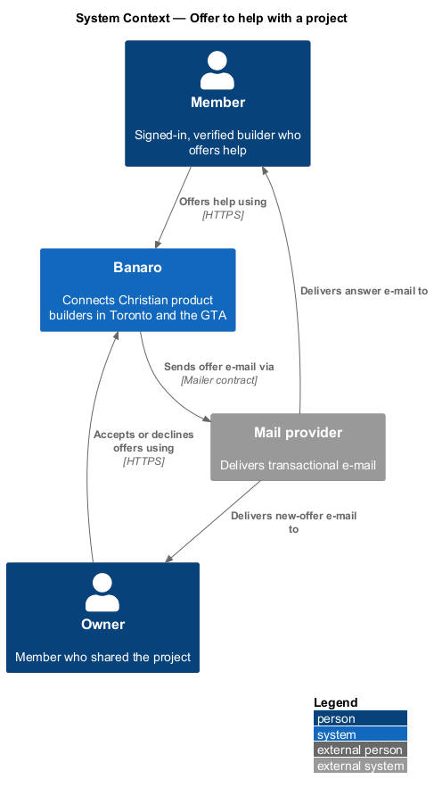
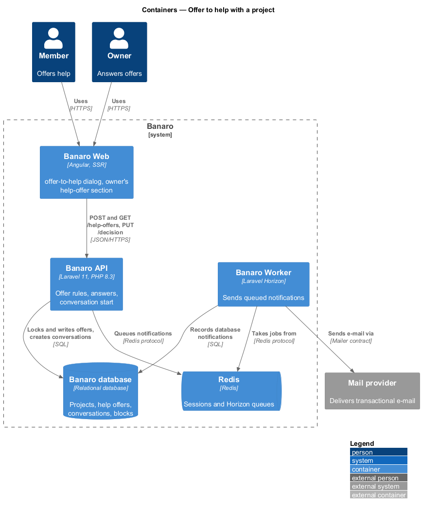
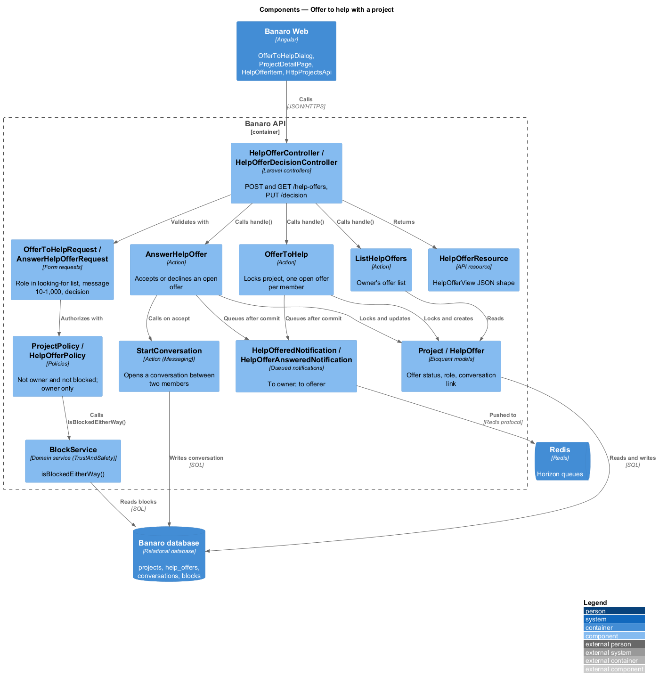
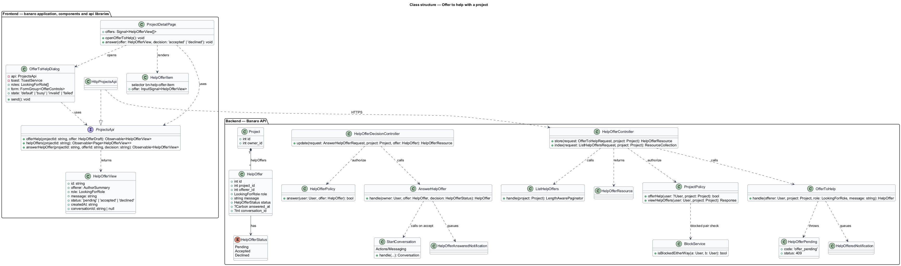
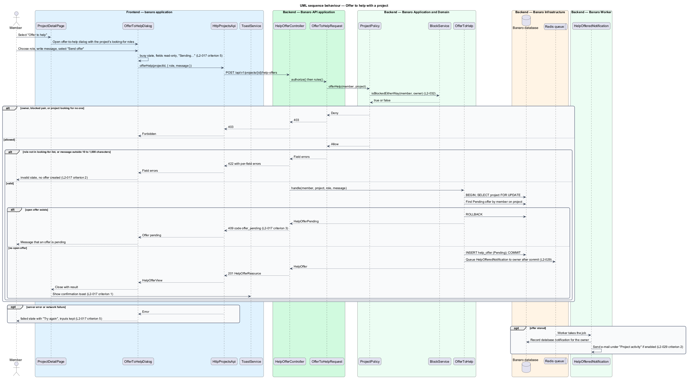
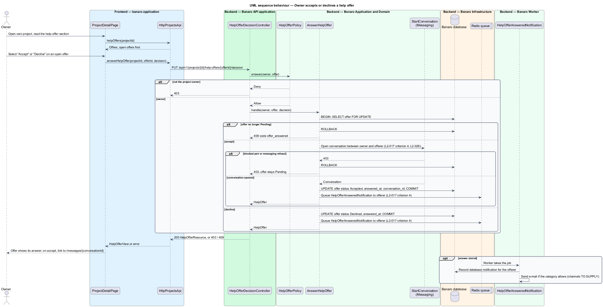

# Offer to help with a project

## Overview

Many shared projects need people: a co-founder, an advisor, a contributor. This feature lets a member
offer help to a project in one of the roles the project is looking for. It lets the owner accept or
decline each offer. It belongs to the `projects` subsystem. The `offer-to-help` dialog opens from the
project page that `view-project` renders. An accepted offer opens a conversation in the `messaging`
subsystem.

Terms used in this design:

- **help offer** — member's proposal to help a project in one role, with a message of 10 to 1,000
  characters
- **offerer** — member who made a help offer
- **open offer** — help offer that the owner has neither accepted nor declined; status `Pending`
- **answer** — owner's decision on an open offer: accept or decline
- **looking-for role** — role from the project's "looking for" list (`share-project`)

A member chooses a role and writes a message, then selects "Send offer". The Banaro API accepts the
offer only for a role the project is looking for. It accepts one open offer per member and project.
The owner is notified. When the owner accepts, the API opens a conversation between the owner and the
offerer and notifies the offerer. A decline only notifies the offerer.

## Description

The slice runs from the `offer-to-help` dialog and the project page in Banaro Web through the Banaro
API to the Banaro database. Notifications leave through Redis and the Banaro Worker.

### Frontend — `banaro` application and libraries

- **`OfferToHelpDialog`** (`dialogs/offer-to-help/`) — CDK dialog opened by "Offer to help" on
  `ProjectDetailPage`. It has the `default`, `busy`, `invalid` and `failed` states of the mock.
  - Focus starts on the role select. Its options come from the project's `lookingFor` list.
  - A 422 shows the `invalid` state with field errors, and focus moves to the first invalid field
    (`L2-017` criterion 2).
  - A 409 with code `offer_pending` explains that an offer is already pending (`L2-017` criterion 3).
    The copy is `<TO SUPPLY>`.
  - The `busy` state makes the fields read-only and the button reads "Sending…". The `failed` state
    shows "Try again" and keeps the inputs (`L2-017` criterion 5).
  - On 201 the dialog closes, and `ToastService` shows a confirmation toast (`L2-017` criterion 1).
    The copy is `<TO SUPPLY>`.
- **`ProjectDetailPage`** (`pages/project-detail/`, see `view-project`) — when
  `permissions.viewHelpOffers` is true, the `own` state renders a help-offer section. It loads the
  offers and shows "Accept" and "Decline" on each open offer (`L2-017` criterion 4). After an accept
  it links to `/messages/{conversationId}`.
- **`HelpOfferItem`** (`components` library, selector `bn-help-offer-item`) — renders one offer:
  offerer avatar, name, role, message, time and status. The component is new, so it adds a
  `HelpOfferItem` perf-test scenario.
- **`ProjectsApi`** / **`PROJECTS_API`** / **`HttpProjectsApi`** (`api` library):
  - `offerHelp(projectId, offer)` sends `POST /api/v1/projects/{id}/help-offers`.
  - `helpOffers(projectId)` sends `GET /api/v1/projects/{id}/help-offers`.
  - `answerHelpOffer(projectId, offerId, decision)` sends
    `PUT /api/v1/projects/{id}/help-offers/{offerId}/decision`.

  Each returns a `HelpOfferView`, or a page of them.
- **`HelpOfferView`** (`api` library model) — `id`, `offerer`, `role`, `message`, `status`
  (`pending`, `accepted` or `declined`), `createdAt` and `conversationId`.

### Backend — Banaro API

- **`HelpOfferController`** (`Controllers/Api/V1/Projects/`) — `store()` and `index()` handle
  `POST` and `GET /projects/{project}/help-offers` in `routes/api.php`.
- **`HelpOfferDecisionController`** (`Controllers/Api/V1/Projects/`) — `update()` handles
  `PUT /projects/{project}/help-offers/{offer}/decision` in `routes/api.php`. Scoped bindings return
  404 for an offer of another project.
- **`OfferToHelpRequest`** (`Requests/Projects/`) — `authorize()` calls `ProjectPolicy::offerHelp()`.
  The rules require `role` to be one of the project's looking-for roles, through `Rule::in`. They
  require `message` as a string of 10 to 1,000 characters (`L2-017` criteria 1 and 2).
- **`ListHelpOffersRequest`** (`Requests/Projects/`) — `authorize()` calls
  `ProjectPolicy::viewHelpOffers()` and validates `page`.
- **`AnswerHelpOfferRequest`** (`Requests/Projects/`) — `authorize()` calls
  `HelpOfferPolicy::answer()`. The rules require `decision` to be `accepted` or `declined`.
- **`ProjectPolicy`** (`Policies/`):
  - `offerHelp()` allows a verified member who is not the owner, on a project with at least one
    looking-for role.
  - It denies a blocked pair through `BlockService::isBlockedEitherWay(member, owner)` from
    `Services/TrustAndSafety`, because blocked members cannot interact (`L2-032`).
  - `viewHelpOffers()` allows only the owner and denies others as not found (`L2-044` criterion 1).
- **`HelpOfferPolicy`** (`Policies/`) — `answer()` allows only the owner of the offer's project.
- **`OfferToHelp`** (`Actions/Projects/`) — runs in one transaction:
  1. It locks the project row with `lockForUpdate()`. Concurrent offers from one member therefore run
     one after another.
  2. It looks for a `Pending` offer by the member on the project. If one exists it throws
     `HelpOfferPending`, rendered as 409 with code `offer_pending` (`L2-017` criterion 3).
  3. It creates a `Pending` `HelpOffer` with `offerer_id` from the session.
  4. After commit, it queues `HelpOfferedNotification` to the owner (`L2-017` criterion 1).
- **`AnswerHelpOffer`** (`Actions/Projects/`) — locks the offer row and returns 409 with code
  `offer_answered` unless it is `Pending`. It then sets the status and `answered_at`.
  - On accept it calls the `messaging` subsystem's `StartConversation` action (`Actions/Messaging`)
    for the owner and the offerer. It stores the returned `conversation_id` on the offer (`L2-017`
    criterion 4, `L2-026`). `StartConversation` applies the messaging rules, including the block
    check of `L2-026` criterion 7. A refusal rolls back the whole answer.
  - After commit it queues `HelpOfferAnsweredNotification` to the offerer (`L2-017` criterion 4).
- **`ListHelpOffers`** (`Actions/Projects/`) — returns the project's offers, open offers first, then
  newest first.
- **`HelpOffer`** (`Models/`) — holds `project_id`, `offerer_id`, `role` (`LookingForRole`),
  `message`, `status` (`HelpOfferStatus`), `answered_at` and `conversation_id`. The message is stored
  as plain text and encoded on output (`L2-045` criterion 5).
- **`HelpOfferStatus`** (`Enums/`) — `Pending`, `Accepted` and `Declined`.
- **`HelpOfferResource`** (`Resources/Projects/`) — serializes an offer into the `HelpOfferView`
  shape.
- **`HelpOfferedNotification`** and **`HelpOfferAnsweredNotification`** (`Notifications/`) — queued
  notifications dispatched after commit. The Banaro Worker sends them. `HelpOfferedNotification` uses
  the `mail` and `database` channels under the "Project activity" e-mail category (`L2-029`
  criterion 1, `L2-037`).

### Open points

- Conflicts between `L2-017` and the `offer-to-help` mock:
  - Role: `L2-017` criterion 1 requires a role from the project's "looking for" list; the mock offers
    fixed choices ("Write code", "Design or research", "Review and test", "Advise", "Something
    else"). The design follows `L2-017`. `<TO SUPPLY>`.
  - The mock asks for a time commitment ("A few hours a month" to "Not sure yet"); `L2-017` has no
    such field. The design does not store it. `<TO SUPPLY>`.
  - `L2-017` criterion 3 needs a pending-offer message; the mock has no state for it.
  - The mock says the owner "can reply in Banaro messages", while `L2-017` criterion 4 opens a
    conversation only on accept. `<TO SUPPLY>`.
- The owner's help-offer section and its accept and decline actions have no mock. The `own` mock shows
  only an "Offers to help" count. A mock is `<TO SUPPLY>` before implementation.
- `StartConversation::handle(sender, recipient, body, clientMessageId)` (`say-hello`) needs a first
  message. Which member is the sender, and whether the body is the offer message: `<TO SUPPLY>`.
- Whether an accepted offer counts toward the daily cap of 20 first messages (`L2-026` criterion 8),
  which `StartConversation` applies: `<TO SUPPLY>`.
- Channels and e-mail category of `HelpOfferAnsweredNotification`: `L2-029` criterion 1 lists help
  offers on the member's own project, not answers to an offer. `<TO SUPPLY>`.
- Whether an offerer may withdraw an open offer: `<TO SUPPLY>`.
- Copy of the confirmation toast and of the `offer_pending` message: `<TO SUPPLY>`.

## Requirements

| L2 ID | Refines (L1) | Requirement |
|-------|--------------|-------------|
| `L2-017` | `L1-005` | A member shall be able to offer help to a project that is looking for contributors, advisors or co-founders. |

The design realizes all five acceptance criteria of `L2-017`. The Description cites each criterion
where a component enforces it.

## Diagrams

### System context

Members offer help and owners answer through Banaro. Banaro notifies both sides by e-mail through the
mail provider.

### Containers

The dialog and the project page in Banaro Web call the Banaro API. The API writes offers and, on
accept, conversations to the Banaro database. It queues notifications on Redis for the Banaro Worker.

### Components

Inside the Banaro API, `OfferToHelp` and `AnswerHelpOffer` carry the offer rules. `AnswerHelpOffer`
calls the `messaging` subsystem's `StartConversation` action on accept.

### Class structure

A `Project` has many `HelpOffer` rows, each made by one offerer and linked to a conversation once
accepted. `OfferToHelpDialog` and `ProjectDetailPage` depend on the `ProjectsApi` contract.

### Behaviour — offer to help

The API checks the policy, the role and the message, then refuses a second open offer with 409. A new
offer is stored and the owner is notified through the Banaro Worker.

### Behaviour — owner accepts or declines an offer

The owner answers an open offer. An accept opens a conversation through `StartConversation` in the
same transaction, and the offerer is notified of either answer.

