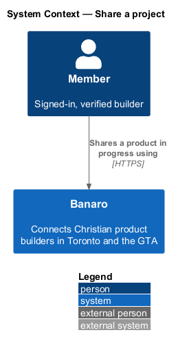
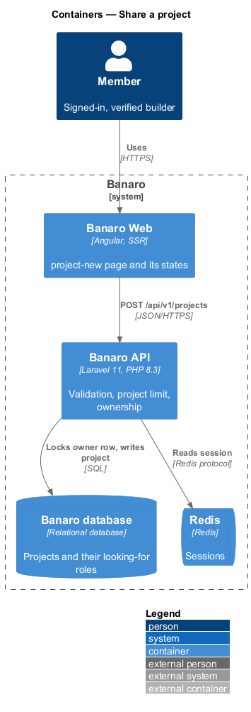
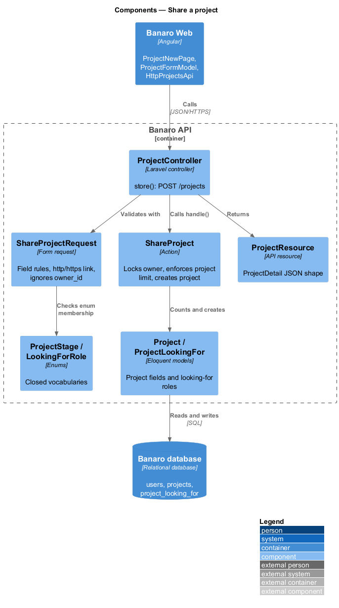
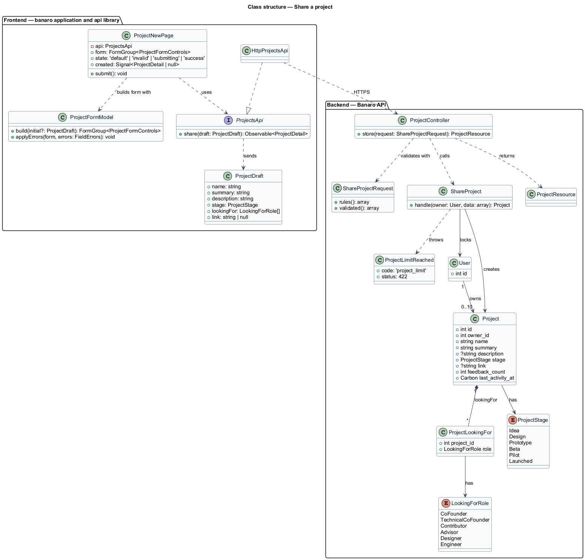
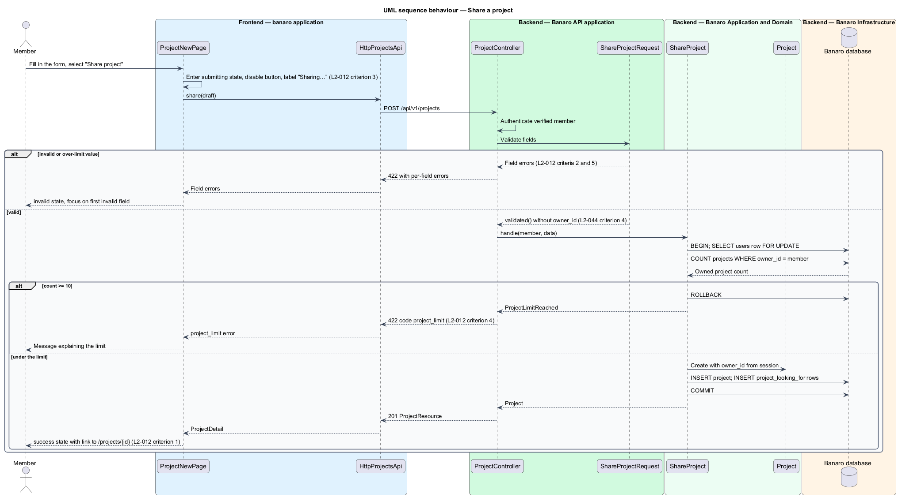

# Share a project

## Overview

The project showcase is the part of Banaro where builders in Toronto and the GTA show what they are
making. This feature lets a member publish a new project at `/projects/new`. It belongs to the
`projects` subsystem. Every other feature of the subsystem starts from a project that this feature
creates: `view-project` shows it, `browse-projects` lists it, and `give-feedback` and `offer-to-help`
attach input to it.

Terms used in this design:

- **project** — product in progress that one member shares on Banaro
- **owner** — member who shared a project and alone may change or delete it
- **one-line description** — single sentence that says what the project does; shown on cards
- **stage** — closed value that says how far the project has come: Idea, Design, Prototype, Beta,
  Pilot or Launched
- **looking for** — set of roles the owner wants help from: Co-founder, Technical co-founder,
  Contributor, Advisor, Designer, Engineer; the set may be empty
- **project limit** — maximum of 10 projects that one member may own at a time

A member fills in the form and selects "Share project". The Banaro API validates every field, checks
the project limit and stores the project with the member as owner. The page then shows its `success`
state, which links to the new project page.

## Description

The slice runs from the `project-new` page in Banaro Web through the Banaro API to the Banaro
database. No e-mail or queued work is involved.

### Frontend — `banaro` application and libraries

- **`ProjectNewPage`** (`pages/project-new/`) — routed page for `/projects/new`, behind the
  `authGuard` from the `api` library. It has the `default`, `invalid`, `submitting` and `success`
  states of the mock. It builds its reactive form with `ProjectFormModel` and submits through the
  projects contract.
  - In the `submitting` state the "Share project" button is disabled and reads "Sharing…". A second
    submission cannot start (`L2-012` criterion 3).
  - On 422 it maps each field error to its control and shows the "Fix these before continuing"
    summary. Focus moves to the first invalid field (`L2-012` criterion 2).
  - On 422 with code `project_limit` it shows a form-level message that explains the limit
    (`L2-012` criterion 4). The copy is `<TO SUPPLY>`.
  - On 201 it shows the `success` state. The "View {project}" action links to `/projects/{id}` from
    the response (`L2-012` criterion 1).
- **`ProjectFormModel`** (`app/shared/`) — helper that builds the typed reactive form shared with
  `ProjectEditPage` (`edit-and-delete-project`). It mirrors the server limits as client hints:
  `maxlength` 80, 140 and 2,000, and an `http`/`https` pattern on the link. The API remains the
  authority.
- **`ProjectsApi`** / **`PROJECTS_API`** / **`HttpProjectsApi`** (`api` library) — the contract, its
  injection token and its HTTP implementation. `share(draft)` sends `POST /api/v1/projects` and
  returns a `ProjectDetail`. `InMemoryProjectsApi` is the fake for component tests.
- **`ProjectDraft`** (`api` library model) — `name`, `summary` (one-line description),
  `description`, `stage`, `lookingFor` (array of `LookingForRole`) and `link`.
- **`ProjectStage`** and **`LookingForRole`** (`api` library models) — string unions that match the
  backend enums.

### Backend — Banaro API

- **`ProjectController`** (`Controllers/Api/V1/Projects/`) — `store()` handles `POST /projects`. The
  route is in `routes/api.php`, so it requires a verified member. It calls `ShareProject` and returns
  a `ProjectResource` with status 201.
- **`ShareProjectRequest`** (`Requests/Projects/`) — form request with these rules (`L2-012`
  criterion 2):
  - `name`: required, string, at most 80 characters.
  - `summary`: required, string, at most 140 characters.
  - `description`: string, at most 2,000 characters. Whether it is required is `<TO SUPPLY>`.
  - `stage`: required, one of the `ProjectStage` cases.
  - `looking_for`: array, possibly empty, of distinct `LookingForRole` cases.
  - `link`: nullable, `url:http,https` (`L2-012` criterion 5).

  It accepts only these keys through `validated()`. An `owner_id` or other field in the body is
  ignored (`L2-044` criterion 4).
- **`ShareProject`** (`Actions/Projects/`) — creates the project in one database transaction:
  1. It locks the member's `users` row with `lockForUpdate()`. Two concurrent shares from one member
     therefore run one after another.
  2. It counts the member's projects. At 10 or more it throws `ProjectLimitReached`, which the
     exception handler renders as 422 with code `project_limit` (`L2-012` criterion 4).
  3. It creates the `Project` with `owner_id` taken from the session and `last_activity_at` set to
     now. It then writes one `project_looking_for` row per role (`L2-012` criterion 1).
- **`Project`** (`Models/`) — holds `owner_id`, `name`, `summary`, `description`, `stage`
  (`ProjectStage`), `link`, `feedback_count` and `last_activity_at`. It has `$fillable` limited to the
  editable fields, so `owner_id` is never mass-assigned.
- **`ProjectLookingFor`** (`Models/`) — one row per project and role, unique on
  (`project_id`, `role`). The `browse-projects` feature filters on it.
- **`ProjectStage`** and **`LookingForRole`** (`Enums/`) — closed vocabularies for stage and roles.
- **`ProjectResource`** (`Resources/Projects/`) — serializes the project, its owner summary and the
  viewer's permissions into the `ProjectDetail` shape that `view-project` also uses.

### Text handling

The API stores every text field as plain text. Angular interpolation encodes it on output, so markup
in a name or description shows as text (`L2-045` criterion 5).

### Open points

- Conflicts between `L2-012` and the `project-new` mock. Each needs a decision before implementation:
  - One-line description limit: 140 characters in `L2-012` criterion 1, 100 in the mock help text and
    error ("Shorten the summary to 100 characters or fewer"). `<TO SUPPLY>`.
  - Longer description: `L2-012` criterion 2 requires a "description"; the mock marks the longer
    description "(optional)". Which description criterion 2 means is `<TO SUPPLY>`.
  - Stage order: `L2-012` lists Beta before Pilot; the mock lists Pilot before Beta. `<TO SUPPLY>`.
  - "Looking for": `L2-012` allows zero roles; the mock adds a "Feedback only" option and requires at
    least one choice. `<TO SUPPLY>`.
  - Links: `L2-012` has one optional link; the mock has "Website" and "Code repository". `<TO SUPPLY>`.
  - Visibility: the mock offers "Everyone on Banaro" and "Members near me" (within 40 km). No L2
    requirement defines project visibility. `<TO SUPPLY>`.
- Copy for the `project_limit` message: `<TO SUPPLY>`; the mock has no state for it.
- The `success` mock says the project "will appear in Monday's co-founder suggestions". Whether
  projects feed the `matching` subsystem is `<TO SUPPLY>`; this design does not connect them.
- Project URL key: `L2-013` uses `/projects/{id}`; the mock manifest uses a slug
  (`/projects/psalter`). `<TO SUPPLY>`.

## Requirements

| L2 ID | Refines (L1) | Requirement |
|-------|--------------|-------------|
| `L2-012` | `L1-004` | A member shall be able to share a product in progress at `/projects/new`. |

The design realizes all five acceptance criteria of `L2-012`. The Description cites each criterion
where a component enforces it.

## Diagrams

### System context

A member shares a project through Banaro. No external system takes part in this slice.

### Containers

The `project-new` page in Banaro Web calls the Banaro API. The API checks the project limit and writes
the project to the Banaro database.

### Components

Inside the Banaro API, `ProjectController` validates with `ShareProjectRequest` and calls
`ShareProject`. The action locks the owner row, counts projects and writes `Project` and
`ProjectLookingFor` rows.

### Class structure

A `Project` belongs to one owner `User` and has many `ProjectLookingFor` rows. On the frontend,
`ProjectNewPage` depends on the `ProjectsApi` contract, not on `HttpProjectsApi`.

### Behaviour — share a project

The page submits the draft and enters its `submitting` state. The API answers with field errors, the
`project_limit` error or the created project, and the page shows the matching state.

