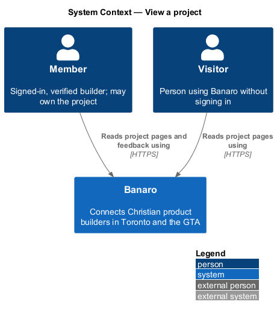
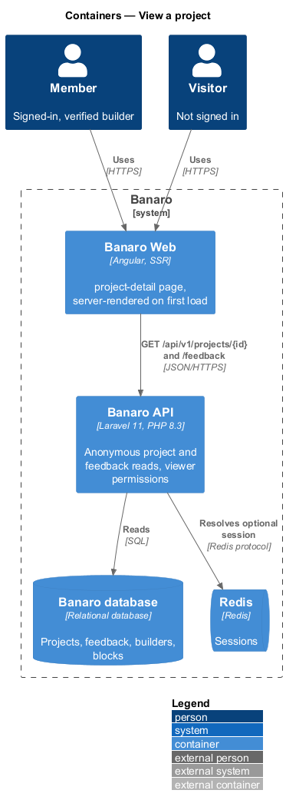
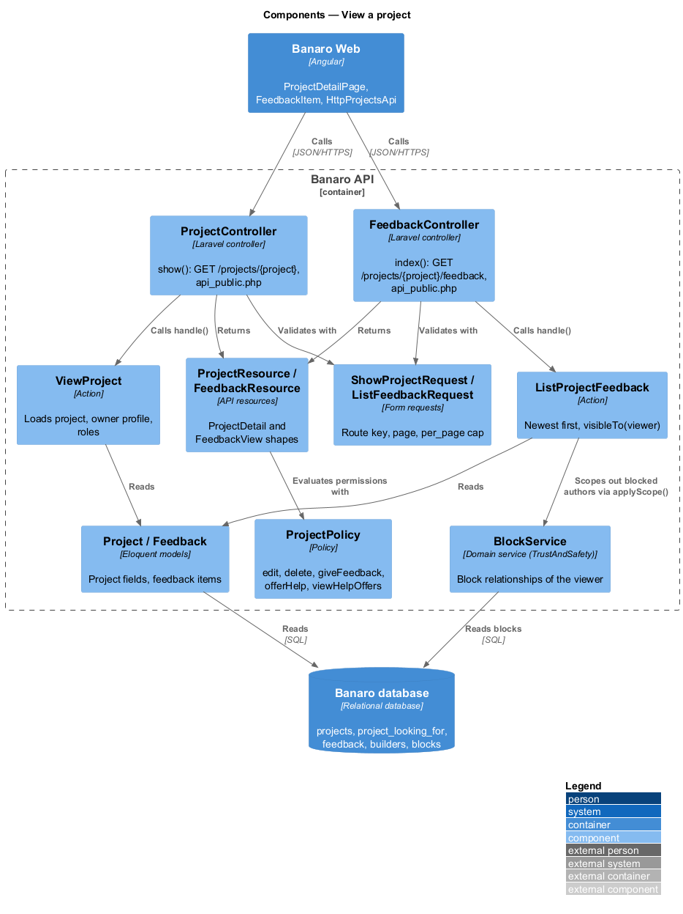
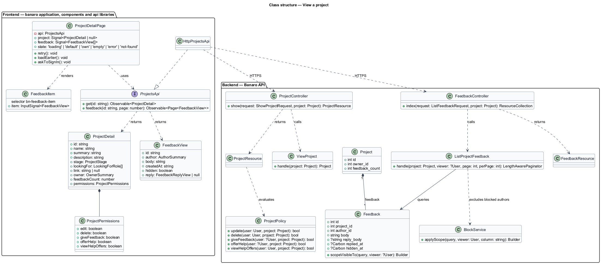
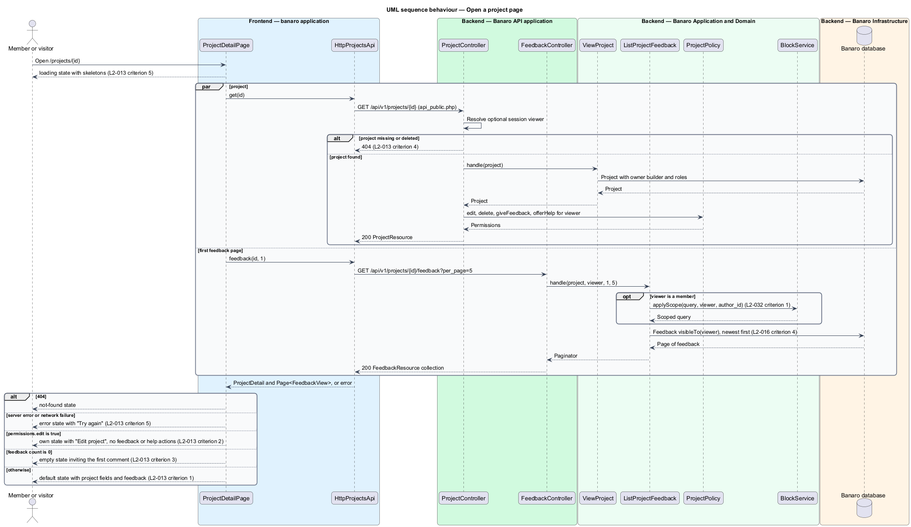
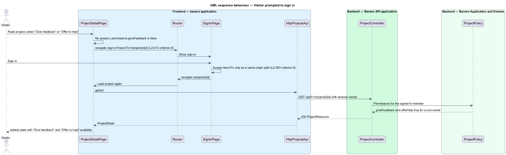

# View a project

## Overview

The project showcase gives every shared project its own page at `/projects/{id}`. This feature
renders that page for members and for visitors. It belongs to the `projects` subsystem. The page is
the hub of the subsystem: `give-feedback` and `offer-to-help` open their dialogs from it, and the owner
reaches `edit-and-delete-project` from it.

Terms used in this design:

- **project page** — public page at `/projects/{id}` that shows one project, its owner and its input
- **owner view** — `own` state of the project page, shown when the viewer owns the project
- **feedback item** — comment that a member other than the owner left on a project
- **hidden feedback item** — feedback item that the owner removed from the public view; it stays
  visible to its author and to administrators
- **viewer** — person reading the page: a visitor, a member, or the owner

Anyone may read a project. The Banaro API tells the page who the viewer is and which actions the
viewer may take. The page never decides ownership on its own. A visitor sees "Give feedback" and
"Offer to help" too, but selecting either one leads to sign-in and back to the project.

## Description

The slice runs from the `project-detail` page in Banaro Web through two anonymous read endpoints of
the Banaro API to the Banaro database. It writes nothing.

### Frontend — `banaro` application and libraries

- **`ProjectDetailPage`** (`pages/project-detail/`) — routed page for `/projects/{id}`, rendered on
  the server for the first load. It has the `default`, `own`, `empty`, `loading`, `error` and
  `not-found` states of the mock.
  - It loads the project and the first page of feedback in parallel. Its `loading` state shows
    skeletons sized to the final layout (`L2-013` criterion 5).
  - It shows name, owner (linked to `/builders/{id}`), one-line description, description, stage,
    "looking for", link and feedback count (`L2-013` criterion 1).
  - When `permissions.edit` is true it renders the `own` state with "Edit project". It hides "Give
    feedback" and "Offer to help" (`L2-013` criterion 2).
  - With a feedback count of 0 it renders the `empty` state "Be the first to say something" with
    "Give the first feedback" (`L2-013` criterion 3).
  - On 404 it renders the `not-found` state with "Browse projects" and "Share a project" (`L2-013`
    criterion 4). On any other failure it renders the `error` state with "Try again" (`L2-013`
    criterion 5).
  - For a visitor, "Give feedback" and "Offer to help" navigate to
    `/sign-in?returnTo=/projects/{id}`. Sign-in returns to that same-origin path (`L2-013`
    criterion 6, `L2-003` criterion 6).
  - "Show {n} earlier comments" loads the next feedback page and appends it.
- **`FeedbackItem`** (`components` library, selector `bn-feedback-item`) — renders one feedback item:
  author avatar or initials, name, relative time, body and the owner's reply when present. It marks a
  hidden item for the viewers who may still see it. The component is new, so it adds the
  `FeedbackItem` and `FeedbackList` perf-test scenarios in `frontend/projects/perf-test`.
- **`ProjectsApi`** / **`PROJECTS_API`** / **`HttpProjectsApi`** (`api` library) — `get(id)` sends
  `GET /api/v1/projects/{id}` and returns a `ProjectDetail`. `feedback(id, page)` sends
  `GET /api/v1/projects/{id}/feedback?page={n}&per_page=5` and returns a `Page<FeedbackView>`.
- **`ProjectDetail`** (`api` library model) — project fields, `owner` (`builderId`, `name`,
  `photoUrl`, `role`, `neighbourhood`), `feedbackCount`, `updatedAt` and `permissions` (`edit`,
  `delete`, `giveFeedback`, `offerHelp`, `viewHelpOffers`).
- **`FeedbackView`** (`api` library model) — `id`, `author`, `body`, `createdAt`, `hidden` and
  `reply` (`body`, `repliedAt`) or `null`.

### Backend — Banaro API

- **`ProjectController`** (`Controllers/Api/V1/Projects/`) — `show()` handles
  `GET /projects/{project}`. The route is in `routes/api_public.php`, so a visitor may call it. The
  Sanctum stateful guard still resolves a member when a session cookie is present. The method calls
  `ViewProject` and returns a `ProjectResource`.
- **`FeedbackController`** (`Controllers/Api/V1/Projects/`) — `index()` handles
  `GET /projects/{project}/feedback`, also in `routes/api_public.php`. It calls `ListProjectFeedback`
  and returns a `FeedbackResource` collection.
- **`ShowProjectRequest`** and **`ListFeedbackRequest`** (`Requests/Projects/`) — validate the route
  key and `page`. `per_page` defaults to 12 and is capped at 50 (`L2-047` criterion 4).
- **`ViewProject`** (`Actions/Projects/`) — loads the project with its owner's `Builder` profile and
  its looking-for roles in one eager-loaded query. Route-model binding returns 404 for an id that does
  not exist or a project that was deleted (`L2-013` criterion 4).
- **`ListProjectFeedback`** (`Actions/Projects/`) — returns feedback newest first, through the
  `Feedback::visibleTo(?User)` query scope:
  - It includes items that are not hidden.
  - It includes hidden items whose author is the viewer, and all hidden items for an administrator
    (`L2-016` criterion 4).
  - For a member viewer, it excludes items whose author is in a block relationship with the viewer.
    `Feedback` uses the `ExcludesBlockedUsers` trait, whose `withoutBlockedFor()` scope calls
    `BlockService::applyScope()` (`Services/TrustAndSafety`) on `author_id`. The `block-builder`
    feature owns both (`L2-032` criterion 1, `L2-044` criterion 5).
- **`ProjectPolicy`** (`Policies/`) — `update`, `delete` and `viewHelpOffers` allow only the owner.
  `giveFeedback` and `offerHelp` allow a verified member who is not the owner. A visitor gets `false`
  for each.
- **`ProjectResource`** (`Resources/Projects/`) — serializes the project and the `permissions` block,
  evaluated with `ProjectPolicy` for the optional viewer. Owner fields respect the owner's privacy
  settings (`L2-036` criterion 1).
- **`FeedbackResource`** (`Resources/Projects/`) — serializes one feedback item into the
  `FeedbackView` shape. `hidden` appears only for viewers who may see hidden items.

### Open points

- Conflicts between `L2-013` and the `project-detail` mock:
  - `L2-013` criterion 2 shows "Edit" and "Delete" in the owner view; the `own` mock shows only "Edit
    project", and the manifest opens `delete-project` from `project-edit`. `<TO SUPPLY>`.
  - `L2-013` criterion 1 lists a help-offer section; the `default` mock has none, and the `own` mock
    shows only an "Offers to help" count. The owner's offer list is unmocked; see `offer-to-help`.
  - The mock shows fields with no requirement: screens, "Built with", "Licence", a second link,
    owner insights ("Views, last 30 days", "Saved by"), a count of comments new since the owner's last visit and
    a feedback kind label. `<TO SUPPLY>`.
  - Stage and "looking for" in the mock carry free-text qualifiers ("1,900 beta users",
    "Contributors (open source)"), while `L2-012` defines closed lists. `<TO SUPPLY>`.
  - The `not-found` mock says a project "may have been … made private by its builder". No L2
    requirement defines private projects. `<TO SUPPLY>`.
- Page size for feedback: the mock shows the five most recent items; `L2-013` names no number. The
  design follows the mock with `per_page=5`.
- Whether a project whose owner is in a block relationship with the viewer returns 404: `<TO SUPPLY>`.
- Owner link when the owner's profile is "Members only" and the viewer is a visitor (`L2-036`
  criterion 2): `<TO SUPPLY>`.
- Project URL key (id or slug, as in the manifest route `/projects/psalter`): `<TO SUPPLY>`.

## Requirements

| L2 ID | Refines (L1) | Requirement |
|-------|--------------|-------------|
| `L2-013` | `L1-004` | Members and visitors shall be able to read a project's page at `/projects/{id}`. |

The design realizes all six acceptance criteria of `L2-013`. The Description cites each criterion
where a component enforces it.

## Diagrams

### System context

Members and visitors read project pages in Banaro. No external system takes part in this slice.

### Containers

Banaro Web renders the project page, on the server for the first load, and calls two anonymous read
endpoints of the Banaro API. The API reads projects, feedback and blocks from the Banaro database.

### Components

Inside the Banaro API, `ProjectController` and `FeedbackController` each call one read action.
`ProjectPolicy` computes the viewer's permissions, and `BlockService` filters the feedback list.

### Class structure

A `Project` has one owner and many `Feedback` items. `ProjectDetailPage` depends on the
`ProjectsApi` contract and renders feedback with the `FeedbackItem` component.

### Behaviour — open a project page

The page loads the project and its first feedback page in parallel. The response's permissions select
the `own` or `default` state, and a 404 or a failure selects `not-found` or `error`.

### Behaviour — visitor asks to give feedback or help

A visitor selecting "Give feedback" or "Offer to help" goes to sign-in with a `returnTo` path. After
sign-in the browser returns to the project page, which now shows the member's actions.

