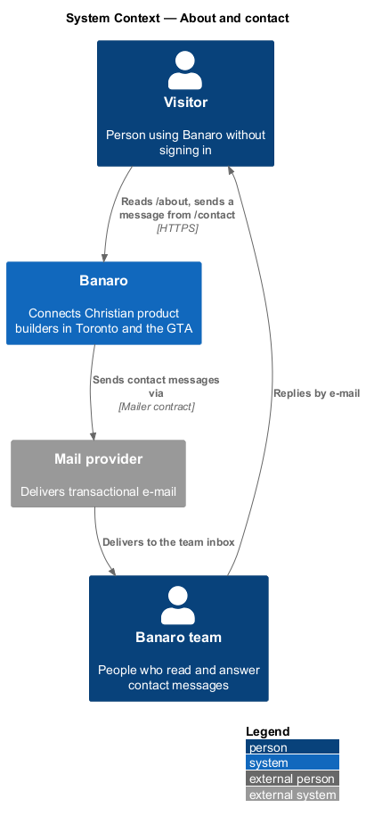
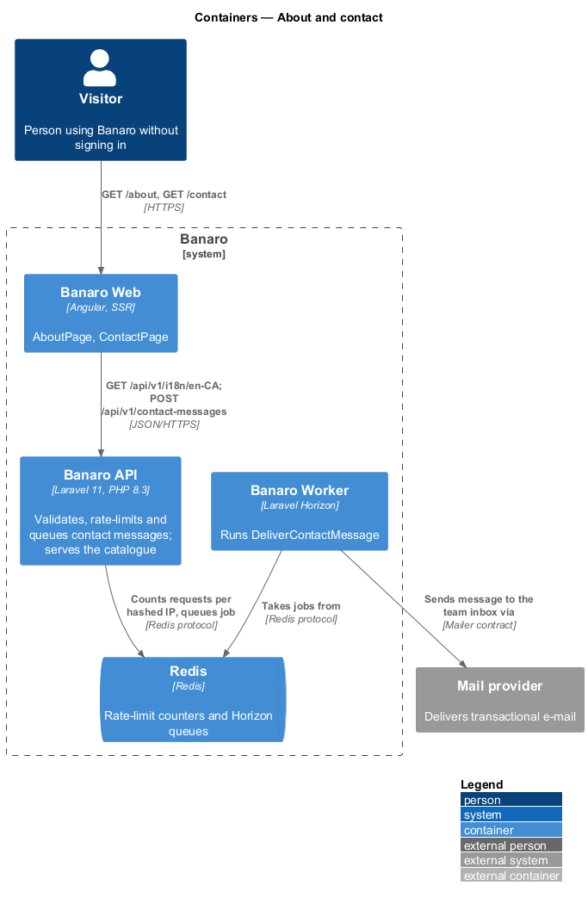
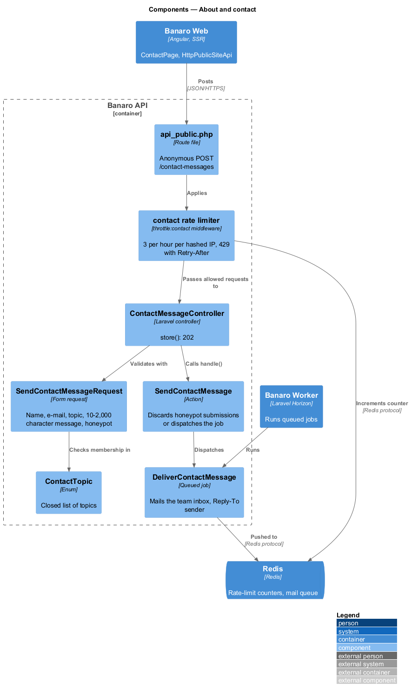
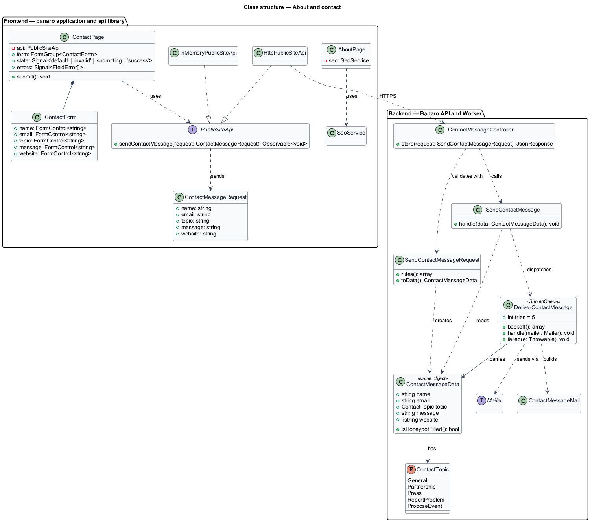
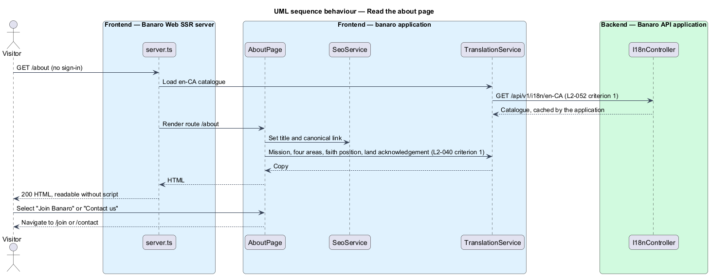
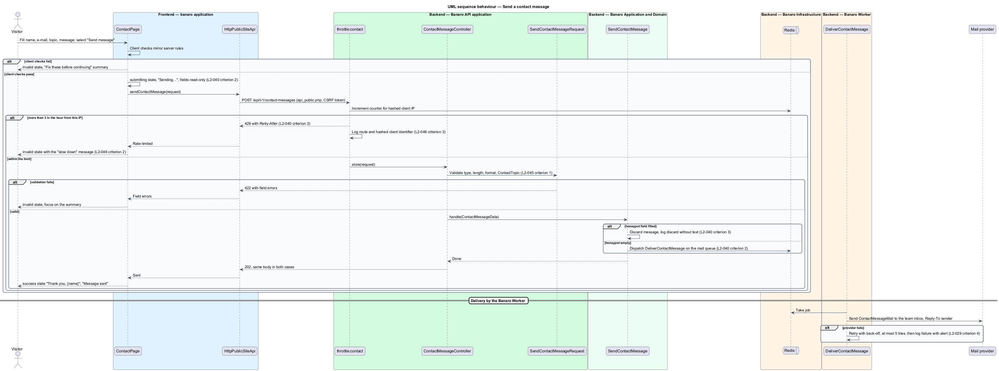

# About and contact

## Overview

Visitors who are deciding whether to join Banaro want to know who runs it, what it stands for and how
to reach a person. This feature provides two public pages in the `public-site` subsystem: the about
page at `/about` and the contact page at `/contact`. Neither page requires sign-in.

Terms used in this design:

- **about page** — static page that describes the mission, the four areas, the faith position and the
  land acknowledgement
- **contact message** — name, e-mail address, topic and message text that a person sends to the
  Banaro team through the contact form
- **topic** — closed category of a contact message
- **team inbox** — e-mail address at which the Banaro team receives contact messages
- **honeypot** — form field hidden from people and left empty by them, which automated form fillers
  tend to complete
- **discarded message** — contact message that the API accepts with a normal-looking response but
  never forwards to the team

The about page is static copy. Banaro Web renders it on the server from the translation catalogue,
so it needs no data request. The contact form posts to an anonymous endpoint. The Banaro API
validates the message, checks the honeypot and the per-address rate limit, and queues a job. The
Banaro Worker then e-mails the message to the team inbox. The form never waits for the e-mail itself.

## Description

The about page touches only Banaro Web and the translation catalogue. The contact slice runs from the
contact page through the Banaro API and Redis to the Banaro Worker and the mail provider.

### Frontend — `banaro` application and libraries

- **`AboutPage`** (`pages/about/`, selector `bn-about-page`) — routed page for `/about` with one
  `default` state. It renders the headline "Build with believers down the street", the sections "Why
  Banaro", "What you can do here", "Who it is for" and "Where we are", and the "Join Banaro" and
  "Contact us" actions (`L2-040` criterion 1). All copy comes from the `en-CA` catalogue through
  `TranslationService` (`api` library, `lib/i18n/`), which the `localize-and-format` feature owns
  (`L2-052` criterion 1). It sets its title and canonical link through `SeoService`.
- **`ContactPage`** (`pages/contact/`, selector `bn-contact-page`) — routed page for `/contact` with
  the `default`, `invalid`, `submitting` and `success` states (`L2-040` criterion 2). It holds a typed
  reactive form with these controls:
  - `name` — "Your name"
  - `email` — "E-mail"
  - `topic` — "Topic", a select that starts on "Choose one"
  - `message` — "Message", a text area of 10 to 2,000 characters
  - `website` — the honeypot. It is visually hidden, removed from the tab order (`tabindex="-1"`),
    marked `aria-hidden="true"` and given `autocomplete="off"`.
- **Contact states**:
  - `default` — focus starts on "Your name". Enter submits the form.
  - `invalid` — client checks mirror the server rules. The page shows the "Fix these before
    continuing" summary (`role="alert"`) with one link per invalid field. Each field shows its
    message, for example "Enter an e-mail address like name@example.com", "Choose a topic" or "Write a
    message so we know how to help". Focus moves to the summary. A 422 response fills the same summary
    from the API's field errors.
  - `submitting` — the fields become read-only. The button shows "Sending…" with `aria-busy="true"`
    and is disabled, so a second submission cannot start.
  - `success` — the form is replaced by "Thank you, {name}" and "Message sent", naming the address
    that receives the reply, with "Back to the home page".
- **Rate-limit message** — a 429 response shows the specific "slow down" message from `L2-046`
  criterion 2 in the error summary. The manifest records that failed submissions use the `invalid`
  state's summary; the contact page has no separate `error` state.
- **`PublicSiteApi`** / **`PUBLIC_SITE_API`** / **`HttpPublicSiteApi`** (`api` library) — the
  contract shared with the `view-home-page` feature. `sendContactMessage(request)` sends
  `POST /api/v1/contact-messages` with a `ContactMessageRequest` and returns `void`.
- **`ContactMessageRequest`** (`api` library model) — `name`, `email`, `topic`, `message` and
  `website`.
- **`InMemoryPublicSiteApi`** (`api` library, `lib/testing/`) — records sent messages and can return
  422 or 429 on demand.

### Backend — Banaro API

- **Route** — `POST /contact-messages` is in `routes/api_public.php`, so it accepts anonymous
  requests. It carries the `throttle:contact` middleware. The route keeps CSRF protection
  (`L2-045` criterion 2), because Banaro Web sends the CSRF token for visitors too.
- **`contact` rate limiter** — defined in `AppServiceProvider` with
  `Limit::perHour(3)->by(hash(client IP))`. The fourth request from one IP within an hour returns
  429 with `Retry-After` (`L2-040` criterion 3). The limit log line carries the route and the hashed
  client identifier, not the raw IP (`L2-046` criterion 3).
- **`ContactMessageController`** (`Controllers/Api/V1/PublicSite/`) — `store()` validates with
  `SendContactMessageRequest`, calls `SendContactMessage` and returns 202 with an empty JSON object.
  The response is identical whether the message was queued or discarded.
- **`SendContactMessageRequest`** (`Requests/PublicSite/`) — form request with these rules
  (`L2-045` criterion 1):
  - `name` — required string; maximum length `<TO SUPPLY>`.
  - `email` — required, valid e-mail format.
  - `topic` — required, a value of `ContactTopic`.
  - `message` — required string of 10 to 2,000 characters.
  - `website` — nullable string; any value marks the request as automated.
  On failure it returns 422 with field errors.
- **`ContactTopic`** (`Enums/`) — `General`, `Partnership`, `Press`, `ReportProblem` and
  `ProposeEvent`, the five topics in `L2-040` criterion 2.
- **`SendContactMessage`** (`Actions/PublicSite/`) — `handle(ContactMessageData)`:
  1. When `website` holds any value, it discards the message, logs the discard without the message
     text, and returns (`L2-040` criterion 3).
  2. Otherwise it dispatches `DeliverContactMessage` on the `mail` queue (`L2-040` criterion 2).
- **`ContactMessageData`** (`Actions/PublicSite/`) — read-only value object built from the validated
  request. It stores message text as plain text (`L2-045` criterion 5).
- **`DeliverContactMessage`** (`Jobs/PublicSite/`) — queued job that the Banaro Worker runs. It sends
  `ContactMessageMail` to the team inbox through the `Mailer` contract, with `Reply-To` set to the
  sender. It retries with back-off up to five times and then logs the failure with an alert, as for
  other transactional e-mail (`L2-029` criterion 4).
- **`ContactMessageMail`** (`resources/views/emails/`) — plain-text e-mail that encodes the sender's
  text on output.

### Open points

- Topic list: `L2-040` criterion 2 names General, Partnership, Press, Report a problem and Propose an
  event. The `contact` mocks show "A question about Banaro", "Report a concern", "Partner on an event",
  "Press and speaking" and "Something else". The agreed list and labels: `<TO SUPPLY>`.
- The `contact/success` mock says "A copy is in your inbox". `L2-040` does not mention a copy to the sender.
  Sending a copy to an unverified address from an anonymous form also lets the form send e-mail to
  third parties. Whether to send a copy: `<TO SUPPLY>`.
- The `contact/invalid` mock shows no error for an empty "Your name". Whether the name is required, and
  its maximum length: `<TO SUPPLY>`.
- Copy for the message-length errors (under 10 or over 2,000 characters): `<TO SUPPLY>`.
- `L2-040` criterion 1 asks for a statement of faith position and a land acknowledgement on `/about`.
  The `about` mock has no distinct faith-position section; "Who it is for" says members "follow
  Jesus". The land acknowledgement appears only in the shared footer, which `docs/mocks/README.md`
  marks optional. The faith-position copy and the acknowledgement's placement: `<TO SUPPLY>`.
- Team inbox address: `<TO SUPPLY>`.
- Whether contact messages are also stored in the Banaro database, and for how long: `<TO SUPPLY>`.
  This design keeps them only in the queued job.

## Requirements

| L2 ID | Refines (L1) | Requirement |
|-------|--------------|-------------|
| `L2-040` | `L1-012` | Visitors shall be able to read about Banaro and contact its team. |

The design realizes all three acceptance criteria of `L2-040`. The topic list in criterion 2 and the
faith-position copy in criterion 1 depend on the open points above.

## Diagrams

### System context

A visitor reads the about page and sends a contact message through Banaro. Banaro forwards each
accepted message to the team inbox through the mail provider.

### Containers

Banaro Web renders both pages. The Banaro API validates and rate-limits contact messages, using Redis
for the counter and the queue. The Banaro Worker sends the e-mail.

### Components

Inside the Banaro API, the `contact` rate limiter runs before `ContactMessageController`. The
controller validates with `SendContactMessageRequest` and calls `SendContactMessage`, which discards
honeypot submissions or queues `DeliverContactMessage`.

### Class structure

`ContactPage` depends on the `PublicSiteApi` contract. On the backend, the action takes a
`ContactMessageData` value object with a `ContactTopic` and dispatches the delivery job.

### Behaviour — read the about page

The SSR server renders the about page from the translation catalogue. No feature-specific API call
takes place.

### Behaviour — send a contact message

The page validates, then posts the message. The API rejects invalid input with 422 and a fourth
message within the hour with 429. It returns the same 202 for a queued message and a discarded
honeypot message. The worker delivers the queued message to the team inbox.

