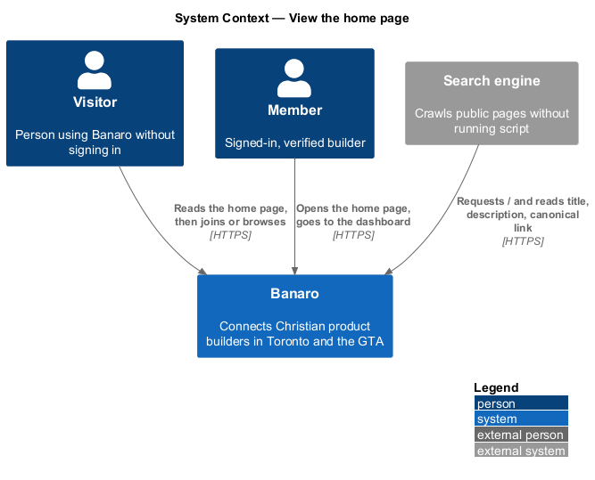
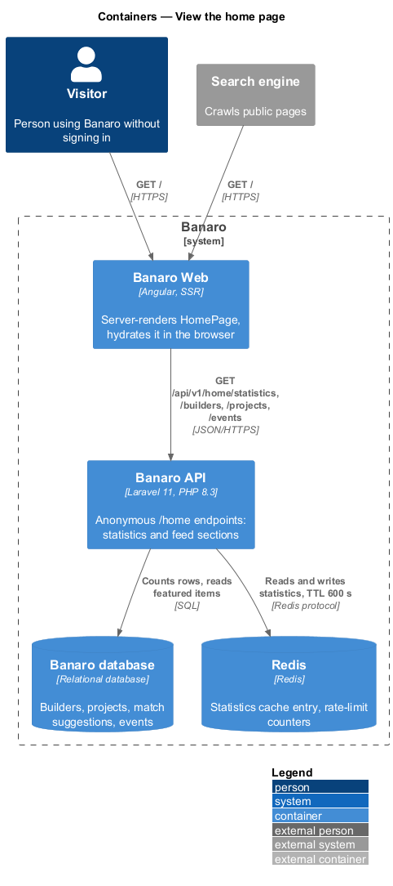
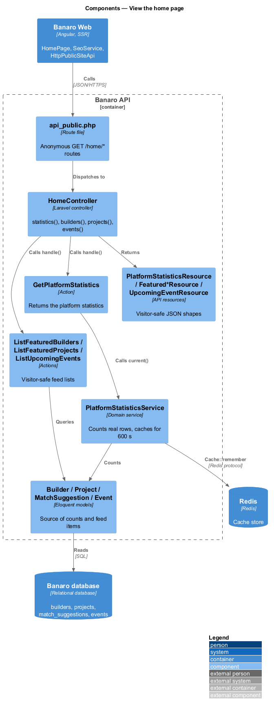
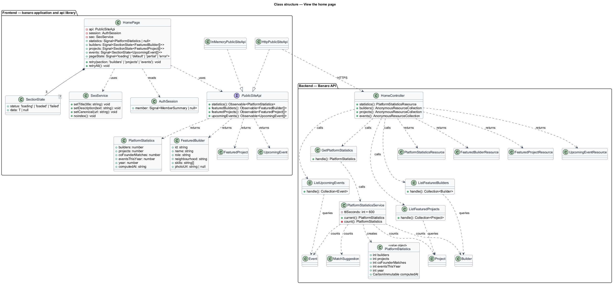
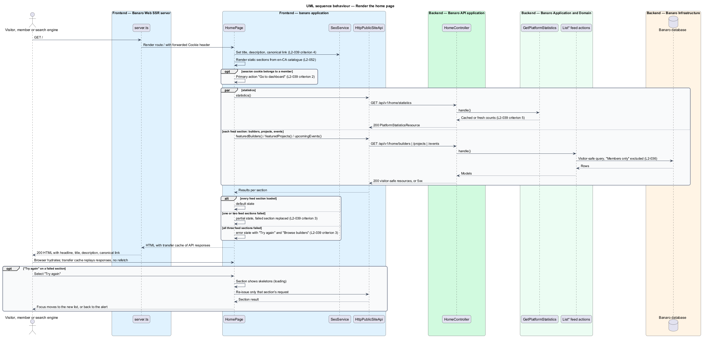
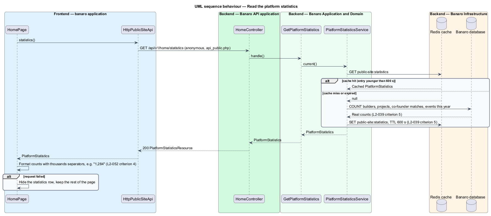

# View the home page

## Overview

The home page at `/` is the front door of Banaro for visitors who have not joined yet. It explains
what Banaro is, shows that real builders, projects and events exist nearby, and leads to joining or
browsing. It belongs to the `public-site` subsystem, alongside the about, contact and privacy pages.

Terms used in this design:

- **hero** — top section with the headline "Build what matters, with believers down the street.", the
  sub-copy and the "Join Banaro" and "Browse builders" actions
- **platform statistics** — four counts shown under the hero: builders, projects, co-founder matches
  and events in the current year
- **feed section** — section of the home page filled from live data: featured builders, the project
  showcase or upcoming gatherings
- **static section** — section whose copy ships with the page: the hero, the four areas, the
  testimonial, the verse, the matching invitation and the footer
- **partial state** — page state in which one or two feed sections failed and the others loaded
- **server-side rendering (SSR)** — rendering of the page to HTML in the Banaro Web server before the
  browser runs any script
- **hydration** — step in which the browser application takes over the server-rendered HTML without
  re-rendering it

Search engines and link previews read the page without running script, so Banaro Web renders it on
the server. The statistics come from real counts. The Banaro API caches them in Redis for at most
10 minutes, so a burst of visitors does not repeat four count queries per request. Each feed section
loads through its own request, so one failed section does not take the others down.

A signed-in member who opens `/` sees the same page with "Go to dashboard" as the primary action. The
shared header then shows the member's avatar and unread counts.

## Description

The slice runs from the `HomePage` in Banaro Web, rendered first by the SSR server, through four
anonymous endpoints of the Banaro API to the Banaro database and the Redis cache.

### Frontend — `banaro` application and libraries

- **`server.ts`** (SSR server) — Angular SSR entry point that renders `/` to HTML. During the render
  it calls the Banaro API with the incoming request's cookies forwarded, so a signed-in member
  receives the member variant on first paint. It caches no member-specific HTML.
- **`app.config.server.ts`** — server providers. It registers the HTTP interceptor that forwards the
  `Cookie` header during SSR and binds `PUBLIC_SITE_API` to `HttpPublicSiteApi`.
- **`HomePage`** (`pages/home/`, selector `bn-home-page`) — routed page for `/`. It renders the static
  sections from the `en-CA` translation catalogue (`L2-052`) and requests the statistics and the three
  feed sections in parallel. It holds one state signal per feed section: `loading`, `loaded` or
  `failed`. From those it derives the page state (`L2-039` criterion 3):
  - `loading` — each pending feed section shows skeletons.
  - `default` — every section loaded.
  - `partial` — at least one feed section failed and at least one loaded. The failed section is
    replaced and the loaded sections stay. The mock and the specification differ on what replaces it;
    see Open points.
  - `error` — all three feed sections failed. One "Featured builders, projects and events" block with
    "We couldn't load this part of Banaro", "Try again" and "Browse builders" replaces them. The hero,
    the four areas, the verse and the matching invitation stay.
- **Primary action switch** — `HomePage` reads the session from the `AuthSession` service
  (`api` library, `lib/auth/`). A visitor sees "Join Banaro" and "Browse builders". A member sees
  "Go to dashboard" (`L2-039` criterion 2). The header avatar and unread counts belong to the shell
  header and the `in-app-notifications` feature.
- **`SeoService`** (`shared/`) — sets the document title, the `description` meta tag and the
  `<link rel="canonical">` element through Angular `Title`, `Meta` and `DOCUMENT`. During SSR these
  land in the HTML response, so a crawler reads them without running script (`L2-039` criterion 4).
- **HTTP transfer cache** — `provideClientHydration()` with the HTTP transfer cache replays the SSR
  responses in the browser. Hydration therefore issues no second set of requests.
- **`PublicSiteApi`** / **`PUBLIC_SITE_API`** / **`HttpPublicSiteApi`** (`api` library) — the
  contract, its injection token and its HTTP implementation. It has four methods:
  - `statistics()` sends `GET /api/v1/home/statistics` and returns `PlatformStatistics`.
  - `featuredBuilders()` sends `GET /api/v1/home/builders` and returns `FeaturedBuilder[]`.
  - `featuredProjects()` sends `GET /api/v1/home/projects` and returns `FeaturedProject[]`.
  - `upcomingEvents()` sends `GET /api/v1/home/events` and returns `UpcomingEvent[]`.
- **`InMemoryPublicSiteApi`** (`api` library, `lib/testing/`) — fake of the contract with the mock
  cast. It can fail any one method, which drives the `partial` and `error` states in tests.
- **Models** (`api` library) — `PlatformStatistics` holds `builders`, `projects`, `coFounderMatches`,
  `eventsThisYear`, `year` and `computedAt`. `FeaturedBuilder`, `FeaturedProject` and
  `UpcomingEvent` hold only fields that a visitor may see.
- **Number formatting** — counts render with thousands separators, for example "1,284" (`L2-052`
  criterion 4). Event dates render in America/Toronto (`L2-052` criterion 2).

### Backend — Banaro API

- **Routes** — the four `GET /home/*` routes are in `routes/api_public.php`, so they accept anonymous
  requests. They fall under the general rate limit (`L2-046`).
- **`HomeController`** (`Controllers/Api/V1/PublicSite/`) — `statistics()`, `builders()`,
  `projects()` and `events()`. Each method calls one action and returns a resource. No method reads a
  request body.
- **`GetPlatformStatistics`** (`Actions/PublicSite/`) — returns the statistics from
  `PlatformStatisticsService`.
- **`PlatformStatisticsService`** (`Services/PublicSite/`) — `current()` wraps the four count queries
  in `Cache::remember('public-site:statistics', 600, ...)` on the Redis cache store. The time to live
  of 600 seconds bounds staleness at 10 minutes (`L2-039` criterion 5). The counts come from the
  `Builder`, `Project`, `MatchSuggestion` and `Event` tables, never from constants. Their exact
  definitions are open; see Open points.
- **`ListFeaturedBuilders`**, **`ListFeaturedProjects`**, **`ListUpcomingEvents`**
  (`Actions/PublicSite/`) — each returns a short list for its section. Each excludes profiles marked
  "Members only" (`L2-036` criterion 2), suspended or deleted accounts, and moderated content.
  `ListUpcomingEvents` returns the next scheduled events by `starts_at`. The selection rule for
  featured builders and projects is open.
- **`PlatformStatisticsResource`**, **`FeaturedBuilderResource`**, **`FeaturedProjectResource`**,
  **`UpcomingEventResource`** (`Resources/PublicSite/`) — visitor-safe JSON shapes. A builder carries
  name, role, neighbourhood, skills and photo URL only, matching the signed-out directory card
  (`L2-009` criterion 6). No resource carries a match score, an exact distance or an online status.

### Failure handling

Each feed request fails or succeeds on its own. A failed request sets its section to `failed`, and
"Try again" on that section re-issues only its request. Focus then moves to the new list, or back to
the section's alert if it fails again. When the statistics request fails, the statistics row is
hidden and the rest of the page renders. When the SSR render cannot reach the API, the SSR server
returns the page with the failed sections already in their failed state, and the browser retries on
hydration.

### Open points

- Partial-state presentation: `L2-039` criterion 3 says the failed section is hidden "without an error
  message block". The `home/partial` mock shows an alert "We couldn't load projects" with "Try again"
  and "See all 312 projects". Which one wins: `<TO SUPPLY>`.
- Statistics definitions: what counts as a builder (verified accounts only, public profiles only),
  as a project (published only) and as a co-founder match: `<TO SUPPLY>`.
- Selection rule and count for featured builders and featured projects (the mock shows six builders
  and four projects): `<TO SUPPLY>`. Number of upcoming events shown (four in the mock):
  `<TO SUPPLY>`.
- The featured builder cards in the mock show "Open to co-founding", which the signed-out directory
  card in `L2-009` criterion 6 does not list. Whether "Open to" is visitor-visible: `<TO SUPPLY>`.
- The matching illustration in the mock shows "26.9 km" and "17.8 km". `L2-052` criterion 3 shows no
  decimal above 10 km. The illustration copy: `<TO SUPPLY>`.
- Testimonial source (fixed copy or administrator-managed): `<TO SUPPLY>`. This design treats it as
  catalogue copy.
- Page title, meta description copy and the production canonical origin: `<TO SUPPLY>`.
- No mock shows the member variant of `/` ("Go to dashboard"). Its layout: `<TO SUPPLY>`.
- No mock shows a failed statistics request. This design hides the statistics row; confirmation:
  `<TO SUPPLY>`.

## Requirements

| L2 ID | Refines (L1) | Requirement |
|-------|--------------|-------------|
| `L2-039` | `L1-012` | The public home page at `/` shall explain Banaro and lead to joining or browsing. |

The design realizes all five acceptance criteria of `L2-039`. The partial-state presentation of
criterion 3 depends on the open point above.

## Diagrams

### System context

A visitor or a member opens the home page in Banaro. A search engine requests the same page and reads
the server-rendered headline, title, description and canonical link.

### Containers

Banaro Web renders the page on the server and calls four anonymous endpoints on the Banaro API. The
API reads counts and feed data from the Banaro database and caches the statistics in Redis.

### Components

Inside the Banaro API, `HomeController` calls one action per endpoint. `GetPlatformStatistics` reads
through `PlatformStatisticsService`, which holds the 10-minute cache.

### Class structure

`HomePage` depends on the `PublicSiteApi` contract and on `SeoService`. On the backend, each action
returns models that a visitor-safe resource serializes.

### Behaviour — render the home page

The SSR server renders the static sections, the statistics and the three feed sections in parallel.
Each feed section ends loaded or failed on its own, which yields the `default`, `partial` or `error`
state.

### Behaviour — read the platform statistics

`PlatformStatisticsService` returns the cached counts while the cache entry is younger than
10 minutes. On a miss it counts the real rows and stores the result for 600 seconds.

