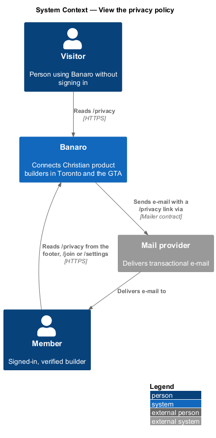
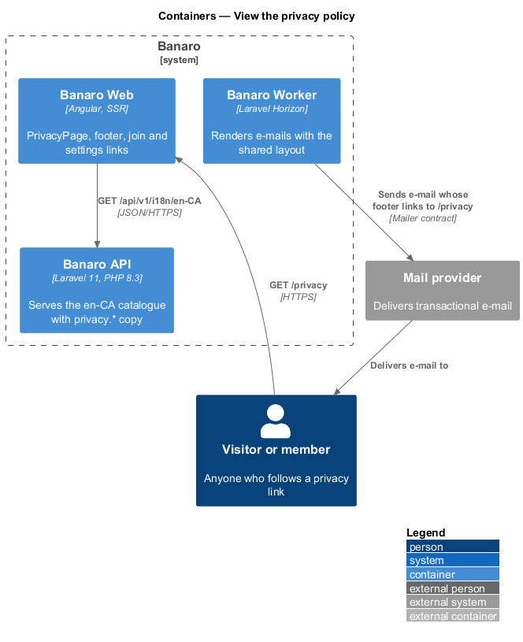
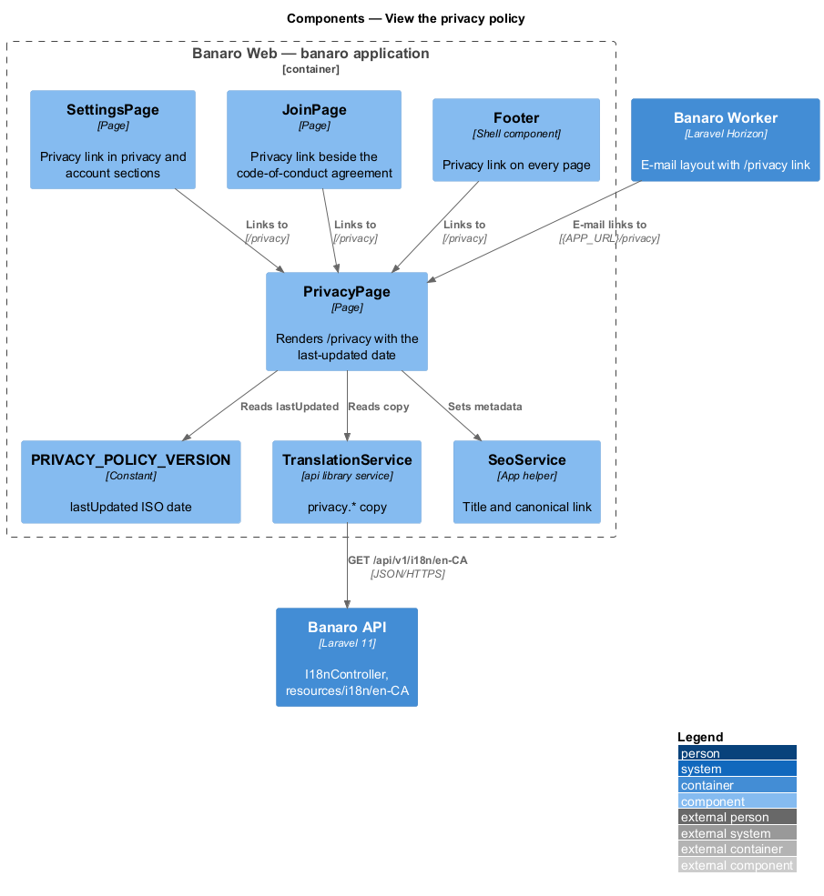
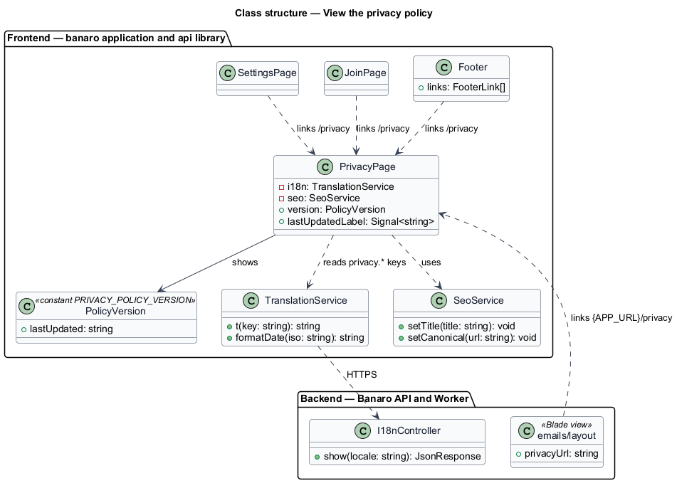
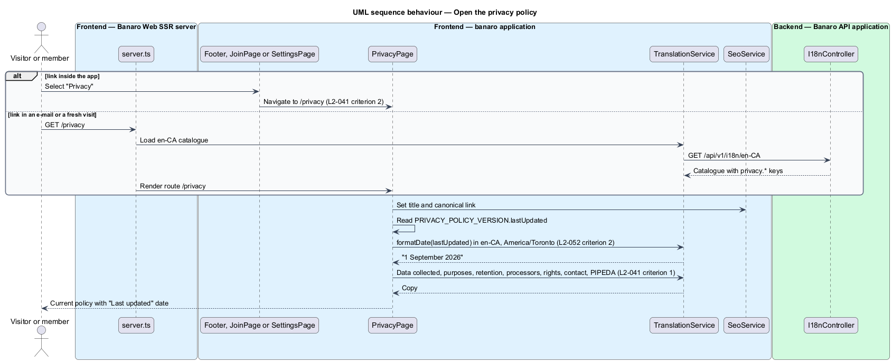

# View the privacy policy

## Overview

Banaro holds personal data about its members: names, e-mail addresses, neighbourhoods, skills,
projects and messages. Canadian privacy law and the trust of the community both call for a plain
statement of what Banaro holds, why, for how long and who else processes it. This feature provides
that statement as a public page at `/privacy`. It belongs to the `public-site` subsystem.

Terms used in this design:

- **privacy policy** — public statement of the data Banaro collects, its purposes, retention periods,
  processors, member rights and privacy contact
- **policy version** — one published wording of the privacy policy, identified by its "last updated"
  date
- **processor** — third party that handles personal data on Banaro's behalf, such as the mail
  provider
- **PIPEDA** — Personal Information Protection and Electronic Documents Act, the Canadian federal
  privacy law for private-sector organizations

The page is static. It has one `default` state and makes no feature-specific data request. Banaro Web
renders it on the server, so it is readable without script and fast from a link in an e-mail. Every
entry point links to the same `/privacy` path, which always shows the current policy version with
its "last updated" date.

## Description

The slice lives almost entirely in Banaro Web. The Banaro API serves the translation catalogue that
holds the copy, and the Banaro Worker's e-mail layout links to the page.

### Frontend — `banaro` application and libraries

- **`PrivacyPage`** (`pages/privacy/`, selector `bn-privacy-page`) — routed page for `/privacy`,
  available without sign-in. It renders the heading "Your privacy" and the line "Last updated
  {date}". It then renders these sections from the `en-CA` catalogue (`L2-041` criterion 1):
  - "What we collect" — data collected
  - "What we do with it" — purposes
  - "What we never do"
  - "Where it lives"
  - "Cookies"
  - "Your choices" — member rights and the privacy contact

  The specification also asks for retention periods, processors and a PIPEDA statement; see Open
  points. The page sets its title and canonical link through `SeoService`.
- **`PRIVACY_POLICY_VERSION`** (`pages/privacy/privacy-policy-version.ts`) — constant that holds the
  current version's `lastUpdated` date as an ISO date. A wording change and its date change land in
  the same commit, so the page cannot show new text under an old date (`L2-041` criterion 2). The page
  formats the date in Canadian English, for example "1 September 2026" (`L2-052` criterion 2).
- **`TranslationService`** (`api` library, `lib/i18n/`) — supplies the copy under the `privacy.*`
  keys from `/api/v1/i18n/en-CA` (`L2-052` criterion 1). The `localize-and-format` feature owns it.
- **Entry points** (`L2-041` criterion 2) — each links to `/privacy`:
  - the shell `Footer` (`shell/`) on every page, labelled "Privacy";
  - `JoinPage` (`pages/join/`), next to the code-of-conduct agreement;
  - `SettingsPage` (`pages/settings/`), in the privacy and account sections;
  - the e-mail layout (`resources/views/emails/`), as an absolute link built from the application URL.

### Backend — Banaro API and Banaro Worker

- **`I18nController`** (`Controllers/Api/V1/`) — serves the catalogue, including the `privacy.*`
  keys, from `resources/i18n/en-CA/`. The `localize-and-format` feature owns it.
- **E-mail layout** (`resources/views/emails/layout`) — shared layout for every transactional e-mail.
  Its footer links to `{APP_URL}/privacy`. The Banaro Worker renders it when it sends mail.

No model, action or endpoint is specific to this feature.

### Open points

- The `privacy` mock does not list retention periods (beyond deletion "within 30 days"), processors
  or a statement of PIPEDA compliance, which `L2-041` criterion 1 requires. The copy for those three
  items: `<TO SUPPLY>`.
- `L2-041` criterion 1 lists access, export, correction and deletion as member rights. The mock names
  editing, downloading and deleting; an explicit right of access is absent. The rights copy:
  `<TO SUPPLY>`.
- The privacy contact: the mock points to the contact page. A named privacy officer or address:
  `<TO SUPPLY>`.
- The mock states "Your data is stored in Canada, on servers that we pay for and control". The
  hosting platform and the media storage provider are `<TO SUPPLY>` in the architecture baseline, so
  this statement depends on them.
- Whether earlier policy versions are archived and reachable: `<TO SUPPLY>`. This design shows only
  the current version.
- Whether members are notified of a policy change: `<TO SUPPLY>`.

## Requirements

| L2 ID | Refines (L1) | Requirement |
|-------|--------------|-------------|
| `L2-041` | `L1-012`, `L1-014` | A public privacy page shall describe what data Banaro holds and why. |

The design realizes both acceptance criteria of `L2-041`. The full content of criterion 1 depends on
the copy listed under Open points.

## Diagrams

### System context

A visitor or member reads the privacy policy in Banaro. E-mails delivered through the mail provider
carry a link back to the page.

### Containers

Banaro Web renders the page from the catalogue that the Banaro API serves. The Banaro Worker sends
e-mails whose footer links to `/privacy`.

### Components

Inside Banaro Web, four entry points link to `PrivacyPage`. The page reads its copy from
`TranslationService` and its date from `PRIVACY_POLICY_VERSION`.

### Class structure

`PrivacyPage` depends on `TranslationService`, `SeoService` and the `PolicyVersion` constant. Each
entry point holds a link to the page's route.

### Behaviour — open the privacy policy

A person follows a link from the footer, `/join`, `/settings` or an e-mail. The SSR server renders the
current version with its "last updated" date.

