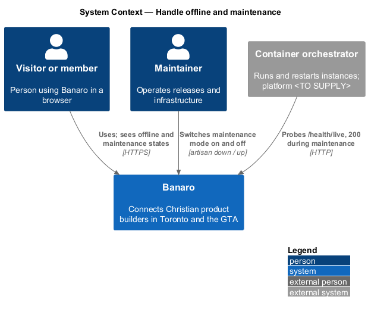
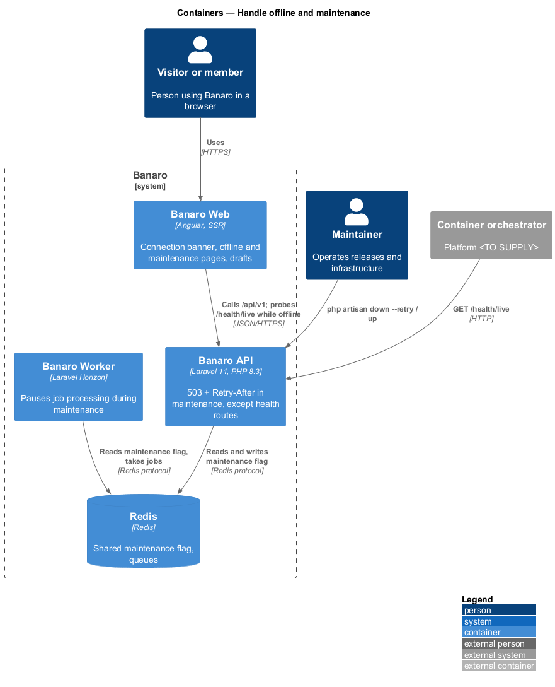
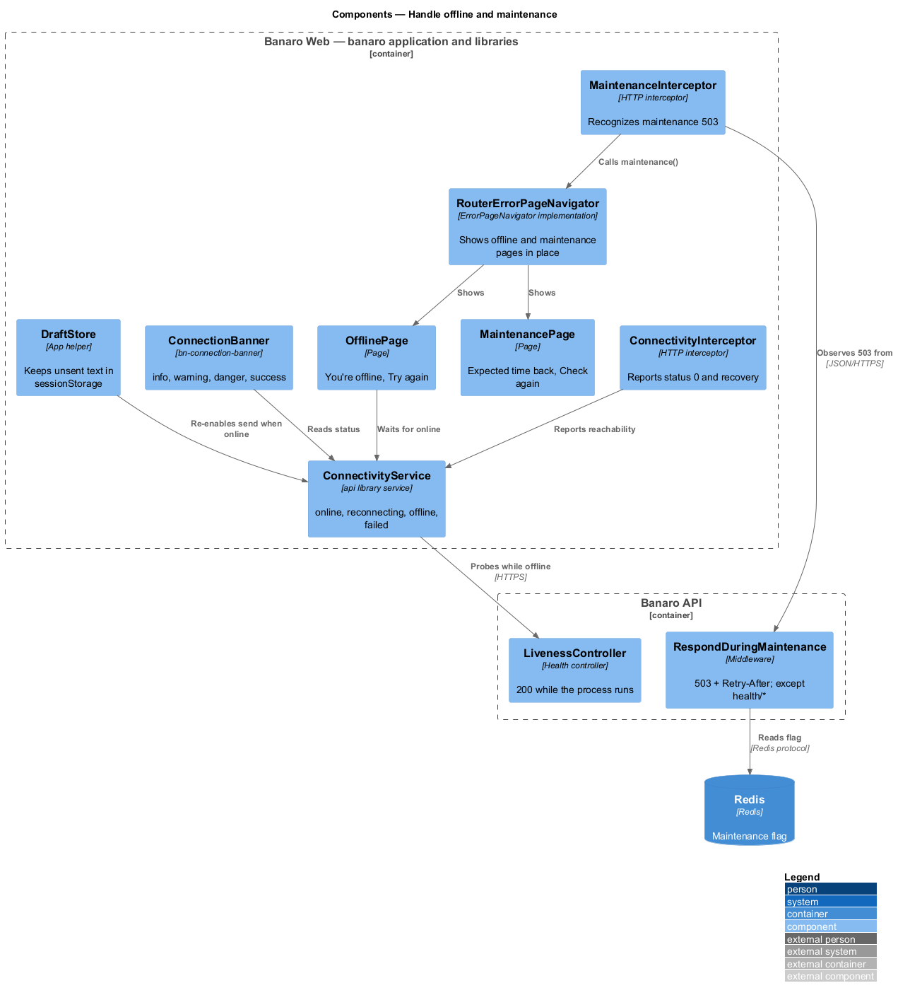
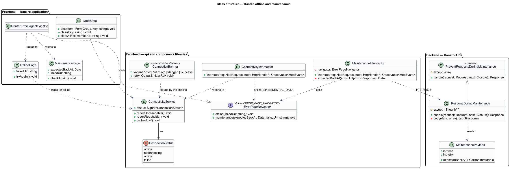
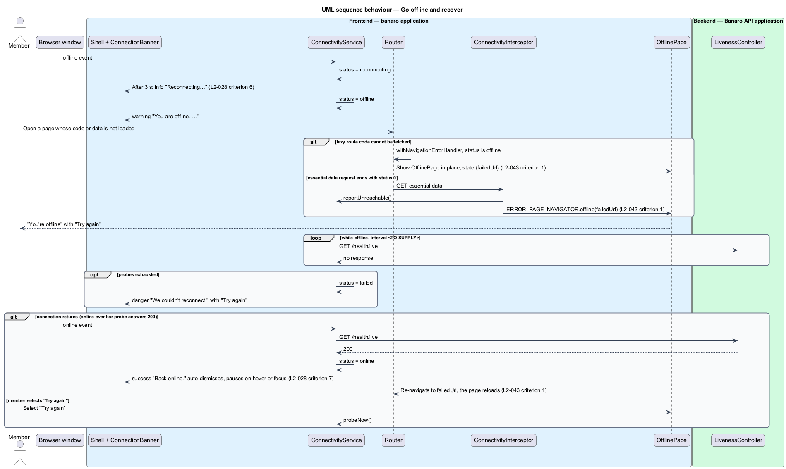
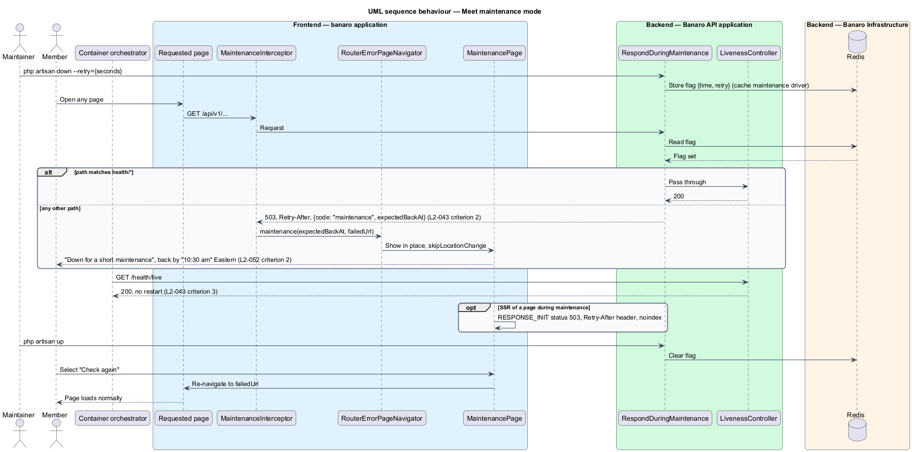
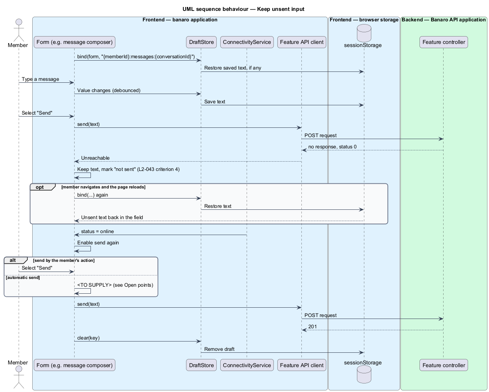

# Handle offline and maintenance

## Overview

Two conditions take Banaro out of reach without any fault in a page: the person's device loses its
network connection, or the Banaro team takes the API down for planned maintenance. In both cases
Banaro says what is happening, keeps what the person was writing, and recovers without a manual
reload. This feature belongs to the `resilience` subsystem.

Terms used in this design:

- **offline** — condition in which the browser cannot reach Banaro, signalled by the browser's
  `offline` event or by an API request that ends with status 0
- **connection banner** — persistent banner above the header that reports connection loss and
  recovery, in the `info`, `warning`, `danger` and `success` variants
- **offline page** — page shown when navigation to a page that is not already loaded fails while
  offline
- **maintenance mode** — API state, switched on by a maintainer, in which every request except the
  health routes receives 503
- **expected time back** — clock time at which maintenance is expected to end, derived from the
  `Retry-After` value
- **maintenance page** — page shown while the API is in maintenance mode, with the expected time back
- **draft** — unsent text in a form, such as a typed message, that Banaro keeps across connection
  loss and page reloads
- **maintainer** — person who operates Banaro's releases and infrastructure

The browser application watches connectivity. When it drops, the connection banner appears. A
navigation that cannot load shows the offline page. Typed text stays in its form. When the
connection returns, a success banner shows and the page that failed loads again.

Maintenance mode lives in the Banaro API. Every non-health request receives 503 with `Retry-After`,
and the web application shows the maintenance page. The liveness route keeps answering 200, so the
orchestrator does not restart instances that are healthy but in maintenance.

## Description

The slice spans Banaro Web, the Banaro API and Redis, which holds the maintenance flag for every API
instance.

### Frontend — `banaro` application and libraries

- **`ConnectivityService`** (`api` library, `lib/auth/`) — holds a `status` signal: `online`,
  `reconnecting`, `offline` or `failed`. It listens to the window `online` and `offline` events and
  to reports from `ConnectivityInterceptor` (`L2-028` criterion 6). While not `online` it probes
  `GET /health/live`, which touches no dependency, every 5 seconds to detect recovery, and after 6
  consecutive failed probes it sets `failed` (`L2-028` criterion 9). `retry()` probes at once. In SSR
  the service always reports `online`.
- **`ConnectivityInterceptor`** (`api` library, `lib/auth/`) — reports a response with status 0 to
  `ConnectivityService` as unreachable. It reports any later success as reachable. For a request
  flagged `ESSENTIAL_DATA` (from the `show-error-pages` feature) that ends with status 0, it also
  calls `offline(failedUrl)` on `ERROR_PAGE_NAVIGATOR`.
- **`ConnectionBanner`** (`components` library, `lib/connection-banner/`, selector
  `bn-connection-banner`) — renders one of four variants. The shell (`shell/`) places it above the
  header and binds it to `ConnectivityService`:
  - `info` — "Reconnecting… Banaro will update as soon as you are back.", shown after 3 s of an
    unreachable API while the browser still reports online; it clears when the connection returns.
  - `warning` — "You are offline. What you write stays on this page until you reconnect." It shows at
    once when the browser reports offline, stays while offline and has no close button.
  - `danger` — "We couldn't reconnect. Check your network, then try again." with "Try again", which
    calls `retry()`. It never auto-dismisses.
  - `success` — "Back online. Banaro is up to date." It auto-dismisses after 6 s and pauses on hover
    or focus (`L2-028` criteria 7 and 8).
  Danger uses `role="alert"`; info, warning and success use `role="status"` (`L2-028` criterion 8).
  The copy names no page, so the shell shows the same banners on every page.
- **`OfflinePage`** (`pages/offline/`, selector `bn-offline-page`) — `h1` "You're offline", the line
  "Banaro can't reach the internet right now.", and "Try again". It is shown in place, with
  `skipLocationChange`, when navigation fails while `ConnectivityService` is not `online` (`L2-043`
  criterion 1). Two failures lead there:
  - the route's lazy-loaded code cannot be fetched (`withNavigationErrorHandler` in `app.config.ts`);
  - the route's essential data request ends with status 0 (`ConnectivityInterceptor`).
  When the status returns to `online`, the page re-navigates to the failed URL, so the page reloads
  (`L2-043` criterion 1). "Try again" triggers the same re-navigation at once.
- **`MaintenancePage`** (`pages/maintenance/`, selector `bn-maintenance-page`) — `h1` "Down for a
  short maintenance" and "We're tending to Banaro and expect to be back by {time} Eastern." It offers
  "Check again", which re-navigates to the failed URL, and "Contact us", a `mailto:` link to the
  support address from `config('banaro.support_email')` (`L2-043` criterion 7). The time renders in
  America/Toronto, for example "10:30 am" (`L2-052` criterion 2). The page sets `noindex`. During SSR
  it sets status 503 and a `Retry-After` header through the response initializer.
- **`MaintenanceInterceptor`** (`api` library, `lib/auth/`) — recognizes a 503 whose body has
  `code: "maintenance"`. It reads `expectedBackAt` from the body, or computes it from `Retry-After`.
  It then calls `maintenance(expectedBackAt, failedUrl)` on `ERROR_PAGE_NAVIGATOR` (`L2-043`
  criterion 2). This feature adds the `offline()` and `maintenance()` methods to that contract from
  the `show-error-pages` feature, and `RouterErrorPageNavigator` implements them. It acts on any
  request, essential or not, because every later request would fail the same way.
- **`DraftStore`** (`shared/`) — keeps unsent text (`L2-043` criterion 4):
  - `bind(form, key)` writes the form's text values to `sessionStorage` under a key scoped to the
    member and the form, debounced, and restores them when the form is created again.
  - `clear(key)` removes the draft after a successful send.
  - Sign-out clears every draft of that member.
  The message composer, the contact form and each dialog with free text bind their forms. A send
  that fails with status 0 leaves the text in place and marks it "not sent". The send action is
  enabled again once `ConnectivityService` reports `online`, and the member sends the text with it.
  Nothing is resent automatically, so a `POST` is never duplicated (`L2-043` criterion 5).

### Backend — Banaro API

- **`RespondDuringMaintenance`** (`Http/Middleware/`) — extends Laravel's
  `PreventRequestsDuringMaintenance` and replaces it in `bootstrap/app.php`. Its `$except` list holds
  `health/*`, so `/health/live` and `/health/ready` answer normally (`L2-043` criterion 3). Any other
  request receives 503 with a `Retry-After` header and the JSON body
  `{ "code": "maintenance", "expectedBackAt": "…" }` (`L2-043` criterion 2). It runs after
  `LogRequest` and `AssignRequestId`, so a 503 still carries a request ID and a log line (`L2-053`).
- **Shared maintenance flag** — `APP_MAINTENANCE_DRIVER=cache` with `APP_MAINTENANCE_STORE=redis`
  stores the flag in Redis. A maintainer runs `php artisan down --retry={seconds}` once, from the
  release pipeline, and every API instance enters maintenance mode. `php artisan up` ends it. The
  admin application has no maintenance control (`L2-043` criterion 8). `expectedBackAt` is the time the flag
  was set plus the `retry` value.
- **Banaro Worker** — Horizon supervisors keep `force` set to `false`, so the worker processes no
  jobs, e-mail included, while the flag is set. Jobs wait in Redis until `php artisan up`, and
  e-mail is sent after it (`L2-043` criterion 9).

### Resolved decisions

- Connection banner copy names no page: "Reconnecting… Banaro will update as soon as you are back.",
  "You are offline. What you write stays on this page until you reconnect.", "We couldn't
  reconnect. Check your network, then try again." and "Back online. Banaro is up to date."
  (`L2-028` criterion 8; mocks `notifications/connection-banner/*`).
- Drafts are sent by the person's action, never automatically, so no `POST` is duplicated
  (`L2-043` criterion 5; the `offline` page and `warning` banner copy say text is kept, not sent).
- The success banner dismisses after 6 s, the same as a success toast (`L2-028` criterion 8; mock
  `success.html` note).
- The app probes `/health/live` every 5 s while not online and shows the `danger` banner after 6
  consecutive failed probes, about 30 s (`L2-028` criterion 9; mock `danger.html` note).
- Banaro has no service worker and caches no pages; "not cached" means not already loaded
  (`L2-043` criterion 6).
- During maintenance "Contact us" is a `mailto:` link, because the contact form needs the API
  (`L2-043` criterion 7; mock `pages/maintenance/default.html`).
- A maintainer switches maintenance mode with `php artisan down` and `up` from the release
  pipeline (`L2-043` criterion 8).
- The worker sends no e-mail during maintenance; queued e-mail goes out after `php artisan up`
  (`L2-043` criterion 9).

## Requirements

| L2 ID | Refines (L1) | Requirement |
|-------|--------------|-------------|
| `L2-043` | `L1-013` | The app shall tell people when they are offline or when Banaro is down for maintenance. |

The design realizes all nine acceptance criteria of `L2-043`, and criteria 8 and 9 of `L2-028` for the connection banner.

## Diagrams

### System context

A visitor or member loses the connection to Banaro, or meets Banaro in maintenance mode. A maintainer
switches maintenance mode on and off. The orchestrator keeps probing liveness throughout.

### Containers

Banaro Web detects connection loss and shows the banners and pages. The Banaro API returns 503 during
maintenance, using a flag in Redis that every API instance reads.

### Components

Inside Banaro Web, two interceptors feed `ConnectivityService` and the error-page navigator. The shell
binds `ConnectionBanner`, and `DraftStore` keeps form text. Inside the Banaro API,
`RespondDuringMaintenance` reads the Redis flag.

### Class structure

`ConnectivityService` owns the connection status that the banner, the offline page and the forms
read. `RespondDuringMaintenance` extends Laravel's maintenance middleware with the health exemption
and the JSON body.

### Behaviour — go offline and recover

The connection drops, the banner appears, and a navigation that cannot load shows the offline page.
When the connection returns, a success banner shows and the failed page loads again.

### Behaviour — meet maintenance mode

A maintainer sets the flag. Every non-health request then receives 503 with `Retry-After`, and the
web application shows the maintenance page. The liveness probe keeps returning 200.

### Behaviour — keep unsent input

A member types a message, and the send fails because the connection dropped. The text stays in the
form and in `sessionStorage`, and the member sends it once the connection returns.

