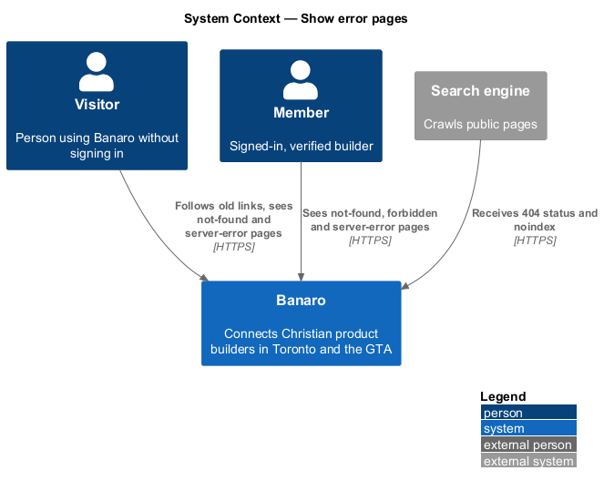
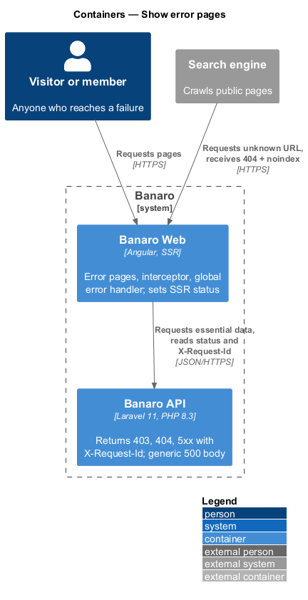
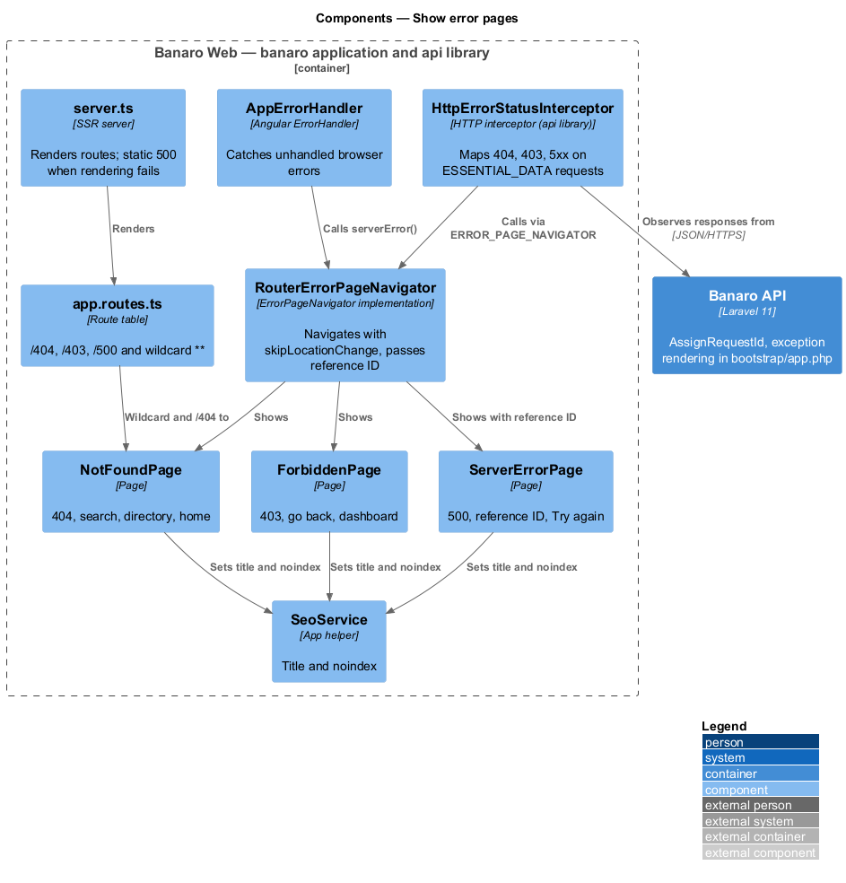
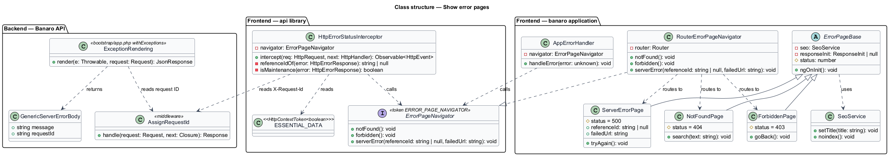
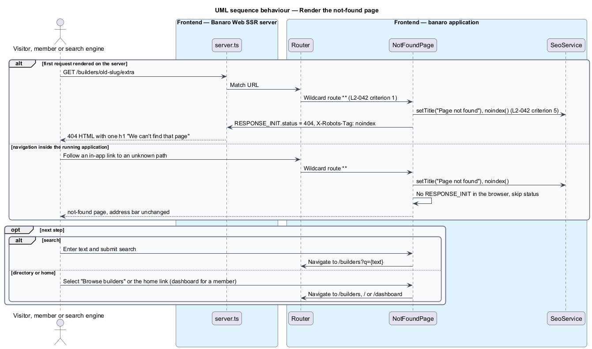
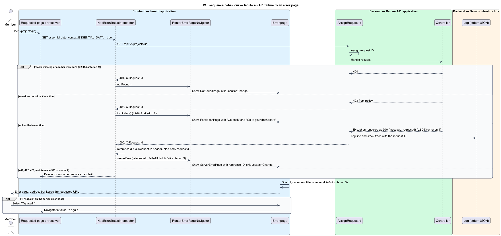
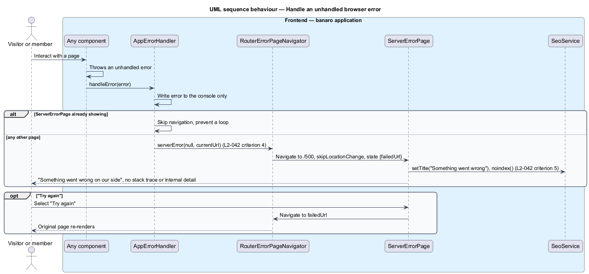

# Show error pages

## Overview

People follow old links, open records they may not see, and occasionally hit a server fault. In each
case Banaro shows a clear page that says what happened and offers a way forward, instead of a blank
screen or a raw error. This feature provides the three error pages of the `resilience` subsystem and
the plumbing that routes failures to them.

Terms used in this design:

- **not-found page** — page shown for a URL that matches no route, or for a record that does not
  exist or is not visible to the requester; HTTP status 404
- **forbidden page** — page shown when a signed-in member asks for something their role does not
  allow; HTTP status 403
- **server-error page** — page shown when the API fails with a 5xx status for a page's essential
  data, or when the browser application hits an unhandled error
- **essential data** — API response without which a page cannot render at all, such as the profile
  on a builder profile page; a failed feed section on the home page is not essential
- **request ID** — identifier that the Banaro API assigns to each request, returns in the
  `X-Request-Id` header and writes to its log line
- **reference ID** — request ID shown to a person on the server-error page, so that support staff can
  find the matching log entry
- **`noindex`** — robots directive that asks search engines to leave a page out of their results

The pages use the manifest routes `/404`, `/403` and `/500`. A failure inside the application does
not change the address bar: the application renders the error page in place of the requested page,
so "Try again" can reload the original address. When Banaro Web renders an unknown URL on the
server, the HTTP response carries status 404, so search engines and link checkers see a real
not-found.

The request ID, the structured log line and the generic 500 body belong to the `observe-health`
feature (`L2-053`). This feature reads the request ID and shows it.

## Description

The slice lives mostly in Banaro Web. The Banaro API contributes the status codes, the request ID and
the generic 500 body.

### Frontend — `banaro` application and libraries

- **Routes** (`app.routes.ts`) — `/404` maps to `NotFoundPage`, `/403` to `ForbiddenPage` and `/500`
  to `ServerErrorPage`. The final wildcard route `**` also maps to `NotFoundPage` (`L2-042`
  criterion 1).
- **`NotFoundPage`** (`pages/not-found/`, selector `bn-not-found-page`) — shows "404", the `h1` "We
  can't find that page" and "The link may be old, or the page may have moved." It offers a search
  field that opens `/builders?q={text}`, "Browse builders", and a link home. A member sees "Go to
  your dashboard" in place of the home link (`L2-042` criterion 1). The mock and the specification
  differ on these actions; see Open points.
- **`ForbiddenPage`** (`pages/forbidden/`, selector `bn-forbidden-page`) — shows "403", the `h1`
  "This one isn't yours to open" and "You don't have access to this page." It offers "Go back" and
  "Go to your dashboard" (`L2-042` criterion 2). The mock shows "Contact us" in place of "Go back".
- **`ServerErrorPage`** (`pages/server-error/`, selector `bn-server-error-page`) — shows "500", the
  `h1` "Something went wrong on our side" and "It isn't you." When a reference ID is known, it shows
  it as selectable text (`L2-042` criterion 3). "Try again" navigates to the failed address again.
  "Go to your dashboard" leaves the page. It never shows a stack trace, an exception class or any
  internal detail (`L2-042` criterion 4).
- **Shared page rules** (`L2-042` criterion 5) — each error page has exactly one `h1`. Each sets its
  document title from the manifest ("Page not found", "No access", "Something went wrong") through
  `SeoService`. Each calls `SeoService.noindex()`, which adds `<meta name="robots"
  content="noindex">`. The three pages extend `ErrorPageBase` (`shared/`), which applies these rules
  and the status step below in `ngOnInit()`.
- **Status on the server** — during SSR each error page injects the response initializer
  (`RESPONSE_INIT`) and sets the status: 404, 403 or 500. It also sets the `X-Robots-Tag: noindex`
  header. In the browser the token is absent and the step is skipped.
- **`server.ts`** (SSR server) — when the render of a route throws before Angular can render
  `ServerErrorPage`, it responds 500 with a static server-error document. That document carries no
  internal detail.
- **`ErrorPageNavigator`** / **`ERROR_PAGE_NAVIGATOR`** (`api` library, `lib/auth/`) — contract with
  `notFound()`, `forbidden()` and `serverError(referenceId, failedUrl)`. The `api` library cannot
  depend on the application, so the interceptor reaches the router through this token. The
  `handle-offline-and-maintenance` feature adds `offline()` and `maintenance()` to the same contract.
- **`RouterErrorPageNavigator`** (`shared/`) — implementation bound in `app.config.ts`. It calls
  `router.navigateByUrl('/404' | '/403' | '/500', { skipLocationChange: true, state })`, so the
  address bar keeps the requested URL. The navigation state carries the reference ID and the failed
  URL to `ServerErrorPage`.
- **`ESSENTIAL_DATA`** (`api` library, `HttpContextToken<boolean>`) — flag that a page or route
  resolver sets on the request for its essential data. Section loads, such as the home page feeds,
  leave it unset and handle their own failures.
- **`HttpErrorStatusInterceptor`** (`api` library, `lib/auth/`) — acts only on requests flagged
  `ESSENTIAL_DATA`:
  - 404 → `notFound()`.
  - 403 → `forbidden()` (`L2-042` criterion 2).
  - 500 to 599, except a maintenance 503 → `serverError()` with the reference ID from the
    `X-Request-Id` header, or else from the body's `requestId` (`L2-042` criterion 3).
  It leaves 401 to the `recover-expired-session` feature, a maintenance 503 and status 0 to the
  `handle-offline-and-maintenance` feature, and 422 and 429 to the calling page.
- **`AppErrorHandler`** (`shared/`) — Angular `ErrorHandler` provided in `app.config.ts`. It catches
  unhandled browser errors, writes them to the console without showing them, and calls
  `serverError(null, currentUrl)` (`L2-042` criterion 4). An error raised while `ServerErrorPage` is
  already showing does not trigger a second navigation, which prevents a loop.

### Backend — Banaro API

- **Status codes** — a record that does not exist, or belongs to another member, returns 404
  (`L2-044` criterion 1). A role-restricted action, such as an administrator endpoint, returns 403
  through its policy. An unknown `/api/v1` route returns a JSON 404.
- **`AssignRequestId`** (`Http/Middleware/`) — gives each request a request ID and returns it in
  `X-Request-Id`. The `observe-health` feature owns it.
- **Exception rendering** (`bootstrap/app.php`, `withExceptions`) — renders any unhandled exception as
  500 with the body `{ "message": "Server Error", "requestId": "…" }` and nothing else (`L2-053`
  criterion 4). The log entry for the same request carries the same request ID, so the reference ID
  on the page is also in the server log (`L2-042` criterion 3).

### Open points

- `L2-042` criterion 1 asks for search and links to the directory and home. The `not-found` mock
  shows "Go to your dashboard" and "Browse builders" with no search field and no home link. The
  agreed actions and the search copy: `<TO SUPPLY>`.
- `L2-042` criterion 2 asks for "go back" or the dashboard. The `forbidden` mock shows "Go to your
  dashboard" and "Contact us". The agreed actions: `<TO SUPPLY>`.
- The `server-error` mock shows no reference ID, which `L2-042` criterion 3 requires. Its label and
  position: `<TO SUPPLY>`.
- The mocks show only the signed-in variant of each error page. The visitor variant's actions:
  `<TO SUPPLY>`.
- Whether browser errors are reported to the server, and through which endpoint or service:
  `<TO SUPPLY>`. Without such reporting, the server-error page for a browser error has no reference ID.

## Requirements

| L2 ID | Refines (L1) | Requirement |
|-------|--------------|-------------|
| `L2-042` | `L1-013` | Unknown routes and failures shall lead to a clear page with a way forward. |

The design realizes all five acceptance criteria of `L2-042`. The exact actions on the not-found and
forbidden pages depend on the open points above.

## Diagrams

### System context

A visitor or member reaches an error page in Banaro. A search engine receives a real 404 status and
a `noindex` directive, so error pages stay out of search results.

### Containers

Banaro Web renders the error pages and sets their HTTP status during SSR. The Banaro API returns the
status codes and the request ID that the pages act on.

### Components

Inside Banaro Web, `HttpErrorStatusInterceptor` and `AppErrorHandler` route failures through
`ErrorPageNavigator` to the three error pages. The pages set their title, `noindex` and SSR status.

### Class structure

The interceptor depends on the `ErrorPageNavigator` contract, which the application implements with
the router. Each error page uses `SeoService` and the optional response initializer.

### Behaviour — render the not-found page

An unknown URL matches the wildcard route. During SSR the page sets status 404 and `noindex`; in the
browser it renders in place without a status.

### Behaviour — route an API failure to an error page

A page's essential request fails. The interceptor maps 404, 403 and 5xx to the matching page and
carries the reference ID from `X-Request-Id` to the server-error page.

### Behaviour — handle an unhandled browser error

`AppErrorHandler` catches the error and shows the server-error page without internal detail. "Try
again" re-runs the navigation to the original address.

