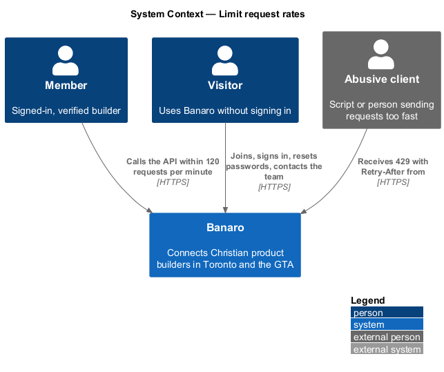
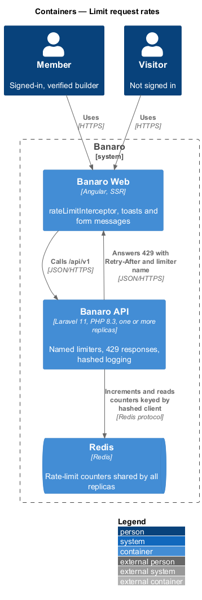
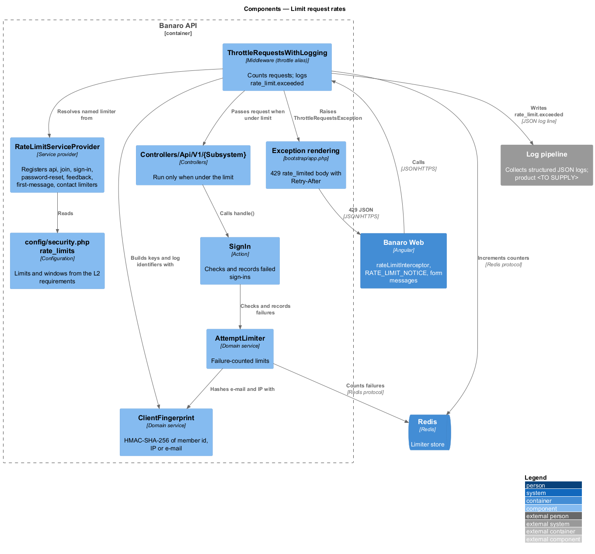
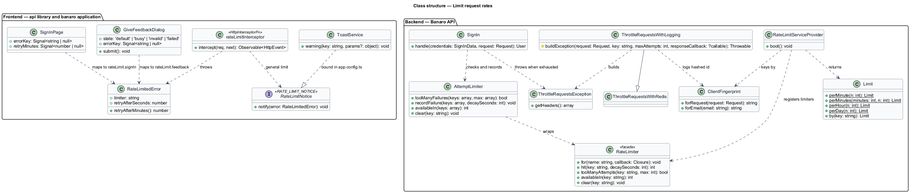
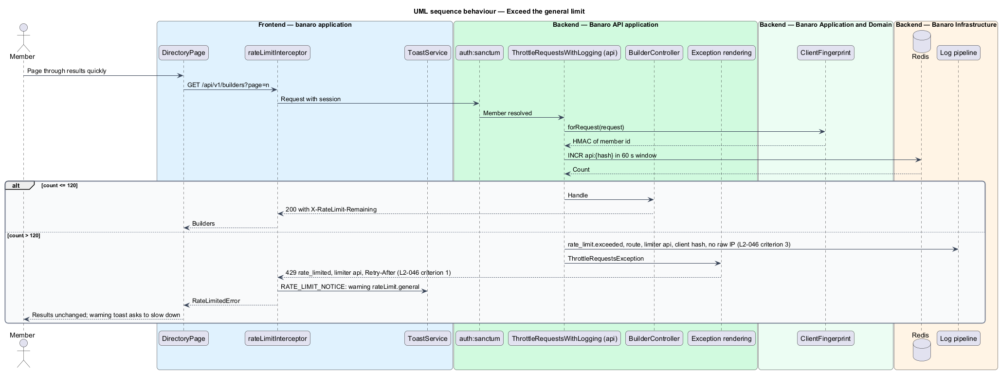
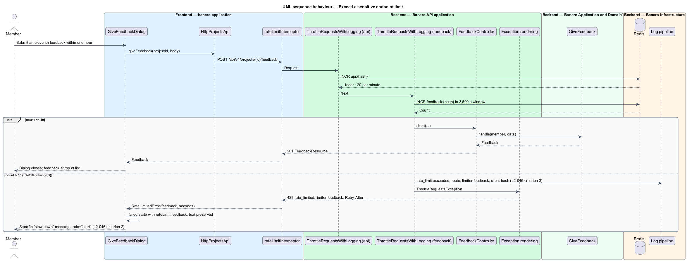
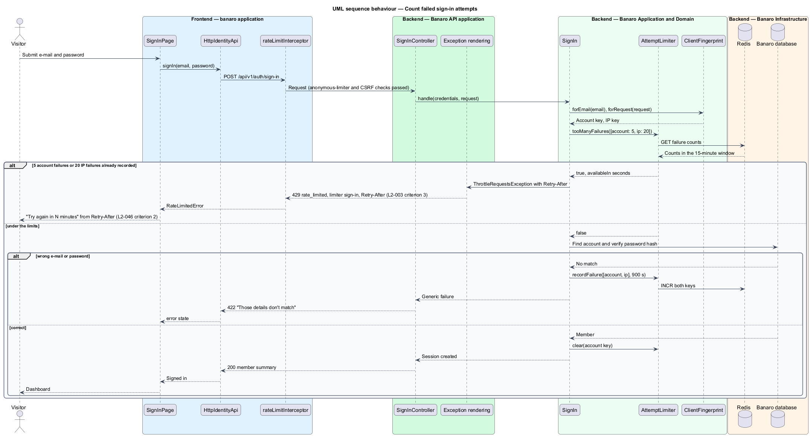

# Limit request rates

## Overview

Some Banaro endpoints invite abuse: joining, signing in, password reset, feedback, first messages and
the contact form. A client that sends requests too fast can guess passwords, flood members with
messages or exhaust the API. This feature is the mechanism that limits request rates and tells the
client when a limit applies. It belongs to the `security` subsystem. It has no screen of its own; every
API route passes through it, and six slices add their own tighter limits.

Terms used in this design:

- **rate limit** — maximum number of requests that one client may make in one time window
- **limiter** — named Laravel rate-limiter definition that returns one or more limits for a request
- **limiter key** — string that identifies the client a limit counts against, such as a member id or a hashed IP address
- **failure-counted limit** — limit that counts only failed attempts, such as wrong passwords, rather than every request
- **hashed client identifier** — keyed HMAC-SHA-256 digest of a member id or IP address, used in limiter keys and logs instead of the raw value
- **`Retry-After`** — response header that gives the number of seconds the client should wait before retrying

Every authenticated client may make 120 API requests per minute. Six sensitive endpoint groups have
their own limits from their requirements. When a client exceeds a limit, the API answers 429 with
`Retry-After` and a machine-readable limiter name. It logs the route and a hashed client identifier.
Banaro Web shows a specific "slow down" message for the sensitive endpoints and a general one
elsewhere.

## Description

The representative request is a member posting an eleventh piece of feedback within one hour.

### Backend — limiter definitions

- **`RateLimitServiceProvider`** (`app/Providers/`) — registers each limiter with
  `RateLimiter::for()` in `boot()`. Limits and windows live in `config/security.php` under
  `rate_limits`.

| Limiter | Applies to | Limit | Key | Source |
|---------|-----------|-------|-----|--------|
| `api` | Every route in `routes/api.php` | 120 per minute | Member id | `L2-046` criterion 1 |
| `api-anonymous` | Every route in `routes/api_public.php` | `<TO SUPPLY>` | Hashed IP | — |
| `join` | `POST /api/v1/auth/join` | 5 per 10 minutes | Hashed IP | `L2-001` criterion 6 |
| `verification-resend` | `POST /api/v1/auth/verification/resend` | 3 per hour | Member id | `L2-002` criterion 3 |
| `sign-in` | `POST /api/v1/auth/sign-in` | 5 failures per 15 minutes per account; 20 failures per 15 minutes per IP | Hashed e-mail; hashed IP | `L2-003` criterion 3 |
| `password-reset` | `POST /api/v1/auth/forgot-password` | 5 per hour per e-mail; 5 per hour per IP | Hashed e-mail; hashed IP | `L2-004` criterion 5 |
| `feedback` | `POST /api/v1/projects/{project}/feedback` | 10 per hour | Member id | `L2-016` criterion 5 |
| `first-message` | `POST /api/v1/conversations` | 20 per day | Member id | `L2-026` criterion 8 |
| `contact` | `POST /api/v1/contact` | 3 per hour | Hashed IP | `L2-040` criterion 3 |

- **Route paths** — the paths in the table are the ones this design expects. The designs of the
  owning features are authoritative for each path.
- **Route attachment** — `bootstrap/app.php` calls `$middleware->throttleWithRedis()` and
  `$middleware->throttleApi()`. The `api` limiter then applies to the API group. Sensitive routes add
  `throttle:{limiter}` in their route files. `L2-046` criterion 2 lists the endpoints of `L2-001`,
  `L2-003`, `L2-004`, `L2-016`, `L2-026` and `L2-040`. `verification-resend` follows the same pattern
  for `L2-002`.
- **Storage** — `config/cache.php` sets the `limiter` store to `redis`. All API replicas therefore
  share one set of counters.
- **Key order** — the `api` limiter keys by member id, so it runs after Sanctum has resolved the
  session. The anonymous limiter keys by hashed IP address.

### Backend — failure-counted sign-in limit

- **`AttemptLimiter`** (`app/Services/Security/`) — wraps `RateLimiter` for limits that count
  failures. `tooManyFailures(array $keys)` checks every key. `recordFailure(array $keys, int
  $decaySeconds)` calls `RateLimiter::hit()` on each. `clear(string $key)` resets the account key
  after a successful sign-in.
- **`SignIn`** (`app/Actions/Identity/`) — checks `AttemptLimiter` before it verifies the password.
  It records a failure for the account key and the IP key after a wrong password. When either key is
  exhausted, it throws `ThrottleRequestsException` with the remaining seconds. The response then
  carries `Retry-After`, from which the form shows "try again in N minutes" (`L2-003` criterion 3).

### Backend — 429 response and logging

- **`ThrottleRequestsWithLogging`** (`app/Http/Middleware/`) — extends Laravel's
  `ThrottleRequestsWithRedis` and replaces the `throttle` alias. Its `buildException()` override
  writes one structured log line at `warning` level with event `rate_limit.exceeded`, the route name,
  the limiter name and the hashed client identifier. It never logs the raw IP address or e-mail
  (`L2-046` criterion 3).
- **`ClientFingerprint`** (`app/Services/Security/`) — `forRequest(Request $request): string`
  returns the HMAC-SHA-256 of the member id, or of the client IP address when no member is signed
  in. `forEmail(string $email)` hashes a lower-cased e-mail address. The key is `security.client_hash_key`,
  separate from `APP_KEY`. Limiter keys use the same digests, so Redis holds no raw IP address either.
- **Exception rendering** (`bootstrap/app.php`) — renders `ThrottleRequestsException` as 429 with
  body `{ "message", "code": "rate_limited", "limiter": "<name>", "retry_after": <seconds> }`. It
  keeps the exception's `Retry-After`, `X-RateLimit-Limit` and `X-RateLimit-Remaining` headers
  (`L2-046` criteria 1 and 2).
- **Request log** — the request-logging middleware sits outside exception handling, as `AGENTS.md`
  requires, so the request log line also records status 429 (`L2-053` criterion 5).

### Frontend — `api` library

- **`rateLimitInterceptor`** (`api` library, `lib/auth/`) — catches 429. It reads `Retry-After` and
  the `limiter` field and rethrows a typed `RateLimitedError`. For the general `api` limiter it also
  calls the `RATE_LIMIT_NOTICE` callback that each application binds in `app.config.ts`.
- **`RateLimitedError`** (`api` library, `lib/models/`) — holds `limiter` and `retryAfterSeconds`,
  and `retryAfterMinutes()` rounded up.
- **`RATE_LIMIT_NOTICE`** — injection token. The `banaro` application binds it to `ToastService` to
  show a warning toast with the catalogue key `rateLimit.general`.

### Frontend — `banaro` pages and dialogs

Each sensitive form shows its own message from the translation catalogue (`L2-046` criterion 2):

- `JoinPage` (`pages/join/`) — `rateLimit.join`
- `SignInPage` (`pages/sign-in/`) — `rateLimit.signIn` with the minutes from `Retry-After`
- `ForgotPasswordPage` (`pages/forgot-password/`) — `rateLimit.passwordReset`
- `GiveFeedbackDialog` (`dialogs/give-feedback/`) — `rateLimit.feedback`, with the text preserved
- `SayHelloDialog` (`dialogs/say-hello/`) — `rateLimit.firstMessage`, with the text preserved
- `ContactPage` (`pages/contact/`) — `rateLimit.contact`

Each form shows the message in its existing `failed` or `error` slot, announced with `role="alert"`
(`L2-050` criterion 4). A busy control returns to enabled so the member may retry after the wait.

### Open points

- **No mock for the "slow down" message.** `docs/mocks` has no state that shows a 429 message on any
  of the six forms. `AGENTS.md` requires a mock before production behaviour. The mock states and
  their copy are `<TO SUPPLY>`.
- **Contact form conflict.** `L2-040` criterion 3 allows a "normal-looking success" for a rate-limited
  bot, while `L2-046` criterion 2 requires a 429 and a "slow down" message. The design answers 429
  for the rate limit and a normal-looking success only for a filled honeypot. Confirmation is
  `<TO SUPPLY>`.
- Limit for anonymous routes other than the named limiters: `<TO SUPPLY>`.
- Rotation procedure for `security.client_hash_key`: `<TO SUPPLY>`.
- Whether repeated limit hits raise an alert to operators: `<TO SUPPLY>`.

## Requirements

| L2 ID | Refines (L1) | Requirement |
|-------|--------------|-------------|
| `L2-046` | `L1-014`, `L1-018` | Abusable endpoints shall be limited, and clients shall be told when they are. |

The design realizes all three acceptance criteria of `L2-046`. The Description cites each criterion
where a component enforces it, together with the endpoint limits from `L2-001`, `L2-002`, `L2-003`,
`L2-004`, `L2-016`, `L2-026` and `L2-040`.

## Diagrams

### System context

Members and visitors call Banaro. Banaro answers clients that send too many requests with 429 and
records the event in its own logs.

### Containers

Every API replica counts requests in Redis, so limits hold across replicas. Banaro Web turns 429
responses into toasts and form messages.

### Components

Inside the Banaro API, `ThrottleRequestsWithLogging` evaluates the limiters that
`RateLimitServiceProvider` registered. `SignIn` uses `AttemptLimiter` for the failure-counted limit.
`ClientFingerprint` supplies the hashed identifiers.

### Class structure

The throttle middleware extends Laravel's Redis throttle. On the frontend, the interceptor raises
`RateLimitedError`, which pages and dialogs map to their specific messages.

### Behaviour — exceed the general limit

A member's client sends a 121st request within one minute. The API answers 429 with `Retry-After`,
logs a hashed identifier, and Banaro Web shows the general warning toast.

### Behaviour — exceed a sensitive endpoint limit

A member posts an eleventh piece of feedback within one hour. The `feedback` limiter answers 429, and
the dialog shows its specific message with the text preserved.

### Behaviour — count failed sign-in attempts

`SignIn` counts wrong passwords per account and per IP address. After five failures for one account
within 15 minutes, the next attempt answers 429, and the form shows "try again in N minutes".

