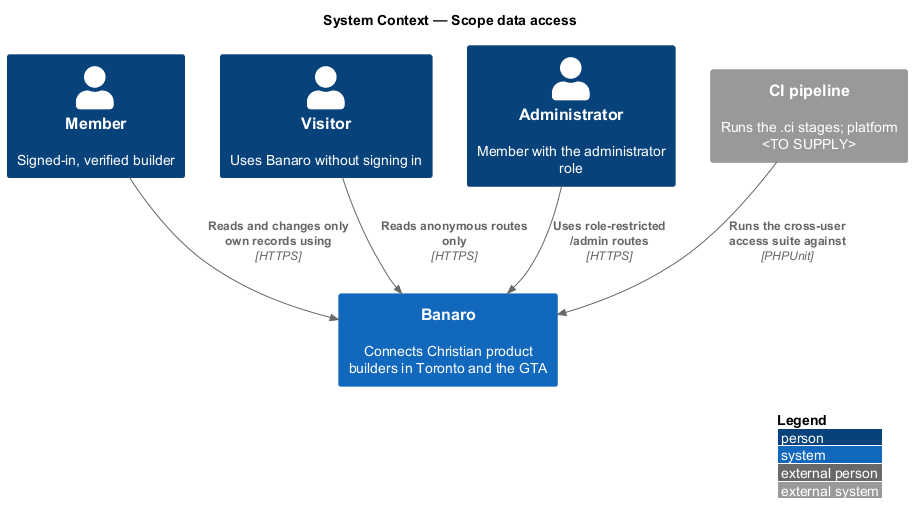
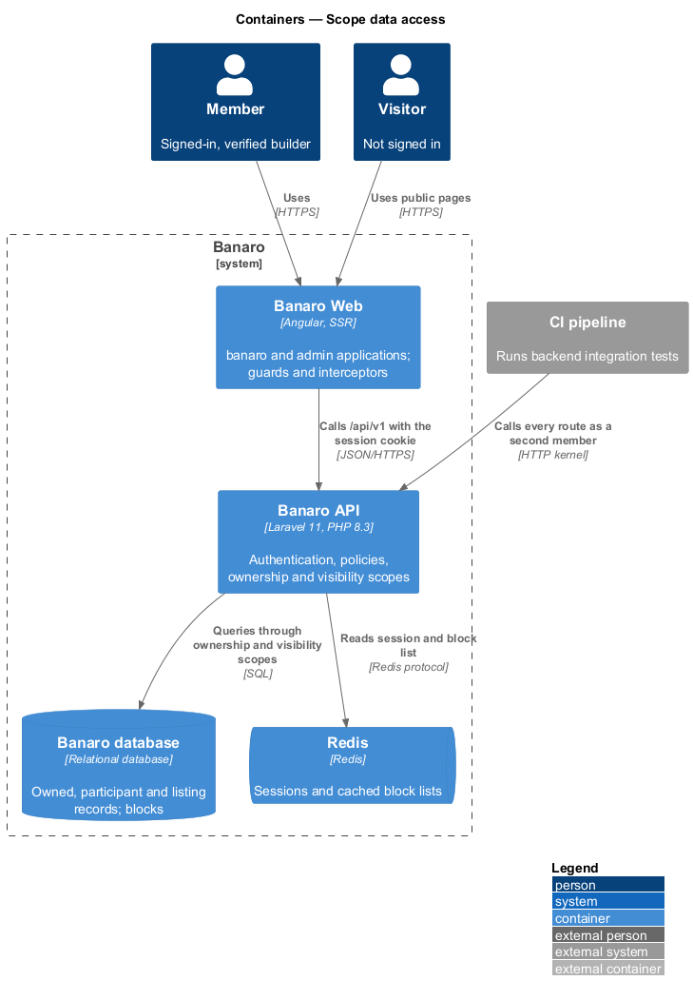
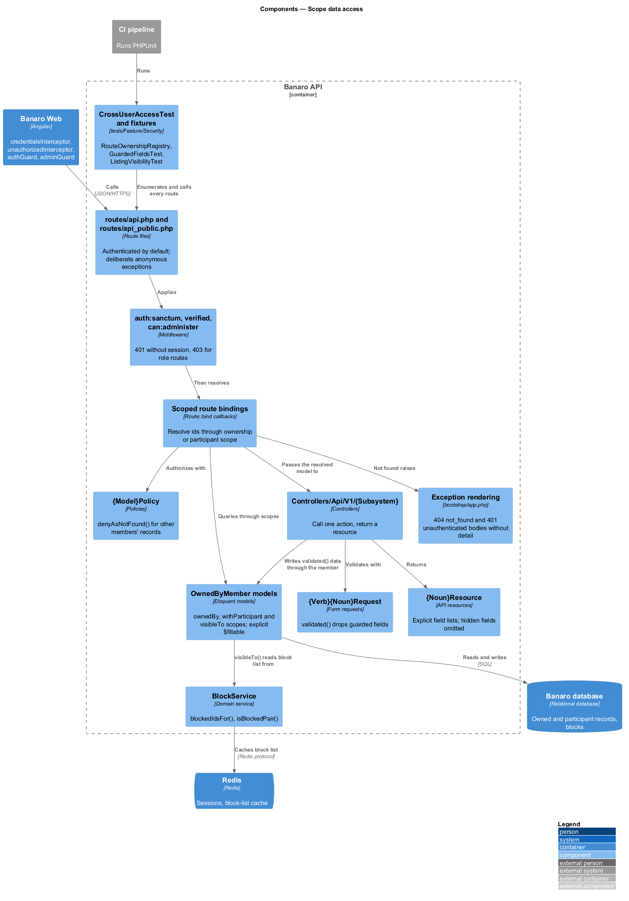
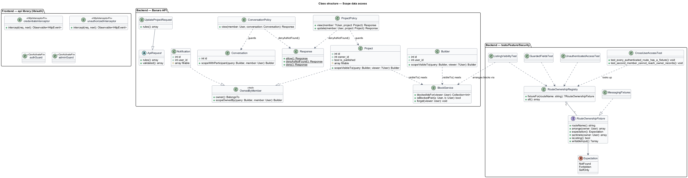
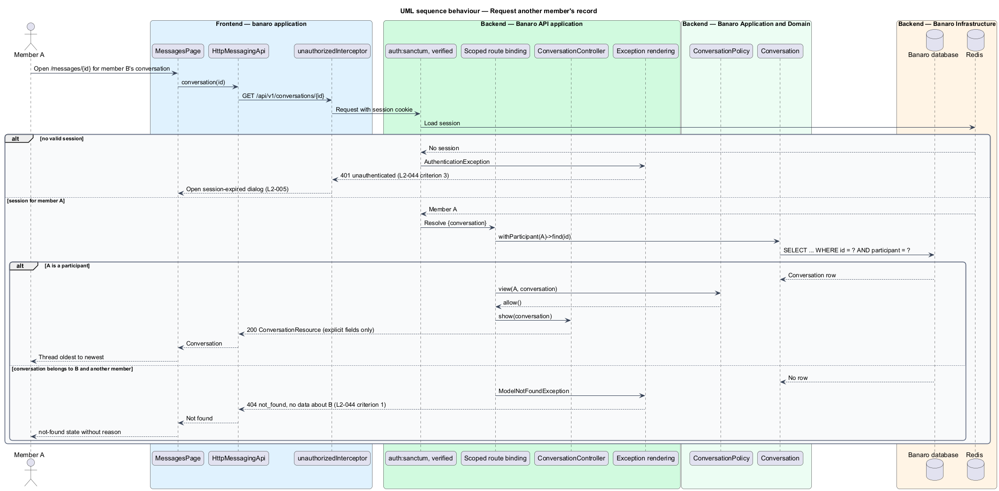
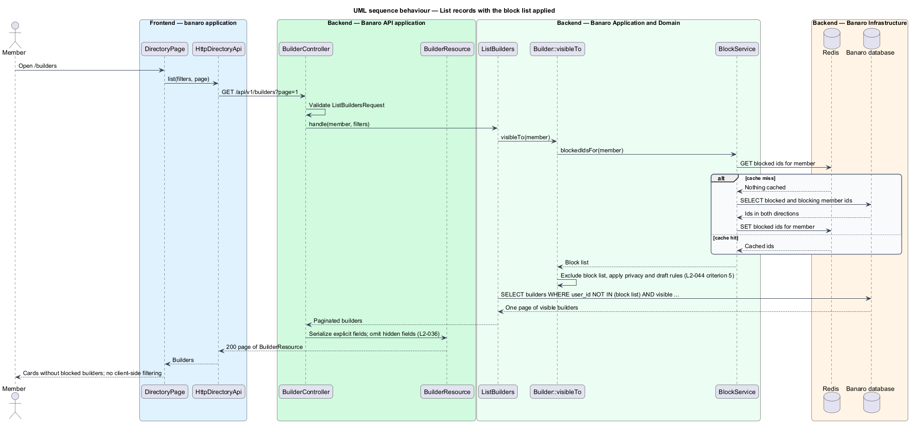
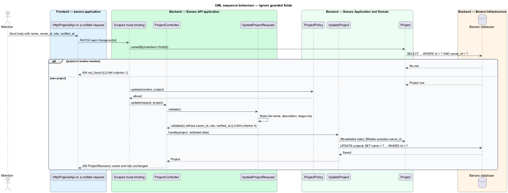
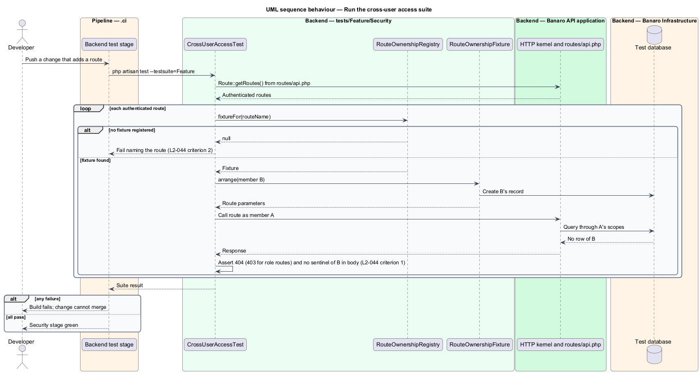

# Scope data access

## Overview

Banaro holds personal records for each member: conversations, notifications, settings, match
suggestions, RSVPs and unpublished project drafts. This feature is the mechanism that keeps each of
those records reachable only by the member who owns it. It also keeps each role-restricted action
reachable only by holders of that role. It belongs to the `security` subsystem. It has no screen of its
own; every other slice that exposes data through the Banaro API uses it.

Terms used in this design:

- **owned record** — row that belongs to exactly one member, such as a notification or a draft project
- **participant record** — row shared by a fixed set of members, such as a conversation between two builders
- **ownership scope** — query constraint that limits a result to the records of the current member
- **visibility scope** — query constraint that removes records hidden from the current viewer by privacy settings or the block list
- **block list** — set of member ids that the viewer has blocked or that have blocked the viewer
- **anonymous route** — API route declared in `routes/api_public.php` that answers without a session
- **guarded field** — attribute that a member never sets through a request body, such as `owner_id`, `role` or `verified_at`
- **route-ownership fixture** — test helper that creates a record owned by one member for one route, so a second member can try to reach it
- **cross-user access suite** — integration tests in `backend/tests/Feature/Security` that call every authenticated route as a second member

The mechanism has five layers. Routes require a session unless they are declared anonymous. Queries
reach owned records through the member, so another member's record is never loaded. Policies give a
second check and answer 404 for records of other members. Form requests and model allow-lists drop
guarded fields. Listing queries apply visibility scopes on the server, including the block list. The
cross-user access suite exercises every route with a second member and fails when a route has no
fixture.

## Description

The slice spans the Banaro API, its test suite and the shared frontend libraries. The representative
request is member A asking for member B's conversation by id.

### Backend — routing and authentication

- **`bootstrap/app.php`** — registers two route files under the `/api/v1` prefix:
  1. `routes/api.php` with the `api` middleware group plus `auth:sanctum` and `verified`. Every route
     in this file therefore requires a signed-in, verified member. An unauthenticated request ends
     in an `AuthenticationException`, rendered as 401 with code `unauthenticated` (`L2-044`
     criterion 3).
  2. `routes/api_public.php` with the `api` middleware group only. It holds the deliberate anonymous
     routes, such as join, sign-in, the public directory and the i18n catalogue.
- **Exception rendering** (`bootstrap/app.php`, `withExceptions`) — renders
  `ModelNotFoundException` and `RecordsNotFoundException` as 404 with code `not_found` and no model
  name, id or other detail. It renders `AuthorizationException` with the status the policy chose.
- **Administrator routes** — the `/api/v1/admin/*` group in `routes/api.php` adds `can:administer`.
  A member without the administrator role receives 403, as `L2-033` criterion 4 states. Role
  restriction is the one case that answers 403 rather than 404.

### Backend — ownership and participant scopes

- **`OwnedByMember`** (`app/Models/Concerns/`) — trait for owned models. It declares the
  `owner()` relationship and `scopeOwnedBy(Builder $query, User $member)`. Models that use it
  include `Notification`, `MatchSuggestion`, `Rsvp`, `EmailPreference` and draft `Project`.
- **Query through the member** — controllers and actions resolve owned records through the member's
  relationship, for example `$member->notifications()->findOrFail($id)`. A record of another member
  is never loaded, so the response is the same 404 as for an id that does not exist (`L2-044`
  criterion 1).
- **Participant scope** — `Conversation::scopeWithParticipant(User $member)` restricts conversations
  and their messages to the two participants. Any other member receives 404 (`L2-026` criterion 9).
- **Route model binding** — routes that bind an owned model use `Route::bind()` callbacks registered
  in `AppServiceProvider`. Each callback resolves the id through the ownership or participant scope
  of the current member. Implicit binding by primary key alone is not used for owned models.
- **`{Model}Policy`** (`app/Policies/`) — second guard on every owned and participant model, for
  example `ConversationPolicy` and `ProjectPolicy`. A denial for another member's record returns
  `Response::denyAsNotFound()`, so a policy failure also answers 404. Controllers call
  `$this->authorize()` or the form request's `authorize()` before calling an action.
- **Resources** (`app/Http/Resources/{Subsystem}/`) — each resource lists its output fields
  explicitly and never calls `parent::toArray()`. Fields that the owner has hidden (`L2-036`) are
  left out of the array, not set to `null`.

### Backend — guarded fields

- **Form requests** — each `{Verb}{Noun}Request` lists only the fields a member may set. Actions
  receive `$request->validated()`, so unknown and guarded fields never reach them (`L2-044`
  criterion 4). The `validate-input-and-harden-transport` feature describes the form request base.
- **Model allow-lists** — every model declares `$fillable`. No model uses `$guarded = []`.
  `owner_id`, `user_id`, `role`, `verified_at` and `status` fields are absent from `$fillable`.
- **Ownership by relationship** — actions create owned records through the member, for example
  `$member->projects()->create($data)`. The owner key therefore always comes from the session.
- **Strict models outside production** — `AppServiceProvider` calls
  `Model::preventSilentlyDiscardingAttributes(! app()->isProduction())`. A developer error that passes
  a guarded field to `fill()` fails in tests instead of being dropped without notice.

### Backend — listing scopes and the block list

- **`BlockService`** (`app/Services/TrustAndSafety/`) — `blockedIdsFor(User $viewer)` returns the ids
  of members the viewer has blocked and of members who have blocked the viewer. It caches the set in
  Redis per viewer and forgets the entry when a block or unblock is written. `isBlockedPair(User $a,
  User $b)` answers whether either has blocked the other. The `block-builder` feature owns the block
  records; this feature defines how listings consume them.
- **`VisibleTo` scopes** — listing models declare `scopeVisibleTo(Builder $query, ?User $viewer)`.
  Each scope excludes the viewer's block list, applies privacy settings such as "Members only" for
  visitors (`L2-036` criterion 2), and hides unpublished drafts of other members. The directory,
  projects, project feedback, event attendee lists, match suggestions and search all query through
  this scope. Filtering therefore happens on the server, never only in the browser (`L2-044`
  criterion 5).
- **Interaction checks** — write actions that involve another member, such as giving feedback or
  sending a message, call `BlockService::isBlockedPair()`. They answer 403 as `L2-016` criterion 6
  and `L2-026` criterion 7 state. Reads of a blocker's profile or conversations answer 404 as
  `L2-032` criterion 4 states.

### Backend — cross-user access suite

The suite lives in `backend/tests/Feature/Security/` and runs with the other integration tests.

- **`RouteOwnershipFixture`** — interface for one route's fixture. `routeName()` names the route.
  `arrange(User $owner): array` creates the owner's record and returns the route parameters.
  `expectation()` returns `NotFound`, `Forbidden` (role routes) or `SelfOnly` (routes without an id,
  such as `GET /me/notifications`). `sentinels(User $owner): array` lists values, such as the owner's
  name and a message body, that the response to the second member shall not contain.
- **`RouteOwnershipRegistry`** — maps each route name to its fixture. Fixtures live beside the
  registry, one class per subsystem, for example `MessagingFixtures`.
- **`CrossUserAccessTest`** — enumerates the routes registered from `routes/api.php` through
  `Route::getRoutes()`. For each route it looks up the fixture and fails with the route name when
  none is registered (`L2-044` criterion 2). It then signs in member B, arranges B's record, signs in
  member A and calls the route. It asserts the expected status and asserts that the body contains no
  sentinel value (`L2-044` criterion 1).
- **`UnauthenticatedAccessTest`** — calls every route from `routes/api.php` without a session and
  asserts 401 (`L2-044` criterion 3).
- **`GuardedFieldsTest`** — for each write route whose fixture declares writable input, sends the
  valid body plus `owner_id`, `role` and `verified_at`. It asserts that the stored record keeps the
  session member as owner and that the member's role and verification are unchanged (`L2-044`
  criterion 4).
- **`ListingVisibilityTest`** — for each fixture flagged as a listing, makes B block A and asserts
  that A's listing excludes B's records, and the reverse (`L2-044` criterion 5).

Each test file carries the acceptance-test header from the L2 conventions, naming `L2-044`.

### Frontend — `banaro` and `admin` applications and the `api` library

- **`credentialsInterceptor`** (`api` library, `lib/auth/`) — sends the session cookie with every
  `/api/v1` request. The browser holds no owner id or role to send.
- **`unauthorizedInterceptor`** (`api` library, `lib/auth/`) — turns a 401 into the
  `session-expired` dialog that the `recover-expired-session` feature (`L2-005`) describes.
- **`authGuard`** and **`adminGuard`** (`api` library, `lib/auth/`) — route guards that keep visitors
  out of member pages and non-administrators out of `/admin`. They improve navigation only; the API
  remains the authority.
- **Pages** — a page that receives 404 for a record shows its `not-found` state, which never says
  whether the record exists. A 403 leads to the `forbidden` page (`L2-042` criterion 2).

### Open points

- **Conflict with `AGENTS.md`.** `L2-044` criterion 2 states that the suite fails when a route lacks
  a registered fixture. `AGENTS.md` forbids tests that assert the shape of the codebase. The
  missing-fixture failure is a coverage check, not a behaviour check. This design keeps it because
  the requirement demands it. The project owner should confirm the exception or restate criterion 2.
- **Status for blocked interactions.** `L2-016` criterion 6 and `L2-026` criterion 7 answer 403 for
  a blocked pair, while `L2-032` criterion 4 and `L2-044` criterion 1 answer 404. The design applies
  403 to writes and 404 to reads. Confirmation that a 403 may reveal the block is `<TO SUPPLY>`.
- Cache lifetime of the block list in Redis, beyond invalidation on change: `<TO SUPPLY>`.
- Whether `/api/v1/admin/*` routes need fixtures of kind `Forbidden` for every endpoint, or one
  shared fixture per group: `<TO SUPPLY>`.

## Requirements

| L2 ID | Refines (L1) | Requirement |
|-------|--------------|-------------|
| `L2-044` | `L1-014` | Every record a member owns shall be reachable only by that member, and every role-restricted action by that role only. |

The design realizes all five acceptance criteria of `L2-044`. The Description cites each criterion
where a component or test enforces it.

## Diagrams

### System context

Members, visitors and administrators reach Banaro over HTTPS. The CI pipeline runs the cross-user
access suite against every route before a release.

### Containers

Banaro Web calls the Banaro API with the session cookie. The API resolves owned records in the Banaro
database and reads the cached block list from Redis.

### Components

Inside the Banaro API, the authentication middleware runs before scoped route binding, the policy and
the controller. Listing queries call `BlockService` through their `visibleTo` scope. The cross-user
access suite drives the same components through the HTTP kernel.

### Class structure

Owned models share the `OwnedByMember` trait. Each policy denies as not found. The suite's registry
maps route names to fixtures that implement `RouteOwnershipFixture`.

### Behaviour — request another member's record

Member A asks for member B's conversation by id. The participant scope finds no row, so the API
answers 404 with no data about B. Alternates show the owner's success and the unauthenticated 401.

### Behaviour — list records with the block list applied

The directory query applies the visibility scope, which reads the block list from `BlockService`. A
blocked builder never reaches the response, so the browser has nothing to filter.

### Behaviour — ignore guarded fields

A member updates a project and adds `owner_id` and `role` to the body. The form request drops them,
and the action writes only validated fields.

### Behaviour — run the cross-user access suite

The pipeline runs the suite. It fails on the first route without a fixture, and otherwise calls each
route as a second member and checks the status and the body.

