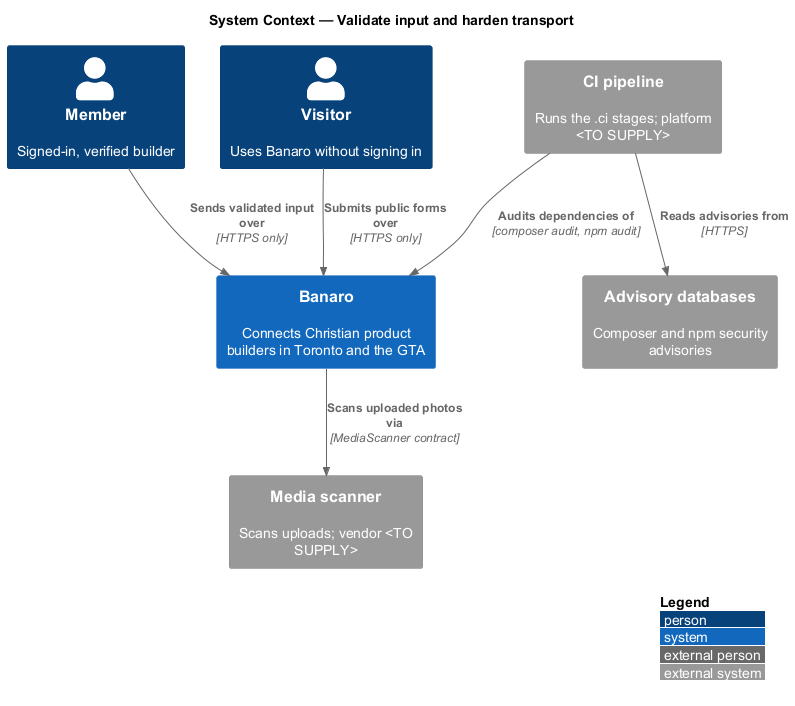
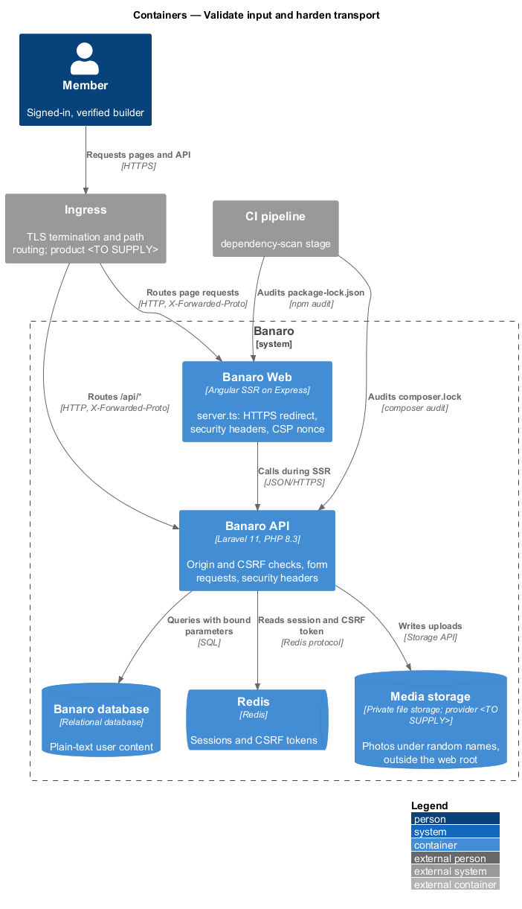
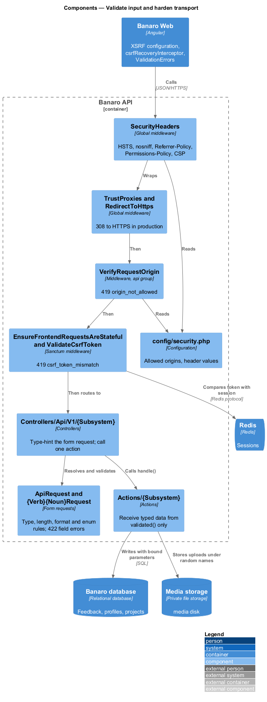
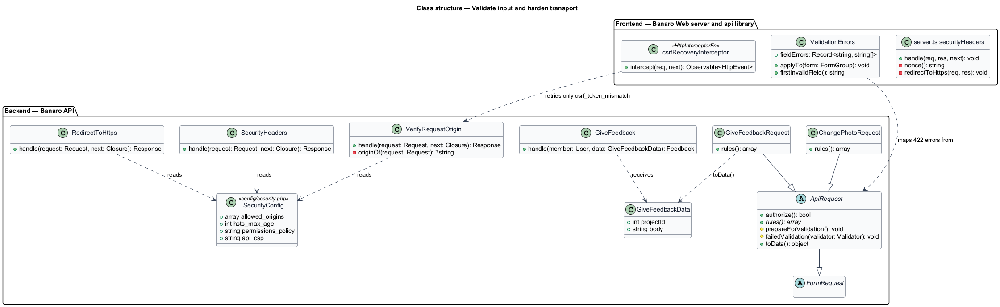
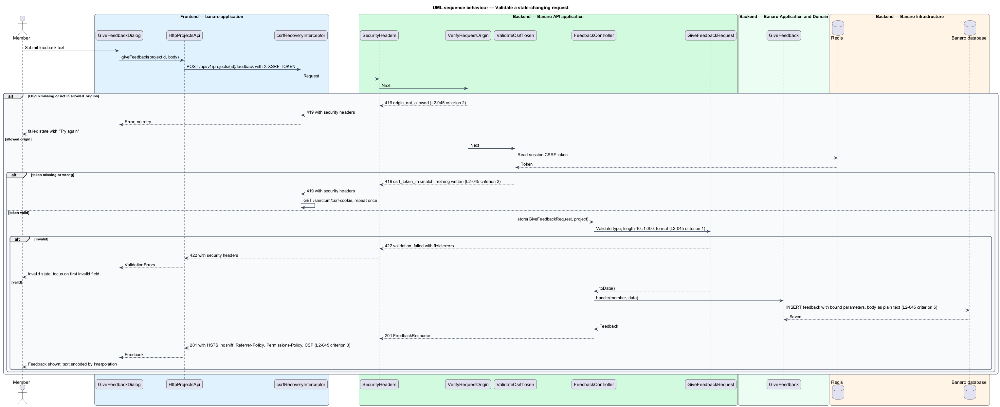
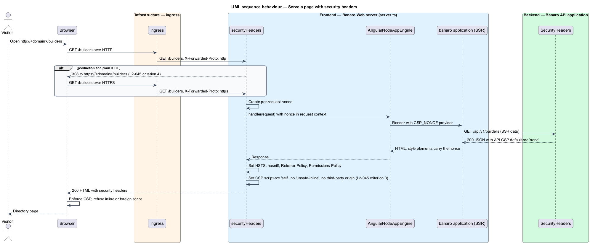
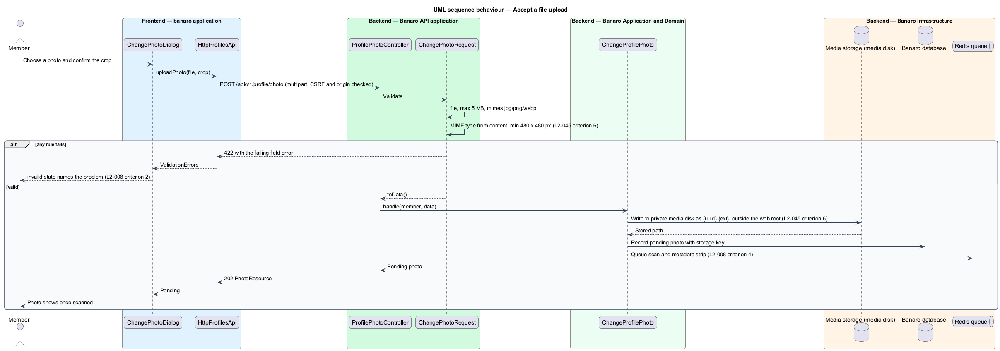
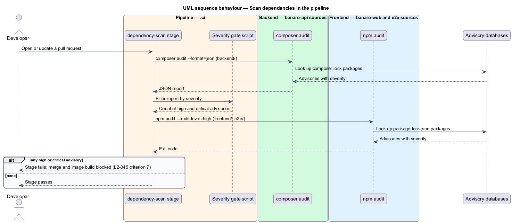

# Validate input and harden transport

## Overview

Every request that reaches Banaro carries input from a browser that Banaro does not control. This
feature is the mechanism that validates all of that input on the server and hardens the traffic and
browser behaviour around it. It belongs to the `security` subsystem. It has no screen of its own; every
slice that accepts input or serves a response runs through it.

Terms used in this design:

- **form request** — Laravel `FormRequest` subclass that authorizes and validates one endpoint's input before the controller runs
- **field error** — validation message keyed by the name of the input field that failed
- **CSRF token** — per-session secret that the browser echoes in the `X-XSRF-TOKEN` header to prove a request came from a Banaro page
- **allowed origin** — scheme, host and port from which Banaro Web pages are served and from which state-changing requests are accepted
- **state-changing request** — request with method `POST`, `PUT`, `PATCH` or `DELETE`
- **security headers** — response headers that restrict how a browser treats the response: `Strict-Transport-Security`, `X-Content-Type-Options`, `Referrer-Policy`, `Permissions-Policy` and `Content-Security-Policy`
- **Content Security Policy (CSP)** — header that lists the sources from which a page may load script, style, images and connections
- **bound parameter** — value passed to the database separately from the SQL text, so it is never parsed as SQL
- **output encoding** — conversion of characters such as `<` and `&` into a form that a browser shows as text

The feature has seven parts, one per acceptance criterion of `L2-045`. Every endpoint validates its
input with a form request. State-changing requests pass an origin check and a CSRF check. Both Banaro
Web and the Banaro API add the security headers. Plain HTTP is redirected to HTTPS. Queries use bound
parameters, and user text is stored as plain text and encoded on output. Uploads are checked and stored
outside the web root. The pipeline fails on vulnerable dependencies.

## Description

The representative request is a member posting feedback on a project from the `give-feedback`
dialog.

### Backend — validation

- **`ApiRequest`** (`app/Http/Requests/`) — abstract base for every form request. It extends
  `FormRequest` and overrides `failedValidation()` to return 422 with body `{ "message", "code":
  "validation_failed", "errors": { "<field>": ["<message>"] } }` (`L2-045` criterion 1). It trims
  strings and converts empty strings to `null` in `prepareForValidation()`. Its `toData()` method
  builds the typed data object that the action receives from `validated()` only.
- **`{Verb}{Noun}Request`** (`app/Http/Requests/{Subsystem}/`) — one per endpoint, including read
  endpoints with query parameters. Rules state type (`string`, `integer`, `boolean`), length (`min`,
  `max`), format (`email:rfc`, `url`, `date`) and enum membership (`Rule::enum(...)` over the
  closed vocabularies in `app/Enums/`). For example, `GiveFeedbackRequest` requires `body` as a
  string of 10 to 1,000 characters (`L2-016` criterion 1).
- **Controllers** — every controller method type-hints its form request. Laravel resolves and
  validates it before the method body runs, so an action never receives unvalidated input.
  Controllers never read `$request->all()` or `$request->input()`.
- **Validation messages** — come from the translation catalogue that the `localize-and-format`
  feature (`L2-052`) describes. The frontend shows each field error next to its field.

### Backend — CSRF and origin check

- **Stateful API** — `bootstrap/app.php` calls `$middleware->statefulApi()`. Sanctum's
  `EnsureFrontendRequestsAreStateful` then starts the session and applies `ValidateCsrfToken` to
  requests from the domains in `SANCTUM_STATEFUL_DOMAINS`. A missing or wrong token raises
  `TokenMismatchException`, rendered as 419 with code `csrf_token_mismatch` (`L2-045` criterion 2).
- **`VerifyRequestOrigin`** (`app/Http/Middleware/`) — runs first in the `api` group for
  state-changing requests. It reads `Origin`, or `Referer` when `Origin` is absent, and compares the
  origin with `config('security.allowed_origins')`. A missing or foreign origin ends the request
  with 419 and code `origin_not_allowed` before any session write or action (`L2-045` criterion 2).
- **`GET /sanctum/csrf-cookie`** — anonymous route that sets the `XSRF-TOKEN` cookie. Banaro Web
  calls it at start-up.

### Backend — security headers and HTTPS

- **`SecurityHeaders`** (`app/Http/Middleware/`) — global middleware appended in `bootstrap/app.php`.
  It wraps the router, so it also adds headers to 4xx and 5xx responses that the exception handler
  produced. It sets the values from `config/security.php` (`L2-045` criterion 3):
  - `Strict-Transport-Security: max-age=<TO SUPPLY>; includeSubDomains`
  - `X-Content-Type-Options: nosniff`
  - `Referrer-Policy: strict-origin-when-cross-origin`
  - `Permissions-Policy: camera=(), microphone=(), geolocation=(), payment=(), usb=()` and the other
    features Banaro does not use
  - `Content-Security-Policy: default-src 'none'; frame-ancestors 'none'` for JSON responses
- **`TrustProxies`** — trusts the ingress in front of the containers, so `X-Forwarded-Proto` tells
  the API whether the original request used HTTPS. The ingress product and its addresses are
  `<TO SUPPLY>`.
- **`RedirectToHttps`** (`app/Http/Middleware/`) — in production only, answers a plain-HTTP request
  with 308 to the same URL on `https` (`L2-045` criterion 4). `/health/live` and `/health/ready` are
  exempt so orchestration probes inside the cluster keep working (`L2-053`).

### Frontend — Banaro Web server (`server.ts`)

- **`securityHeaders`** (Express middleware in `projects/banaro/src/server.ts`) — sets the same
  `Strict-Transport-Security`, `nosniff`, `Referrer-Policy` and `Permissions-Policy` values on every
  page, script, style and image response. It also redirects plain HTTP to HTTPS in production
  (`L2-045` criteria 3 and 4).
- **Page CSP** — the same middleware generates a random nonce per request and sends
  `default-src 'self'; script-src 'self'; style-src 'self' 'nonce-{n}'; img-src 'self'
  <media origin>; font-src 'self'; connect-src 'self'; object-src 'none'; base-uri 'self';
  form-action 'self'; frame-ancestors 'none'`. `script-src` has no `'unsafe-inline'` and no
  third-party origin (`L2-045` criterion 3). The nonce reaches Angular through the `CSP_NONCE`
  provider in `app.config.server.ts`, so Angular's runtime style elements carry it.
- **Angular build settings** — the `banaro` and `admin` builds turn off features that emit inline
  script, such as the `onload` handler of critical-CSS inlining. The JSON hydration state uses
  `type="application/json"`, which the browser does not execute.
- **Same origin** — the ingress routes `/api/*` to the Banaro API and everything else to Banaro Web.
  The page and the API therefore share one origin, which `connect-src 'self'` and the Sanctum
  cookie both rely on.

### Frontend — `api` library and pages

- **XSRF configuration** — each application's `app.config.ts` calls `provideHttpClient(
  withXsrfConfiguration({ cookieName: 'XSRF-TOKEN', headerName: 'X-XSRF-TOKEN' }))`. Angular then
  adds the header to every state-changing request to the same origin.
- **`csrfRecoveryInterceptor`** (`api` library, `lib/auth/`) — on 419 with code
  `csrf_token_mismatch`, it calls `/sanctum/csrf-cookie` once and repeats the request once. A 419
  with code `origin_not_allowed` is not repeated.
- **`ValidationErrors`** (`api` library, `lib/models/`) — maps the 422 `errors` object onto the
  reactive form's controls. Dialogs and pages show the `invalid` state and move focus to the first
  invalid field (`L2-001` criterion 2).
- **Output encoding** — templates bind user text with interpolation (`{{ }}`) or property binding,
  which Angular encodes. Templates do not use `[innerHTML]` or `DomSanitizer.bypassSecurityTrust*`.
  E-mail views use Blade `{{ }}`, which escapes (`L2-045` criterion 5, `L2-007` criterion 6).

### Backend — data handling

- **Bound parameters** — queries use Eloquent and the query builder, which bind every value. Raw
  fragments (`whereRaw`, `orderByRaw`, `DB::select`) are allowed only with a bindings array. Sort and
  filter names from the URL are mapped through enums to fixed column names, never interpolated
  (`L2-045` criterion 5).
- **Plain text** — bios, feedback, messages and other free text are stored exactly as typed, as plain
  text. Banaro accepts no HTML or Markdown, so nothing is sanitized or rendered as markup (`L2-045`
  criterion 5).

### Backend — file uploads

- **`ChangePhotoRequest`** (`app/Http/Requests/Profiles/`) — the only upload endpoint. Its rules are
  `file`, `max:5120` (5 MB), `mimes:jpg,jpeg,png,webp`, `mimetypes:image/jpeg,image/png,image/webp`
  and `dimensions:min_width=480,min_height=480` (`L2-008` criterion 2). Laravel derives the MIME type
  from the file content, so a renamed file fails (`L2-045` criterion 6).
- **`media` disk** (`config/filesystems.php`) — private disk on media storage, outside the web root.
  Files are written under `Str::uuid()` names, never the uploaded name (`L2-045` criterion 6).
  Photos are served through an authorized API route, not a public path. Metadata stripping and
  malware scanning belong to the `change-profile-photo` feature (`L2-008` criterion 4).

### Pipeline — dependency scanning

- **`.ci/` dependency-scan stage** — runs on every pipeline (`L2-045` criterion 7):
  1. `composer audit --format=json` in `backend/`.
  2. `npm audit --audit-level=high` in `frontend/` and in `e2e/`.
  3. A gate script reads the Composer report and fails on any advisory of severity `high` or
     `critical`. `npm audit` exits non-zero by itself at that level.
- A failed stage blocks the merge and the image build. An additional scanner for the container
  images is `<TO SUPPLY>`.

### Open points

- `Strict-Transport-Security` `max-age` and whether to submit the domain for preload: `<TO SUPPLY>`.
- Ingress product, its trusted proxy addresses and the production domain: `<TO SUPPLY>`.
- Angular event replay inlines a script. The design either turns it off or adds the per-request
  nonce to `script-src`; the choice is `<TO SUPPLY>`. A nonce keeps the strict reading of `L2-045`
  criterion 3 only if a nonce counts as "not inline script".
- Media storage provider and the origin it serves images from, which the page CSP lists in
  `img-src`: `<TO SUPPLY>`.
- Lint enforcement for the ban on `[innerHTML]` and `bypassSecurityTrust*`: rule `<TO SUPPLY>`.

## Requirements

| L2 ID | Refines (L1) | Requirement |
|-------|--------------|-------------|
| `L2-045` | `L1-014` | All input shall be validated on the server, and all traffic and browser behavior shall be hardened. |

The design realizes all seven acceptance criteria of `L2-045`. The Description cites each criterion
where a component or pipeline stage enforces it.

## Diagrams

### System context

Members and visitors reach Banaro only over HTTPS. The CI pipeline reads advisory databases through
Composer and npm before it builds the images.

### Containers

The ingress sends page requests to Banaro Web and `/api/*` to the Banaro API on one origin. Both
containers add the security headers. Only the API writes to the database and media storage.

### Components

Inside the Banaro API, the origin check, the CSRF check and the form request all run before the
controller calls an action. `SecurityHeaders` wraps the whole pipeline, including error responses.

### Class structure

Every form request extends `ApiRequest`. The middleware classes share `config/security.php`. On the
frontend, the interceptor and the error mapper live in the `api` library.

### Behaviour — validate a state-changing request

A member posts feedback. The request passes the origin check, the CSRF check and
`GiveFeedbackRequest`, or stops with 419 or 422 and no change.

### Behaviour — serve a page with security headers

A browser asks for a page over HTTP. Banaro Web redirects it to HTTPS, then renders the page with a
per-request CSP nonce and the security headers.

### Behaviour — accept a file upload

The photo upload passes size, type, extension and dimension rules. The API stores the file on the
private `media` disk under a random name.

### Behaviour — scan dependencies in the pipeline

The pipeline audits Composer and npm dependencies. A high or critical advisory fails the stage and
blocks the merge.

