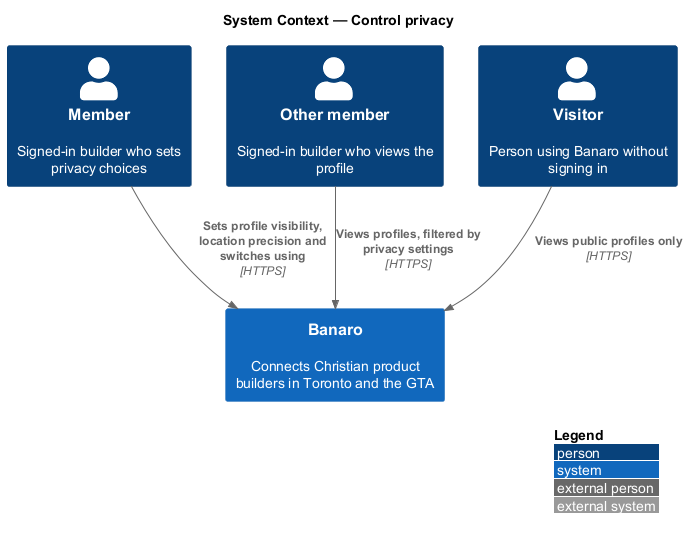
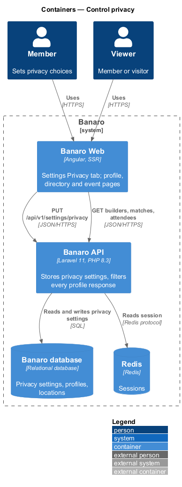
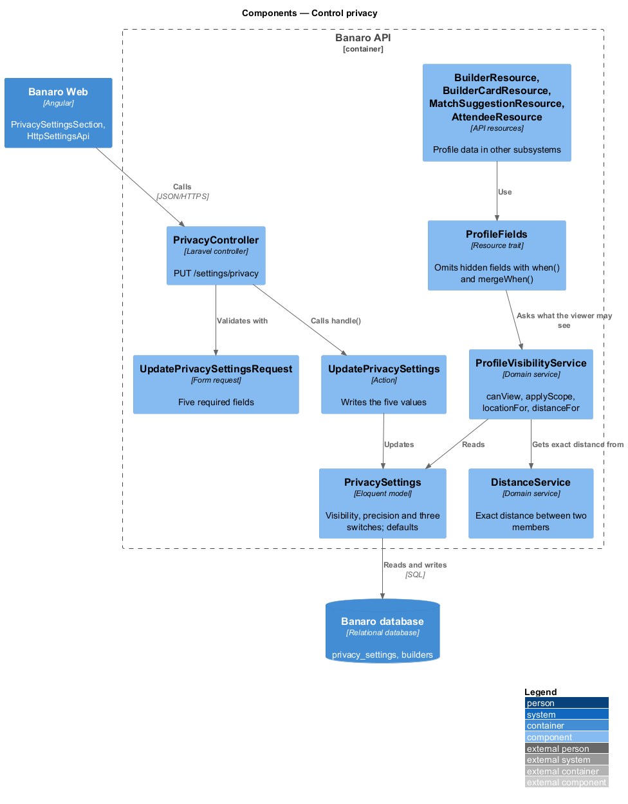
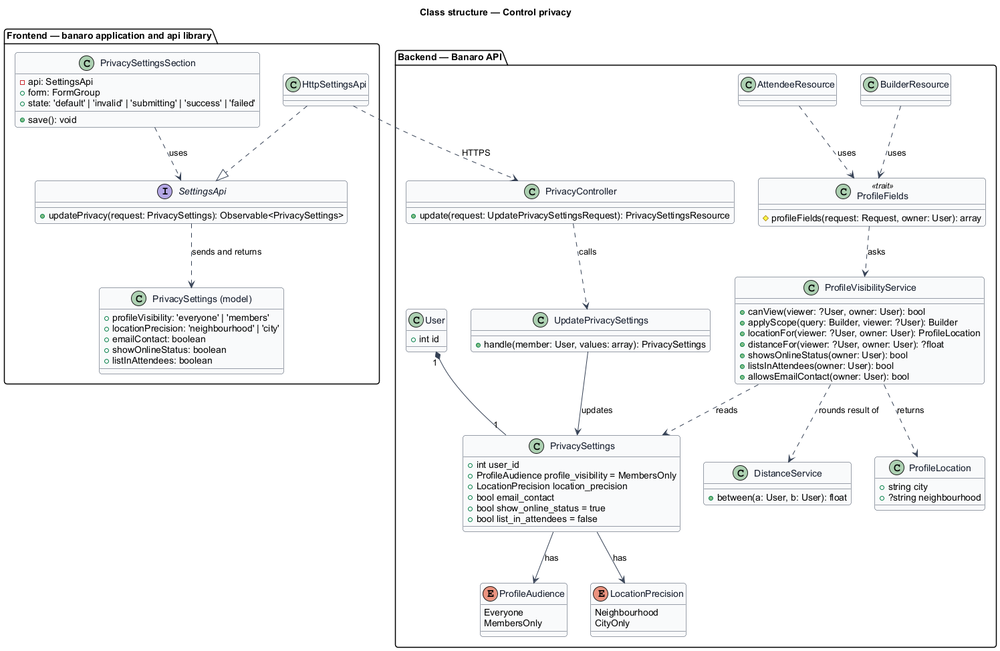
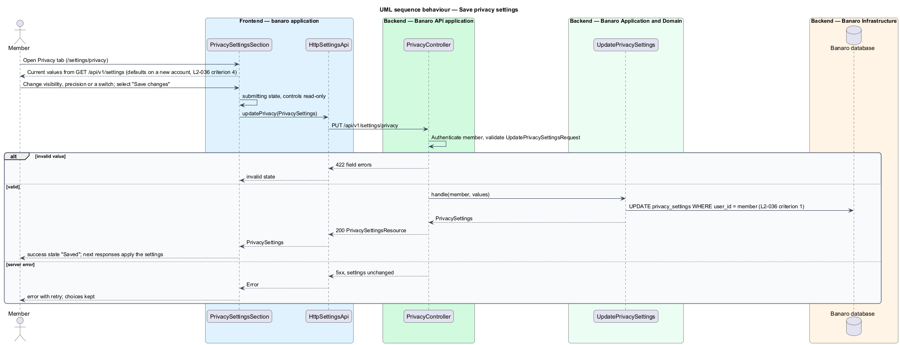
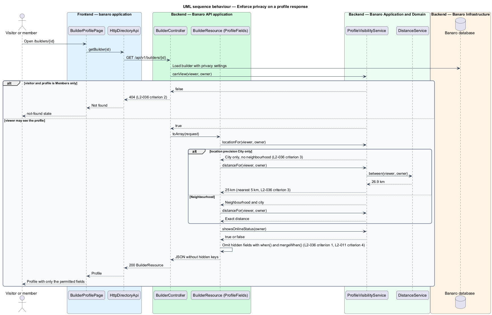

# Control privacy

## Overview

A builder profile shows where a member lives, whether they are online and which events they attend.
This feature lets a member decide who sees those details, from the Privacy tab of `/settings`. It
belongs to the `settings` subsystem. It also defines `ProfileVisibilityService`, the rule that every
API response applies before it includes another member's profile data.

Terms used in this design:

- **privacy settings** — member's five visibility choices, stored once per member
- **profile visibility** — who can open the member's profile: Everyone, or Members only
- **neighbourhood precision** — how exactly other members see the member's location: Neighbourhood,
  or City only
- **e-mail-based contact** — setting that allows or stops contact through e-mail; its exact behaviour
  is an open point
- **online status** — "Online now" or last-seen indicator on the member's profile and cards
- **attendee-list listing** — appearance of the member's name in the attendee list of events they
  attend
- **viewer** — person, signed in or not, whose request the API is answering
- **visibility filter** — server-side step that removes hidden fields from a response before it is
  serialized

The member changes a setting on the Privacy tab and saves it. From then on, each API response that
carries the member's profile applies the setting for the viewer. A hidden field is absent from the
JSON, not empty. "Members only" hides the profile from visitors and from the signed-out directory.
"City only" shows other members the city and a distance rounded to the nearest 5 km, never the
neighbourhood. A new account starts with "Members only", online status on and attendee listing off.

## Description

The slice runs from the Privacy tab of the settings page in Banaro Web through the Banaro API to the
Banaro database. The enforcement half runs inside every API resource that shows another member.

### Frontend — `banaro` application and libraries

- **`PrivacySettingsSection`** (`pages/settings/privacy-settings-section/`) — the Privacy tab, the
  `privacy` state of the `settings` mock. It shows one control per setting: profile visibility as a
  radio group, neighbourhood precision as a radio group, and e-mail-based contact, online status and
  attendee-list listing as switches. "Save changes" saves the tab; it shares the `invalid`,
  `submitting`, `success` and error behaviour of `AccountSettingsSection` (`L2-035` criteria 2 and 3).
- **`SettingsPage`** (`pages/settings/`) — owned by `manage-account-settings`. It loads the current
  privacy settings with the rest of the page.
- **`SettingsApi`** / **`SETTINGS_API`** / **`HttpSettingsApi`** (`api` library) —
  `updatePrivacy(request)` sends `PUT /api/v1/settings/privacy` and returns `PrivacySettings`.
- **`PrivacySettings`** (`api` library model) — `profileVisibility` (`everyone` or `members`),
  `locationPrecision` (`neighbourhood` or `city`), `emailContact`, `showOnlineStatus` and
  `listInAttendees`.

### Backend — Banaro API: saving the settings

- **`PrivacyController`** (`Controllers/Api/V1/Settings/`) — `update()` handles
  `PUT /settings/privacy` in `routes/api.php`. It acts on the session user only and returns a
  `PrivacySettingsResource`.
- **`UpdatePrivacySettingsRequest`** (`Requests/Settings/`) — requires all five fields, with the two
  enumerations validated against `ProfileAudience` and `LocationPrecision`.
- **`UpdatePrivacySettings`** (`Actions/Settings/`) — writes the five values in one statement
  (`L2-036` criterion 1).
- **`PrivacySettings`** (`Models/`) — one row per user: `profile_visibility`, `location_precision`,
  `email_contact`, `show_online_status` and `list_in_attendees`. The migration and the model defaults
  set `MembersOnly`, online status on and attendee listing off (`L2-036` criterion 4). The join action
  of `join-banaro` creates the row with the account.
- **`ProfileAudience`** and **`LocationPrecision`** (`Enums/`) — `Everyone` and `MembersOnly`;
  `Neighbourhood` and `CityOnly`.

### Backend — Banaro API: enforcing the settings

- **`ProfileVisibilityService`** (`Services/Settings/`) — the single visibility rule for every
  subsystem. Other designs that name a `ProfileVisibility` service or filter refer to this class:
  - `canView(?User $viewer, User $owner): bool` — true for the owner, for any viewer under
    `Everyone`, and for a verified member under `MembersOnly` (`L2-036` criterion 2).
  - `applyScope(Builder $query, ?User $viewer): Builder` — removes `MembersOnly` profiles from a
    listing when the viewer is not signed in. The signed-out directory uses it (`L2-036` criterion 2).
  - `locationFor(?User $viewer, User $owner): ProfileLocation` — the neighbourhood and city for
    `Neighbourhood`; the city only for `CityOnly` (`L2-036` criterion 3).
  - `distanceFor(?User $viewer, User $owner): ?float` — the exact distance from `DistanceService` for
    `Neighbourhood`; for `CityOnly`, that distance rounded to the nearest 5 km
    (`round(km / 5) * 5`) (`L2-036` criterion 3).
  - `showsOnlineStatus(User $owner)`, `listsInAttendees(User $owner)` and
    `allowsEmailContact(User $owner)` — read the switches.
- **`ProfileFields`** (`Http/Resources/Concerns/`) — trait for resources that serialize another
  member. It calls the service and uses `$this->when()` and `mergeWhen()`, so a hidden field is absent
  from the JSON (`L2-036` criterion 1, `L2-011` criterion 4). The owner always receives every field.
- **Consumers** — `BuilderResource` and `BuilderCardResource` (directory and profile),
  `MatchSuggestionResource` (matching), `AttendeeResource` (events, which also filters out members with
  attendee listing off) and conversation participant resources (messaging) use `ProfileFields`. Text
  that cites a distance, such as a match reason, takes it from `distanceFor()`.
- **Coordinates** — no resource serializes stored coordinates; distances are computed on the server.

### Open points

- Settings shown on the mock: the `privacy` state offers "Who can see my profile" with "Signed-in
  builders", "Only people I have messaged" and "Nobody", plus "Appear in the directory" and "Show my
  distance". `L2-036` names Everyone and Members only, neighbourhood precision, e-mail-based contact,
  online status and attendee-list listing. The mock has no control for four of the five spec settings.
  Agreed set of controls and copy: `<TO SUPPLY>`.
- Distance copy: the mock's "Show my distance" example cites "5.8 km", while "City only" rounds to the
  nearest 5 km. Display of a rounded distance (for example "about 5 km"): `<TO SUPPLY>`.
- Meaning of "e-mail-based contact" (showing the address, or allowing e-mail notification of
  messages): `<TO SUPPLY>`.
- Defaults for neighbourhood precision and e-mail-based contact: `<TO SUPPLY>`; `L2-036` criterion 4
  sets only the other three.
- A rounded distance under 2.5 km rounds to 0 km. Minimum displayed value: `<TO SUPPLY>`.
- Whether a member with attendee listing off still counts in an event's going count: `<TO SUPPLY>`.
- What a visitor sees when opening a `MembersOnly` profile directly (the not-found state, or a sign-in
  prompt): `<TO SUPPLY>`. The API returns 404 either way.

## Requirements

| L2 ID | Refines (L1) | Requirement |
|-------|--------------|-------------|
| `L2-036` | `L1-011`, `L1-014` | A member shall be able to control the visibility of their profile. |

The design realizes all four acceptance criteria of `L2-036`. Criteria 1 to 3 also depend on each
consuming resource using `ProfileFields`, as the Description lists.

## Diagrams

### System context

A member sets privacy choices through Banaro. Other members and visitors then see only what those
choices allow.

### Containers

The Privacy tab in Banaro Web calls the Banaro API. The API stores the settings in the Banaro database
and applies them to every response about the member.

### Components

Inside the Banaro API, `PrivacyController` calls `UpdatePrivacySettings`. Every resource that shows
another member uses `ProfileFields`, which calls `ProfileVisibilityService` and `DistanceService`.

### Class structure

A `User` has one `PrivacySettings` row with two enumerations and three switches. Resources depend on
`ProfileVisibilityService` through the `ProfileFields` trait.

### Behaviour — save privacy settings

The member saves the Privacy tab. The action writes all five values and the tab shows the saved state.

### Behaviour — enforce privacy on a profile response

A visitor asks for a "Members only" profile and receives 404. A member asks for a "City only" profile
and receives the city and a rounded distance, with no neighbourhood field.

