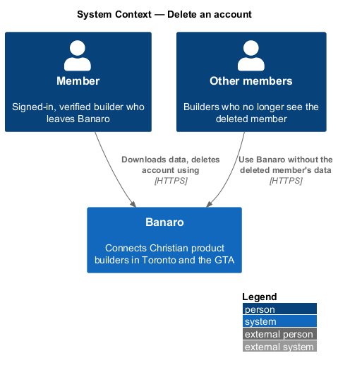
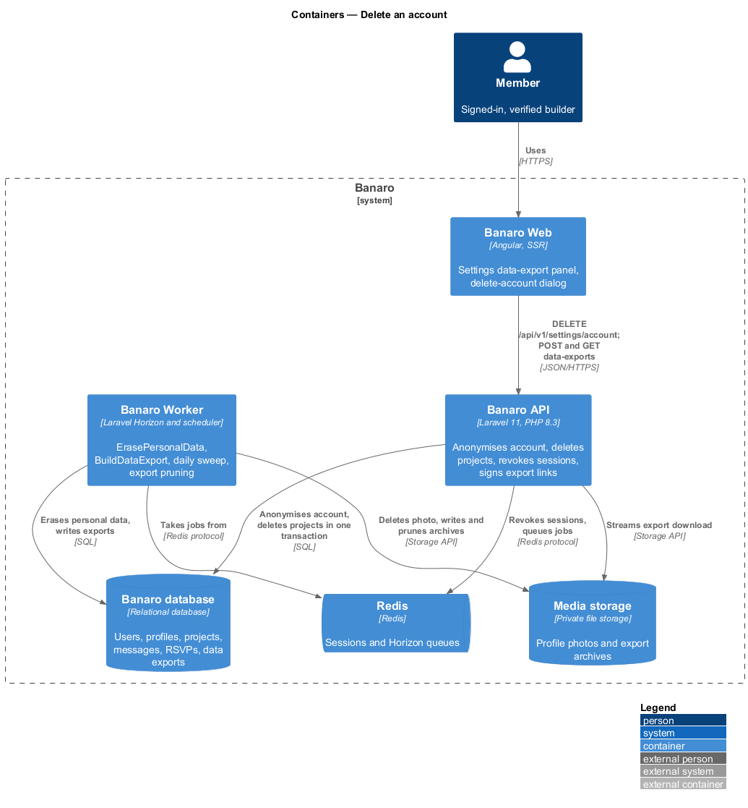
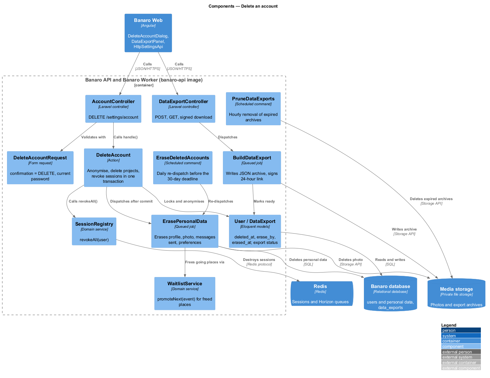
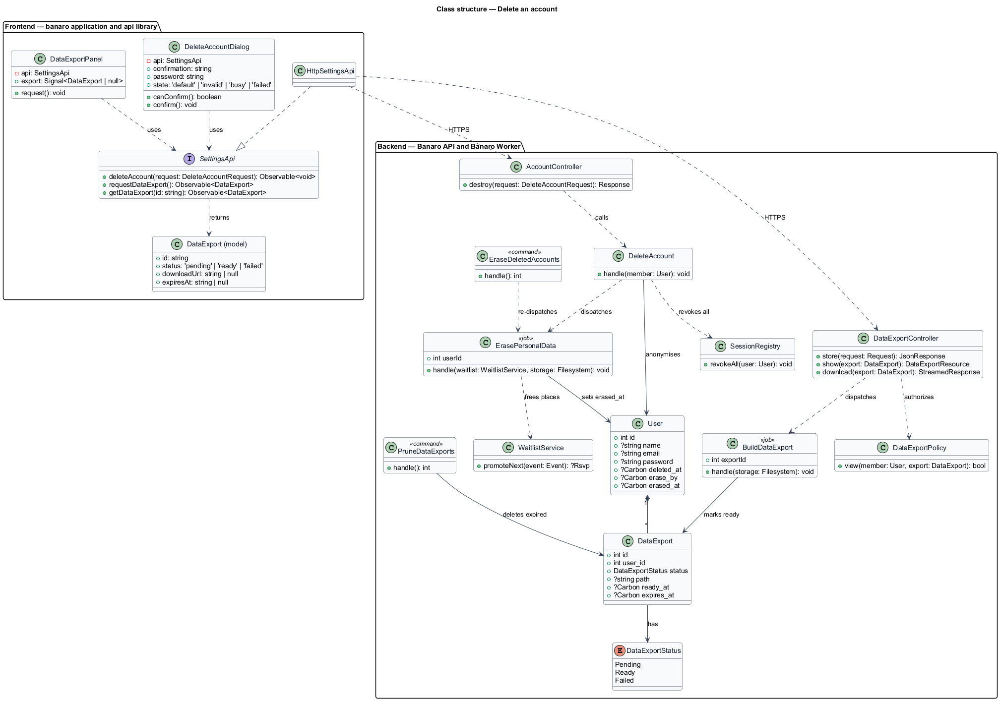
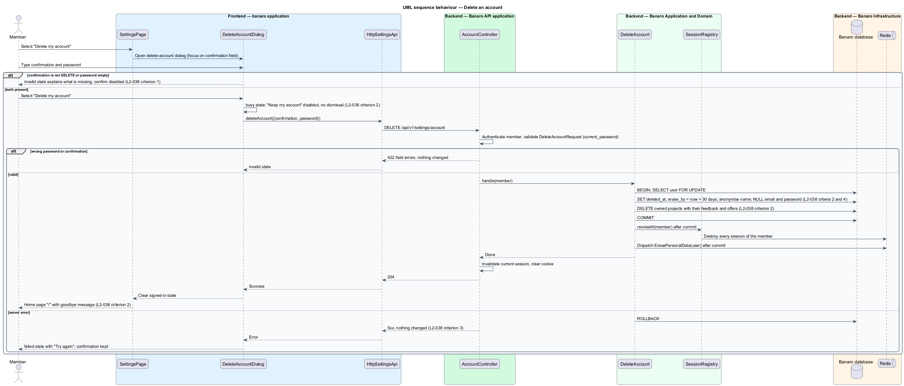
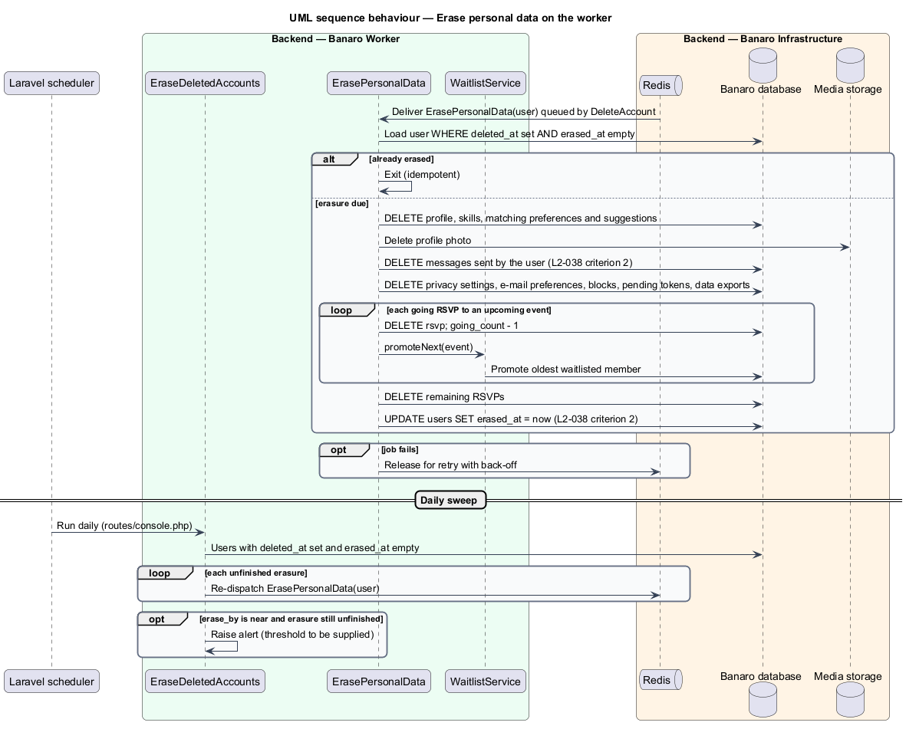
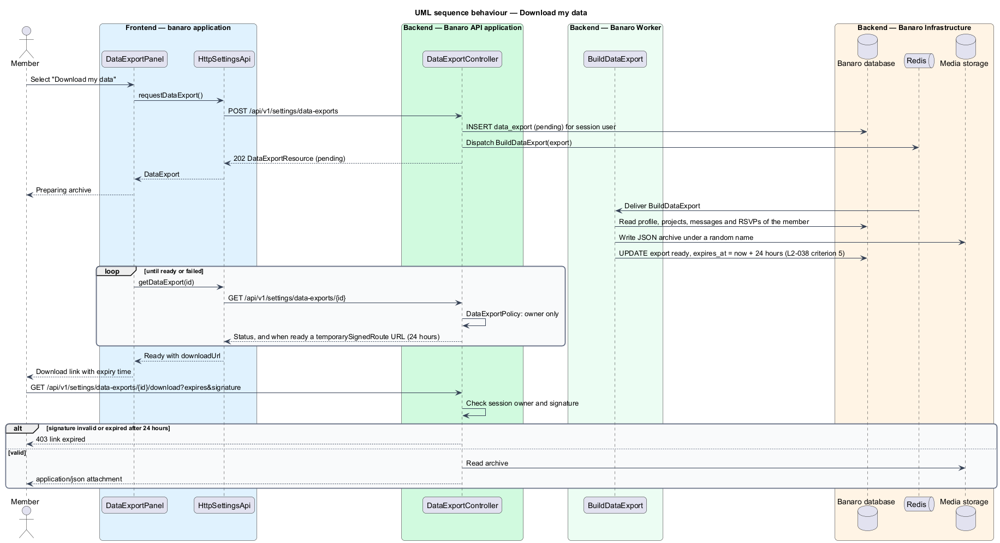

# Delete an account

## Overview

A member may leave Banaro and take their personal data with them. This feature lets a member export
their data as a JSON archive and then permanently delete the account from `/settings`. It belongs to
the `settings` subsystem. It runs on the settings page and the `delete-account` dialog, and on the
Banaro Worker, which builds the export and finishes the erasure.

Terms used in this design:

- **account deletion** — permanent removal of a member's account at the member's request
- **anonymisation** — immediate replacement of the account's identifying values, so that no screen or
  response links the remaining rows to the person
- **erasure** — removal of the member's personal data: profile, photo, messages sent, preferences and
  sessions
- **erasure deadline** — 30 days after the deletion request, by which erasure is complete
- **data export** — JSON archive of the member's profile, projects, messages and RSVPs
- **download link** — signed URL for one data export that expires 24 hours after it is issued

On the Account tab, "Download my data" asks the API for a data export. The Banaro Worker builds the
archive, and the page then offers a download link valid for 24 hours. "Delete my account" opens the
`delete-account` dialog, which lists what the member loses. The confirm action stays disabled until
the member types DELETE and the password. On confirmation the API anonymises the account and deletes the
member's projects in one transaction, then ends every session. A queued job then erases the rest of the
personal data, well inside 30 days. The member lands on the home page with a goodbye message. A new
sign-up with the same e-mail address later creates a new, empty account.

## Description

The slice runs from the settings page and the `delete-account` dialog in Banaro Web through the Banaro
API to the Banaro database, Redis and media storage. The Banaro Worker runs the export and erasure jobs.

### Frontend — `banaro` application and libraries

- **`DeleteAccountDialog`** (`dialogs/delete-account/`) — CDK dialog with the `default`, `invalid`,
  `busy` and `failed` states of the mock. It lists what the member loses (profile and photo,
  each owned project, the people they have messaged) from data the page already holds.
  - Focus starts on the confirmation field. "Delete my account" stays disabled until the confirmation
    reads DELETE and a password is entered; the `invalid` state explains what is missing
    (`L2-038` criterion 1).
  - While busy, "Keep my account" is disabled and the dialog cannot be dismissed, because the request
    cannot be recalled (`L2-038` criterion 2).
  - On failure, the `failed` state moves focus to the alert, keeps the typed confirmation and offers
    "Try again" (`L2-038` criterion 3).
  - On success, the application clears its signed-in state and navigates to `/` with a goodbye
    message (`L2-038` criterion 2).
- **`DataExportPanel`** (`pages/settings/data-export-panel/`) — part of the Account tab. "Download my
  data" requests an export, polls its status, and then shows a download link with its expiry time
  (`L2-038` criterion 5).
- **`SettingsApi`** / **`SETTINGS_API`** / **`HttpSettingsApi`** (`api` library):
  - `deleteAccount({confirmation, password})` sends `DELETE /api/v1/settings/account`.
  - `requestDataExport()` sends `POST /api/v1/settings/data-exports` and returns a `DataExport`.
  - `getDataExport(id)` sends `GET /api/v1/settings/data-exports/{id}`.
- **`DataExport`** (`api` library model) — `id`, `status` (`pending`, `ready` or `failed`),
  `downloadUrl` and `expiresAt`.

### Backend — Banaro API

- **`AccountController`** (`Controllers/Api/V1/Settings/`) — `destroy()` handles
  `DELETE /settings/account` in `routes/api.php`. It calls `DeleteAccount`, invalidates the current
  session, clears the cookie and returns 204.
- **`DeleteAccountRequest`** (`Requests/Settings/`) — requires `confirmation` equal to `DELETE` and a
  `password` that passes the `current_password` rule. A mismatch returns 422 with field errors and
  changes nothing (`L2-038` criterion 1).
- **`DeleteAccount`** (`Actions/Settings/`) — runs in one database transaction, so a failure leaves
  everything unchanged (`L2-038` criterion 3):
  1. It locks the user row with `lockForUpdate()`.
  2. It anonymises the account: it sets `deleted_at` and `erase_by` (now plus 30 days), replaces the
     name with a neutral label, and sets `email` and `password` to null. The address becomes free, so
     a later join creates a new, empty account (`L2-038` criteria 2 and 4).
  3. It deletes the member's owned projects with their feedback and help offers (`L2-038` criterion 2).
  4. After commit, it calls `SessionRegistry::revokeAll()` to end every session
     (`L2-038` criterion 2). Revoking only after commit keeps sessions intact when the transaction
     fails.
  5. After commit, it dispatches `ErasePersonalData` for the user.
- **`ErasePersonalData`** (`Jobs/Settings/`) — queued job on the Banaro Worker. It erases the
  profile, the photo in media storage, messages sent, privacy settings, e-mail preferences, matching
  preferences and suggestions, blocks, RSVPs and pending tokens. For each RSVP to an upcoming event in
  which the member was going, it calls `WaitlistService::promoteNext()` of `rsvp-to-event`. It is
  idempotent, retries with back-off, and sets `erased_at` when done (`L2-038` criterion 2).
- **`EraseDeletedAccounts`** (`Console/Commands/`) — scheduled daily in `routes/console.php`. It
  re-dispatches `ErasePersonalData` for any account with `deleted_at` set and `erased_at` empty, and
  raises an alert for any account still unerased when `erase_by` is within `<TO SUPPLY>` days. This
  sweep keeps the 30-day deadline when a job fails.
- **`DataExportController`** (`Controllers/Api/V1/Settings/`) — `store()` creates a `DataExport` with
  status `pending` and dispatches `BuildDataExport`, returning 202. `show()` returns the export's status.
  `download()` handles `GET /settings/data-exports/{export}/download`, which requires both the
  owner's session and a valid temporary signature (`signed` middleware), and streams the file.
- **`BuildDataExport`** (`Jobs/Settings/`) — queued job on the Banaro Worker. It writes one JSON file of
  the member's profile, projects, messages and RSVPs to private media storage under a random name. It
  then marks the export `ready` with a download URL from `URL::temporarySignedRoute()` that expires in
  24 hours (`L2-038` criterion 5).
- **`PruneDataExports`** (`Console/Commands/`) — scheduled hourly. It deletes export files and rows
  older than 24 hours.
- **`DataExport`** (`Models/`) — holds `user_id`, `status`, `path`, `ready_at` and `expires_at`.
- **`DataExportPolicy`** (`Policies/`) — limits `show` and `download` to the export's owner
  (`L2-044` criterion 1).

### Open points

- Confirmation input: `L2-038` criterion 1 requires DELETE and the password. The `delete-account` mock
  asks for DELETE or the member's e-mail address in one field and has no password field. Agreed confirmation and mock
  update: `<TO SUPPLY>`.
- "Download my data": the dialog mock tells the member to download first, but neither the dialog nor
  the `settings` mock has a "Download my data" control or export states. Mock: `<TO SUPPLY>`.
- Goodbye message on the home page: no mock state exists for it. Copy and placement: `<TO SUPPLY>`.
- Anonymised label shown in other members' threads and feedback, and whether received messages in
  other members' threads are kept: `<TO SUPPLY>`.
- Retention of reports, moderation actions and audit entries that name the deleted member:
  `<TO SUPPLY>`.
- Backup retention: erasure from database backups follows the backup retention period, which is
  `<TO SUPPLY>`.
- Alert threshold for the daily sweep, and whether a ready export is also announced by e-mail:
  `<TO SUPPLY>`.
- Limit on export requests per member per day: `<TO SUPPLY>`.

## Requirements

| L2 ID | Refines (L1) | Requirement |
|-------|--------------|-------------|
| `L2-038` | `L1-011`, `L1-014` | A member shall be able to permanently delete their account and personal data. |

The design realizes all five acceptance criteria of `L2-038`. The Description cites each criterion
where a component enforces it.

## Diagrams

### System context

A member exports data and deletes the account through Banaro. No external system takes part; the
member's e-mail address stops receiving Banaro e-mail once the account is anonymised.

### Containers

The Banaro API anonymises the account and revokes sessions at once. The Banaro Worker erases the
remaining data and builds data exports in media storage.

### Components

Inside the Banaro API, `AccountController` calls `DeleteAccount`, which dispatches `ErasePersonalData`.
`DataExportController` dispatches `BuildDataExport`. Two scheduled commands guard the deadlines.

### Class structure

A `User` carries `deleted_at`, `erase_by` and `erased_at` and has many `DataExport` rows. On the
frontend, the dialog and the export panel depend on the `SettingsApi` contract.

### Behaviour — delete the account

The member types DELETE and the password and confirms. One transaction anonymises the account and deletes
projects; session revocation and the erasure job follow after commit.

### Behaviour — erase personal data on the worker

The job erases the remaining personal data and frees RSVP places. The daily sweep re-dispatches any
unfinished erasure before the 30-day deadline.

### Behaviour — download my data

The member requests an export. The worker builds the JSON archive, and the page offers a signed link
that expires in 24 hours.

