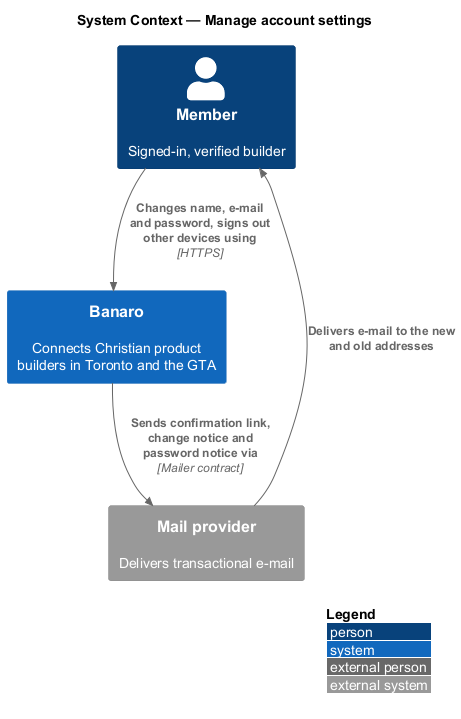
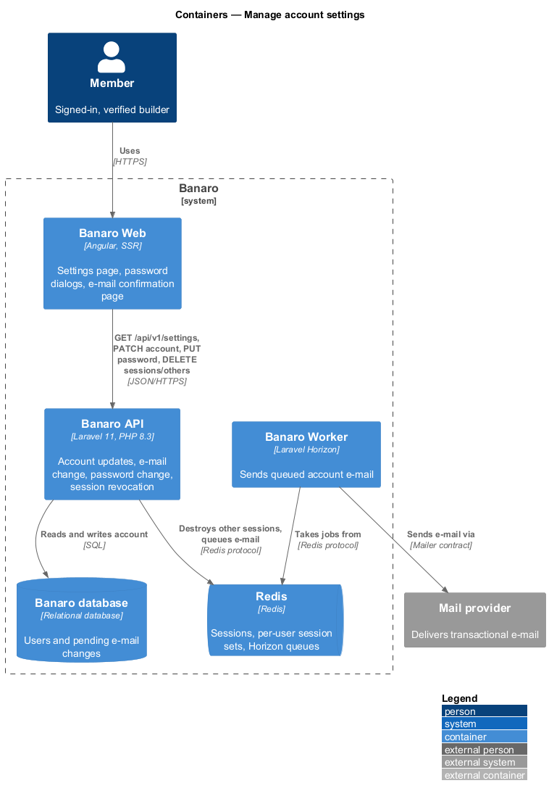
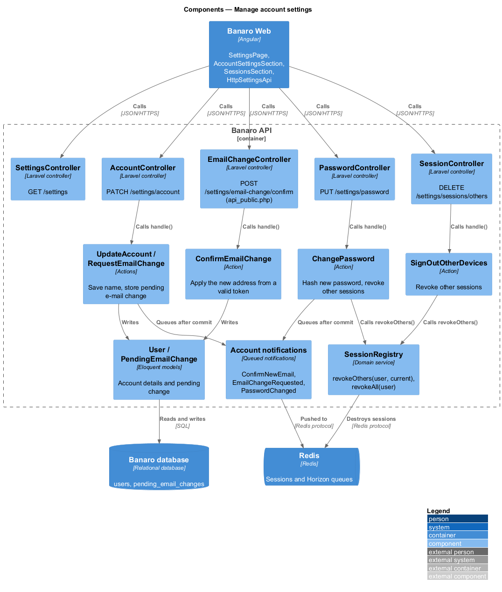
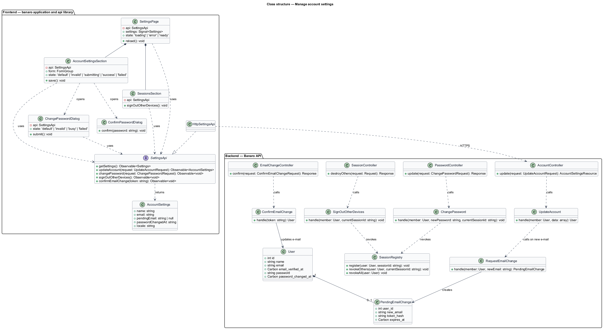
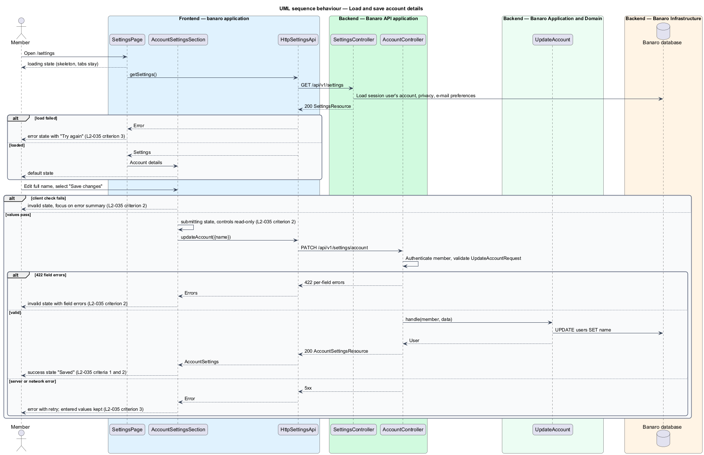
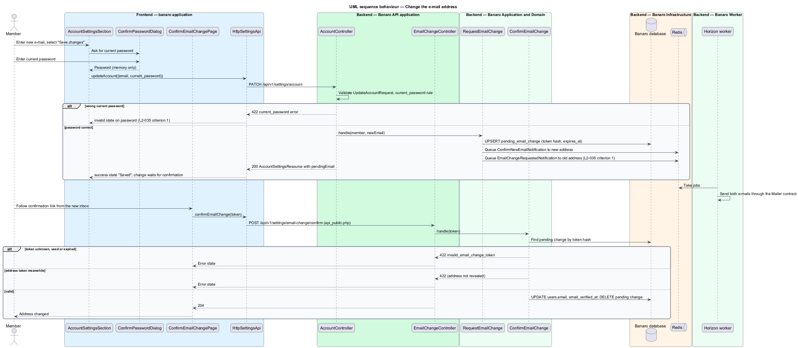
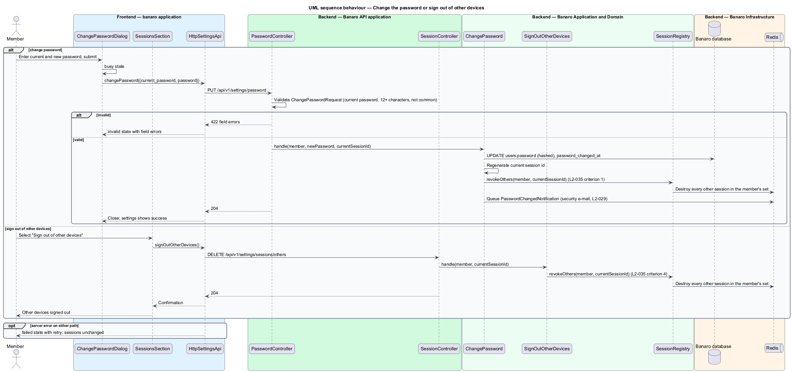

# Manage account settings

## Overview

Each member has an account: a name, an e-mail address that Banaro writes to, a password and the
sessions that are signed in with it. This feature lets a member change those details at `/settings`
and sign out of every other device. It belongs to the `settings` subsystem. It also owns the
`SettingsPage` shell that the `control-privacy`, `manage-email-preferences` and `delete-account`
features add their parts to.

Terms used in this design:

- **settings page** — page at `/settings` with three tabs: Account, Privacy and E-mail
- **account details** — member's full name, e-mail address and password
- **pending e-mail change** — requested new address that waits for confirmation from that address
- **confirmation link** — signed, single-use link sent to the new address to complete an e-mail change
- **session** — one signed-in browser, identified by its Laravel session id
- **other sessions** — every session of the member except the one making the request

The member edits the Account tab and selects "Save changes". A name change saves at once. An e-mail
change needs the current password; the API e-mails a confirmation link to the new address and tells
the old address. The address changes only when the member follows the link. A password change needs
the current password and signs out every other session. "Sign out of other devices" does the same
without a password change.

## Description

The slice runs from the settings page in Banaro Web through the Banaro API to the Banaro database and
Redis. The Banaro Worker sends the e-mail.

### Frontend — `banaro` application and libraries

- **`SettingsPage`** (`pages/settings/`) — routed page for `/settings`, with child routes
  `/settings/privacy` and `/settings/email` for the other tabs. It loads all settings once with
  `getSettings()` and shows the mock's `loading` skeleton, then the tab. On a failed load it shows the
  `error` state ("Try again") (`L2-035` criterion 3).
- **`AccountSettingsSection`** (`pages/settings/account-settings-section/`) — the Account tab: full
  name, e-mail, password (a change-password link and the last-changed date) and the delete-account
  entry.
  - Client checks run first. Invalid values show the `invalid` state: an error summary ("Fix these
    before continuing") that takes focus, with links to each field and errors under the fields. API
    422 field errors use the same display (`L2-035` criterion 2).
  - While saving, the fields are read-only and "Save changes" reads "Saving…" (`submitting` state).
  - On success, the `success` state shows "Saved", announced politely until the next edit.
  - On a failed save, the section shows an error with retry and keeps every entered value
    (`L2-035` criterion 3).
  - When the e-mail field changes, the section collects the current password through
    `ConfirmPasswordDialog` before sending (`L2-035` criterion 1).
- **`ConfirmPasswordDialog`** (`dialogs/confirm-password/`) — CDK dialog that asks for the current
  password and returns it to the caller. It holds the password only in memory.
- **`ChangePasswordDialog`** (`dialogs/change-password/`) — CDK dialog opened by the change-password
  link. It takes the current password and the new password, with `default`, `invalid`, `busy`
  and `failed` states.
- **`SessionsSection`** (`pages/settings/sessions-section/`) — offers "Sign out of other devices"
  (`L2-035` criterion 4).
- **`ConfirmEmailChangePage`** (`pages/confirm-email-change/`) — public page that the confirmation
  link opens. It posts the token and shows the result.
- **`SettingsApi`** / **`SETTINGS_API`** / **`HttpSettingsApi`** (`api` library) — the contract, its
  injection token and its HTTP implementation:
  - `getSettings()` sends `GET /api/v1/settings` and returns `Settings`.
  - `updateAccount(request)` sends `PATCH /api/v1/settings/account`.
  - `changePassword(request)` sends `PUT /api/v1/settings/password`.
  - `signOutOtherDevices()` sends `DELETE /api/v1/settings/sessions/others`.
  - `confirmEmailChange(token)` sends `POST /api/v1/settings/email-change/confirm`.
- **`Settings`** and **`AccountSettings`** (`api` library models) — `Settings` holds `account`,
  `privacy` and `emailPreferences`. `AccountSettings` holds `name`, `email`, `pendingEmail`,
  `passwordChangedAt` and `locale`.

### Backend — Banaro API

Every route below except the confirmation is in `routes/api.php` and acts on the session user only; no
route takes a user id (`L2-044` criterion 1).

- **`SettingsController`** (`Controllers/Api/V1/Settings/`) — `show()` handles `GET /settings` and
  returns a `SettingsResource` with the account, privacy and e-mail parts.
- **`AccountController`** (`Controllers/Api/V1/Settings/`) — `update()` handles
  `PATCH /settings/account` and calls `UpdateAccount`.
- **`UpdateAccountRequest`** (`Requests/Settings/`) — validates `name` (required, length
  `<TO SUPPLY>`), `email` (well-formed) and `current_password`. `current_password` is required when
  `email` differs from the stored address and shall match it (Laravel `current_password` rule). Fields
  such as `role` or `verified_at` are ignored (`L2-044` criterion 4).
- **`UpdateAccount`** (`Actions/Settings/`) — saves the name. When the e-mail differs, it calls
  `RequestEmailChange`. It returns the updated `AccountSettings`.
- **`RequestEmailChange`** (`Actions/Settings/`) — stores one `PendingEmailChange` per member with a
  hashed random token and an expiry of `<TO SUPPLY>`, replacing any earlier one. After commit it queues
  `ConfirmNewEmailNotification` to the new address and `EmailChangeRequestedNotification` to the
  current address (`L2-035` criterion 1).
- **`EmailChangeController`** (`Controllers/Api/V1/Settings/`) — `confirm()` handles
  `POST /settings/email-change/confirm` from `routes/api_public.php`, because the member may open the
  link on a device without a session. It calls `ConfirmEmailChange`.
- **`ConfirmEmailChange`** (`Actions/Settings/`) — finds the pending change by token hash, rejects an
  expired or used token with 422 `invalid_email_change_token`, checks that the address is still free
  case-insensitively (`L2-001`), sets `users.email` and `email_verified_at`, and deletes the pending
  change.
- **`PasswordController`** (`Controllers/Api/V1/Settings/`) — `update()` handles `PUT /settings/password`
  with `ChangePasswordRequest` (current password, new password of at least 12 characters, not on the
  common-password list, as in `L2-001`) and calls `ChangePassword`.
- **`ChangePassword`** (`Actions/Settings/`) — hashes and stores the new password, sets
  `password_changed_at`, regenerates the current session id, and calls
  `SessionRegistry::revokeOthers()` (`L2-035` criterion 1). After commit it queues
  `PasswordChangedNotification`, a security e-mail that preferences never turn off (`L2-029`).
- **`SessionController`** (`Controllers/Api/V1/Settings/`) — `destroyOthers()` handles
  `DELETE /settings/sessions/others` and calls `SignOutOtherDevices`, which calls
  `SessionRegistry::revokeOthers()` (`L2-035` criterion 4).
- **`SessionRegistry`** (`Services/Identity/`) — keeps a Redis set of session ids per user, filled at
  sign-in. `revokeOthers(User, string $currentId)` destroys every other session in the set.
  `revokeAll(User)` destroys all of them; `moderate-reports` and `delete-account` call it.
- **`PendingEmailChange`** (`Models/`) — holds `user_id`, `new_email`, `token_hash` and `expires_at`.
- **`SettingsResource`** and **`AccountSettingsResource`** (`Resources/Settings/`) — the JSON shapes
  above. The password hash is never serialized.

### Open points

- Sessions section: the `settings` mock has no "Sign out of other devices" control and no sessions
  list, while `L2-035` criterion 4 requires the action. Mock: `<TO SUPPLY>`.
- Current password for an e-mail change: the Account tab mock has no current-password field. The
  design uses `ConfirmPasswordDialog`; a mock for it: `<TO SUPPLY>`.
- Change-password link: no mock exists for `ChangePasswordDialog`. Mock: `<TO SUPPLY>`.
- Confirmation page for the new address: no mock exists for `ConfirmEmailChangePage`. Mock:
  `<TO SUPPLY>`.
- Language field: the Account tab mock offers "English" and "Français", while `L2-035` names only
  name, e-mail and password and `L2-052` names only `en-CA`. Whether the language field ships:
  `<TO SUPPLY>`.
- Confirmation link lifetime, the old-address notice timing (at request, at completion or both), and
  the response when the new address already belongs to another account: `<TO SUPPLY>`. The design
  avoids revealing that an address is registered.
- Name length limits: `<TO SUPPLY>`.
- Ownership of `SessionRegistry`: this design assumes `sign-in-and-sign-out` records each session at
  sign-in; confirmation: `<TO SUPPLY>`.

## Requirements

| L2 ID | Refines (L1) | Requirement |
|-------|--------------|-------------|
| `L2-035` | `L1-011` | A member shall be able to manage their account at `/settings`. |

The design realizes all four acceptance criteria of `L2-035`. The Description cites each criterion
where a component enforces it.

## Diagrams

### System context

A member manages the account through Banaro. Banaro sends the confirmation link, the change notice and
the password notice through the mail provider.

### Containers

The settings page in Banaro Web calls the Banaro API. The API writes the account to the Banaro
database, revokes sessions in Redis and queues e-mail for the Banaro Worker.

### Components

Inside the Banaro API, four controllers call one action each. `ChangePassword` and
`SignOutOtherDevices` share `SessionRegistry`.

### Class structure

A `User` has at most one `PendingEmailChange`. On the frontend, the settings page, its sections and
dialogs depend on the `SettingsApi` contract.

### Behaviour — load and save account details

The page loads all settings once, then saves the Account tab. The sequence covers the invalid,
submitting, success and failed states.

### Behaviour — change the e-mail address

The member confirms the current password. The API e-mails the new address a confirmation link and
tells the old address. Following the link completes the change.

### Behaviour — change the password or sign out of other devices

Both paths end in `SessionRegistry::revokeOthers()`, which destroys every session except the current
one.

