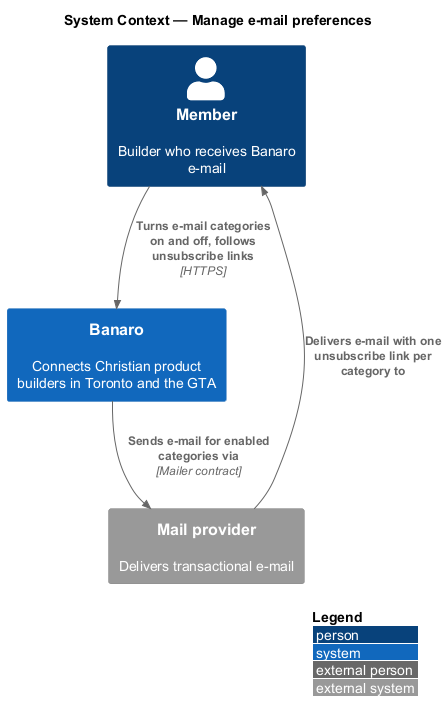
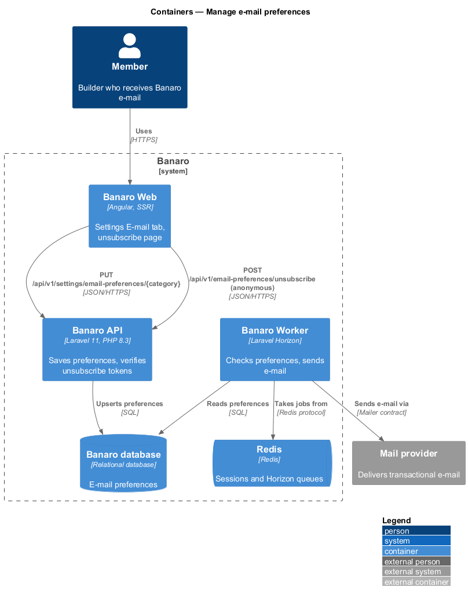
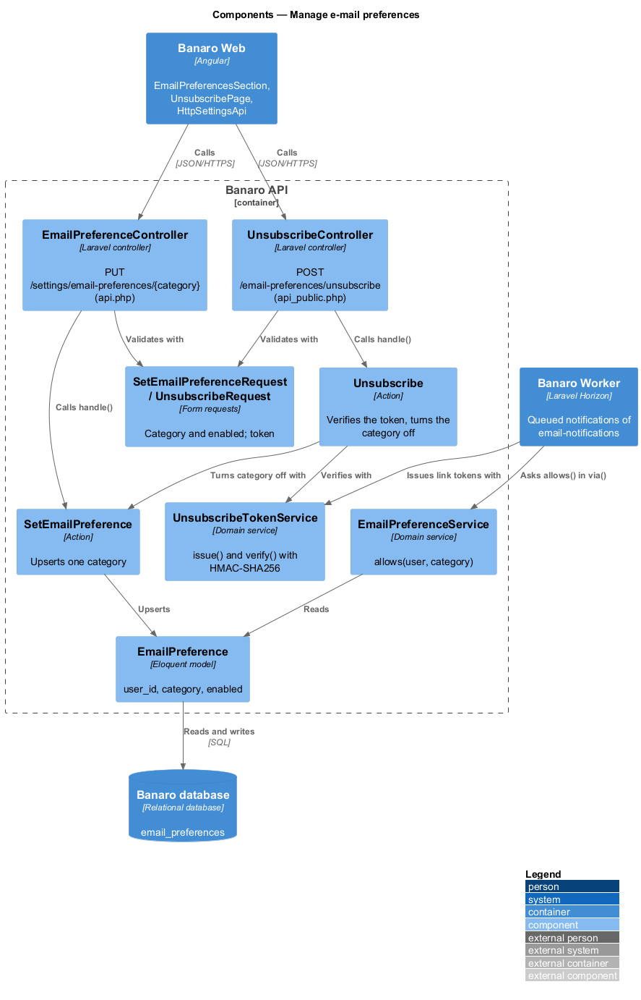
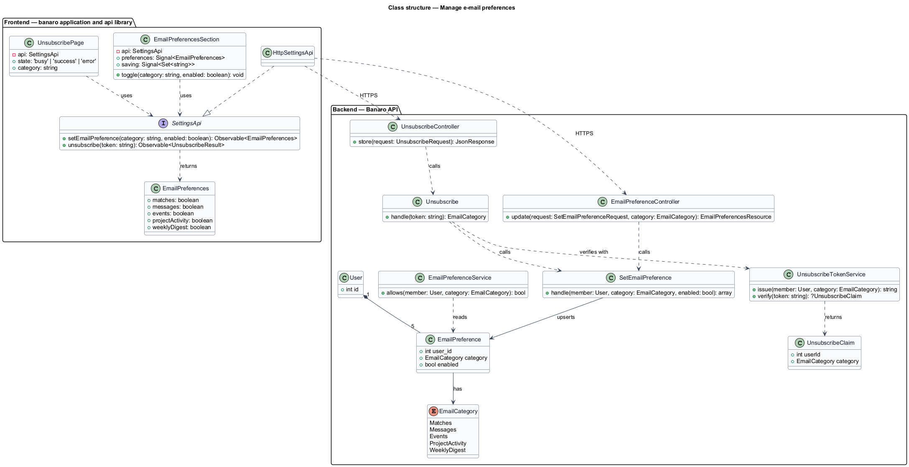
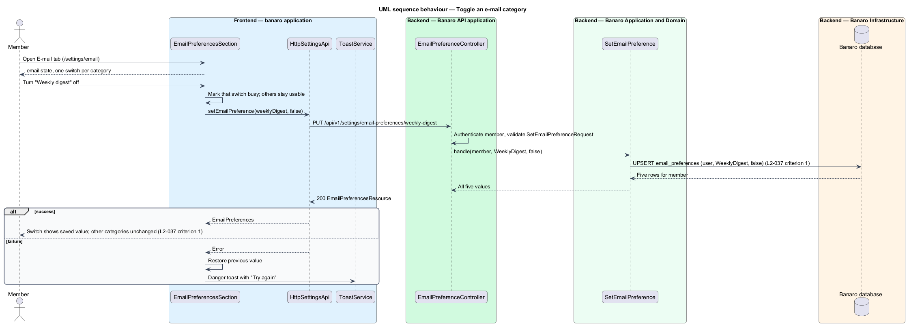
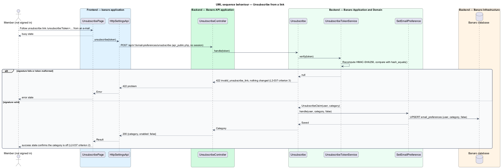

# Manage e-mail preferences

## Overview

Banaro e-mails members about matches, messages, events, activity on their projects and a weekly
digest. This feature lets a member turn each of those categories on or off from the E-mail tab of
`/settings`, and turn one off from a link in any e-mail without signing in. It belongs to the
`settings` subsystem. It defines `EmailPreferenceService`, which the `email-notifications` feature
consults before it sends an e-mail.

Terms used in this design:

- **e-mail category** — one of Matches, Messages, Events, Project activity and Weekly digest
- **e-mail preference** — on or off value of one category for one member
- **security e-mail** — verification, password reset, sign-in from a new device and other account
  e-mail that no preference turns off
- **unsubscribe link** — link in an e-mail that turns off that e-mail's category
- **unsubscribe token** — value in the unsubscribe link that names the member and the category and
  carries a signature
- **tampered link** — unsubscribe link whose token fails the signature check

On the E-mail tab, each category has a switch. Changing a switch saves that one category at once, with
no effect on the others. In an e-mail, the unsubscribe link opens a Banaro Web page that turns the
category off without sign-in and confirms it. A tampered link changes nothing and shows an error.

## Description

The slice runs from the E-mail tab and the unsubscribe page in Banaro Web through the Banaro API to the
Banaro database. The Banaro Worker reads the preferences when it sends e-mail.

### Frontend — `banaro` application and libraries

- **`EmailPreferencesSection`** (`pages/settings/email-preferences-section/`) — the E-mail tab, the
  `email` state of the `settings` mock. It shows "Sent to {address}. Account and security messages are
  always sent." and one switch per category.
  - Each switch calls `setEmailPreference()` on change and shows the saved value from the response
    (`L2-037` criterion 1).
  - While a switch saves, that switch is busy; the others stay usable.
  - On failure, the switch returns to its previous value and `ToastService` shows a danger toast with
    "Try again".
- **`UnsubscribePage`** (`pages/unsubscribe/`) — public page for `/unsubscribe?token=…`. On load it
  posts the token and shows `busy`, `success` (the category name, turned off) or `error`
  (`L2-037` criteria 2 and 3). A successful page links to the E-mail tab for a signed-in member.
- **`SettingsApi`** / **`SETTINGS_API`** / **`HttpSettingsApi`** (`api` library):
  - `setEmailPreference(category, enabled)` sends `PUT /api/v1/settings/email-preferences/{category}`
    and returns `EmailPreferences`.
  - `unsubscribe(token)` sends `POST /api/v1/email-preferences/unsubscribe`.
- **`EmailPreferences`** (`api` library model) — `matches`, `messages`, `events`, `projectActivity`
  and `weeklyDigest` as booleans.

### Backend — Banaro API

- **`EmailPreferenceController`** (`Controllers/Api/V1/Settings/`) — `update()` handles
  `PUT /settings/email-preferences/{category}` in `routes/api.php`. It acts on the session user only.
- **`SetEmailPreferenceRequest`** (`Requests/Settings/`) — validates `{category}` as an
  `EmailCategory` value and requires a boolean `enabled`.
- **`SetEmailPreference`** (`Actions/Settings/`) — upserts the one `EmailPreference` row for the member
  and category, so each category saves on its own (`L2-037` criterion 1). It returns all five values.
- **`UnsubscribeController`** (`Controllers/Api/V1/Settings/`) — `store()` handles
  `POST /email-preferences/unsubscribe` in `routes/api_public.php`, so it needs no session
  (`L2-037` criterion 2). The route is exempt from CSRF, because the signed token is the credential
  and mail clients may post to it directly for one-click unsubscribe (`L2-029` criterion 3).
- **`UnsubscribeRequest`** (`Requests/Settings/`) — requires `token`.
- **`Unsubscribe`** (`Actions/Settings/`) — asks `UnsubscribeTokenService` to verify the token. A
  failed check returns 422 with code `invalid_unsubscribe_link` and changes nothing
  (`L2-037` criterion 3). A valid token turns the named category off for the named member through
  `SetEmailPreference` and returns the category. A repeated request returns the same result.
- **`UnsubscribeTokenService`** (`Services/Settings/`) — `issue(User, EmailCategory)` returns
  `base64url(user id, category)` followed by an HMAC-SHA256 signature under a dedicated key from
  `config/security.php`. `verify(string)` recomputes the signature and compares it with
  `hash_equals()`.
- **`EmailPreferenceService`** (`Services/Settings/`) — `allows(User, EmailCategory): bool`. The
  notifications of `email-notifications` call it from `via()` and drop the `mail` channel when it is
  false (`L2-029` criterion 2). Security e-mail never calls it.
- **`EmailPreference`** (`Models/`) — one row per member and category: `user_id`, `category` and
  `enabled`, with a unique index on (`user_id`, `category`).
- **`EmailCategory`** (`Enums/`) — `Matches`, `Messages`, `Events`, `ProjectActivity` and
  `WeeklyDigest`.
- **`EmailPreferencesResource`** (`Resources/Settings/`) — the `EmailPreferences` shape.

### Open points

- Categories: `L2-037` names Matches, Messages, Events, Project activity and Weekly digest. The `email`
  mock shows "Weekly matches on Monday", "Event reminders", "New messages", "Feedback on my projects"
  and "Banaro news", with no weekly digest. Agreed list and labels: `<TO SUPPLY>`.
- Saving: `L2-037` criterion 1 saves each toggle independently, while the `email` mock has one
  "Save changes" button. The design saves per switch; mock update: `<TO SUPPLY>`.
- Unsubscribe page: no mock exists for `/unsubscribe` in any state. Mock and copy: `<TO SUPPLY>`.
- Defaults for each category on a new account: `<TO SUPPLY>`.
- Token lifetime (none, or an expiry) and behaviour for a token of a deleted account: `<TO SUPPLY>`.
- Rate limit for the anonymous unsubscribe endpoint: `<TO SUPPLY>`.

## Requirements

| L2 ID | Refines (L1) | Requirement |
|-------|--------------|-------------|
| `L2-037` | `L1-009`, `L1-011` | A member shall be able to choose which e-mail they receive. |

The design realizes all three acceptance criteria of `L2-037`. It also provides the preference check
and the unsubscribe token that `L2-029` criteria 2 and 3 rely on.

## Diagrams

### System context

A member chooses e-mail categories in Banaro or follows an unsubscribe link from an e-mail. Banaro
sends only the categories that are on through the mail provider.

### Containers

The E-mail tab and the unsubscribe page in Banaro Web call the Banaro API. The Banaro Worker reads the
stored preferences before it sends e-mail.

### Components

Inside the Banaro API, `EmailPreferenceController` and `UnsubscribeController` both end in
`SetEmailPreference`. `UnsubscribeTokenService` signs and verifies tokens; `EmailPreferenceService`
answers the notifications.

### Class structure

A `User` has one `EmailPreference` row per `EmailCategory`. On the frontend, the section and the
unsubscribe page depend on the `SettingsApi` contract.

### Behaviour — toggle a category

The member changes one switch. The API upserts that category alone and returns all five values.

### Behaviour — unsubscribe from a link

The member follows the link without signing in. A valid token turns the category off; a tampered
token changes nothing and the page shows an error.

