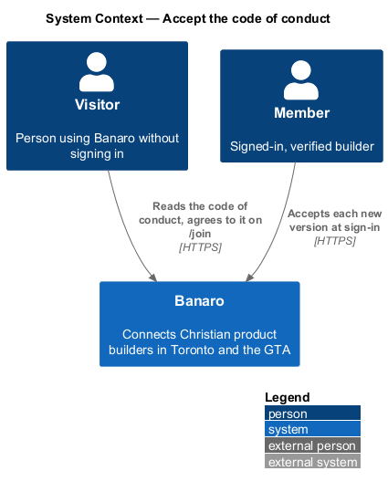
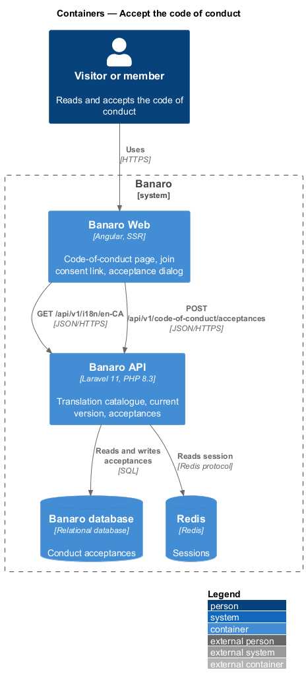
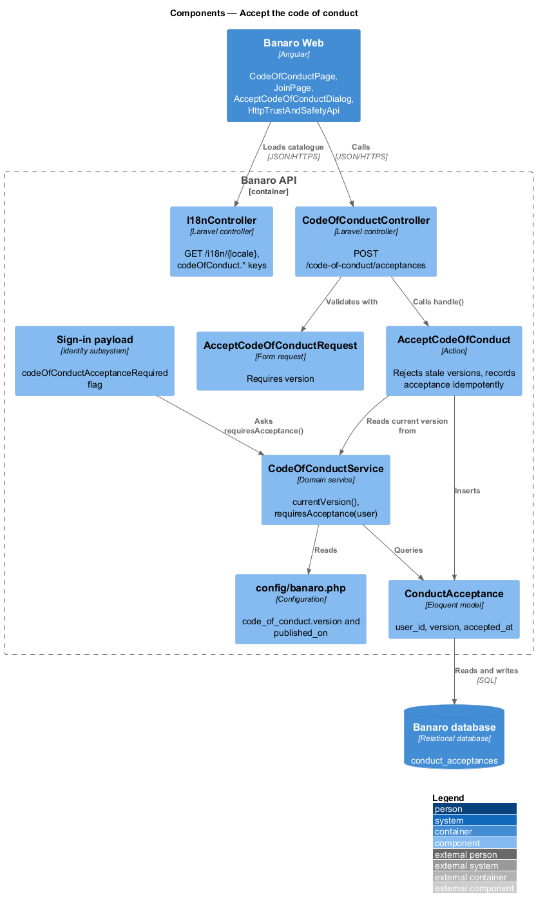
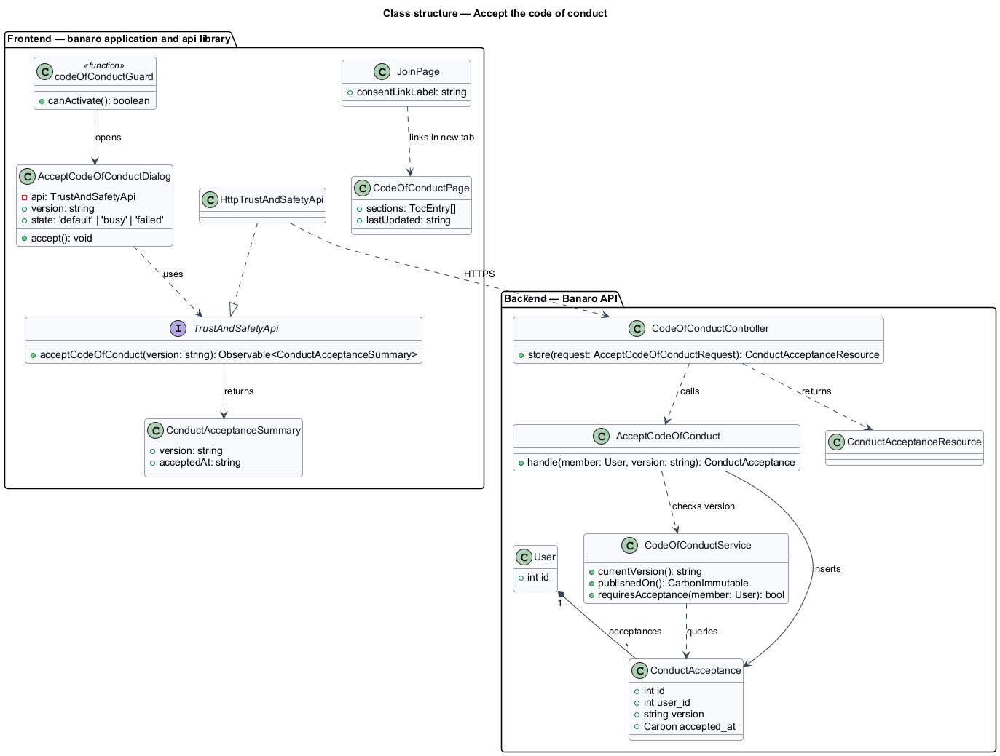
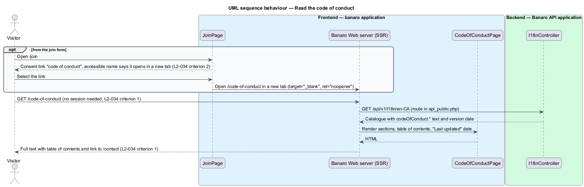
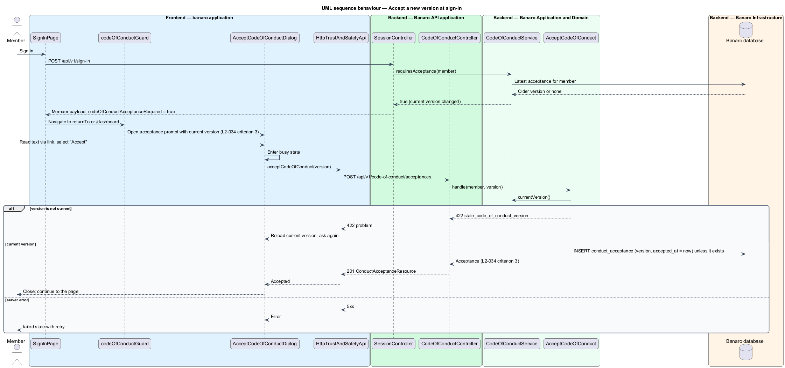

# Accept the code of conduct

## Overview

Banaro's code of conduct describes how members treat each other online and at events. This feature
publishes the code at `/code-of-conduct` for anyone to read, links to it where a visitor agrees to it
on `/join`, and asks members to accept each new version. It belongs to the `trust-and-safety`
subsystem. The `join-banaro` feature owns the join form; this feature defines what the consent link
does and what the API records.

Terms used in this design:

- **code of conduct** — public text that sets the community's expected behaviour and its contact route
  for concerns
- **version** — identifier of one published wording of the code of conduct, with its publication date
- **current version** — version that Banaro publishes now
- **acceptance** — stored record that one member accepted one version at one time
- **acceptance prompt** — screen shown after sign-in to a member whose latest acceptance is older than
  the current version

Any visitor can open `/code-of-conduct` without signing in. The page shows the full text, a table of
contents and a link to the contact page. On `/join`, the consent text "I will follow the code of
conduct" links to that page in a new tab. When the code changes, the version changes. At the next
sign-in, each member who has not accepted the new version sees the acceptance prompt, and the API
stores the accepted version and time.

## Description

The slice runs from the `code-of-conduct` page, the `join` page and the acceptance prompt in Banaro Web
through the Banaro API to the Banaro database.

### Frontend — `banaro` application and libraries

- **`CodeOfConductPage`** (`pages/code-of-conduct/`) — public, server-rendered page for
  `/code-of-conduct`. The route has no guard (`L2-034` criterion 1).
  - The text comes from the `en-CA` translation catalogue under `codeOfConduct.*` (`L2-052`), so the
    page makes no data request and has only the `default` state.
  - It renders a table of contents as a `nav` of in-page links built from the section headings
    (`L2-034` criterion 1).
  - It shows "Last updated" with the date of the current version.
  - Its closing section links to `/contact` as the route for concerns (`L2-034` criterion 1).
- **`JoinPage`** (`pages/join/`) — owned by `join-banaro`. Its consent link to `/code-of-conduct` has
  `target="_blank"` and `rel="noopener"`. Its accessible name includes "opens in a new tab", and a
  visible new-tab icon carries the same meaning (`L2-034` criterion 2).
- **`AcceptCodeOfConductDialog`** (`dialogs/accept-code-of-conduct/`) — CDK dialog that the shell opens
  after sign-in when the signed-in member payload has `codeOfConductAcceptanceRequired: true`. It links
  to the full text, offers "Accept" and has `busy` and `failed` states with retry
  (`L2-034` criterion 3).
- **`codeOfConductGuard`** (`api` library, `lib/auth/`) — guard on signed-in routes that opens the
  dialog when acceptance is required.
- **`TrustAndSafetyApi`** / **`TRUST_AND_SAFETY_API`** / **`HttpTrustAndSafetyApi`** (`api` library) —
  `acceptCodeOfConduct(version)` sends `POST /api/v1/code-of-conduct/acceptances`.

### Backend — Banaro API

- **`config/banaro.php`** — holds `code_of_conduct.version` and `code_of_conduct.published_on`. A
  change to the text in the catalogue and a change to these values ship in the same release.
- **`I18nController`** — serves the catalogue, including the `codeOfConduct.*` keys, at
  `GET /api/v1/i18n/{locale}` from `routes/api_public.php`. The `localize-and-format` feature owns it.
- **`CodeOfConductService`** (`Services/TrustAndSafety/`) — `currentVersion()` reads the
  configuration. `requiresAcceptance(User)` is true when the member has no acceptance of the current
  version.
- **`CodeOfConductController`** (`Controllers/Api/V1/TrustAndSafety/`) — `store()` handles
  `POST /code-of-conduct/acceptances` in `routes/api.php`. It calls `AcceptCodeOfConduct` and returns
  201 with a `ConductAcceptanceResource`.
- **`AcceptCodeOfConductRequest`** (`Requests/TrustAndSafety/`) — requires `version`.
- **`AcceptCodeOfConduct`** (`Actions/TrustAndSafety/`) — rejects a version other than the current one
  with 422 and code `stale_code_of_conduct_version`. It then inserts a `ConductAcceptance` with the
  version and the server time, or returns the existing row for that version (`L2-034` criterion 3).
- **`ConductAcceptance`** (`Models/`) — holds `user_id`, `version` and `accepted_at`, with a unique
  index on (`user_id`, `version`). Rows are never updated, so the history of acceptances stays intact.
- **Join integration** — `join-banaro`'s action records a `ConductAcceptance` for the current version
  when it creates the account, because the join form's consent is an acceptance.
- **Sign-in integration** — the signed-in member payload of `sign-in-and-sign-out` includes
  `codeOfConductAcceptanceRequired`, computed by `CodeOfConductService::requiresAcceptance()`
  (`L2-034` criterion 3).

### Open points

- Table of contents: the `code-of-conduct` mock has none, while `L2-034` criterion 1 requires one.
  Mock update: `<TO SUPPLY>`.
- New tab: the consent link in the `join` mock has no `target="_blank"` and no new-tab wording, while
  `L2-034` criterion 2 requires both. Mock update and exact accessible name: `<TO SUPPLY>`.
- Acceptance prompt: no mock exists for it. Whether it is a dialog or a page, its copy, and whether a
  member may decline and keep using Banaro (or is limited until accepting): `<TO SUPPLY>`.
- Members who stay signed in across a version change: `L2-034` criterion 3 prompts at the next sign-in;
  whether an active session is also prompted: `<TO SUPPLY>`.
- Version identifier format (date or number): `<TO SUPPLY>`.

## Requirements

| L2 ID | Refines (L1) | Requirement |
|-------|--------------|-------------|
| `L2-034` | `L1-010`, `L1-012` | The code of conduct shall be public and referenced where members agree to it. |

The design realizes all three acceptance criteria of `L2-034`. Criteria 2 and 3 also depend on the
`join-banaro` and `sign-in-and-sign-out` features applying the integrations above.

## Diagrams

### System context

A visitor reads the code of conduct without an account. A member accepts each new version through
Banaro.

### Containers

Banaro Web renders the public page from the translation catalogue that the Banaro API serves. The API
stores acceptances in the Banaro database.

### Components

Inside the Banaro API, `CodeOfConductController` calls `AcceptCodeOfConduct`. `CodeOfConductService`
reads the current version and tells sign-in whether a prompt is due.

### Class structure

A `User` has many `ConductAcceptance` rows, one per accepted version. On the frontend, the dialog
depends on the `TrustAndSafetyApi` contract.

### Behaviour — read the code of conduct

A visitor opens the page directly or from the join form's consent link in a new tab. The server
renders the full text, table of contents and contact route without a session.

### Behaviour — accept a new version at sign-in

The member signs in after a version change. The payload asks for acceptance, the dialog opens, and the
API stores the version and time.

