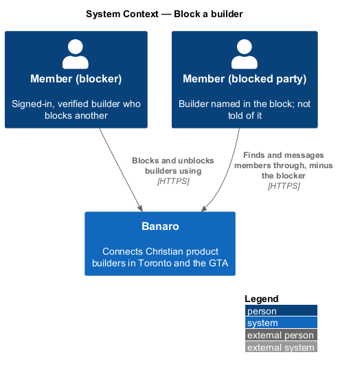
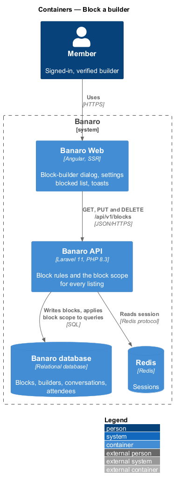
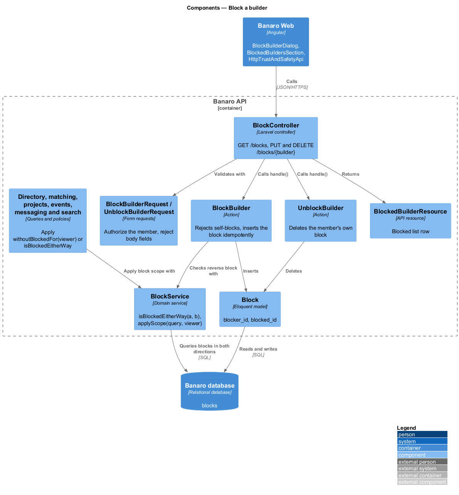
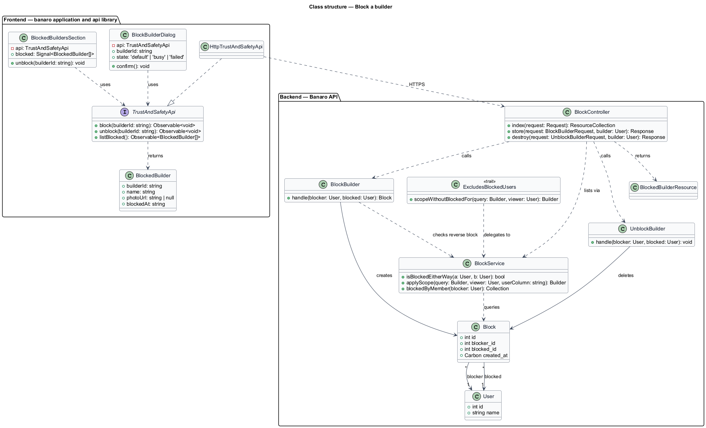
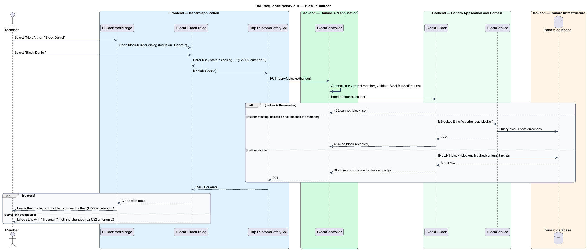
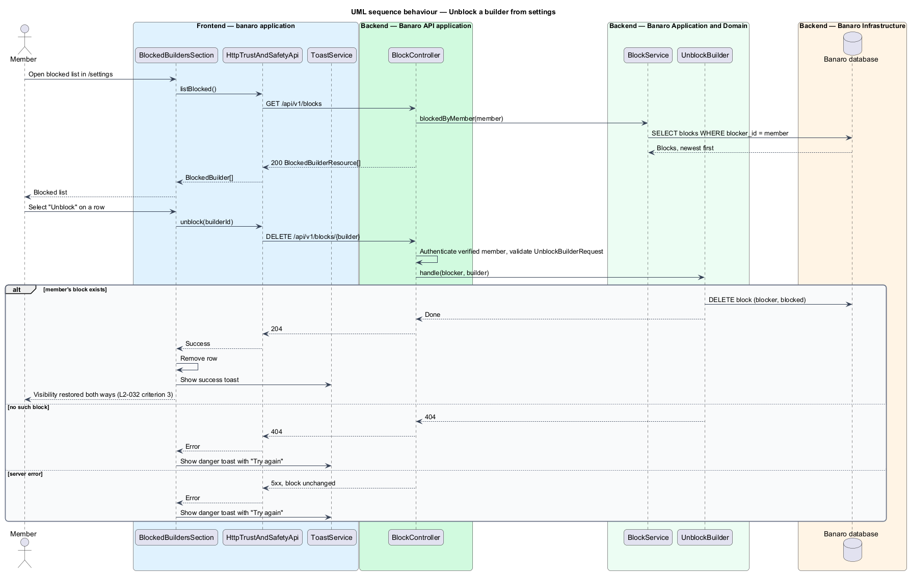
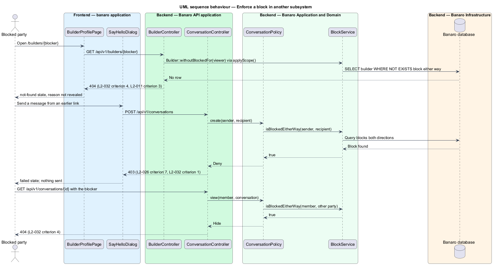

# Block a builder

## Overview

Banaro puts members in touch through the directory, matching, project feedback, event attendee lists,
search and messages. This feature lets a member block another builder so the two can no longer find or
reach each other anywhere in Banaro. It belongs to the `trust-and-safety` subsystem. It also defines
`BlockService`, the rule that every other subsystem applies before it shows one member to another.

Terms used in this design:

- **block** — stored decision by one member to stop all interaction with one other builder
- **blocker** — member who creates a block
- **blocked party** — builder named in a block
- **blocked either way** — relation between two members where either one has blocked the other
- **block scope** — query constraint that removes members who are blocked either way with the viewer
- **blocked list** — blocker's list of the builders they have blocked, shown in settings

A member opens the `block-builder` dialog from the "More" menu on a builder profile ("Block Daniel")
or from the success state of the `report` dialog. Focus starts on "Cancel", the safe choice. After
"Block Daniel", both members disappear from each other's directory, matches, project feedback, event
attendee lists and search results, and neither can message the other. The blocked party is not told.
The blocker can undo the block from the blocked list in settings.

## Description

The slice runs from the `block-builder` dialog and the settings page in Banaro Web through the Banaro
API to the Banaro database. A block sends no e-mail, so the Banaro Worker takes no part.

### Frontend — `banaro` application and libraries

- **`BlockBuilderDialog`** (`dialogs/block-builder/`) — CDK dialog with the `default`, `busy` and
  `failed` states of the mock. It receives the builder's id, full name and first name.
  - "Block Daniel" calls the contract. While busy the button reads "Blocking…"; "Cancel" stays enabled
    and closes the dialog, and the request still completes (`L2-032` criterion 2).
  - On failure, the `failed` state shows a danger alert that never auto-dismisses and offers
    "Try again" (`L2-032` criterion 2).
  - On success, the dialog closes with the result. The opener then leaves the blocked profile for the
    directory, because the profile now returns 404 to the blocker as well (`L2-011` criterion 3).
- **`BuilderProfilePage`** (`pages/builder-profile/`) — opens `BlockBuilderDialog` from its "More"
  menu. `ReportDialog` opens it from its `success` state. The `view-builder-profile` feature owns the
  page.
- **`BlockedBuildersSection`** (`pages/settings/blocked-builders-section/`) — section of
  `SettingsPage` that lists the blocked builders with an "Unblock" action per row
  (`L2-032` criterion 3). It removes a row only after the API confirms the unblock.
- **`ToastService`** (`components` library) — confirms a block or an unblock and reports a failed
  unblock with "Try again". Toast timing follows `system-notifications` (`L2-028`).
- **`TrustAndSafetyApi`** / **`TRUST_AND_SAFETY_API`** / **`HttpTrustAndSafetyApi`** (`api` library) —
  the contract, its injection token and its HTTP implementation:
  - `block(builderId)` sends `PUT /api/v1/blocks/{builder}`.
  - `unblock(builderId)` sends `DELETE /api/v1/blocks/{builder}`.
  - `listBlocked()` sends `GET /api/v1/blocks` and returns `BlockedBuilder[]`.
- **`BlockedBuilder`** (`api` library model) — `builderId`, `name`, `photoUrl` and `blockedAt`.

### Backend — Banaro API

- **`BlockController`** (`Controllers/Api/V1/TrustAndSafety/`) — `index()`, `store()` and `destroy()`
  handle `GET /blocks`, `PUT /blocks/{builder}` and `DELETE /blocks/{builder}`. The routes are in
  `routes/api.php`, so they require a verified member. The blocker always comes from the session.
- **`BlockBuilderRequest`** and **`UnblockBuilderRequest`** (`Requests/TrustAndSafety/`) — form
  requests that authorize the member and reject any request body fields.
- **`BlockBuilder`** (`Actions/TrustAndSafety/`) — creates the block:
  1. It rejects a block of the member's own builder with 422 and code `cannot_block_self`.
  2. It returns 404 for a builder that does not exist, is deleted, or has already blocked the member.
     The response is the same in each case, so it reveals no block.
  3. It inserts the `Block` row; an existing row returns unchanged, so the request is idempotent.
  4. It sends no notification to the blocked party.
- **`UnblockBuilder`** (`Actions/TrustAndSafety/`) — deletes the blocker's own `Block` row and returns
  204, or 404 when none exists. Visibility returns in both directions unless the other member holds a
  separate block of their own (`L2-032` criterion 3).
- **`BlockService`** (`Services/TrustAndSafety/`) — the single block rule for every subsystem:
  - `isBlockedEitherWay(User $a, User $b): bool` — true when a `Block` row exists from `a` to `b` or
    from `b` to `a`.
  - `applyScope(Builder $query, User $viewer, string $userColumn = 'user_id'): Builder` — adds a
    `whereNotExists` subquery on `blocks` in both directions for the given user column. It returns the
    same query for chaining.
  - `blockedByMember(User $blocker): Collection` — the blocker's own blocks, newest first, for the
    blocked list.
- **`ExcludesBlockedUsers`** (`Models/Concerns/`) — trait that gives a model the local scope
  `withoutBlockedFor(User $viewer)`, which delegates to `BlockService::applyScope()`.
- **`Block`** (`Models/`) — holds `blocker_id`, `blocked_id` and `created_at`. A unique index on
  (`blocker_id`, `blocked_id`) and a second index on `blocked_id` serve both directions of the scope.
- **`BlockedBuilderResource`** (`Resources/TrustAndSafety/`) — serializes one row of the blocked list.

### Enforcement in other subsystems

Each subsystem applies `BlockService` on the server, never only in the browser (`L2-044` criterion 5).
The table names the consumer in each design (`L2-032` criteria 1 and 4).

| Surface | Consumer | Rule |
|---------|----------|------|
| Directory and search | listing queries in `browse-directory` and `filter-directory` | `withoutBlockedFor($viewer)` |
| Builder profile | route binding in `view-builder-profile` | `withoutBlockedFor($viewer)`, so a blocked profile returns 404 |
| Matching | `MatchingService` in `generate-weekly-suggestions` and `review-matches` | scope on candidates and on stored suggestions |
| Project feedback | feedback listing in `give-feedback` and `view-project` | scope on the feedback author |
| Event attendee lists | attendee listing in `view-event` | scope on the attendee |
| Messaging | conversation policy in `say-hello` and `hold-conversations` | 404 when fetching the other member's conversations; 403 on send (`L2-026` criterion 7) |

The enforcement sequence names the consumers `BuilderController`, `ConversationController`,
`ConversationPolicy` and `SayHelloDialog`. The consuming designs fix their final names.

### Open points

- Blocked list in settings: the `settings` mock has no blocked-list section, no "Unblock" control and
  no state for it. Mock and copy: `<TO SUPPLY>`.
- Where the blocker lands after a successful block, and the toast copy for block and unblock:
  `<TO SUPPLY>`; the mocks show neither.
- Status codes for messaging: `L2-032` criterion 4 asks for 404 on the blocker's conversations, while
  `L2-026` criterion 7 asks for 403 on a send and read-only existing threads. The design applies 404 to
  fetches and 403 to sends. Confirmation that the two criteria mean this: `<TO SUPPLY>`.
- Fate of existing match suggestions, pending help offers and feedback between the two members once a
  block exists (hidden by the scope, or deleted): `<TO SUPPLY>`.
- A specific rate limit for `PUT /blocks/{builder}` beyond `L2-046` criterion 1: `<TO SUPPLY>`.

## Requirements

| L2 ID | Refines (L1) | Requirement |
|-------|--------------|-------------|
| `L2-032` | `L1-010`, `L1-014` | A member shall be able to block another builder so they cannot interact. |

The design realizes all four acceptance criteria of `L2-032`. Criteria 1 and 4 also depend on each
consuming subsystem applying `BlockService`, as the enforcement table lists.

## Diagrams

### System context

A member blocks and unblocks builders through Banaro. The blocked party uses the same system but
receives no message about the block.

### Containers

The block dialog and the settings page in Banaro Web call the Banaro API. The API stores blocks in the
Banaro database and applies them to every query that lists or loads another member.

### Components

Inside the Banaro API, `BlockController` calls `BlockBuilder` or `UnblockBuilder`. `BlockService` is
the shared component that directory, matching, projects, events, messaging and search call.

### Class structure

A `Block` joins a blocker and a blocked `User`. Models that list members use the
`ExcludesBlockedUsers` trait, which delegates to `BlockService`. On the frontend, the dialog and the
settings section depend on the `TrustAndSafetyApi` contract.

### Behaviour — block a builder

The member confirms the dialog. The action rejects a self-block, hides any existing reverse block
behind a 404 and inserts the block idempotently.

### Behaviour — unblock from settings

The member selects "Unblock" in the blocked list. The action deletes the member's own block, and
visibility returns in both directions.

### Behaviour — enforce a block in another subsystem

The blocked party opens the blocker's profile and then tries to send a message. The profile query
applies the block scope and returns 404; the message policy calls `isBlockedEitherWay` and returns 403.

