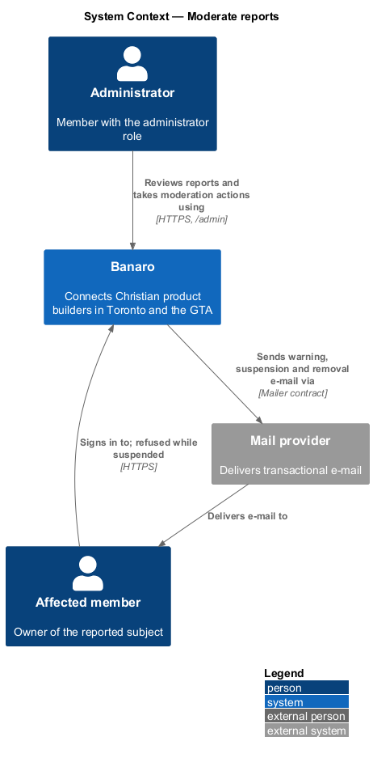
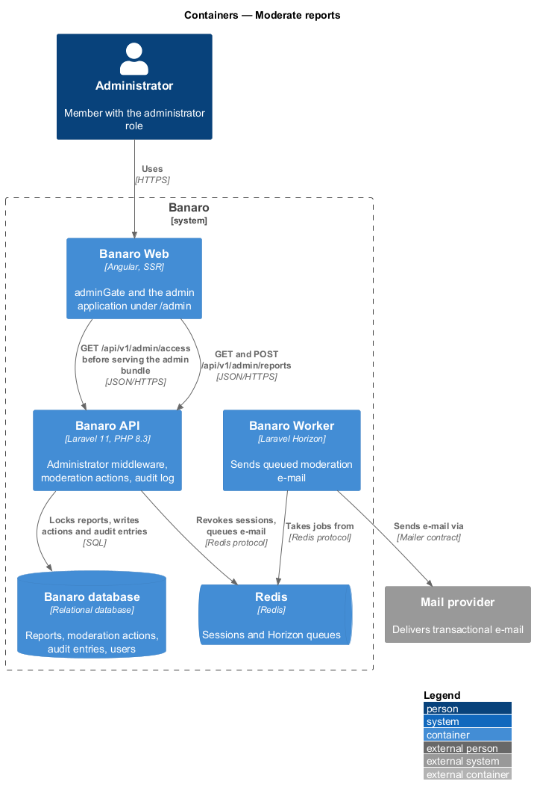
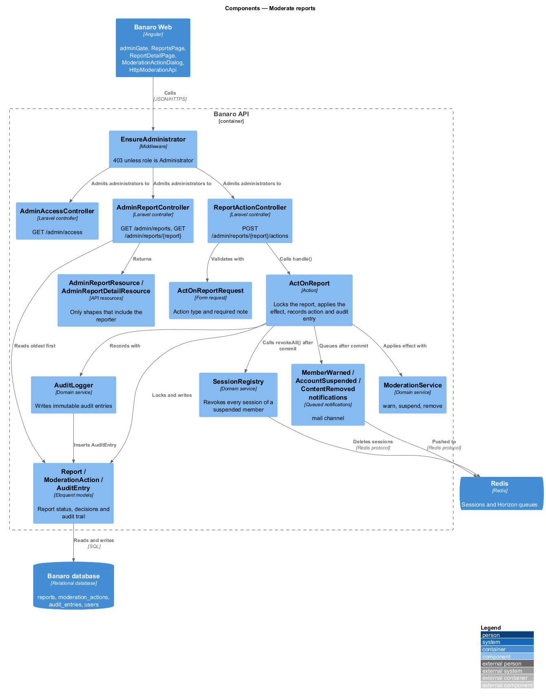
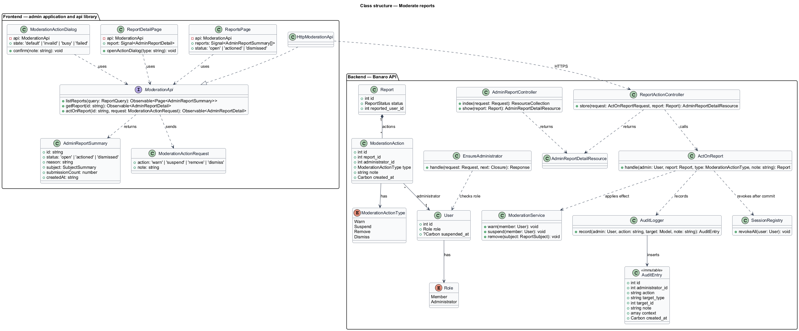
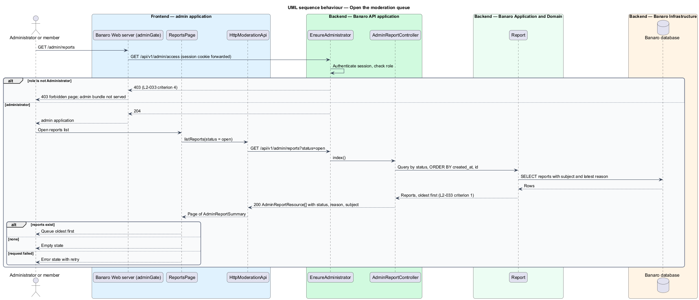
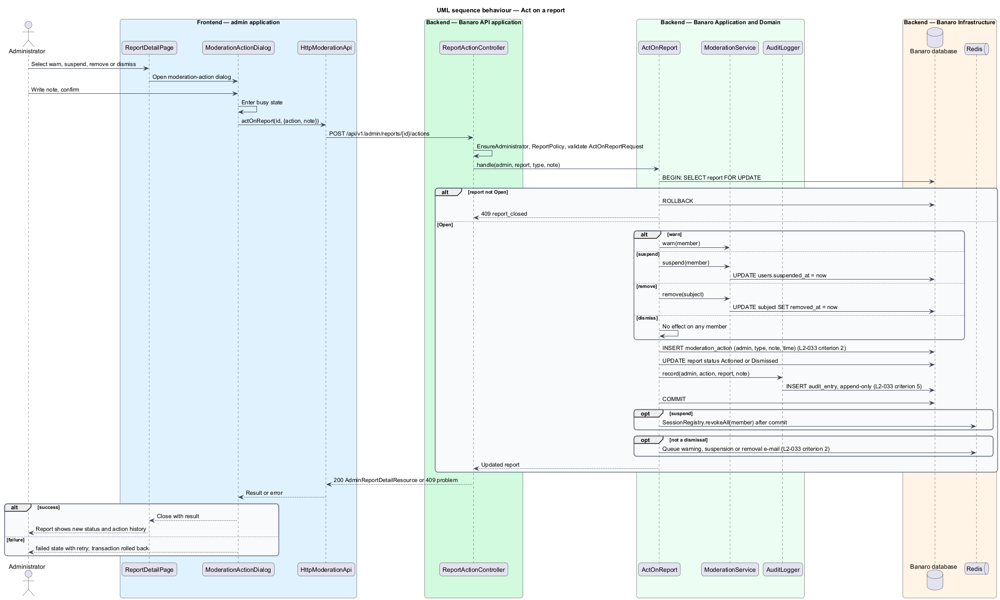
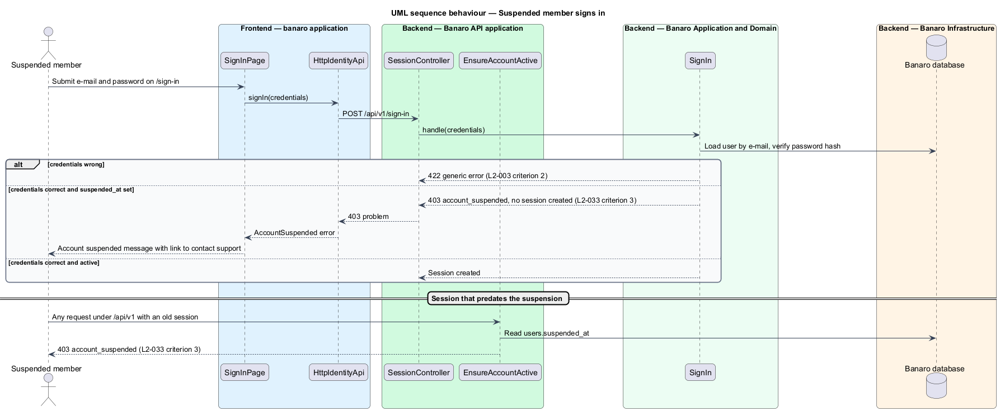

# Moderate reports

## Overview

Members report builders and content that break the code of conduct through the `report-content`
feature. This feature gives administrators the means to review those reports and act on them. It
belongs to the `trust-and-safety` subsystem. It runs in the `admin` Angular application, which Banaro
Web serves under `/admin`, separate from the public `banaro` application.

Terms used in this design:

- **administrator** — member who holds the administrator role and moderates the community
- **moderation queue** — list of reports at `/admin/reports`, oldest first
- **moderation action** — administrator's decision on one report: warn, suspend, remove or dismiss
- **warning** — moderation action that e-mails the affected member and changes nothing else
- **suspension** — moderation action that stops the affected member from signing in
- **removal** — moderation action that takes the reported subject out of Banaro
- **dismissal** — moderation action that closes a report without consequence for anyone
- **affected member** — member who owns the reported subject
- **audit entry** — immutable record of one administrator action: who, what, when and the note

An administrator opens `/admin/reports` and sees each report's status, reason and subject. The
administrator opens a report, chooses an action, writes a note and confirms. The API records the action
with the administrator, the time and the note, and writes an audit entry. It e-mails the affected
member unless the action is a dismissal. A suspended member who tries to sign in is told that the
account is suspended and how to contact support. A member without the administrator role receives 403
from every `/admin` page and every `/api/v1/admin/*` endpoint.

## Description

The slice runs from the `admin` application in Banaro Web through the Banaro API to the Banaro
database. Moderation e-mail leaves through the Banaro Worker.

### Frontend — `admin` application and libraries

- **`ReportsPage`** (`projects/admin/src/app/pages/reports/`) — routed page for `/admin/reports`. It
  lists reports oldest first with status (Open, Actioned or Dismissed), reason, subject and the number
  of submissions (`L2-033` criterion 1). A status filter defaults to Open. It has loading, empty and
  error states with retry.
- **`ReportDetailPage`** (`projects/admin/src/app/pages/report-detail/`) — routed page for
  `/admin/reports/{id}`. It shows the subject, the reporter, every submission's reason and details, and
  the actions already taken. Its action buttons open `ModerationActionDialog`.
- **`ModerationActionDialog`** (`projects/admin/src/app/dialogs/moderation-action/`) — CDK dialog that
  confirms one action with a required note. It has `default`, `invalid`, `busy` and `failed` states.
- **`administratorGuard`** (`api` library, `lib/auth/`) — route guard for every `admin` route. It
  checks the role in the signed-in member payload and shows the forbidden page otherwise.
- **`ModerationApi`** / **`MODERATION_API`** / **`HttpModerationApi`** (`api` library) — the contract,
  its injection token and its HTTP implementation. Only the `admin` application binds the token:
  - `listReports(query)` sends `GET /api/v1/admin/reports?status=&page=`.
  - `getReport(id)` sends `GET /api/v1/admin/reports/{id}`.
  - `actOnReport(id, action)` sends `POST /api/v1/admin/reports/{id}/actions`.
- **`AdminReportSummary`**, **`AdminReportDetail`** and **`ModerationActionRequest`** (`api` library,
  `models/admin/`) — the response and request types for the endpoints above.

### Frontend — Banaro Web server

- **`adminGate`** (`frontend/projects/banaro/src/server.ts`) — request handler in front of the `admin`
  bundle. For each `/admin` request it forwards the session cookie to `GET /api/v1/admin/access`. On
  any status other than 204 it returns 403 with the forbidden page and never sends the `admin` bundle
  (`L2-033` criterion 4).

### Backend — Banaro API

- **Routes** — every moderation route is in `routes/api.php` inside a group with prefix `admin` and
  the `EnsureAdministrator` middleware, after authentication and e-mail verification.
- **`EnsureAdministrator`** (`Http/Middleware/`) — returns 403 unless the session user's role is
  `Administrator` (`L2-033` criterion 4). `ReportPolicy` repeats the check per action as a second
  guard.
- **`AdminAccessController`** (`Controllers/Api/V1/TrustAndSafety/Admin/`) — `show()` handles
  `GET /admin/access` and returns 204 for an administrator.
- **`AdminReportController`** (`Controllers/Api/V1/TrustAndSafety/Admin/`) — `index()` returns
  `AdminReportResource` rows ordered by `created_at` ascending, then `id` (`L2-033` criterion 1).
  `show()` returns one `AdminReportDetailResource`.
- **`ReportActionController`** (`Controllers/Api/V1/TrustAndSafety/Admin/`) — `store()` handles
  `POST /admin/reports/{report}/actions`. It validates with `ActOnReportRequest` and calls
  `ActOnReport`.
- **`ActOnReportRequest`** (`Requests/TrustAndSafety/`) — requires `action` as a `ModerationActionType`
  and a `note` of `<TO SUPPLY>` maximum length.
- **`ActOnReport`** (`Actions/TrustAndSafety/`) — applies the action in one database transaction:
  1. It locks the report row with `lockForUpdate()` and rejects a report that is not `Open` with 409
     and code `report_closed`.
  2. It applies the effect through `ModerationService`.
  3. It writes a `ModerationAction` row with the administrator, the action, the note and the time
     (`L2-033` criterion 2).
  4. It sets the report status to `Actioned`, or to `Dismissed` for a dismissal.
  5. It writes an audit entry through `AuditLogger` in the same transaction (`L2-033` criterion 5).
  6. After commit, it queues the e-mail for the affected member unless the action is a dismissal
     (`L2-033` criterion 2).
- **`ModerationService`** (`Services/TrustAndSafety/`) — one method per effect:
  - `warn(User)` changes no data.
  - `suspend(User)` sets `users.suspended_at`. After commit, `ActOnReport` calls
    `SessionRegistry::revokeAll()`, so the affected member's open sessions end.
  - `remove(ReportSubject)` soft-deletes a project, feedback item or message with `removed_at`. The
    effect for a builder subject is `<TO SUPPLY>`.
- **`AuditLogger`** (`Services/TrustAndSafety/`) — `record(administrator, action, target, note)`
  inserts one `AuditEntry`. Every write under `/api/v1/admin/*` calls it.
- **`AuditEntry`** (`Models/`) — holds `administrator_id`, `action`, `target_type`, `target_id`,
  `note`, `context` (JSON) and `created_at`. The model has no `updated_at`. Its `updating` and
  `deleting` model events throw, and no route updates or deletes it (`L2-033` criterion 5).
- **`ModerationAction`** (`Models/`) — holds `report_id`, `administrator_id`, `type`
  (`ModerationActionType`), `note` and `created_at`.
- **`ModerationActionType`** (`Enums/`) — `Warn`, `Suspend`, `Remove` and `Dismiss`.
- **`Role`** (`Enums/`) — `Member` and `Administrator`, stored on `users.role`.
- **`MemberWarnedNotification`**, **`AccountSuspendedNotification`** and
  **`ContentRemovedNotification`** (`Notifications/`) — queued `mail` notifications. They are account
  e-mail, so the e-mail preferences of `L2-037` do not turn them off. None names the reporter
  (`L2-031` criterion 4).
- **`AdminReportResource`** and **`AdminReportDetailResource`** (`Resources/TrustAndSafety/Admin/`) —
  the only resources that include the reporter's identity.

### Suspension at sign-in

The `sign-in-and-sign-out` feature owns sign-in. This feature adds one rule to it: after the password
check succeeds, a user with `suspended_at` set receives 403 with code `account_suspended`, and no
session is created. The `sign-in` page then explains that the account is suspended and links to the
contact route (`L2-033` criterion 3). The `EnsureAccountActive` middleware on `routes/api.php` returns
the same 403 for a session that predates the suspension. The sequence diagram names the sign-in parts
`SignInPage`, `HttpIdentityApi`, `SessionController` and `SignIn`; the `sign-in-and-sign-out` design
fixes their final names.

### Open points

- Admin mocks: `docs/mocks` holds no `admin` pages or dialogs. Mocks for `/admin/reports`, the report
  detail page, `ModerationActionDialog` and their states: `<TO SUPPLY>`. They are required before
  implementation.
- Suspended sign-in: the `sign-in` mock has no suspended state. Copy and the support contact (the
  `/contact` page or an address): `<TO SUPPLY>`.
- Effect of "remove" on a builder subject (end the membership, hide the profile, or run the
  `delete-account` pipeline): `<TO SUPPLY>`.
- Suspension length, lifting a suspension, and reopening a closed report: `<TO SUPPLY>`.
- Maximum note length and whether a dismissal also needs a note: `<TO SUPPLY>`.
- Whether reading a report (which shows the reporter's identity) also writes an audit entry:
  `<TO SUPPLY>`.
- Database-level protection of `audit_entries` (revoking `UPDATE` and `DELETE` from the API's
  database user) depends on the engine, which is `<TO SUPPLY>`; retention period: `<TO SUPPLY>`.
- Ownership of `SessionRegistry`: this design assumes the `identity` subsystem records each session
  at sign-in; confirmation: `<TO SUPPLY>`.

## Requirements

| L2 ID | Refines (L1) | Requirement |
|-------|--------------|-------------|
| `L2-033` | `L1-010` | Administrators shall be able to review reports and act on them from the admin application under `/admin`. |

The design realizes all five acceptance criteria of `L2-033`. Criterion 3 also depends on the
`sign-in-and-sign-out` feature applying the suspension rule above.

## Diagrams

### System context

An administrator reviews and acts on reports through Banaro. Banaro e-mails the affected member through
the mail provider, except on a dismissal.

### Containers

Banaro Web serves the `admin` application only after the Banaro API confirms the administrator role.
The API writes actions and audit entries to the Banaro database and queues e-mail on Redis for the
Banaro Worker.

### Components

Inside the Banaro API, `EnsureAdministrator` guards every admin controller. `ActOnReport` applies the
effect through `ModerationService` and records the audit entry through `AuditLogger`.

### Class structure

A `Report` has many `ModerationAction` rows; each action writes one `AuditEntry`. On the frontend,
the admin pages and dialog depend on the `ModerationApi` contract.

### Behaviour — open the moderation queue

The Banaro Web server checks the role before serving the `admin` bundle. The API then lists reports
oldest first. A non-administrator receives 403 at both points.

### Behaviour — act on a report

The administrator confirms an action with a note. The action locks the report, applies the effect,
records the action and the audit entry in one transaction, and queues e-mail after commit.

### Behaviour — suspended member signs in

A suspended member enters correct credentials. The sign-in action refuses a session and the `sign-in`
page explains the suspension and how to contact support.

